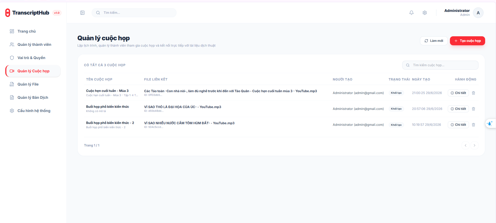
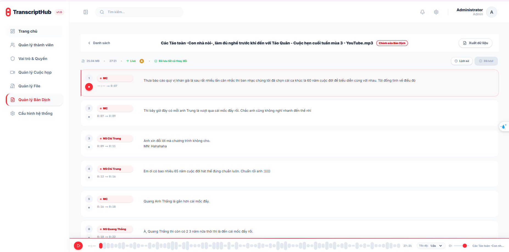

# TranscriptHub

Nền tảng ghi lại, phiên âm và cộng tác trên nội dung cuộc họp theo thời gian thực.

---

## Giới thiệu

**TranscriptHub** là ứng dụng web hỗ trợ nhóm làm việc ghi lại và xử lý nội dung cuộc họp thông qua tính năng phiên âm audio tự động bằng AI, kết hợp khả năng chỉnh sửa cộng tác thời gian thực trên transcript.

### Chức năng chính

- Xác thực người dùng (đăng ký, đăng nhập, refresh token, đăng xuất)
- Tạo và quản lý cuộc họp (meeting)
- Upload file audio lên object storage (MinIO) thông qua Presigned URL
- Phiên âm audio tự động bằng Gemini AI, xử lý bất đồng bộ qua Kafka
- Xem và chỉnh sửa transcript cộng tác theo thời gian thực (Yjs + WebSocket)
- Phân quyền thành viên trong cuộc họp (owner, editor, viewer)

### Công nghệ sử dụng

**Backend**
- NestJS (Microservices architecture, TCP transport)
- PostgreSQL + Prisma ORM
- Apache Kafka (message queue cho tác vụ phiên âm)
- Redis (JWT blacklist, cache phân quyền)
- MinIO (object storage)
- Yjs + y-protocols (CRDT, real-time collaboration)
- Google Gemini API (phiên âm audio)

**Frontend**
- Next.js 14 (App Router)
- NextAuth.js (authentication)
- Yjs + y-websocket (client-side CRDT)

**Infrastructure**
- Docker Compose
- Kubernetes (k8s manifests)

---

## Hướng dẫn chạy Local

### Yêu cầu

- Docker & Docker Compose
- Node.js >= 18

### Bước 1: Clone và cấu hình biến môi trường

```bash
git clone <repo-url>
cd VDT_miniproject_TranscriptHub
```

Tạo file `.env` cho backend từ file mẫu:

```bash
cp services_ms/.env.example services_ms/.env
```

Tạo file `.env.local` cho frontend từ file mẫu:

```bash
cp fe_next/.env.example fe_next/.env.local
```

Cập nhật các giá trị cần thiết trong `.env` (Gemini API key, JWT secret, ...).

### Bước 2: Khởi chạy toàn bộ hệ thống bằng Docker Compose

```bash
docker compose up --build
```

Docker Compose sẽ tự động khởi động các service sau:

| Service | Mô tả | Port |
|---|---|---|
| api-gateway | HTTP API Gateway | 3000 |
| users-service | Quản lý người dùng | 3001 |
| identity-service | Xác thực, JWT | 3002, 3009 |
| file-service | Upload, quản lý file | 3003 |
| transcript-service | Phiên âm audio | 3005 |
| meeting-service | Quản lý cuộc họp | 3006 |
| collab-service | Cộng tác transcript | 3007 |
| collab-gateway | WebSocket gateway | 3008 |
| PostgreSQL | Cơ sở dữ liệu | 5432 |
| Redis | Cache & blacklist | 6379 |
| Kafka + Zookeeper | Message broker | 9092 |
| MinIO | Object storage | 9100 (API), 9101 (Console) |
| pgAdmin | Quản lý DB qua UI | 8080 |

### Bước 3: Chạy Frontend

```bash
cd fe_next
npm install
npm run dev
```

Frontend sẽ chạy tại `http://localhost:3005` (hoặc port được cấu hình trong `.env.local`).

### Truy cập

| Địa chỉ | Mô tả |
|---|---|
| http://localhost:3000 | API Gateway |
| http://localhost:8080 | pgAdmin (admin@admin.com / admin) |
| http://localhost:9101 | MinIO Console (minioadmin / minioadmin) |

---

## Hình ảnh

- 
- 