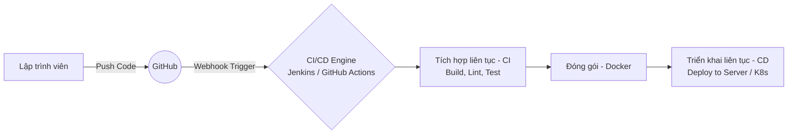
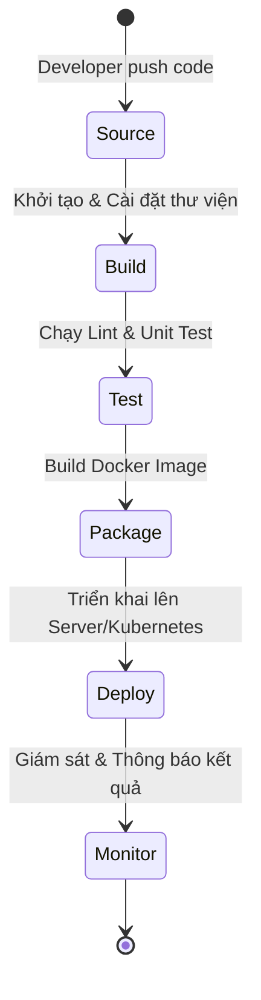

# Giới thiệu về Tích hợp liên tục (CI) và Triển khai liên tục (CD)

Chào mừng bạn đến với tài liệu hướng dẫn về **CI/CD**. Tài liệu này được thiết kế nhằm cung cấp một cái nhìn tổng quan, chuẩn chỉ và hệ thống nhất về khái niệm CI/CD, các giai đoạn trong một đường ống (pipeline) tiêu chuẩn, và định hướng học tập DevOps cho dự án **TranscriptHub**.

---

## 1. CI/CD là gì?

Trong kỷ nguyên phát triển phần mềm hiện đại, đặc biệt là với kiến trúc **Microservices** như dự án TranscriptHub, việc bàn giao nhanh chóng và đảm bảo độ ổn định của hệ thống là yếu tố sống còn. **CI/CD** chính là phương pháp luận và tập hợp các thực hành giúp tự động hóa toàn bộ vòng đời phát triển phần mềm (Software Development Life Cycle - SDLC).

### 1.1. CI (Continuous Integration) - Tích hợp liên tục
**CI** là thực hành phát triển phần mềm trong đó các thành viên của nhóm tích hợp mã nguồn của họ vào một nhánh chính (thường là `main` hoặc `develop`) liên tục, tối thiểu một hoặc nhiều lần mỗi ngày. Mỗi lần tích hợp được tự động xác minh bằng cách chạy trình biên dịch (Build), công cụ chuẩn hóa mã nguồn (Linter), và các bộ kiểm thử tự động (Unit Test, Integration Test) để phát hiện lỗi sớm nhất có thể.

* **Mục tiêu**: Phát hiện xung đột mã nguồn sớm, hạn chế tối đa lỗi "đụng độ code" (Integration Hell) và đảm bảo nhánh chính luôn ở trạng thái sẵn sàng chạy được.
* **Tần suất**: Diễn ra tự động mỗi khi có thay đổi được push lên Git repository hoặc khi tạo Pull Request.

### 1.2. CD (Continuous Delivery & Continuous Deployment) - Giao hàng & Triển khai liên tục
Khái niệm **CD** thực chất chia làm hai mức độ tự động hóa khác nhau tùy thuộc vào nhu cầu của dự án:

* **Continuous Delivery (Chuyển giao liên tục)**:
  Tự động hóa quá trình đóng gói sản phẩm và chuẩn bị môi trường để sẵn sàng triển khai. Toàn bộ các bước từ biên dịch, kiểm thử, đóng gói Docker image đều được thực hiện tự động. Tuy nhiên, hành động đưa mã nguồn đó lên môi trường Production thực tế vẫn yêu cầu một thao tác bấm nút phê duyệt thủ công (Manual Approval) từ đội ngũ vận hành.
* **Continuous Deployment (Triển khai liên tục)**:
  Là bước tiến cao nhất của tự động hóa. Mọi thay đổi vượt qua được tất cả các giai đoạn của quy trình kiểm thử tự động ở bước CI và Delivery sẽ **tự động** được cập nhật trực tiếp lên môi trường Production mà không cần bất kỳ sự can thiệp thủ công nào từ con người.

---

## 2. Một quy trình CI/CD tiêu chuẩn cần làm những gì?

Một đường ống (Pipeline) CI/CD hoàn chỉnh thường bao gồm 6 giai đoạn cốt lõi sau:

### 2.1. Giai đoạn 1: Source (Nguồn mã nguồn)
* **Hành động**: Pipeline lắng nghe sự thay đổi trên Git repository thông qua cơ chế **Webhooks** hoặc lập lịch quét (Polling).
* **Ý nghĩa**: Kích hoạt tự động pipeline ngay khi lập trình viên thực hiện lệnh `git push` hoặc tạo/merge Pull Request.

### 2.2. Giai đoạn 2: Build (Biên dịch ứng dụng)
* **Hành động**: Pipeline kéo code mới nhất về, thiết lập môi trường (ví dụ: Node.js đối với NestJS và Next.js) và thực hiện cài đặt các thư viện phụ thuộc (`npm ci` hoặc `yarn install`).
* **Ý nghĩa**: Đảm bảo dự án không bị lỗi cú pháp khi biên dịch và tất cả thư viện cần thiết đều sẵn có.

### 2.3. Giai đoạn 3: Test (Kiểm thử tự động)
* **Hành động**: Chạy các công cụ định dạng và phân tích mã tĩnh (ESLint, Prettier), đồng thời thực thi các bài kiểm thử tự động (Unit Test, Integration Test).
* **Ý nghĩa**: Đảm bảo chất lượng mã nguồn tuân thủ tiêu chuẩn chung của dự án, logic nghiệp vụ không bị lỗi và không có lỗi hồi quy (regression bugs).

### 2.4. Giai đoạn 4: Package (Đóng gói ứng dụng)
* **Hành động**: Đóng gói mã nguồn cùng các thư viện cần thiết thành các ảnh container (**Docker Images**) bằng kỹ thuật **Multi-stage Build** nhằm giảm thiểu dung lượng file. Sau đó, đẩy các image này lên các kho chứa tập trung như **Docker Hub**, GitHub Container Registry (GHCR), hoặc AWS ECR.
* **Ý nghĩa**: Đảm bảo tính nhất quán của môi trường. Ứng dụng chạy trên máy phát triển, máy build CI/CD hay trên server production đều giống hệt nhau.

### 2.5. Giai đoạn 5: Deploy (Triển khai hệ thống)
* **Hành động**: Cập nhật ứng dụng trên máy chủ.
  * *Với Docker Compose*: SSH vào VPS, kéo image mới (`docker compose pull`) và restart service không gây downtime (`docker compose up -d`).
  * *Với Kubernetes*: Jenkins cập nhật trực tiếp Image Tag mới vào cụm K8s. K8s sẽ tự động thực hiện **Rolling Update** (khởi động Pod mới chạy ảnh mới, kiểm tra trạng thái Ready, sau đó mới tắt Pod cũ).
* **Ý nghĩa**: Đưa tính năng mới tiếp cận khách hàng một cách nhanh chóng và an toàn nhất mà không gây gián đoạn dịch vụ.

### 2.6. Giai đoạn 6: Monitor & Feedback (Giám sát & Thông báo)
* **Hành động**: Gửi trạng thái của pipeline (Thành công/Thất bại) đến các kênh liên lạc của team (Slack, Telegram, Discord, Email). Đồng thời hệ thống giám sát (Prometheus, Grafana) bắt đầu theo dõi sức khỏe của container mới deploy.
* **Ý nghĩa**: Giúp lập trình viên nắm bắt được tình hình build để sửa lỗi ngay lập tức nếu pipeline thất bại.

---

## 3. Tài liệu tự học CI/CD, Docker & Kubernetes (Minikube)

Dưới đây là danh sách các nguồn tài nguyên học tập chọn lọc giúp bạn làm quen và làm chủ quy trình DevOps từ cơ bản đến nâng cao.

### 3.1. Tài liệu học CI/CD & Tư duy DevOps (Lý thuyết & Triết lý)
* **Sách "The DevOps Handbook"** (*Gene Kim, Jez Humble, Patrick Debois, John Willis*):
  * *Mục tiêu*: Cuốn sách gối đầu giường để hiểu về văn hóa DevOps, triết lý "Ba con đường" (The Three Ways) và cách xây dựng hạ tầng bền vững.
* **Sách "Continuous Delivery"** (*Jez Humble, David Farley*):
  * *Mục tiêu*: Hiểu sâu sắc về các mô hình tự động hóa kiểm thử, cấu hình quản lý và chiến lược phát hành phần mềm chuyên nghiệp.
* **Blog Martin Fowler - Continuous Integration**:
  * *Link*: [martinfowler.com/articles/continuousIntegration.html](https://martinfowler.com/articles/continuousIntegration.html)
  * *Mục tiêu*: Bài viết kinh điển định nghĩa chi tiết nền tảng của CI.

### 3.2. Tài liệu học Docker (Containerization)
* **Trang tài liệu chính thức Docker (Docker Docs)**:
  * *Link*: [docs.docker.com](https://docs.docker.com/)
  * *Mục tiêu*: Đọc hiểu cách viết `Dockerfile`, tối ưu hóa layer cache, cơ chế kết nối mạng (`docker network`) và gắn ổ cứng lưu trữ (`docker volume`).
* **Khóa học Udemy: "Docker and Kubernetes: The Complete Guide"** (*Stephen Grider*):
  * *Mục tiêu*: Khóa học xuất sắc nhất dành cho người mới bắt đầu. Giải thích cực kỳ trực quan cơ chế hoạt động của Docker và cách chuyển tiếp sang Kubernetes.
* **Kênh Youtube TechWorld with Nana**:
  * *Link*: [youtube.com/@TechWorldwithNana](https://www.youtube.com/@TechWorldwithNana)
  * *Mục tiêu*: Các video bài giảng miễn phí, trực quan và dễ tiếp cận về Docker cho người mới.

### 3.3. Tài liệu học Kubernetes & Minikube (Orchestration)
* **Tài liệu chính thức Kubernetes (Kubernetes Documentation)**:
  * *Link*: [kubernetes.io/docs/home/](https://kubernetes.io/docs/home/)
  * *Mục tiêu*: Tìm hiểu các khái niệm cốt lõi như `Pods`, `Deployments`, `Services`, `ConfigMaps`, `Secrets` và `Ingress`.
* **Trang web học thử nghiệm tương tác**:
  * **Play with Kubernetes** ([labs.play-with-k8s.com](https://labs.play-with-k8s.com/)): Cho phép tạo cụm K8s ảo miễn phí ngay trên trình duyệt để gõ lệnh.
  * **Minikube Start Guide** ([minikube.sigs.k8s.io/docs/start/](https://minikube.sigs.k8s.io/docs/start/)): Hướng dẫn cài đặt Minikube trên Windows/macOS/Linux.
* **Khóa học Udemy: "Certified Kubernetes Application Developer (CKAD)"** (*Mumshad Mannambeth*):
  * *Mục tiêu*: Khóa học thực hành đỉnh cao đi kèm phòng lab thực tế để luyện tập viết các tệp cấu hình YAML của K8s. Đây là khóa học chuẩn bị cho chứng chỉ quốc tế CKAD.
