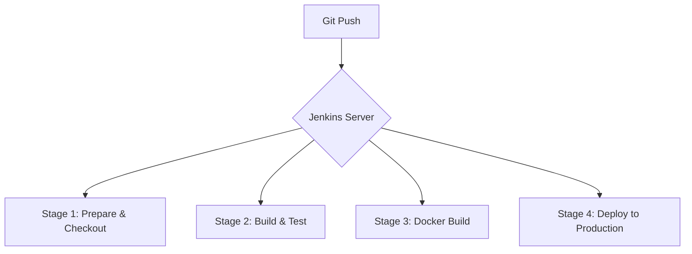
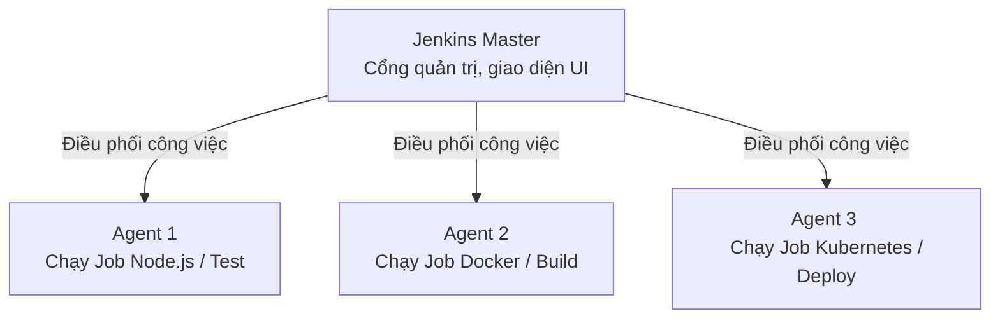

# Tổng quan về Jenkins - Công cụ Tự động hóa Pipeline

Tài liệu này giới thiệu chi tiết về **Jenkins**, công cụ tự động hóa tích hợp liên tục (CI) và triển khai liên tục (CD) tự quản lý (Self-hosted) phổ biến nhất thế giới. Hiểu rõ Jenkins sẽ giúp bạn làm chủ quy trình phân phối sản phẩm trong dự án **TranscriptHub**.

---

## 1. Jenkins là gì?

**Jenkins** là một máy chủ tự động hóa mã nguồn mở (Open-source automation server) được viết bằng ngôn ngữ Java. Nó hỗ trợ đắc lực cho các lập trình viên trong việc tự động hóa các công đoạn liên quan đến build, test và deploy phần mềm.



---

## 2. Tại sao chọn Jenkins?

Mặc dù thị trường hiện nay có nhiều giải pháp CI/CD dạng SaaS (Software-as-a-Service) hiện đại như GitHub Actions, GitLab CI, CircleCI,... Jenkins vẫn giữ vững vị thế số một trong môi trường doanh nghiệp nhờ vào các ưu điểm vượt trội sau:

### 2.1. Tự quản lý hạ tầng (Self-hosted) & Tiết kiệm chi phí
* **Jenkins**: Bạn tự cài đặt Jenkins trên hạ tầng server của riêng mình (VPS, On-premise server). Bạn không phải trả chi phí dựa trên số phút build như GitHub Actions hay GitLab CI. Đối với các dự án lớn, build liên tục hoặc build tốn nhiều tài nguyên (như build cùng lúc 9 image của hệ thống TranscriptHub), việc sử dụng server riêng giúp tiết kiệm một khoản chi phí rất lớn.
* **SaaS CI/CD**: Giới hạn số phút build miễn phí hàng tháng (thường là 2000 phút), sau đó tính phí rất cao.

### 2.2. Hệ sinh thái Plugins khổng lồ
Jenkins sở hữu hơn **1800+ Plugins** do cộng đồng phát triển. Điều này cho phép Jenkins kết nối và điều phối hầu hết mọi công cụ trong chuỗi cung ứng phần mềm:
* Quản lý mã nguồn: Git, GitHub, GitLab, Bitbucket.
* Containerization & Orchestration: Docker, Kubernetes, Helm.
* Thông báo: Slack, Telegram, Email, Discord.
* Đo lường chất lượng: SonarQube, JUnit.

### 2.3. Khả năng tùy biến và mở rộng linh hoạt
Jenkins không giới hạn bạn trong bất kỳ khuôn khổ nào. Bạn có thể tự viết các script phức tạp bằng ngôn ngữ Groovy để tùy biến luồng chạy của pipeline, điều chỉnh tài nguyên phần cứng cho các job, hoặc thiết lập phân quyền người dùng (Role-based Authorization) cực kỳ chi tiết.

---

## 3. Kiến trúc Jenkins Master - Agent

Để giải quyết bài toán hiệu năng khi số lượng job cần build tăng lên, Jenkins sử dụng kiến trúc **Master-Agent** (trước đây gọi là Master-Slave) hoạt động theo mô hình tính toán phân tán.



### 3.1. Jenkins Master (Bộ điều khiển trung tâm)
Jenkins Master là máy chủ chạy ứng dụng Jenkins chính. Nó đảm nhận các vai trò:
* Cung cấp giao diện đồ họa Web UI cho người dùng cấu hình và theo dõi.
* Nhận tín hiệu Webhook từ Git repository để kích hoạt job.
* Đọc và phân tích cú pháp tệp cấu hình pipeline (`Jenkinsfile`).
* Lập lịch và phân phối các bước thực thi (stages/steps) tới các Agent phù hợp.
* Quản lý thông tin đăng nhập bảo mật (Credentials), cấu hình hệ thống toàn cục và logs.
* **Lưu ý**: Để tối ưu hiệu năng và bảo mật, Master *không nên* trực tiếp thực thi các lệnh build nặng.

### 3.2. Jenkins Agent (Runner thực thi)
Jenkins Agent là một dịch vụ chạy trên một máy chủ độc lập (hoặc một Container) kết nối tới Master.
* **Nhiệm vụ**: Nhận lệnh từ Master và thực thi trực tiếp các câu lệnh trong pipeline (như chạy `npm run test`, `docker build`, `kubectl apply`).
* **Ưu điểm**:
  * Giảm tải cho Master, tránh tình trạng Master bị treo do thiếu RAM/CPU khi build.
  * Tận dụng hạ tầng đa dạng: Bạn có thể cấu hình Agent 1 chạy Windows để build app .NET, Agent 2 chạy Linux để build Docker, Agent 3 chạy macOS để build app iOS.
  * Trong môi trường Kubernetes, Jenkins có thể tự động tạo ra một Pod Agent tạm thời khi bắt đầu build và tự động xóa Pod đó đi sau khi hoàn thành công việc (Dynamic Provisioning), giúp tiết kiệm tài nguyên tối đa.

---

## 4. Pipeline as Code & Jenkinsfile

**Pipeline as Code** là triết lý định nghĩa toàn bộ quy trình CI/CD dưới dạng mã nguồn và lưu trữ trực tiếp trong Git Repository của dự án. File cấu hình này được đặt tên mặc định là **`Jenkinsfile`**.

### 4.1. Lợi ích của Pipeline as Code
* **Quản lý phiên bản (Version Control)**: Sự thay đổi trong pipeline được theo dõi, review qua Pull Request giống như code ứng dụng.
* **Khôi phục nhanh chóng**: Nếu cấu hình pipeline bị lỗi, bạn chỉ cần revert commit cũ trên Git.
* **Duy nhất một nguồn sự thật (Single Source of Truth)**: Mọi thành viên trong team đều biết quy trình build diễn ra như thế nào bằng cách đọc file `Jenkinsfile`.

### 4.2. Declarative Pipeline vs Scripted Pipeline
Jenkins hỗ trợ hai cú pháp để viết pipeline:

1. **Scripted Pipeline (Cú pháp cũ)**:
   * Dựa trên ngôn ngữ Groovy thuần túy.
   * Rất linh hoạt nhưng phức tạp, khó đọc và dễ xảy ra lỗi nếu lập trình viên không rành Groovy.
2. **Declarative Pipeline (Cú pháp mới - Khuyên dùng)**:
   * Cung cấp một cấu trúc phân cấp định sẵn, dễ đọc, dễ viết và thân thiện hơn.
   * Tự động kiểm tra lỗi cú pháp trước khi chạy.
   * **Đây là cú pháp đang được sử dụng trong tệp [Jenkinsfile](file:///d:/VDT_Tucode/VDT_miniproject_TranscriptHub/Jenkinsfile) gốc của dự án TranscriptHub**.

### 4.3. Các thành phần cốt lõi trong Declarative Jenkinsfile
Một file Declarative Jenkinsfile tiêu chuẩn có cấu trúc cơ bản như sau:
```groovy
pipeline {
    agent any // Định nghĩa chạy pipeline này trên bất kỳ Agent nào có sẵn
    
    environment {
        // Khai báo các biến môi trường toàn cục sử dụng trong toàn bộ pipeline
        APP_NAME = 'transcripthub'
    }
    
    stages {
        stage('Build') {
            steps {
                // Chứa các câu lệnh shell thực thi cụ thể
                echo 'Building application...'
            }
        }
        stage('Test') {
            steps {
                echo 'Running unit tests...'
            }
        }
    }
    
    post {
        always {
            // Các hành động luôn được thực thi sau khi pipeline kết thúc (dù thành công hay thất bại)
            echo 'Cleaning workspace...'
        }
    }
}
```
* **`pipeline`**: Thẻ bao ngoài cùng bắt buộc của Declarative Pipeline.
* **`agent`**: Khai báo nơi thực thi pipeline (ví dụ: `agent any`, `agent none` hoặc chỉ định label của Agent cụ thể).
* **`environment`**: Nơi lưu trữ các cặp key-value làm biến môi trường.
* **`stages`**: Tập hợp tất cả các giai đoạn (stage) của pipeline.
* **`stage`**: Định nghĩa một giai đoạn cụ thể (ví dụ: Build, Test, Deploy). Mỗi stage xuất hiện dưới dạng một cột trực quan trên màn hình Jenkins Dashboard.
* **`steps`**: Nơi chứa các câu lệnh thực thi tuần tự bên trong một stage (ví dụ: `sh`, `bat`, `echo`, `git`, `withCredentials`).
* **`post`**: Định nghĩa các hành động xảy ra sau khi pipeline chạy xong dựa trên kết quả (`success`, `failure`, `always`).
