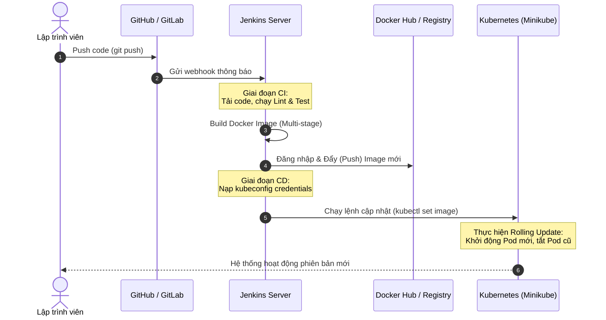
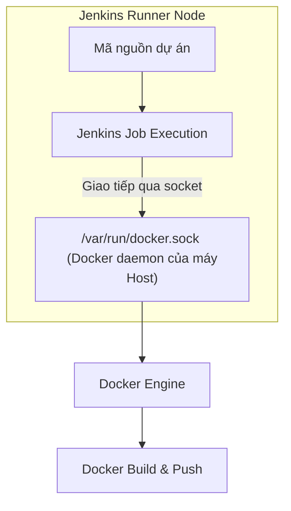
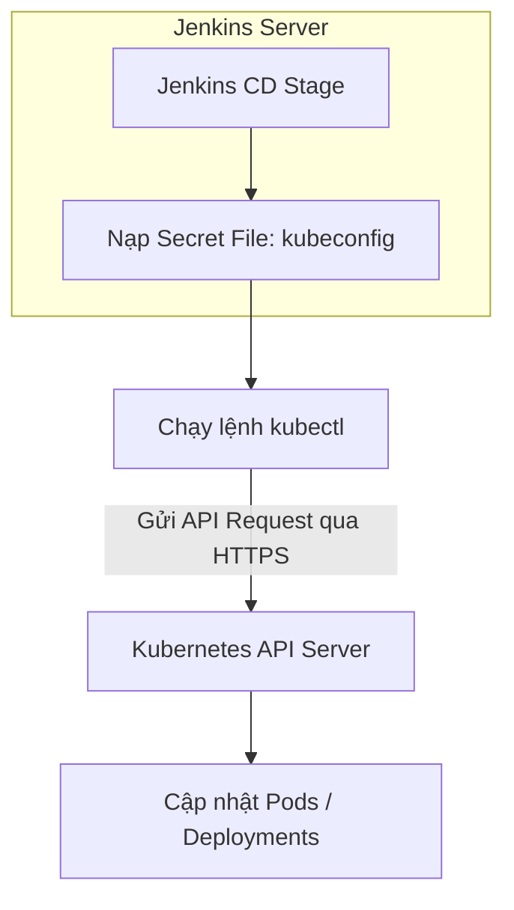
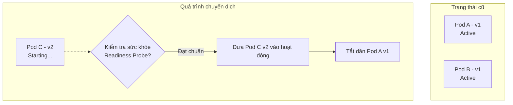

# CI/CD Pipeline với Jenkins, Docker và Kubernetes (Minikube)

Tài liệu này phân tích chi tiết mô hình kết hợp giữa **Jenkins**, **Docker**, và **Kubernetes (Minikube)**. Đây là bộ ba công nghệ DevOps tiêu chuẩn giúp xây dựng một quy trình CI/CD tự động, an toàn và tối ưu cho kiến trúc Microservices của dự án **TranscriptHub**.

---

## 1. Sơ đồ luồng hoạt động tổng quan (Workflow)

Dưới đây là mô hình hoạt động của pipeline tích hợp 3 thành phần này:



---

## 2. Vai trò của từng thành phần trong Pipeline

Để hệ thống vận hành trơn tru, mỗi công cụ được phân công đảm nhận một vai trò chuyên biệt:

| Công nghệ | Vai trò trong Pipeline | Nhiệm vụ chính |
| :--- | :--- | :--- |
| **Jenkins** | **Nhà điều phối (Orchestrator)** | Lắng nghe sự kiện Git, lên lịch chạy, kiểm tra chất lượng code (Lint & Test), điều khiển Docker build và ra lệnh deploy sang K8s. |
| **Docker** | **Đồng nhất môi trường (Containerization)** | Đóng gói ứng dụng và các dependencies thành một Docker Image duy nhất. Đảm bảo ứng dụng chạy giống hệt nhau ở mọi nơi. |
| **Kubernetes (Minikube)** | **Quản trị vận hành (Orchestration)** | Nhận lệnh từ Jenkins để chạy container, quản lý tài nguyên (CPU/RAM), tự động phục hồi khi lỗi (Self-healing), cân bằng tải và cập nhật không gây downtime. |

---

## 3. Cách Jenkins tương tác với Docker

Trong các giai đoạn đóng gói (Package), Jenkins cần giao tiếp với công cụ Docker để build và push image.



### 3.1. Kỹ thuật chia sẻ Docker Socket (Docker outside of Docker)
Khi cài đặt Jenkins Server dưới dạng một container Docker, Jenkins container không tự có Docker Engine bên trong nó. Để Jenkins có thể chạy được các lệnh `docker build`, chúng ta áp dụng kỹ thuật ánh xạ (mount) file socket của Docker từ máy Host vào bên trong Jenkins Container:
* Thêm cấu hình volume: `/var/run/docker.sock:/var/run/docker.sock` và `/usr/bin/docker:/usr/bin/docker`.
* **Cách hoạt động**: Khi Jenkins thực thi lệnh `docker build`, lệnh này sẽ gửi tín hiệu qua socket tới Docker Engine đang chạy trên máy Host để thực thi việc build. Nhờ đó, ảnh Docker sau khi build sẽ được lưu trực tiếp trên máy Host, tránh làm phình dung lượng container Jenkins.

### 3.2. Quản lý Đăng nhập bảo mật (Credentials)
Để push image lên Docker Hub, Jenkins sử dụng plugin **Docker Pipeline** kết hợp block `withCredentials` trong `Jenkinsfile` để đăng nhập an toàn mà không làm lộ mật khẩu ra log hệ thống:
```groovy
withCredentials([usernamePassword(credentialsId: 'dockerhub-credentials', 
                                  usernameVariable: 'DOCKER_USER', 
                                  passwordVariable: 'DOCKER_PASS')]) {
    sh "echo \$DOCKER_PASS | docker login -u \$DOCKER_USER --password-stdin"
}
```

---

## 4. Cách Jenkins tương tác với Kubernetes

Sau khi đẩy Docker Image thành công lên Registry, Jenkins bước sang giai đoạn CD (Deploy) để cập nhật ứng dụng trên Kubernetes.



### 4.1. Sử dụng tệp cấu hình `kubeconfig`
Mọi giao tiếp với cụm Kubernetes đều đi qua **Kubernetes API Server**. Để xác thực quyền truy cập, Jenkins cần sử dụng tệp `kubeconfig` (thường nằm ở `~/.kube/config` trên máy có quyền quản trị cụm).
* **Bước thiết lập**:
  1. Trích xuất file cấu hình `kubeconfig` của cụm K8s (hoặc Minikube).
  2. Thêm file này vào Jenkins Credentials dưới dạng **Secret File**.
  3. Trong `Jenkinsfile`, sử dụng plugin **Kubernetes CLI** để nạp cấu hình này tạm thời trong phiên làm việc.
* **Cú pháp trong Jenkinsfile**:
  ```groovy
  withKubeConfig([credentialsId: 'k8s-kubeconfig-id']) {
      sh "kubectl set image deployment/users-service users-service=docker.io/yourusername/transcripthub-users:${IMAGE_TAG} -n transcripthub"
  }
  ```

---

## 5. Quy trình Rolling Update (Cập nhật không gián đoạn dịch vụ)

Khi Jenkins thực hiện lệnh `kubectl set image` hoặc `kubectl apply -f`, Kubernetes sẽ tự động thực hiện quy trình cập nhật **Rolling Update**. Đây là tính năng cốt lõi giúp hệ thống cập nhật phiên bản mới mà người dùng không hề nhận ra sự gián đoạn (Zero-downtime).



### 5.1. Cơ chế hoạt động của Rolling Update
1. **Khởi tạo Pod mới**: Kubernetes tạo một Pod mới chạy phiên bản code mới (ví dụ: v2) song song với các Pod cũ (v1) vẫn đang chạy.
2. **Kiểm tra Readiness Probe**: K8s sẽ thực hiện kiểm tra sức khỏe của Pod v2 thông qua các endpoint cấu hình sẵn (ví dụ: request HTTP tới `/api/health`). 
3. **Chuyển hướng Traffic**: Khi Pod v2 vượt qua kiểm tra sức khỏe và ở trạng thái `Ready`, K8s Service sẽ bắt đầu định tuyến một phần traffic của người dùng sang Pod v2 mới này.
4. **Tắt Pod cũ**: K8s tiến hành gửi tín hiệu tắt (`SIGTERM`) và xóa dần một Pod cũ chạy bản v1.
5. **Lặp lại quy trình**: Quy trình này lặp lại cho các Pod tiếp theo cho tới khi toàn bộ cụm chỉ còn chạy phiên bản v2.

### 5.2. Lợi ích vượt trội
* **Không mất kết nối**: Người dùng không gặp lỗi màn hình trắng hay lỗi 502/504 trong suốt quá trình cập nhật.
* **Tự động Rollback**: Nếu Pod v2 mới bị lỗi khởi động (crash loop) hoặc không vượt qua được kiểm tra sức khỏe, Kubernetes sẽ dừng ngay lập tức việc deploy và giữ nguyên các Pod v1 cũ hoạt động bình thường, giúp bảo vệ an toàn cho hệ thống.
