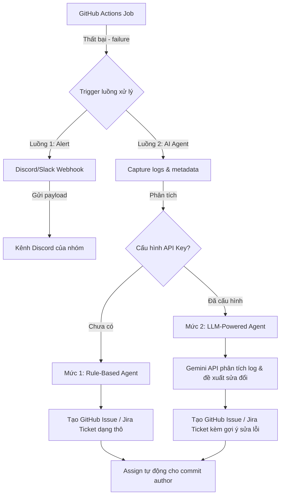
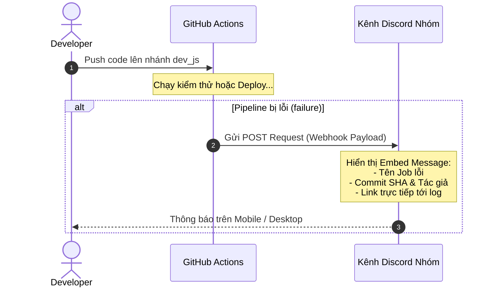
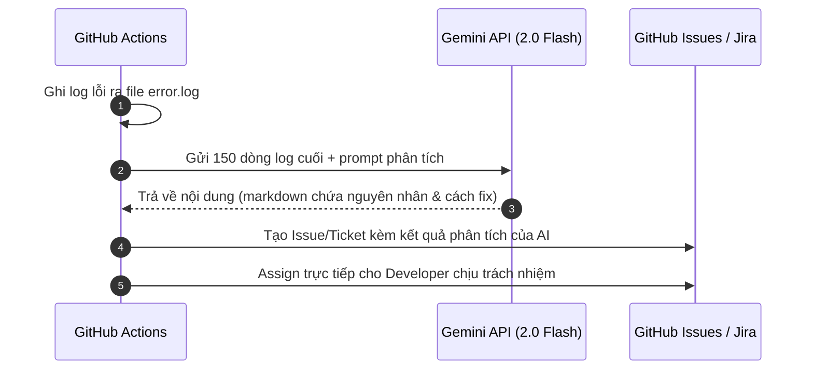

# ĐỀ XUẤT CẢI TIẾN CI/CD PIPELINE: TỰ ĐỘNG HÓA ALERT & TÍCH HỢP AI AGENT XỬ LÝ SỰ CỐ

## 1. Đặt vấn đề và Mục tiêu cải tiến

Hệ thống CI/CD hiện tại của TranscriptHub đã đáp ứng tốt các yêu cầu cơ bản về kiểm thử (CI) và triển khai (CD - Rolling Update lên K8s). Tuy nhiên, quy trình vận hành vẫn còn hai điểm nghẽn lớn:

1. **Thiếu tính chủ động trong cảnh báo**: Khi pipeline gặp lỗi build/deploy, hệ thống không phát đi tín hiệu cảnh báo. Lập trình viên phải kiểm tra thủ công trạng thái trên GitHub, dẫn đến việc phát hiện lỗi bị trễ.
2. **Thiếu cơ chế tự động hóa phân loại và theo dõi sự cố (Task Tracking)**: Khi phát hiện lỗi lint hoặc test, chưa có cơ chế tự động ghi nhận (Jira Ticket / GitHub Issue) và phân phối công việc cho tác giả của commit gây lỗi.

**Mục tiêu của đề xuất này:**
- Thiết lập kênh cảnh báo tự động tức thì (Alert) khi build hoặc deploy thất bại.
- Xây dựng một AI Agent dạng nhẹ tích hợp trực tiếp vào GitHub Actions để tự động phân tích log lỗi, phân loại sự cố, tạo task tracking và đề xuất giải pháp sửa lỗi.

---

## 2. Kiến trúc giải pháp tổng quan

Quy trình cải tiến đề xuất tích hợp cả 2 luồng **Alert** và **AI Agent** chạy song song khi phát hiện sự kiện lỗi (`failure()`):



---

## 3. Phần 1: Luồng Alert khi Build/Deploy Thất bại

### 3.1. Phương án lựa chọn kênh thông báo
Để tối ưu chi phí và tăng tính tiện dụng cho dự án, **Discord Webhook** được đề xuất làm kênh thông báo chính thức thay vì Slack hay Email:
- **Chi phí:** Hoàn toàn miễn phí, không bị giới hạn số lượng tin nhắn và lịch sử lưu trữ (Slack giới hạn 90 ngày với gói Free).
- **Tốc độ:** Nhận thông báo tức thì trên ứng dụng di động/desktop.

### 3.2. Sơ đồ luồng (Sequence Diagram) của Alert



### 3.3. Ví dụ cấu hình payload gửi đi (YAML)
```yaml
- name: Send Discord Alert
  if: failure()
  uses: sarisia/actions-status-discord@v1
  with:
    webhook: ${{ secrets.DISCORD_WEBHOOK_URL }}
    title: "🚨 Pipeline Thất bại tại Job: ${{ github.job }}"
    description: |
      **Branch**: `${{ github.ref_name }}`
      **Commit**: `${{ github.sha }}` bởi @${{ github.actor }}
      **Chi tiết log**: [Xem tại đây](${{ github.server_url }}/${{ github.repository }}/actions/runs/${{ github.run_id }})
    color: 0xff0000
```

---

## 4. Phần 2: AI Agent tự động điều phối & tạo Task Tracking

Để tối ưu hóa thời gian sửa lỗi, hệ thống sẽ tự động chuyển lỗi từ log thành một task có thể theo dõi được (GitHub Issue hoặc Jira Ticket).

### 4.1. Mức 1: Tạo Task tự động (Rule-Based)
* **Nguyên lý:** Sử dụng token GitHub có sẵn để gọi REST API tạo Issue. Không sử dụng AI để phân tích sâu, chỉ đóng gói thông tin thô từ log.
* **Cơ chế chống Spam:** Hệ thống sẽ quét qua danh sách Issue đang mở, nếu đã tồn tại một Issue tương tự cho Job đó, hệ thống sẽ bỏ qua không tạo mới để tránh làm nhiễu danh sách công việc.
* **Tự động gán quyền:** Issue sẽ tự động assign trực tiếp cho người vừa thực hiện lệnh push (`github.actor`).

### 4.2. Mức 2: Tích hợp AI (Gemini 2.0 Flash) đề xuất giải pháp
* **Nguyên lý:** Khi có API Key, hệ thống sẽ trích xuất 150 dòng cuối của file log lỗi (`stderr`), chuyển tiếp đến model Gemini 2.0 Flash để phân tích nguyên nhân và đưa ra giải pháp sửa đổi cụ thể.

#### Prompt mẫu gửi cho AI Agent:
```
Bạn là kỹ sư DevOps chuyên nghiệp. Hãy phân tích đoạn log lỗi CI/CD dưới đây của dự án Node.js/Next.js/NestJS.
Chỉ ra nguyên nhân chính xác và gợi ý các dòng code cần sửa một cách ngắn gọn bằng tiếng Việt.

Log:
[Chèn log lỗi tại đây]
```

#### Sơ đồ hoạt động của AI Agent:



---

## 5. So sánh giải pháp & Lộ trình thực hiện

### 5.1. So sánh hai mô hình Agent

| Tiêu chí | Mức 1: Rule-Based Agent | Mức 2: AI-Powered Agent |
|---|---|---|
| **Chi phí** | 0 USD (Hoàn toàn miễn phí) | Cực kỳ thấp (Dùng Gemini Flash miễn phí/rẻ) |
| **Độ phức tạp** | Thấp, chỉ dùng file YAML | Trung bình, cần thêm script Node.js |
| **Ưu điểm** | Đảm bảo 100% không sót lỗi | Có gợi ý sửa lỗi trực tiếp, dễ đọc hiểu |
| **Nhược điểm** | Developer vẫn phải tự đọc log thô | Đôi khi có thể bị trễ API hoặc phân tích sai |

### 5.2. Lộ trình triển khai đề xuất (3 Giai đoạn)

1. **Giai đoạn 1 (Ngay lập tức):** Cấu hình webhook gửi cảnh báo lỗi lên Discord khi build hoặc deploy thất bại.
2. **Giai đoạn 2 (Trong tuần đầu):** Tích hợp rule-based GitHub Script để tự động tạo Issue và assign cho commit author khi lint/test fail.
3. **Giai đoạn 3 (Thử nghiệm):** Cấu hình Gemini API key vào GitHub Secret để AI tham gia phân tích và ghi chú gợi ý vào Issue.
