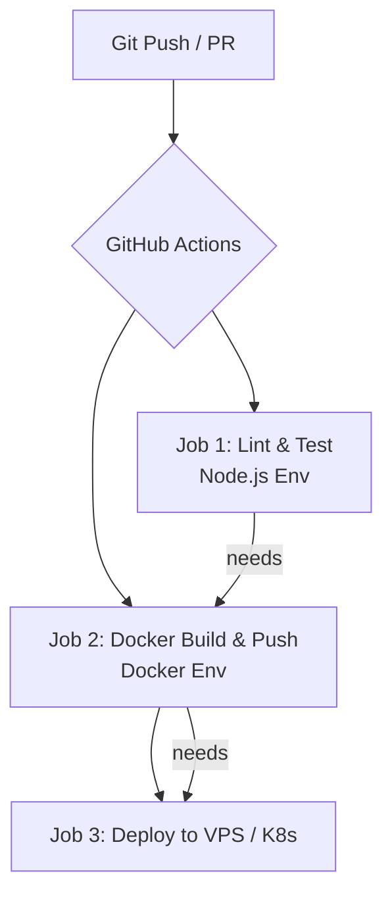
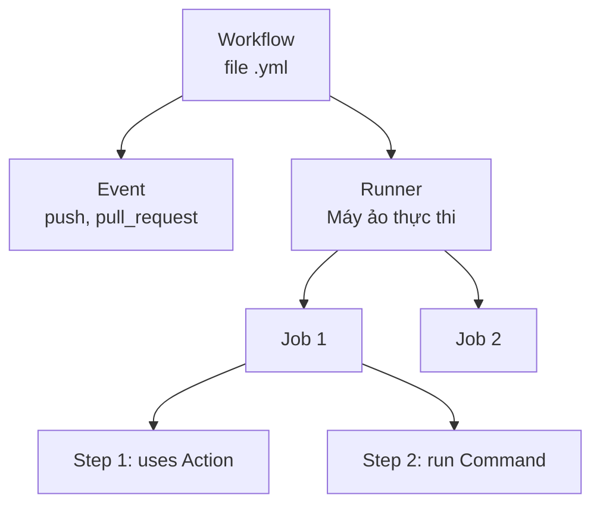

# Tổng quan về GitHub Actions - Công cụ Tự động hóa Workflow

Tài liệu này giới thiệu chi tiết về **GitHub Actions**, giải pháp CI/CD được tích hợp sẵn trên nền tảng GitHub. Hiểu rõ GitHub Actions sẽ giúp bạn làm chủ quy trình tự động hóa tích hợp và triển khai liên tục cho dự án **TranscriptHub**.

---

## 1. GitHub Actions là gì?

**GitHub Actions** là một nền tảng tích hợp liên tục (CI) và phân phối liên tục (CD) cho phép bạn tự động hóa quy trình xây dựng, kiểm thử và triển khai mã nguồn trực tiếp từ GitHub. Bạn có thể viết các quy trình công việc (Workflows) để thực thi bất cứ khi nào có sự kiện xảy ra trong kho chứa (Repository) của bạn (ví dụ: tạo Pull Request, push code, tạo Release, hoặc theo lịch định sẵn).



---

## 2. Tại sao chọn GitHub Actions?

So với các công cụ CI/CD truyền thống như Jenkins, GitHub Actions sở hữu nhiều ưu điểm vượt trội giúp đơn giản hóa quy trình DevOps, đặc biệt là đối với các dự án lưu trữ mã nguồn trên GitHub như **TranscriptHub**:

### 2.1. Tích hợp sâu với Hệ sinh thái GitHub
* **Kích hoạt tự động dựa trên sự kiện (Event-driven)**: Bạn có thể kích hoạt pipeline bằng hầu hết mọi hành động diễn ra trên GitHub (Push, Pull Request, gắn Label, tạo Issue, Star, Release,...).
* **Quản lý quyền tối ưu**: Liên kết trực tiếp với GitHub Accounts và GitHub Teams. Bạn không cần cấu hình phân quyền người dùng phức tạp như trên Jenkins.
* **Giao diện trực quan**: Kết quả build, logs kiểm thử, các bước chạy được tích hợp hiển thị trực tiếp trong trang Pull Request (PR Checks).

### 2.2. Mô hình Serverless (Cloud-hosted Runners) & Tiết kiệm chi phí vận hành
* **Không cần tự cài đặt và bảo trì máy chủ**: GitHub cung cấp sẵn các máy ảo (GitHub-hosted runners) chạy hệ điều hành Ubuntu, Windows, hoặc macOS để thực thi các job CI/CD. Bạn không cần lo lắng về việc nâng cấp hệ điều hành, cài Java, cấu hình RAM/CPU hay xử lý lỗi đĩa đầy như Jenkins.
* **Chính sách chi phí**:
  * **Miễn phí** và không giới hạn số phút build đối với tất cả **Kho chứa Công khai (Public Repositories)**.
  * Đối với **Kho chứa Riêng tư (Private Repositories)**, GitHub tặng sẵn 2,000 phút build miễn phí mỗi tháng (cho tài khoản Free) trước khi tính phí.
* **Hỗ trợ Self-hosted Runners**: Nếu dự án lớn cần build liên tục (như build 9 Docker images cùng lúc của hệ thống TranscriptHub) và bạn muốn tận dụng hạ tầng riêng để tiết kiệm chi phí hoặc truy cập mạng nội bộ (như Kubernetes/Minikube local), bạn có thể dễ dàng cài đặt GitHub Runner lên máy chủ của mình miễn phí.

### 2.3. Chợ ứng dụng GitHub Marketplace khổng lồ
Thay vì cài đặt các Plugins phức tạp và dễ xung đột phiên bản như Jenkins, GitHub Actions sử dụng các **Actions** được chia sẻ và phiên bản hóa trên **GitHub Marketplace**.
* **Dễ sử dụng**: Bạn chỉ cần gọi Action thông qua cú pháp `uses: tác_giả/tên_action@phiên_bản`.
* **Cộng đồng lớn mạnh**: Hàng ngàn Action có sẵn từ các nhà phát triển lớn như Docker (để build/push image), HashiCorp (để chạy Terraform), AWS, Google Cloud, Microsoft Azure, v.v.

---

## 3. Kiến trúc của GitHub Actions

Một quy trình GitHub Actions được cấu thành từ các thành phần cốt lõi sau:



### 3.1. Workflows (Quy trình công việc)
* Là một quy trình tự động được định nghĩa bằng tệp định dạng **YAML** nằm tại thư mục chuyên biệt: **`.github/workflows/`**.
* Một repository có thể chứa nhiều Workflows thực hiện các nhiệm vụ độc lập (ví dụ: `ci.yml` để chạy test khi push code, `deploy.yml` để triển khai khi release ứng dụng, `cleanup.yml` để dọn dẹp tài nguyên).

### 3.2. Events (Sự kiện kích hoạt)
* Là hành động cụ thể kích hoạt Workflow chạy. Các ví dụ phổ biến:
  * `push`: Kích hoạt khi push code lên nhánh được chỉ định.
  * `pull_request`: Kích hoạt khi có PR tạo mới hoặc cập nhật.
  * `schedule`: Chạy định kỳ dựa trên cú pháp Cron.
  * `workflow_dispatch`: Cho phép bấm nút chạy thủ công từ giao diện web GitHub.

### 3.3. Jobs (Công việc)
* Một Workflow chứa một hoặc nhiều **Jobs**.
* Theo mặc định, các Job sẽ chạy **song song (parallel)** với nhau trên các máy ảo (Runners) độc lập.
* Bạn có thể thiết lập sự phụ thuộc giữa các job bằng từ khóa `needs` (ví dụ: Job Deploy chỉ chạy sau khi Job Test thành công).

### 3.4. Steps (Các bước)
* Mỗi Job bao gồm nhiều **Steps** chạy tuần tự.
* Một Step có thể là:
  * Một câu lệnh shell chạy trực tiếp (sử dụng từ khóa `run`).
  * Một Action được gọi từ bên ngoài hoặc từ Marketplace (sử dụng từ khóa `uses`).
* Vì các step trong cùng một Job chạy trên cùng một máy ảo, chúng có thể chia sẻ dữ liệu qua hệ thống file (ví dụ: Step 1 build ứng dụng ra thư mục `dist`, Step 2 nén thư mục đó lại).

### 3.5. Actions (Hành động tái sử dụng)
* Là các module chức năng độc lập, có thể tái sử dụng để xây dựng các step trong job.
* Giúp rút gọn tệp cấu hình YAML bằng cách che giấu các câu lệnh shell phức tạp bên trong.

### 3.6. Runners (Máy thực thi)
* Là máy chủ cài đặt ứng dụng GitHub Actions Runner để lắng nghe và thực thi các Job.
* **GitHub-hosted runner**: Do GitHub quản lý hoàn toàn, tự động dọn dẹp sạch sẽ sau mỗi lần build (máy ảo dùng một lần - Ephemeral VM).
* **Self-hosted runner**: Do bạn tự cấu hình trên hạ tầng riêng (máy chủ vật lý, VPS, Kubernetes cluster). Thích hợp khi cần cấu hình phần cứng đặc thù hoặc tối ưu hóa bộ nhớ đệm (cache) giữa các lần build.

---

## 4. So sánh GitHub Actions và Jenkins

Dưới đây là bảng so sánh trực quan giúp bạn hiểu rõ sự khác biệt giữa hai công cụ CI/CD hàng đầu này:

| Tiêu chí | Jenkins | GitHub Actions |
| :--- | :--- | :--- |
| **Mô hình** | Tự quản lý hoàn toàn (Self-hosted) | Dịch vụ đám mây (SaaS/Managed) hoặc tự quản lý |
| **Cấu hình** | Viết bằng mã lệnh Groovy (`Jenkinsfile`) | Định nghĩa bằng YAML (`.github/workflows/*.yml`) |
| **Cài đặt ban đầu** | Khá phức tạp (phải cài Java, cấu hình server, cài Plugins) | Không cần cài đặt (Hoạt động ngay lập tức trên repository GitHub) |
| **Hạ tầng (Runner)** | Cần tự quản lý và cấp phát các Agents | Sử dụng máy ảo sẵn có của GitHub hoặc tự thêm runner riêng |
| **Plugins vs Actions** | Sử dụng Plugins tải về (dễ gặp lỗi tương thích, lỗi bảo mật) | Sử dụng Actions từ GitHub Marketplace (bảo mật tốt hơn, phân bản rõ ràng) |
| **Khả năng mở rộng** | Rất mạnh mẽ nhưng đòi hỏi kỹ năng quản trị hệ thống cao | Dễ dàng mở rộng qua matrix build, cấu hình đơn giản |
| **Độ tin cậy** | Có thể bị treo, đầy ổ cứng, lỗi master nếu cấu hình kém | Rất cao nhờ hạ tầng đám mây phân tán của GitHub |
| **Đăng nhập & Bảo mật** | Quản lý qua Jenkins Credentials Store | Sử dụng GitHub Secrets lưu trữ mã hóa ở mức Repository/Organization |

---

## 5. Ví dụ cấu hình một Workflow GitHub Actions đơn giản

Tệp `.github/workflows/demo.yml` tiêu chuẩn:
```yaml
name: Node.js CI Demo

# Kích hoạt khi push lên nhánh main
on:
  push:
    branches: [ main ]
  pull_request:
    branches: [ main ]

jobs:
  build-and-test:
    runs-on: ubuntu-latest # Chạy trên máy ảo Ubuntu mới nhất của GitHub

    steps:
    - name: Checkout code
      uses: actions/checkout@v4 # Kéo mã nguồn về máy ảo

    - name: Use Node.js
      uses: actions/setup-node@v4 # Cài đặt Node.js
      with:
        node-version: '20'
        cache: 'npm' # Tự động cache các thư viện node_modules

    - name: Install dependencies
      run: npm ci

    - name: Run Lint
      run: npm run lint

    - name: Run Test
      run: npm test
```
* **`name`**: Tên hiển thị của workflow trên giao diện GitHub.
* **`on`**: Định nghĩa các trigger kích hoạt workflow.
* **`jobs`**: Danh sách các job cần thực thi.
* **`runs-on`**: Khai báo môi trường chạy job.
* **`steps`**: Các bước chạy tuần tự, kết hợp gọi Actions từ Marketplace (`uses`) và chạy shell script trực tiếp (`run`).
