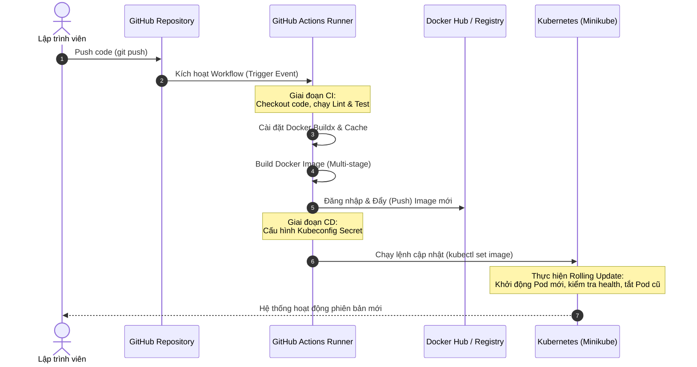
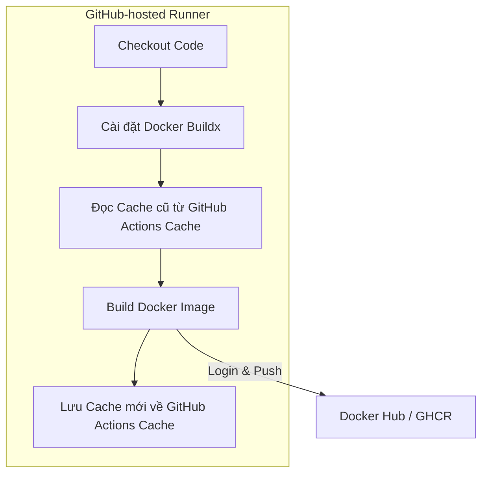
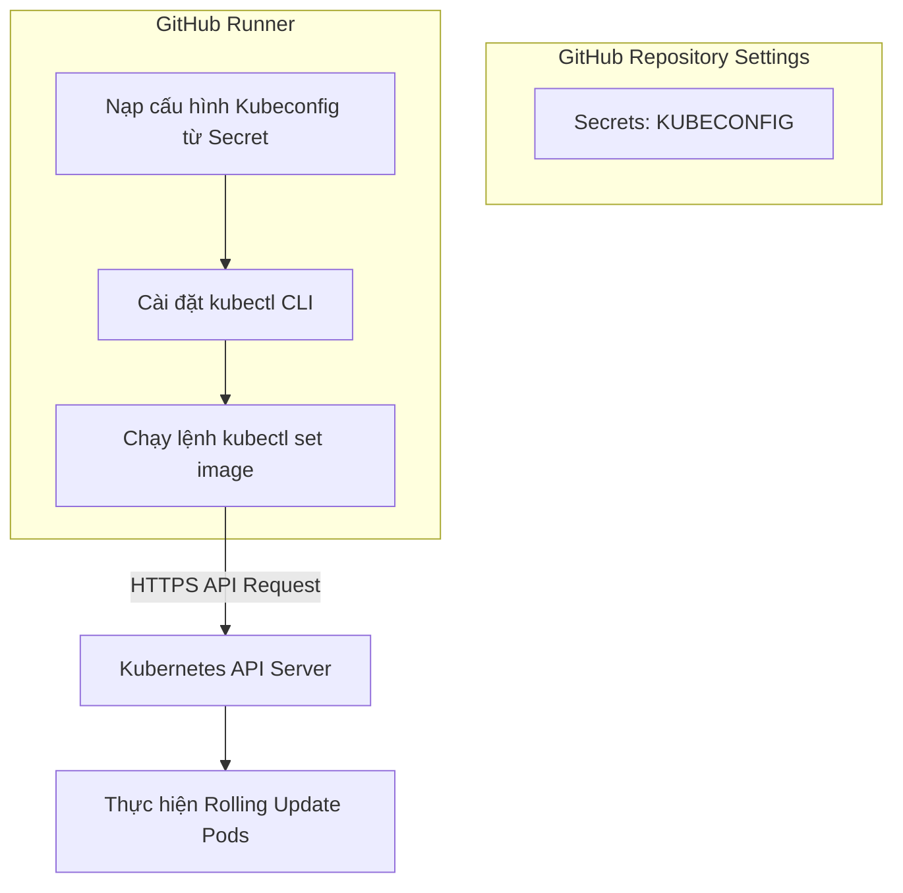
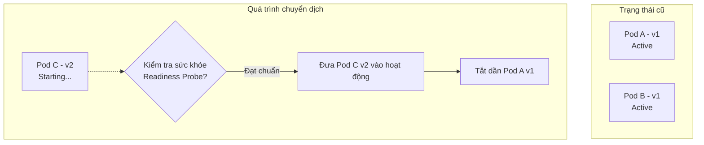

# CI/CD Pipeline với GitHub Actions, Docker và Kubernetes (Minikube)

Tài liệu này phân tích chi tiết mô hình kết hợp giữa **GitHub Actions**, **Docker**, và cụm **Kubernetes (Minikube)**. Đây là bộ ba công nghệ DevOps mạnh mẽ, giúp xây dựng một quy trình CI/CD tự động, tối ưu hóa bộ nhớ đệm (cache), bảo mật thông tin đăng nhập và hỗ trợ cập nhật không gây downtime cho dự án **TranscriptHub**.

---

## 1. Sơ đồ luồng hoạt động tổng quan (Workflow)

Mô hình hoạt động của pipeline tích hợp các thành phần:



---

## 2. Vai trò của từng thành phần trong Pipeline

Để quy trình CI/CD vận hành trơn tru và hiệu quả nhất, mỗi công nghệ đảm nhận một vai trò chuyên biệt:

| Công nghệ | Vai trò trong Pipeline | Nhiệm vụ chính |
| :--- | :--- | :--- |
| **GitHub Actions** | **Nhà điều phối (Orchestrator)** | Lắng nghe sự kiện Git, quản lý các biến bí mật (Secrets), chạy song song các job kiểm thử, thiết lập môi trường build, gọi Docker command để build/push và ra lệnh deploy sang K8s. |
| **Docker** | **Đồng nhất môi trường (Containerization)** | Đóng gói mã nguồn cùng toàn bộ dependencies thành các Docker Images gọn nhẹ. Đảm bảo ứng dụng chạy đồng nhất từ máy ảo CI/CD cho đến môi trường Production thực tế. |
| **Kubernetes (Minikube)** | **Quản trị vận hành (Orchestration)** | Tiếp nhận yêu cầu deploy từ GitHub Actions, quản lý vòng đời container, tự động phân phối tải, tự phục hồi khi lỗi (Self-healing) và thực thi cập nhật phiên bản mới không gây downtime. |

---

## 3. Cách GitHub Actions tương tác với Docker

Vì các máy ảo GitHub-hosted runners bắt đầu từ trạng thái hoàn toàn mới (clean state) ở mỗi lần chạy workflow, việc tối ưu hóa thời gian build Docker bằng bộ nhớ đệm (cache) là cực kỳ quan trọng đối với hệ thống gồm nhiều microservices như TranscriptHub.



### 3.1. Các Actions chính thức từ Docker (Docker Official Actions)
Để tương tác với Docker, thay vì viết các lệnh shell `docker login` hay `docker build` thủ công, chúng ta sử dụng bộ Actions chính thức được tối ưu từ Docker:
1. **`docker/login-action@v3`**: Sử dụng để đăng nhập vào Docker Hub hoặc GitHub Container Registry (GHCR) một cách an toàn.
2. **`docker/setup-buildx-action@v3`**: Cấu hình **Docker Buildx** (công cụ build mạnh mẽ hỗ trợ tính năng build nâng cao, build đa nền tảng và quản lý cache vượt trội).
3. **`docker/build-push-action@v6`**: Đảm nhận nhiệm vụ build Dockerfile và push image lên registry.

### 3.2. Cơ chế lưu đệm nâng cao (Build Cache)
Khi sử dụng `docker/build-push-action`, chúng ta có thể cấu hình lưu đệm các layers của Dockerfile trực tiếp lên GitHub Actions Cache. Điều này giúp giảm thiểu thời gian build từ 10-15 phút xuống chỉ còn vài chục giây cho các lần build sau:
```yaml
- name: Build and push
  uses: docker/build-push-action@v6
  with:
    context: ./services_ms
    file: ./services_ms/apps/users/Dockerfile
    push: true
    tags: user/transcripthub-users:latest
    cache-from: type=gha # Đọc cache từ GitHub Actions Cache
    cache-to: type=gha,mode=max # Ghi cache tối đa vào GitHub Actions Cache
```
* **`cache-from: type=gha`**: Chỉ định Docker tìm kiếm các layers đã được build từ trước trong kho lưu trữ cache của GitHub Actions.
* **`cache-to: type=gha,mode=max`**: Lưu lại toàn bộ layers (bao gồm cả các stage trung gian của Multi-stage build) để tái sử dụng trong các workflow chạy sau.

---

## 4. Cách GitHub Actions tương tác với Kubernetes

Sau khi đẩy Docker Image lên registry thành công, GitHub Actions bước sang giai đoạn CD (Deploy) để ra lệnh cập nhật cho Kubernetes.



### 4.1. Sử dụng GitHub Secrets để lưu cấu hình `kubeconfig`
Để có quyền tương tác với Kubernetes API Server, runner cần tệp cấu hình chứa token xác thực (`kubeconfig`).
* **Giải pháp**: 
  1. Lấy nội dung file `~/.kube/config` của cụm K8s.
  2. Lưu toàn bộ nội dung file này vào phần **Repository Secrets** trên GitHub với tên biến (ví dụ: `KUBECONFIG_RAW`).
  3. Trong workflow, trích xuất biến này ra một file tạm thời trên runner để `kubectl` sử dụng.

### 4.2. Triển khai lệnh kubectl bằng Actions
Chúng ta có thể cài đặt `kubectl` CLI trên runner thông qua action **`azure/setup-kubectl@v4`**. Máy ảo Ubuntu-latest của GitHub cũng thường cài sẵn công cụ này.
Đoạn cấu hình mẫu trong file workflow YAML:
```yaml
- name: Deploy to Kubernetes
  run: |
    # Tạo thư mục .kube và ghi nội dung kubeconfig
    mkdir -p ~/.kube
    echo "${{ secrets.KUBECONFIG_RAW }}" > ~/.kube/config
    
    # Thực hiện apply các file YAML cấu hình
    kubectl apply -f k8s/init-config.yaml
    kubectl apply -f k8s/users-service.yaml
    
    # Cập nhật image tag mới
    kubectl set image deployment/users-service users-service=docker.io/yourusername/transcripthub-users:${{ github.run_number }} -n transcripthub
    
    # Kiểm tra trạng thái triển khai
    kubectl rollout status deployment/users-service -n transcripthub
```

---

## 5. Quy trình Rolling Update (Cập nhật không gián đoạn dịch vụ)

Khi GitHub Actions chạy lệnh `kubectl set image` hoặc `kubectl apply -f`, Kubernetes sẽ tự động thực hiện quy trình cập nhật **Rolling Update**. Đây là tính năng giúp cập nhật phiên bản ứng dụng mà người dùng không hề nhận ra sự gián đoạn (Zero-downtime).



### 5.1. Cơ chế hoạt động của Rolling Update
1. **Khởi tạo Pod mới**: Kubernetes tạo một Pod mới chạy phiên bản code mới (ví dụ: v2) song song với các Pod cũ (v1) vẫn đang chạy.
2. **Kiểm tra Readiness Probe**: K8s thực hiện kiểm tra sức khỏe của Pod v2 thông qua các endpoint cấu hình sẵn (ví dụ: request HTTP tới `/api/health`).
3. **Chuyển hướng Traffic**: Khi Pod v2 vượt qua kiểm tra sức khỏe và ở trạng thái `Ready`, K8s Service sẽ bắt đầu định tuyến một phần traffic của người dùng sang Pod v2 mới.
4. **Tắt Pod cũ**: K8s tiến hành gửi tín hiệu tắt (`SIGTERM`) và xóa dần một Pod cũ chạy bản v1.
5. **Lặp lại quy trình**: Quy trình này lặp lại cho các Pod tiếp theo cho tới khi toàn bộ cụm chỉ còn chạy phiên bản v2.

### 5.2. Lợi ích vượt trội
* **Không mất kết nối**: Người dùng không gặp lỗi màn hình trắng hay lỗi 502/504 trong suốt quá trình cập nhật.
* **Tự động Rollback**: Nếu Pod v2 mới bị lỗi khởi động (crash loop) hoặc không vượt qua được kiểm tra sức khỏe, Kubernetes sẽ dừng ngay lập tức việc deploy và giữ nguyên các Pod v1 cũ hoạt động bình thường, giúp bảo vệ an toàn cho hệ thống.
