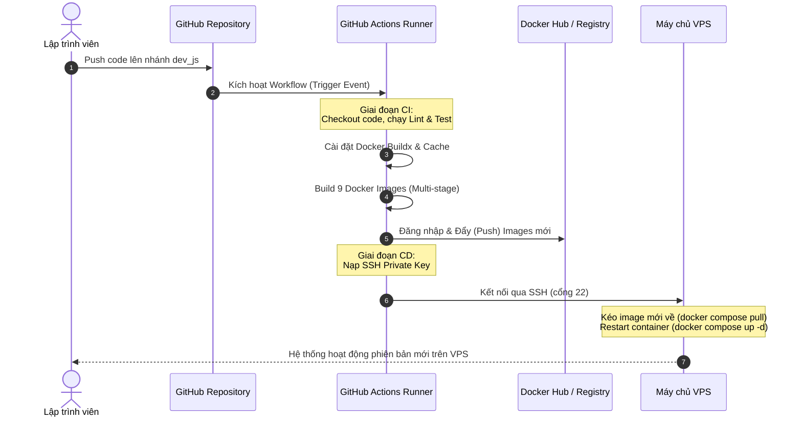
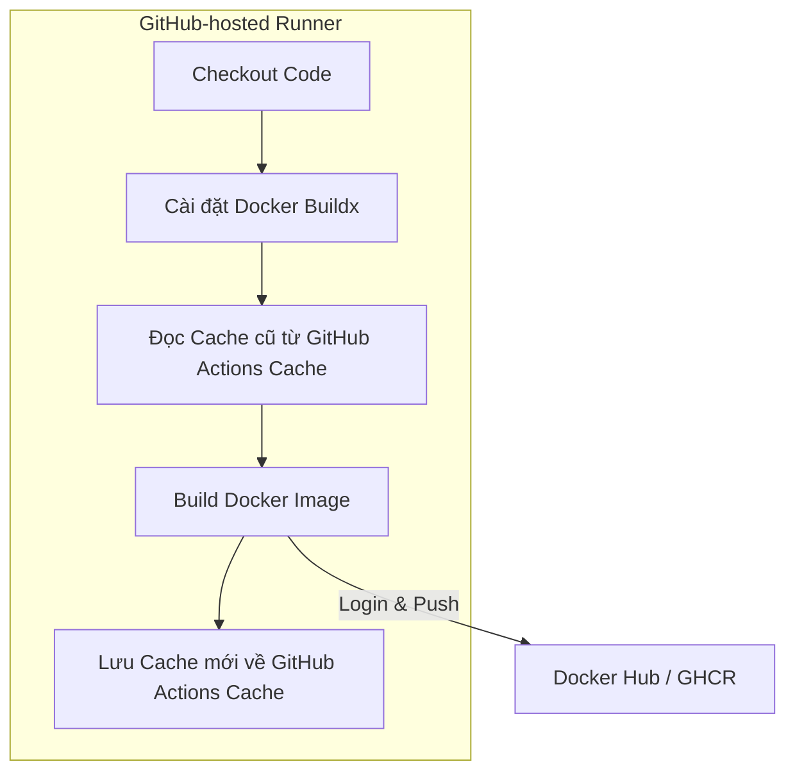
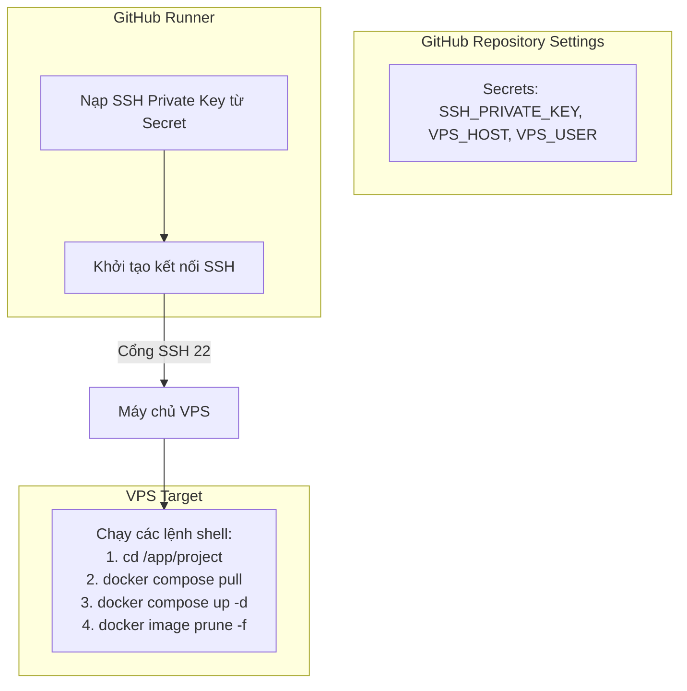

# CI/CD Pipeline với GitHub Actions, Docker và VPS (Docker Compose)

Tài liệu này phân tích chi tiết mô hình kết hợp giữa **GitHub Actions**, **Docker**, và **VPS (Docker Compose)**. Đây là giải pháp triển khai CI/CD hiệu quả, phổ biến và bảo mật nhất cho các dự án khởi nghiệp và vừa nhỏ như **TranscriptHub**, giúp cập nhật hệ thống nhanh chóng chỉ với giao thức SSH.

---

## 1. Sơ đồ luồng hoạt động tổng quan (Workflow)

Mô hình hoạt động của pipeline tích hợp 3 thành phần:



---

## 2. Vai trò của từng thành phần trong Pipeline

Để quy trình CI/CD vận hành trơn tru và hiệu quả nhất, mỗi công nghệ đảm nhận một vai trò chuyên biệt:

| Công nghệ | Vai trò trong Pipeline | Nhiệm vụ chính |
| :--- | :--- | :--- |
| **GitHub Actions** | **Nhà điều phối (Orchestrator)** | Lắng nghe sự kiện Git, chạy song song các job kiểm thử, cài đặt môi trường build, gọi Docker command để build/push, sau đó khởi tạo phiên SSH bảo mật kết nối tới VPS để gửi lệnh deploy. |
| **Docker** | **Đồng nhất môi trường (Containerization)** | Đóng gói mã nguồn cùng toàn bộ dependencies thành các Docker Images gọn nhẹ. Đảm bảo ứng dụng chạy đồng nhất từ máy ảo CI/CD cho đến môi trường VPS Production thực tế. |
| **VPS (Docker Compose)** | **Máy chủ Chạy ứng dụng (Runtime)** | Tiếp nhận lệnh từ GitHub Actions qua SSH để cập nhật các container ứng dụng, duy trì sự ổn định, cấu hình volume lưu trữ dữ liệu và xử lý traffic từ người dùng. |

---

## 3. Cách GitHub Actions tương tác với Docker

Vì các máy ảo GitHub-hosted runners bắt đầu từ trạng thái hoàn toàn mới (clean state) ở mỗi lần chạy workflow, việc tối ưu hóa thời gian build Docker bằng bộ nhớ đệm (cache) là cực kỳ quan trọng đối với hệ thống gồm nhiều microservices như TranscriptHub.



### 3.1. Các Actions chính thức từ Docker (Docker Official Actions)
Để tương tác với Docker, chúng ta sử dụng bộ Actions chính thức được tối ưu từ Docker:
1. **`docker/login-action@v3`**: Sử dụng để đăng nhập vào Docker Hub một cách an toàn thông qua Credentials.
2. **`docker/setup-buildx-action@v3`**: Cấu hình **Docker Buildx** (công cụ build mạnh mẽ hỗ trợ tính năng build nâng cao và quản lý cache vượt trội).
3. **`docker/build-push-action@v6`**: Đảm nhận nhiệm vụ build Dockerfile và push image lên registry.

### 3.2. Cơ chế lưu đệm nâng cao (Build Cache)
Khi sử dụng `docker/build-push-action`, chúng ta có thể cấu hình lưu đệm các layers của Dockerfile trực tiếp lên GitHub Actions Cache. Điều này giúp giảm thiểu thời gian build từ 10-15 phút xuống chỉ còn vài chục giây cho các lần build sau:
```yaml
- name: Build and push
  uses: docker/build-push-action@v6
  with:
    context: ./services_ms
    file: ./services_ms/apps/users/Dockerfile
    push: true
    tags: user/transcripthub-users:latest
    cache-from: type=gha # Đọc cache từ GitHub Actions Cache
    cache-to: type=gha,mode=max # Ghi cache tối đa vào GitHub Actions Cache
```
* **`cache-from: type=gha`**: Chỉ định Docker tìm kiếm các layers đã được build từ trước trong kho lưu trữ cache của GitHub Actions.
* **`cache-to: type=gha,mode=max`**: Lưu lại toàn bộ layers (bao gồm cả các stage trung gian của Multi-stage build) để tái sử dụng trong các workflow chạy sau.

---

## 4. Cách GitHub Actions tương tác với VPS

Sau khi đẩy Docker Image lên registry thành công, GitHub Actions bước sang giai đoạn CD (Deploy) để ra lệnh cập nhật cho VPS.



### 4.1. Sử dụng GitHub Secrets để lưu thông tin SSH
Để kết nối bảo mật tới VPS mà không làm lộ mật khẩu, bạn cần cấu hình các thông tin này trong phần **Settings -> Secrets and variables -> Actions** của repository:
* `VPS_HOST`: Địa chỉ IP public của VPS.
* `VPS_USER`: Tên tài khoản SSH của VPS (ví dụ: `ubuntu` hoặc `root`).
* `SSH_PRIVATE_KEY`: Private Key (nội dung tệp `id_rsa`) tương ứng với Public Key đã cấu hình trong tệp `authorized_keys` của VPS.

### 4.2. Khởi tạo phiên SSH bằng Action Appleboy
Chúng ta sử dụng Action phổ biến và bảo mật nhất hiện nay là **`appleboy/ssh-action@v1.0.3`** để thực thi tập hợp lệnh shell trực tiếp trên máy chủ VPS:
```yaml
- name: Deploy to VPS (Docker Compose)
  uses: appleboy/ssh-action@v1.0.3
  with:
    host: ${{ secrets.VPS_HOST }}
    username: ${{ secrets.VPS_USER }}
    key: ${{ secrets.SSH_PRIVATE_KEY }}
    script: |
      cd /app/VDT_miniproject_TranscriptHub
      echo 'Connected to VPS. Pulling new Docker Images...'
      docker compose pull
      echo 'Updating stack without downtime...'
      docker compose up -d --remove-orphans
      echo 'Cleaning old Docker images...'
      docker image prune -f
```

---

## 5. Quy trình Cập nhật container trên VPS

Khi chạy lệnh `docker compose up -d --remove-orphans`, Docker Compose sẽ tự động kiểm tra sự thay đổi của Image ID vừa được pull về:
1. **Phát hiện thay đổi**: Nếu Image ID mới khác với Image đang chạy, Docker Compose sẽ dừng container cũ và khởi tạo container mới ngay lập tức.
2. **Hạn chế gián đoạn dịch vụ**: Quá trình dừng và khởi tạo lại chỉ diễn ra trong vòng 1-2 giây cho mỗi service.
3. **Dọn dẹp đĩa**: Lệnh `docker image prune -f` cuối cùng sẽ dọn dẹp toàn bộ các Docker image cũ bị "mồ côi" (dangling images - không còn tag cụ thể) giúp bảo vệ ổ cứng VPS không bị đầy sau nhiều lần deploy.
