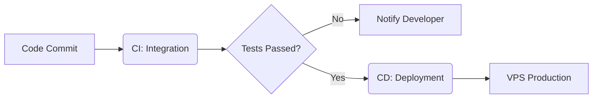
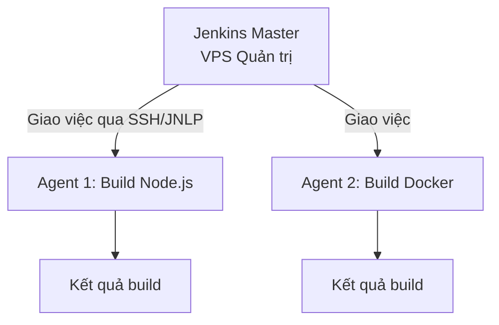

# Hướng dẫn Triển khai CI/CD với Jenkins cho dự án TranscriptHub

Tài liệu này cung cấp cái nhìn toàn diện về **Tích hợp liên tục (CI)** và **Triển khai liên tục (CD)**, giải thích cách thức hoạt động, cách kết hợp với **Jenkins** và các bước chi tiết để thiết lập quy trình tự động hóa cho dự án **TranscriptHub** (bao gồm Backend NestJS Monorepo và Frontend Next.js).

---

## 1. Giới thiệu về CI/CD

Trong phát triển phần mềm hiện đại, đặc biệt là với kiến trúc **Microservices** như dự án TranscriptHub, **CI/CD** đóng vai trò là xương sống giúp tăng tốc độ bàn giao sản phẩm và nâng cao chất lượng code.



### 1.1. CI (Continuous Integration - Tích hợp liên tục)
CI là thực hành tự động hóa việc tích hợp các thay đổi mã nguồn từ nhiều lập trình viên vào một kho chứa (repository) chung. 
* **Mục tiêu**: Phát hiện xung đột và lỗi code sớm nhất có thể.
* **Tần suất**: Diễn ra liên tục (mỗi khi push code hoặc tạo Pull Request).

### 1.2. CD (Continuous Delivery / Continuous Deployment - Giao hàng & Triển khai liên tục)
* **Continuous Delivery**: Tự động hóa quá trình đóng gói và chuẩn bị ứng dụng để sẵn sàng triển khai lên các môi trường (Staging, Production). Tuy nhiên, quyết định deploy lên Production vẫn cần bấm nút thủ công.
* **Continuous Deployment**: Bước tiếp theo của Delivery, tự động đưa thẳng mã nguồn đã build và kiểm thử thành công lên server Production mà không cần bất kỳ sự can thiệp thủ công nào.

---

## 2. Một quy trình CI/CD cần làm những gì?

Một đường ống (Pipeline) CI/CD tiêu chuẩn bao gồm 5 giai đoạn cốt lõi:

| Giai đoạn | Hành động cụ thể | Ý nghĩa |
| :--- | :--- | :--- |
| **1. Source** | Lắng nghe sự kiện push code, PR trên GitHub/GitLab. | Kích hoạt tự động pipeline. |
| **2. Build & Test** | Cài đặt dependencies (`npm ci`), chạy Linters (`eslint`), Unit Tests (`jest`), và biên dịch code. | Đảm bảo code chạy đúng nghiệp vụ, không lỗi cú pháp và đạt chuẩn chất lượng. |
| **3. Package** | Xây dựng các Docker Images theo cơ chế **Multi-stage build** và đẩy (push) lên Docker Registry (Docker Hub). | Đóng gói ứng dụng và các dependencies thành một thực thể độc lập, dễ dàng deploy. |
| **4. Deploy** | SSH kết nối vào VPS, chạy `docker compose pull` và `docker compose up -d` để reload dịch vụ. | Đưa phiên bản mới của ứng dụng lên môi trường Production không gây gián đoạn. |
| **5. Notify & Monitor** | Gửi cảnh báo về Slack, Telegram, Discord hoặc Email. Giám sát hệ thống qua Prometheus/Grafana. | Cung cấp thông tin phản hồi ngay lập tức cho đội ngũ phát triển. |

---

## 3. Kết hợp CI/CD với Jenkins

**Jenkins** là công cụ tự động hóa mã nguồn mở phổ biến nhất thế giới được viết bằng Java, chuyên dùng để thiết lập các pipeline CI/CD tự quản lý (Self-hosted).

### 3.1. Tại sao chọn Jenkins thay vì GitHub Actions / GitLab CI?
1. **Tiết kiệm chi phí**: Jenkins chạy trên cơ sở hạ tầng của chính bạn (Self-hosted VPS). Bạn không phải trả phí theo số phút build như GitHub Actions hay GitLab CI SaaS.
2. **Tính linh hoạt cao**: Jenkins có hệ sinh thái hơn 1800+ plugins giúp kết nối tới mọi công nghệ (Docker, Kubernetes, AWS, Slack, SonarQube...).
3. **Pipeline as Code**: Định nghĩa toàn bộ pipeline thông qua tệp [Jenkinsfile](file:///d:/VDT_Tucode/VDT_miniproject_TranscriptHub/Jenkinsfile) lưu trực tiếp trong mã nguồn giúp quản lý phiên bản dễ dàng.

### 3.2. Kiến trúc Jenkins Master - Agent (Runner)
Để tránh quá tải cho server chính, Jenkins sử dụng mô hình Master-Agent:
* **Jenkins Master**: Đảm nhận nhiệm vụ quản trị, phân tích cú pháp `Jenkinsfile`, lập lịch chạy các job, quản lý cấu hình và giao diện UI.
* **Jenkins Agent (Worker)**: Là các máy ảo hoặc container Docker chạy ngầm kết nối tới Master. Agent trực tiếp thực thi các lệnh biên dịch, chạy test, build Docker Image.



---

## 4. Hướng dẫn triển khai CI/CD Jenkins cho dự án TranscriptHub

### 4.1. Chuẩn bị tài nguyên trong mã nguồn
Dự án đã được thiết lập sẵn sàng:
1. **Frontend Dockerfile**: Đóng gói Next.js standalone tại [fe_next/Dockerfile](file:///d:/VDT_Tucode/VDT_miniproject_TranscriptHub/fe_next/Dockerfile).
2. **Backend Dockerfiles**: Nằm trong từng thư mục microservices, ví dụ: [services_ms/apps/users/Dockerfile](file:///d:/VDT_Tucode/VDT_miniproject_TranscriptHub/services_ms/apps/users/Dockerfile).
3. **Tệp điều phối Pipeline**: File cấu hình [Jenkinsfile](file:///d:/VDT_Tucode/VDT_miniproject_TranscriptHub/Jenkinsfile) đặt tại thư mục gốc.

---

### 4.2. Bước 1: Cài đặt Jenkins trên Server bằng Docker Compose
Đăng nhập SSH vào server VPS dành riêng cho CI/CD (hoặc cài trực tiếp trên máy chủ của bạn) và khởi chạy Jenkins bằng Docker:

Tạo tệp `docker-compose.jenkins.yml`:
```yaml
version: '3.8'
services:
  jenkins:
    image: jenkins/jenkins:lts-jdk17
    container_name: jenkins-server
    restart: always
    privileged: true
    user: root
    ports:
      - "8080:8080"
      - "50000:50000"
    volumes:
      - jenkins_data:/var/jenkins_home
      # Cho phép Jenkins sử dụng Docker daemon của Host để build image
      - /var/run/docker.sock:/var/run/docker.sock
      - /usr/bin/docker:/usr/bin/docker
    environment:
      - TZ=Asia/Ho_Chi_Minh

volumes:
  jenkins_data:
```
Chạy lệnh khởi động:
```bash
docker compose -f docker-compose.jenkins.yml up -d
```
> [!NOTE]
> Sau khi khởi động, truy cập `http://<vps_jenkins_ip>:8080`. Lấy mật khẩu admin ban đầu bằng lệnh:
> `docker exec jenkins-server cat /var/jenkins_home/secrets/initialAdminPassword`

---

### 4.3. Bước 2: Cài đặt các Plugin cần thiết trên Jenkins
Truy cập **Manage Jenkins** -> **Plugins** -> **Available Plugins** và cài đặt các plugin sau:
1. **Docker Pipeline**: Hỗ trợ cú pháp build và push Docker dễ dàng trong Jenkinsfile.
2. **SSH Agent**: Hỗ trợ nạp SSH key để kết nối không mật khẩu tới VPS Production.
3. **Pipeline Stage View**: Giúp hiển thị trực quan các bước chạy pipeline dưới dạng bảng lưới.
4. **Git Integration**: Kết nối tới GitHub để lắng nghe sự thay đổi.

---

### 4.4. Bước 3: Cấu hình Credentials (Thông tin bảo mật) trên Jenkins
Vào **Manage Jenkins** -> **Credentials** -> **System** -> **Global credentials** và thêm 2 khóa sau:

1. **Docker Hub Credentials**:
   * **Kind**: *Username with password*
   * **ID**: `dockerhub-credentials` (Phải khớp với biến `DOCKER_CREDS_ID` trong Jenkinsfile)
   * **Username**: Tài khoản Docker Hub của bạn.
   * **Password**: Access Token sinh ra từ tài khoản Docker Hub (không dùng mật khẩu chính để bảo mật).

2. **VPS Deploy SSH Key**:
   * **Kind**: *SSH Username with private key*
   * **ID**: `vps-ssh-key` (Phải khớp với biến `SSH_CREDS_ID` trong Jenkinsfile)
   * **Username**: Tên tài khoản SSH trên VPS Production (ví dụ: `ubuntu` hoặc `root`).
   * **Private Key**: Copy toàn bộ nội dung file private key của bạn (`~/.ssh/id_rsa`).

---

### 4.5. Bước 4: Thiết lập GitHub Webhook
Để mỗi lần push code GitHub tự động báo cho Jenkins chạy build:
1. Vào repository dự án trên GitHub -> **Settings** -> **Webhooks** -> **Add webhook**.
2. **Payload URL**: Nhập `http://<vps_jenkins_ip>:8080/github-webhook/` (Phải có dấu gạch chéo cuối).
3. **Content type**: `application/json`.
4. **Which events**: Chọn **Just the push event**.
5. Nhấn **Add webhook**.

---

### 4.6. Bước 5: Tạo Pipeline Job trên Jenkins
1. Tại màn hình chính Jenkins, chọn **New Item**.
2. Đặt tên Job (ví dụ: `TranscriptHub-Pipeline`) và chọn kiểu **Pipeline**, sau đó nhấn **OK**.
3. Cuộn xuống phần **Build Triggers**, tích chọn **GitHub hook trigger for GITScm polling** (để lắng nghe Webhook).
4. Tại phần **Pipeline**:
   * **Definition**: Chọn *Pipeline script from SCM*.
   * **SCM**: Chọn *Git*.
   * **Repository URL**: Điền link Git của dự án (ví dụ: `https://github.com/yourusername/VDT_miniproject_TranscriptHub.git`).
   * **Credentials**: Chọn Git Credentials đã thêm (nếu repo ở chế độ Private).
   * **Branch Specifier**: Điền `*/main`.
   * **Script Path**: Điền `Jenkinsfile`.
5. Nhấn **Save**.

Bây giờ, mỗi khi bạn push code lên nhánh `main`, Jenkins sẽ tự động kích hoạt, thực thi chạy Lint, Test cho cả Frontend và Backend, build song song 9 Docker Images, push lên Docker Hub, và cập nhật ứng dụng trực tiếp trên VPS Production mà không gián đoạn!

---

## 5. Phân tích tối ưu trong Jenkinsfile của dự án

Tệp [Jenkinsfile](file:///d:/VDT_Tucode/VDT_miniproject_TranscriptHub/Jenkinsfile) được thiết kế đặc biệt nhằm tối ưu hóa hiệu năng và độ an toàn:

1. **Parallel Test & Build**:
   * Sử dụng cấu trúc `parallel` ở giai đoạn **Lint & Unit Test** để chạy kiểm tra Frontend và Backend cùng lúc.
   * Giai đoạn **Docker Build & Push** chạy song song 9 luồng build cho 9 dịch vụ (`api-gateway`, `users`, `identity`, `file`, `transcript`, `meeting`, `collab`, `collab-gateway`, `frontend`), tận dụng tối đa CPU của Jenkins Runner và giảm thời gian chờ đợi từ **40 phút xuống còn dưới 5 phút**.
2. **An toàn bảo mật**:
   * Sử dụng block `withCredentials` để ẩn đi các thông tin nhạy cảm của Docker Hub, ngăn ngừa việc rò rỉ token ra console logs.
   * Sử dụng plugin `sshagent` giúp kết nối an toàn tới VPS bằng SSH Key mà không cần lưu password dạng plain-text.
3. **Tự động dọn dẹp hệ thống (Clean Up)**:
   * Block `post { always { ... } }` thực hiện dọn dẹp toàn bộ Docker images rác được tạo ra trong quá trình build trên máy Jenkins Runner. Điều này ngăn chặn tình trạng đầy phân vùng đĩa cứng (`Out of Disk Space`) - lỗi phổ biến nhất trong các hệ thống CI/CD Jenkins.
   * Lệnh `docker image prune -f` trên VPS giúp dọn dẹp các layer cũ của Docker sau khi khởi chạy thành công container mới.

---

## 6. Tài liệu học tập CI/CD và DevOps khuyên dùng

Để nâng cao kiến thức và trở thành một kỹ sư DevOps thực thụ, dưới đây là các nguồn tài liệu học tập được chọn lọc tốt nhất:

### 6.1. Sách (Books)
* **The DevOps Handbook** (*Gene Kim, Jez Humble, Patrick Debois, John Willis*): Cuốn sách "gối đầu giường" giới thiệu triết lý DevOps, luồng công việc CI/CD và văn hóa làm việc cộng tác.
* **Continuous Delivery: Reliable Software Releases through Build, Test, and Deployment Automation** (*Jez Humble, David Farley*): Sách định hình toàn bộ lý thuyết và thực hành về các pipeline CD chuyên nghiệp.
* **Jenkins 2: Up and Running** (*Brent Laster*): Sách hướng dẫn chi tiết cách viết Jenkinsfile dạng Declarative và Scripted Pipeline từ cơ bản tới nâng cao.

### 6.2. Trang Web & Tài liệu chính thức (Official Documentation)
* [Jenkins User Documentation](https://www.jenkins.io/doc/): Tài liệu hướng dẫn sử dụng Jenkins chính thức cực kỳ đầy đủ. Hãy tập trung học phần **Pipeline** và **Declarative Pipeline syntax**.
* [Docker Docs](https://docs.docker.com/): CI/CD hiện đại luôn gắn liền với Container. Hãy nắm vững Dockerfile, Multi-stage build, và Docker Compose.
* [DevOps School](https://devops.school/) & [DevOpsCube](https://devopscube.com/): Hai trang blog chia sẻ các bài viết hướng dẫn thực hành (hands-on tutorials) về Jenkins, Kubernetes, Docker rất trực quan.

### 6.3. Khóa học trực tuyến (Online Courses)
* **Udemy: Jenkins, From Zero To Hero: Become a DevOps Jenkins Master** (*Ricardo Andre Gonzalez Gomez*): Khóa học thực hành Jenkins thực tế rất chi tiết trên Udemy.
* **Udemy: Docker and Kubernetes: The Complete Guide** (*Stephen Grider*): Cung cấp nền tảng containerization cực tốt để viết các pipeline đóng gói.
* **Coursera: DevOps on AWS Specialization**: Loạt khóa học từ AWS giúp hiểu cách vận hành CI/CD trên nền tảng cloud.
