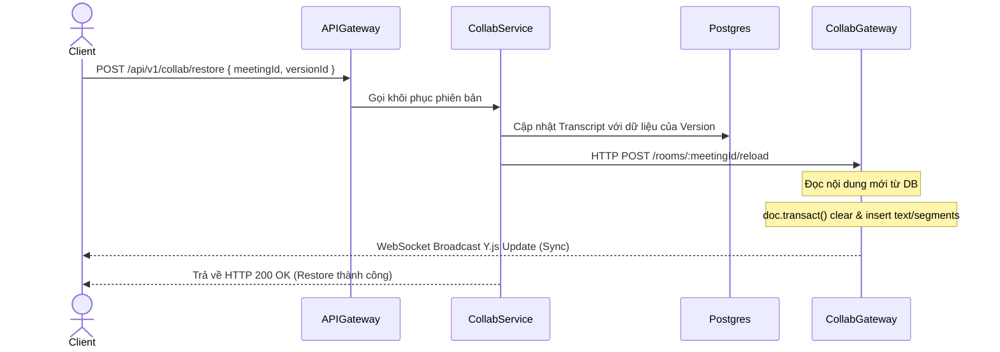

# Kế hoạch Thiết kế & Triển khai 3 Tính năng Mới cho TranscriptHub

Tài liệu này đặc tả chi tiết thiết kế kỹ thuật, luồng dữ liệu và các bước triển khai cho 3 tính năng mới được lựa chọn để hoàn thiện hệ thống TranscriptHub:
1. **Git-like Diff & Version History Viewer** (Xem lịch sử và so sánh phiên bản)
2. **Khởi tạo Bản dịch gốc từ AI** (Nâng cấp phương thức `updateStatusAndContent`)
3. **Phân quyền Meeting & Gửi thông báo nội bộ qua Kafka** (Gửi thông báo và hỗ trợ URL điều hướng trực tiếp)

---

## 1. Git-like Diff & Version History Viewer

### 1.1. Luồng hoạt động & Thử thách kỹ thuật (Yjs Memory Out-Of-Sync)
*   **Thử thách:** Khi người dùng gọi API REST `POST /collab/restore` để khôi phục một phiên bản cũ, Postgres Database được cập nhật thành công. Tuy nhiên, `collab-gateway` (WebSocket server) đang lưu trữ đối tượng `Y.Doc` của phòng đó trong RAM.
    *   Nếu Gateway không biết nội dung đã được khôi phục, các client đang kết nối vẫn giữ văn bản cũ trong trình soạn thảo Quill.
    *   Lượt gõ phím tiếp theo của client sẽ ghi đè và làm hỏng nội dung vừa được khôi phục trong cơ sở dữ liệu.
*   **Giải pháp (Gateway Socket Reload):**
    1. Khi gọi REST API `restoreVersion`, `collab-service` cập nhật Postgres DB.
    2. Đồng thời, `collab-service` gửi một HTTP POST request (hoặc gửi qua Redis Pub/Sub) tới `collab-gateway` thông qua endpoint:
       `POST http://collab-gateway:3008/rooms/:meetingId/reload`
    3. `collab-gateway` nhận được tín hiệu reload, sẽ:
       * Tải nội dung transcript mới nhất từ database.
       * Thực hiện thay đổi trong `doc.transact(...)`: xóa sạch `yText` và `ySegments` hiện tại, sau đó điền nội dung khôi phục vào.
       * Yjs tự động tính toán sự khác biệt (delta) và broadcast bản cập nhật này tới tất cả client đang kết nối. Trình soạn thảo Quill của tất cả mọi người sẽ tự động thay đổi nội dung mượt mà mà không bị lệch sync.



### 1.2. Thiết kế giao diện So sánh Phiên bản (Frontend Diff Viewer)
*   **Giao diện Lịch sử:**
    *   Sidebar bên phải màn hình chỉnh sửa hiển thị danh sách các phiên bản (đọc từ `GET /collab/:meetingId/versions`).
    *   Hiển thị thông tin: Tên phiên bản (`Bản lưu - 10:20:15 30/06/2026` hoặc `Bản dịch gốc từ AI`), Người tạo (Avatar, Tên), và Thời gian tạo.
*   **Chế độ So sánh (Diff Mode):**
    *   Khi click vào một phiên bản, mở Modal so sánh chi tiết.
    *   Sử dụng thư viện gọn nhẹ `diff-match-patch` hoặc `jsdiff` (phía Client) để tính toán sự khác biệt giữa **Phiên bản được chọn** và **Phiên bản hiện tại trên màn hình soạn thảo**.
    *   **Inline Diff View:** Hiển thị một khung văn bản hợp nhất:
        *   Phần chữ bị xóa: Bôi đỏ nền, gạch ngang chữ (`background: #fed7d7; text-decoration: line-through; color: #c53030`).
        *   Phần chữ được thêm mới: Bôi xanh lá nền (`background: #c6f6d5; color: #22543d`).
        *   Phần chữ giữ nguyên: Chữ thường mặc định.
    *   Nút **"Khôi phục phiên bản này"** ở cuối Modal để kích hoạt REST API restore.

---

## 2. Khởi tạo Bản dịch gốc từ AI (`updateStatusAndContent`)

### 2.1. Vấn đề hiện tại
*   Khi Gemini thực hiện dịch xong (hoặc dịch lại thành công), hệ thống cập nhật trạng thái `Transcript` thành `COMPLETED` và lưu nội dung qua hàm `updateStatusAndContent` trong `TranscriptService`.
*   Tại thời điểm này, chưa có bản ghi `TranscriptVersion` nào được tạo cho bản dịch gốc của AI. Do đó, khi người dùng mở lịch sử phiên bản, họ không thể so sánh văn bản đã sửa với bản dịch gốc đầu tiên của AI.

### 2.2. Giải pháp kỹ thuật
Nâng cấp hàm `updateStatusAndContent` trong `TranscriptRepository` hoặc `TranscriptService` để tự động tạo một phiên bản snapshot làm gốc:
*   Khi `status` cập nhật thành **`COMPLETED`**:
    *   Thực hiện ghi log/transaction cập nhật trạng thái của `Transcript`.
    *   Tự động ghi thêm một bản ghi vào bảng `TranscriptVersion` với thông tin:
        *   `versionName`: `"Bản dịch gốc từ AI"`
        *   `rawText`: `rawText` (kết quả AI)
        *   `structuredContent`: `structuredContent` (mảng phân đoạn AI dịch)
        *   `createdById`: `null` (đại diện cho hệ thống/AI tạo)
*   **Sửa đổi trong `transcript.repository.ts`:**
    ```typescript
    async updateStatusAndContent(
      id: number,
      status: string,
      rawText?: string,
      structuredContent?: any,
    ) {
      return this.prisma.$transaction(async (tx) => {
        // 1. Cập nhật bản ghi chính
        const updated = await tx.transcript.update({
          where: { id },
          data: { status, rawText, structuredContent },
        });

        // 2. Nếu trạng thái là COMPLETED, tạo snapshot gốc
        if (status === 'COMPLETED') {
          // Kiểm tra xem đã có phiên bản gốc chưa (tránh trùng lặp khi re-transcribe)
          const existOrigin = await tx.transcriptVersion.findFirst({
            where: { transcriptId: id, versionName: 'Bản dịch gốc từ AI' }
          });
          
          if (!existOrigin) {
            await tx.transcriptVersion.create({
              data: {
                transcriptId: id,
                versionName: 'Bản dịch gốc từ AI',
                rawText: rawText || '',
                structuredContent: structuredContent || { segments: [] },
                createdById: null, // Hệ thống/AI
              }
            });
          }
        }
        return updated;
      });
    }
    ```

---

## 3. Phân quyền Meeting & Thông báo nội bộ qua Kafka

Hệ thống sẽ không gửi email ra bên ngoài mà sử dụng **Thông báo nội bộ trong hệ thống (Internal System Notifications)**. Khi có các thay đổi về quyền (Thêm thành viên, Xoá thành viên, Thay đổi vai trò), một event sẽ được bắn qua **Kafka**, dịch vụ Notification sẽ tiêu thụ event này, lưu vào database và cập nhật thời gian thực cho người dùng.

### 3.1. Thiết kế cơ sở dữ liệu (Prisma Schema)
Thêm bảng `Notification` vào schema của `users` service trong file `schema.prisma`:

```prisma
model Notification {
  id          Int      @id @default(autoincrement())
  userId      Int      @map("user_id")      // ID người nhận thông báo
  title       String                        // Tiêu đề thông báo
  content     String   @db.Text             // Nội dung thông báo chi tiết
  url         String?                       // URL để click chuyển hướng (e.g. /meetings/{meetingId})
  isRead      Boolean  @default(false) @map("is_read")
  createdAt   DateTime @default(now()) @map("created_at")

  @@map("notifications")
  @@schema("users")
}
```

### 3.2. Thiết kế luồng sự kiện qua Kafka
Tạo topic mới trên Kafka tên là: `notifications`.

#### Cấu trúc Payload của Event trên Kafka:
Khi có thay đổi về thành viên trong meeting, `meeting-service` sẽ publish một message lên topic `notifications`.

```json
{
  "key": "user-12", // userId người nhận để Kafka phân vùng (partition key)
  "value": {
    "recipientId": 12,
    "senderId": 1,
    "type": "MEETING_ACCESS_GRANTED" | "MEETING_ACCESS_REVOKED" | "MEETING_ROLE_UPDATED",
    "meetingId": "8bfa2e9a-7b3c-4d2a-89a1-526bfd254e01",
    "meetingTitle": "Họp kế hoạch Sprint 1",
    "role": "EDITOR" | "VIEWER",
    "url": "/transcripts/8bfa2e9a-7b3c-4d2a-89a1-526bfd254e01/edit", // Deep link di chuyển thẳng vào meeting transcript
    "createdAt": "2026-06-30T00:40:00Z"
  }
}
```

#### Các trường hợp phát sinh sự kiện trong `meeting.service.ts`:
1.  **Thêm thành viên (`addMember`):**
    *   *Hành động:* Thêm User B vào meeting với quyền `EDITOR`/`VIEWER`.
    *   *Event:* Emit sự kiện `MEETING_ACCESS_GRANTED`.
    *   *Nội dung thông báo:* `"Bạn đã được thêm vào cuộc họp [Tên Meeting] với vai trò [Vai trò]."`
    *   *URL:* `/transcripts/[fileId]/edit` (nếu quyền sửa) hoặc `/transcripts/[fileId]/view` (nếu quyền xem).
2.  **Sửa vai trò thành viên (`updateMemberRole`):**
    *   *Hành động:* Thay đổi role của User B từ `VIEWER` sang `EDITOR`.
    *   *Event:* Emit sự kiện `MEETING_ROLE_UPDATED`.
    *   *Nội dung thông báo:* `"Vai trò của bạn trong cuộc họp [Tên Meeting] đã được cập nhật thành [Vai trò mới]."`
    *   *URL:* `/transcripts/[fileId]/edit` hoặc `/transcripts/[fileId]/view`.
3.  **Xoá thành viên (`removeMember`):**
    *   *Hành động:* Xoá User B ra khỏi meeting.
    *   *Event:* Emit sự kiện `MEETING_ACCESS_REVOKED`.
    *   *Nội dung thông báo:* `"Quyền truy cập của bạn vào cuộc họp [Tên Meeting] đã bị thu hồi bởi Chủ phòng."`
    *   *URL:* `/dashboard` (không thể vào link meeting cũ được nữa).

### 3.3. Xây dựng dịch vụ tiêu thụ thông báo (Notification Consumer)
*   **Nơi đặt:** Đặt trong `users-service` (vì nó quản lý DB schema `users` có bảng `Notification`).
*   **Logic xử lý:**
    *   Đăng ký lắng nghe topic `notifications` trên Kafka.
    *   Khi có message mới:
        1. Tạo bản ghi `Notification` mới trong PostgreSQL thông qua Prisma.
        2. Gửi thông báo thời gian thực lên Frontend qua WebSocket/SSE nếu người dùng đó đang online (hoặc tích hợp thông qua `collab-gateway`).
*   **Các API Endpoint mới cung cấp bởi API Gateway:**
    *   `GET /users/notifications` : Lấy danh sách thông báo của user hiện tại (hỗ trợ phân trang, sắp xếp theo thời gian mới nhất).
    *   `PATCH /users/notifications/:id/read` : Đánh dấu thông báo đã đọc.

### 3.4. Giao diện hiển thị trên Frontend
*   **Notification Bell:** Một icon hình chuông trên Header của trang Dashboard. Hiển thị số lượng thông báo chưa đọc (đếm từ API).
*   **Notification Popover:** Click vào chuông hiển thị danh sách các thông báo gần đây.
*   **Click Redirect:** Khi click vào một dòng thông báo:
    1. Gọi API mark as read.
    2. Chuyển hướng trình duyệt đến trường `url` đính kèm trong thông báo (Ví dụ: nhảy trực tiếp vào màn hình sửa Transcript `/transcripts/uuid/edit`).

---

## 4. Kế hoạch triển khai & Kiểm thử (Verification Plan)

### Bước 1: Cấu hình Database & Schema
*   Cập nhật `schema.prisma` với bảng `Notification` mới.
*   Bổ sung logic tự động tạo snapshot khi `status = COMPLETED` vào `updateStatusAndContent`.
*   Chạy `npx prisma db push` (ở môi trường phát triển) hoặc sinh migration.

### Bước 2: Triển khai backend của Meeting & Notification
*   Tích hợp Kafka producer vào `meeting-service`, gửi event lên topic `notifications` khi thay đổi member/role.
*   Xây dựng consumer tại `users-service` để lưu thông báo vào database.
*   Viết API endpoints lấy danh sách/đánh dấu đã đọc thông báo trong `api-gateway` và `users-service`.

### Bước 3: Triển khai Version History & Restore Gateway Sync
*   Xây dựng endpoint reload `/rooms/:meetingId/reload` trong `collab-gateway`.
*   Cập nhật endpoint `restoreVersion` trong `collab-service` để gửi lệnh POST reload tới `collab-gateway`.

### Bước 4: Tích hợp Frontend
*   Xây dựng giao diện xem lịch sử phiên bản (sidebar) và so sánh phiên bản (Modal Diff Viewer).
*   Xây dựng icon chuông thông báo trên Header và xử lý click di chuyển màn hình.

### Kế hoạch Kiểm thử (Manual Verification)
1.  **Dịch thử file audio mới:** Kiểm tra xem hệ thống có tự tạo bản ghi `Bản dịch gốc từ AI` trong danh sách lịch sử khi AI dịch xong không.
2.  **Khôi phục phiên bản:** Sửa linh tinh văn bản, sau đó nhấn khôi phục bản dịch gốc AI $\rightarrow$ Xác nhận Quill Editor của tất cả các tab đang mở tự động chuyển về văn bản gốc cùng lúc mà không cần load lại trang.
3.  **Phân quyền & Thông báo:** Dùng tài khoản Host A thêm tài khoản B vào meeting $\rightarrow$ Mở tài khoản B xem có thấy chuông thông báo nhảy số không. Click vào thông báo xem có chuyển hướng trực tiếp vào phòng họp được không.
