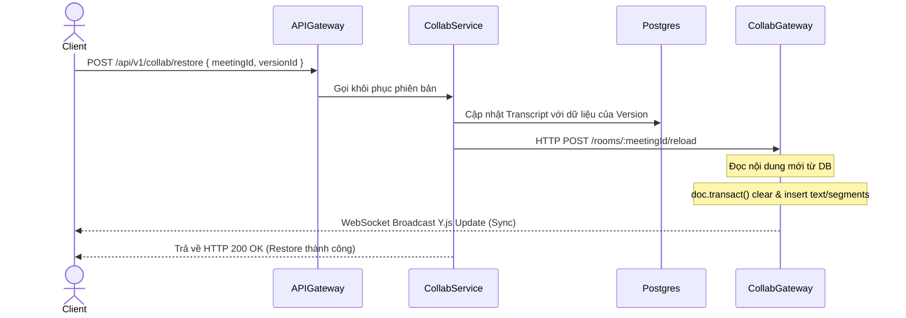

# Kế hoạch Thiết kế & Triển khai 3 Tính năng Mới cho TranscriptHub

Tài liệu này đặc tả chi tiết thiết kế kỹ thuật, luồng dữ liệu và các bước triển khai cho 3 tính năng mới được lựa chọn để hoàn thiện hệ thống TranscriptHub:
1. **Git-like Diff & Version History Viewer** (Xem lịch sử và so sánh phiên bản)
2. **Khởi tạo Bản dịch gốc từ AI** (Nâng cấp phương thức `updateStatusAndContent`)
3. **Phân quyền Meeting & Gửi thông báo nội bộ qua Kafka & WebSocket** (Gửi thông báo và hỗ trợ URL điều hướng trực tiếp)

---

## 1. Git-like Diff & Version History Viewer

### 1.1. Luồng hoạt động & Thử thách kỹ thuật (Yjs Memory Out-Of-Sync)
*   **Thử thách:** Khi người dùng gọi API REST `POST /collab/restore` để khôi phục một phiên bản cũ, Postgres Database được cập nhật thành công. Tuy nhiên, `collab-gateway` (WebSocket server) đang lưu trữ đối tượng `Y.Doc` của phòng đó trong RAM.
    *   If Gateway không biết nội dung đã được khôi phục, các client đang kết nối vẫn giữ văn bản cũ trong trình soạn thảo Quill.
    *   Lượt gõ phím tiếp theo của client sẽ ghi đè và làm hỏng nội dung vừa được khôi phục trong cơ sở dữ liệu.
*   **Giải pháp (Gateway Socket Reload):**
    1. Khi gọi REST API `restoreVersion`, `collab-service` cập nhật Postgres DB.
    2. Đồng thời, `collab-service` gửi một HTTP POST request (hoặc gửi qua Redis Pub/Sub) tới `collab-gateway` thông qua endpoint:
       `POST http://collab-gateway:3008/rooms/:meetingId/reload`
    3. `collab-gateway` nhận được tín hiệu reload, sẽ:
       * Tải nội dung transcript mới nhất từ database.
       * Thực hiện thay đổi trong `doc.transact(...)`: xóa sạch `yText` và `ySegments` hiện tại, sau đó điền nội dung khôi phục vào.
       * Yjs tự động tính toán sự khác biệt (delta) và broadcast bản cập nhật này tới tất cả client đang kết nối. Trình soạn thảo Quill của tất cả mọi người sẽ tự động thay đổi nội dung mượt mà mà không bị lệch sync.



### 1.2. Thiết kế giao diện So sánh Phiên bản (Frontend Diff Viewer)
*   **Giao diện Lịch sử:**
    *   Sidebar bên phải màn hình chỉnh sửa hiển thị danh sách các phiên bản (đọc từ `GET /collab/:meetingId/versions`).
    *   Hiển thị thông tin: Tên phiên bản, Người tạo, và Thời gian tạo.
*   **Chế độ So sánh (Diff Mode):**
    *   Khi click vào một phiên bản, mở Modal so sánh chi tiết.
    *   Sử dụng thư viện gọn nhẹ `diff-match-patch` hoặc `jsdiff` (phía Client) để tính toán sự khác biệt giữa **Phiên bản được chọn** và **Phiên bản hiện tại trên màn hình soạn thảo**.
    *   **Inline Diff View:** Hiển thị một khung văn bản hợp nhất:
        *   Phần chữ bị xóa: Bôi đỏ nền, gạch ngang chữ (`background: #fed7d7; text-decoration: line-through; color: #c53030`).
        *   Phần chữ được thêm mới: Bôi xanh lá nền (`background: #c6f6d5; color: #22543d`).
        *   Phần chữ giữ nguyên: Chữ thường mặc định.
    *   Nút **"Khôi phục phiên bản này"** ở cuối Modal để kích hoạt REST API restore.

---

## 2. Khởi tạo Bản dịch gốc từ AI (`updateStatusAndContent`)

### 2.1. Vấn đề hiện tại
*   Khi Gemini thực hiện dịch xong (hoặc dịch lại thành công), hệ thống cập nhật trạng thái `Transcript` thành `COMPLETED` và lưu nội dung qua hàm `updateStatusAndContent` trong `TranscriptService`.
*   Tại thời điểm này, chưa có bản ghi `TranscriptVersion` nào được tạo cho bản dịch gốc của AI. Do đó, khi người dùng mở lịch sử phiên bản, họ không thể so sánh văn bản đã sửa với bản dịch gốc đầu tiên của AI.

### 2.2. Giải pháp kỹ thuật
Nâng cấp hàm `updateStatusAndContent` trong `TranscriptRepository` hoặc `TranscriptService` để tự động tạo một phiên bản snapshot làm gốc:
*   Khi `status` cập nhật thành **`COMPLETED`**:
    *   Thực hiện ghi log/transaction cập nhật trạng thái của `Transcript`.
    *   Tự động ghi thêm một bản ghi vào bảng `TranscriptVersion` với thông tin:
        *   `versionName`: `"Bản dịch gốc từ AI"`
        *   `rawText`: `rawText` (kết quả AI)
        *   `structuredContent`: `structuredContent` (mảng phân đoạn AI dịch)
        *   `createdById`: `null` (đại diện cho hệ thống/AI tạo)
*   **Sửa đổi trong `transcript.repository.ts`:**
    ```typescript
    async updateStatusAndContent(
      id: number,
      status: string,
      rawText?: string,
      structuredContent?: any,
    ) {
      return this.prisma.$transaction(async (tx) => {
        // 1. Cập nhật bản ghi chính
        const updated = await tx.transcript.update({
          where: { id },
          data: { status, rawText, structuredContent },
        });

        // 2. Nếu trạng thái là COMPLETED, tạo snapshot gốc
        if (status === 'COMPLETED') {
          // Kiểm tra xem đã có phiên bản gốc chưa (tránh trùng lặp khi re-transcribe)
          const existOrigin = await tx.transcriptVersion.findFirst({
            where: { transcriptId: id, versionName: 'Bản dịch gốc từ AI' }
          });
          
          if (!existOrigin) {
            await tx.transcriptVersion.create({
              data: {
                transcriptId: id,
                versionName: 'Bản dịch gốc từ AI',
                rawText: rawText || '',
                structuredContent: structuredContent || { segments: [] },
                createdById: null, // Hệ thống/AI
              }
            });
          }
        }
        return updated;
      });
    }
    ```

---

## 3. Phân quyền Meeting & Thông báo nội bộ qua Kafka & WebSocket

Hệ thống sẽ không gửi email ra bên ngoài mà sử dụng **Thông báo nội bộ (Internal System Notifications)** để lưu lịch sử thông báo, đồng thời tích hợp **WebSocket & Redis Pub/Sub** để cập nhật quyền chỉnh sửa trực tiếp thời gian thực cho người dùng đang online.

### 3.1. Thiết kế cơ sở dữ liệu (Prisma Schema)
Thêm bảng `Notification` vào schema của `users` service trong file `schema.prisma`:

```prisma
model Notification {
  id          Int      @id @default(autoincrement())
  userId      Int      @map("user_id")      // ID người nhận thông báo
  title       String                        // Tiêu đề thông báo
  content     String   @db.Text             // Nội dung thông báo chi tiết
  url         String?                       // URL để click chuyển hướng (e.g. /meetings/{meetingId})
  isRead      Boolean  @default(false) @map("is_read")
  createdAt   DateTime @default(now()) @map("created_at")

  @@map("notifications")
  @@schema("users")
}
```

### 3.2. Thiết kế luồng sự kiện truyền tin kép (Kafka + Redis Pub/Sub)
Khi có thay đổi về thành viên trong meeting, `meeting-service` sẽ thực hiện đồng thời hai luồng phát sự kiện:

#### A. Luồng Sự kiện qua Kafka (Lưu trữ lịch sử thông báo)
*   **Topic:** `notifications`
*   **Payload của Kafka Event:**
    ```json
    {
      "key": "user-12",
      "value": {
        "recipientId": 12,
        "senderId": 1,
        "type": "MEETING_ACCESS_GRANTED" | "MEETING_ACCESS_REVOKED" | "MEETING_ROLE_UPDATED",
        "meetingId": "8bfa2e9a-7b3c-4d2a-89a1-526bfd254e01",
        "meetingTitle": "Họp kế hoạch Sprint 1",
        "role": "EDITOR" | "VIEWER",
        "url": "/transcripts/8bfa2e9a-7b3c-4d2a-89a1-526bfd254e01/edit",
        "createdAt": "2026-06-30T00:40:00Z"
      }
    }
    ```
*   **Các trường hợp phát sinh sự kiện:**
    1.  **Thêm thành viên (`addMember`):** Gửi event `MEETING_ACCESS_GRANTED`.
    2.  **Sửa vai trò thành viên (`updateMemberRole`):** Gửi event `MEETING_ROLE_UPDATED`.
    3.  **Xoá thành viên (`removeMember`):** Gửi event `MEETING_ACCESS_REVOKED`.

#### B. Luồng Thời gian thực qua Redis Pub/Sub (Cập nhật giao diện lập tức)
*   **Channel:** `meeting_member_updated`
*   **Payload:** `{ "meetingId": string, "userId": number, "role": "EDITOR" | "VIEWER" | null }` (role là `null` khi bị xóa).

---

### 3.3. Xây dựng dịch vụ Tiêu thụ & Đồng bộ

#### A. Notification Consumer (`users-service`)
*   Đăng ký lắng nghe topic `notifications` trên Kafka.
*   Khi có message mới: Tạo bản ghi `Notification` mới trong database thông qua Prisma.
*   Cung cấp API endpoints:
    *   `GET /users/notifications` : Lấy danh sách thông báo của user (phân trang, sắp xếp mới nhất).
    *   `PATCH /users/notifications/:id/read` : Đánh dấu một thông báo là đã đọc.
    *   `PATCH /users/notifications/read-all` : Đánh dấu tất cả thông báo của user là đã đọc.
    *   `DELETE /users/notifications/:id` : Xóa một thông báo cụ thể.

#### B. Real-time WebSocket Broadcaster (`collab-gateway`)
*   `collab-gateway` duy trì một kết nối phụ để Subscribe kênh `meeting_member_updated` của Redis.
*   Khi nhận tin nhắn:
    *   Quét qua toàn bộ các socket client đang kết nối (`wss.clients`).
    *   Tìm client có `meetingId` và `userId` trùng khớp.
    *   Cập nhật trực tiếp thông tin quyền trong RAM: `conn.role = role`, `conn.isReadOnly = (role === 'VIEWER' || !role)`.
    *   Gửi một WebSocket text frame dạng: `JSON.stringify({ type: "ROLE_UPDATED", role: role || "NONE" })`.

#### C. Reacting on Client (`fe_next`)
*   Trong `use-collab.ts`, lắng nghe tin nhắn văn bản từ WebSocket của `provider`.
*   Khi nhận được `{ type: "ROLE_UPDATED", role }`:
    *   Cập nhật `collab.role` và `provider.isReadOnly` của Yjs.
    *   Gọi `instance.forceNotify()` để ép Next.js render lại trang biên tập.
    *   Nếu role thay đổi thành `VIEWER` hoặc bị xóa (`NONE`), giao diện sẽ tự động khoá khả năng chỉnh sửa và chuyển các trường text sang read-only lập tức mà không cần F5.

---

### 3.4. Giao diện hiển thị trên Frontend
*   **Notification Bell:** Một icon hình chuông trên Header của trang Dashboard hiển thị số lượng thông báo chưa đọc.
*   **Notification Popover:** Click vào chuông hiển thị danh sách các thông báo gần đây.
    *   Có nút **"Đánh dấu tất cả đã đọc"** ở đầu danh sách.
    *   Mỗi thông báo chưa đọc hiển thị một chấm tròn xanh báo hiệu, click vào sẽ gọi API đánh dấu đã đọc.
    *   Có một **nút icon thùng rác (Delete)** bên cạnh mỗi thông báo để người dùng chủ động xóa bỏ thông báo khỏi danh sách.
*   **Click Redirect:** Click vào dòng thông báo sẽ đánh dấu đã đọc và chuyển hướng trình duyệt tới URL đính kèm (ví dụ: chuyển thẳng vào trang `/transcripts/[meetingId]/edit`).

---

## 4. Kế hoạch triển khai & Kiểm thử (Verification Plan)

### Bước 1: Cấu hình Database & Schema
*   Cập nhật `schema.prisma` với bảng `Notification` mới.
*   Bổ sung logic tự động tạo snapshot khi `status = COMPLETED` vào `updateStatusAndContent`.
*   Chạy `npx prisma db push` hoặc tạo migration.

### Bước 2: Triển khai backend của Meeting & Notification
*   Tích hợp Kafka producer vào `meeting-service`, gửi event lên topic `notifications`.
*   Tích hợp Redis Pub/Sub vào `meeting-service` để publish sự kiện thay đổi thành viên lên channel `meeting_member_updated`.
*   Xây dựng consumer tại `users-service` để lưu thông báo vào database từ Kafka.
*   Viết API endpoints lấy danh sách/đánh dấu đã đọc/xóa thông báo trong `api-gateway` và `users-service`.

### Bước 3: Triển khai Version History & WebSockets
*   Triển khai Redis subscribe trong `collab-gateway`, nhận sự kiện thay đổi quyền và bắn tin nhắn `ROLE_UPDATED` tới connection tương ứng của user đó.
*   Xây dựng endpoint reload `/rooms/:meetingId/reload` trong `collab-gateway` để đồng bộ khi khôi phục lịch sử.

### Bước 4: Tích hợp Frontend
*   Cập nhật `use-collab.ts` để lắng nghe bản tin `ROLE_UPDATED`, cập nhật nóng quyền hạn trong RAM.
*   Xây dựng UI quả chuông thông báo trên Header, hỗ trợ đánh dấu đã đọc, đánh dấu đọc tất cả, và xóa thông báo trực tiếp.

---

### Kế hoạch Kiểm thử (Manual Verification)
1.  **Dịch thử file audio mới:** Kiểm tra xem hệ thống có tự tạo bản ghi `Bản dịch gốc từ AI` trong danh sách lịch sử khi AI dịch xong không.
2.  **Khôi phục phiên bản:** Sửa văn bản, sau đó nhấn khôi phục bản dịch gốc AI $\rightarrow$ Xác nhận Quill Editor của tất cả các tab tự động chuyển về văn bản gốc cùng lúc mà không cần load lại trang.
3.  **Phân quyền thời gian thực:**
    *   Mở 2 trình duyệt: Admin A và User B (đang ở màn hình soạn thảo với vai trò `VIEWER` - chỉ xem).
    *   Admin A thực hiện nâng quyền của User B lên `EDITOR`.
    *   **Kết quả:** Trình duyệt của User B lập tức mở khoá các ô nhập liệu, cho phép sửa trực tiếp mà không cần reload trang.
4.  **Hộp chuông thông báo:** Kiểm tra xem User B có nhận được quả chuông đỏ báo hiệu thông báo mới. Thử đánh dấu đọc toàn bộ, click xóa thông báo và kiểm tra kết quả đồng bộ trên giao diện. Click vào thông báo xem có chuyển hướng chính xác đến trang cuộc họp.
