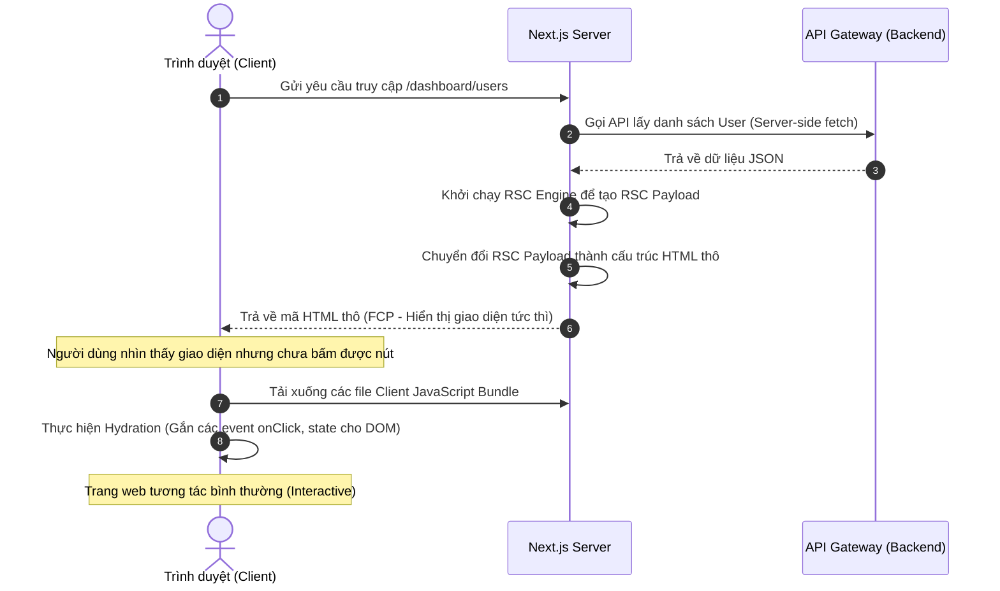

# Kiến trúc và Cơ chế Hoạt động của Next.js (App Router)

Tài liệu này phân tích chi tiết kiến trúc của **Next.js** (tập trung vào cấu trúc **App Router** từ phiên bản 13 đến 15+), cách thức hoạt động của các cơ chế render, caching, định tuyến (routing) và luồng đi của dữ liệu trong hệ thống.

---

## 1. Kiến trúc Tổng quan (High-Level Architecture)

Next.js hoạt động như một **Meta-Framework** chạy trên cả hai môi trường: **Node.js Server** (phía máy chủ) và **Browser** (phía trình duyệt). Sự kết hợp này giúp ứng dụng đạt hiệu năng tối đa thông qua việc tối ưu hoá hiển thị trang trước khi gửi tới người dùng.

```mermaid
graph TD
    subgraph Trình duyệt (Client Side)
        Browser[Trình duyệt của Người dùng]
        ClientReact[React Hydration / Client Components]
        RouterCache[Router Cache - Client]
    end

    subgraph Next.js Server (Node.js Runtime)
        NextServer[Next.js Server / Reverse Proxy]
        Middleware[Next.js Middleware]
        RSC[React Server Components Engine]
        ServerActions[Server Actions Handler]
        NextCache[Next.js Caching Layer]
    end

    subgraph Backend Services
        Gateway[API Gateway / Microservices]
        DB[(Database / Cache)]
    end

    Browser -->|1. HTTP Request| Middleware
    Middleware -->|2. Route Match| RSC
    RSC -->|3. Fetch Data| Gateway
    Gateway --> DB
    RSC -->|4. Generate RSC Payload + HTML| NextCache
    NextCache -->|5. Trả về HTML + JS| Browser
    Browser -->|6. Giao tiếp qua REST/Actions| ServerActions
    ServerActions --> Gateway
```

### Chi tiết các thành phần trong sơ đồ:

#### 1. Phân vùng Trình duyệt (Client Side)
* **Browser (Trình duyệt của Người dùng)**: Điểm bắt đầu và kết thúc của các yêu cầu. Trình duyệt gửi HTTP Request lên server, nhận mã HTML để hiển thị giao diện tức thì, và chạy code JavaScript của các Client Component.
* **ClientReact (React Hydration / Client Components)**: React Runtime hoạt động tại trình duyệt. Nó chịu trách nhiệm **Hydrate** (so khớp HTML tĩnh nhận từ server với JavaScript để gắn kết event handler và quản lý state) cho các component đánh dấu `"use client"`.
* **Router Cache (Client-side Cache)**: Bộ nhớ đệm lưu tạm thời trên trình duyệt. Nó lưu lại bố cục (Layouts) và dữ liệu các trang đã xem để khi người dùng bấm Back/Forward hoặc chuyển tuyến đường sẽ hiển thị ngay lập tức mà không cần gọi lại Server.

#### 2. Phân vùng Next.js Server (Node.js Runtime)
* **NextServer (Next.js Server / Reverse Proxy)**: Cổng tiếp nhận và xử lý routing, thực hiện chức năng Reverse Proxy (chuyển tiếp API qua cổng `rewrites()`) về API Gateway.
* **Middleware (Next.js Middleware)**: Bộ chặn chạy trước mọi request, chuyên trách kiểm tra trạng thái đăng nhập, xác thực quyền truy cập và thực hiện chuyển hướng (`redirect`) nếu cần thiết.
* **RSC (React Server Components Engine)**: Bộ dựng giao diện phía máy chủ. Nó thực thi mã của các Server Components, lấy dữ liệu API từ Backend, và trả về dữ liệu **RSC Payload** kèm HTML thô gửi xuống client.
* **ServerActions (Server Actions Handler)**: Bộ tiếp nhận các hàm Server Action gọi từ trình duyệt. Nó nhận payload HTTP POST ngầm từ client, thực thi code trên server, cập nhật/xoá cache trên server và trả kết quả ngược lại cho client.
* **NextCache (Next.js Caching Layer)**: Hệ thống quản lý bộ nhớ đệm phía Server giúp tăng tốc xử lý và giảm tải cho backend (bao gồm Request Memoization, Data Cache và Full Route Cache).

#### 3. Phân vùng Backend Services
* **Gateway (API Gateway / Microservices)**: Cổng dịch vụ NestJS backend (ví dụ: port 3000), điều phối nghiệp vụ chính, bảo mật, giao tiếp RPC sang các Microservices nội bộ.
* **DB (Database / Cache)**: Tầng lưu trữ cơ sở dữ liệu vật lý (PostgreSQL) và bộ nhớ đệm phân tán (Redis).

---

## 2. Mô hình Thành phần: Server Components và Client Components

Trong App Router, Next.js chia các component thành hai loại dựa trên nơi chúng được thực thi:

### 2.1. React Server Components (RSC)
Đây là các thành phần **mặc định** trong Next.js App Router.
* **Nơi thực thi**: Chạy hoàn toàn trên **Server**.
* **Đặc điểm**:
  * Mã nguồn và các thư viện phụ thuộc (dependencies) của RSC không bị tải xuống trình duyệt (giúp giảm dung lượng JavaScript Bundle về 0% cho các component này).
  * Có thể truy cập trực tiếp các tài nguyên phía server (file system, database, biến môi trường ẩn).
  * Bảo mật cao do không để lộ logic tính toán hoặc khóa bảo mật ra client.
* **Cách thức trả về**: RSC được biên dịch thành một định dạng dữ liệu đặc biệt gọi là **RSC Payload** (chứ không phải HTML thô hay code JS), sau đó được render thành HTML gửi về client.

### 2.2. Client Components (Sử dụng `"use client"`)
Các thành phần cần sự tương tác từ người dùng.
* **Nơi thực thi**: Chạy trên cả **Server** (để render HTML ban đầu) và **Browser** (để tương tác).
* **Đặc điểm**:
  * Sử dụng được các React Hooks (`useState`, `useEffect`, `useContext`,...).
  * Sử dụng được các Event Listeners (`onClick`, `onChange`,...).
  * Sử dụng được các API của trình duyệt (`window`, `document`, `localStorage`,...).
* **Lưu ý quan trọng**: Khai báo `"use client"` **không** có nghĩa là component đó chỉ chạy ở client. Nó vẫn được Next.js Server dựng trước thành HTML tĩnh (SSR) để người dùng thấy giao diện ngay lập tức, sau đó trình duyệt tải JavaScript về để kích hoạt tương tác (quá trình **Hydration**).

---

## 3. Các Cơ chế Render Dữ liệu (Rendering Strategies)

Next.js hỗ trợ linh hoạt 4 cơ chế render chính trên cùng một ứng dụng:

| Cơ chế Render | Nơi tạo HTML | Thời điểm tạo | Tần suất cập nhật | Trường hợp sử dụng |
| :--- | :--- | :--- | :--- | :--- |
| **SSG** (Static Site Generation) | Server | Khi chạy `npm run build` | Cố định, không đổi | Blog, Trang tài liệu, Giới thiệu sản phẩm |
| **SSR** (Server-Side Rendering) | Server | Khi có HTTP Request gửi lên | Mỗi khi load trang | Dashboard, Trang tìm kiếm, Profile người dùng |
| **ISR** (Incremental Static Regen) | Server | Build time + Rebuild định kỳ | Tự động sau mỗi khoảng thời gian | Trang tin tức, Thương mại điện tử |
| **CSR** (Client-Side Rendering) | Browser | Chạy trực tiếp tại trình duyệt | Thời gian thực (Real-time) | Các widget con tương tác, Chat app |

### Luồng xử lý Server-Side Rendering (SSR) trong Next.js:



---

## 4. Kiến trúc Định tuyến (Routing Architecture)

App Router sử dụng cơ chế định tuyến dựa trên cấu trúc thư mục (File-system based router):

* **Thư mục làm Route**: Mỗi thư mục trong folder `app/` đại diện cho một phân đoạn URL (URL segment).
* **File đặc biệt**:
  * `layout.tsx`: Định nghĩa giao diện dùng chung cho phân đoạn đó và các thư mục con bên dưới (không bị re-render khi chuyển trang con).
  * `page.tsx`: Giao diện độc nhất hiển thị tại URL đó.
  * `loading.tsx`: Giao diện chờ tự động kích hoạt nhờ React Suspense.
  * `error.tsx`: Giao diện hiển thị lỗi tự động nhờ React Error Boundary.
  * `template.tsx`: Tương tự layout nhưng sẽ tạo mới instance (re-mount) mỗi khi chuyển tuyến đường.

> [!TIP]
> **Parallel Routes (Định tuyến song song)**: Sử dụng ký hiệu `@folder` để hiển thị nhiều trang cùng một lúc trong một layout duy nhất (ví dụ: hiển thị song song Dashboard chính và một bảng phân tích số liệu độc lập).
> **Intercepting Routes (Định tuyến đánh chặn)**: Sử dụng ký hiệu `(.)folder` để load nội dung của một route khác hiển thị đè lên (dưới dạng Modal) trong khi vẫn giữ nguyên ngữ cảnh trang hiện tại.

---

## 5. Hệ thống Caching 4 Tầng của Next.js

Next.js sở hữu hệ thống Caching tích hợp sâu để giảm tải tối đa cho Backend và tăng tốc thời gian phản hồi:

```
                  [ REQUEST ĐẾN ]
                         │
                         ▼
        1. ──► [ Request Memoization ] ────► (Bỏ qua fetch trùng lặp trong 1 render)
                         │ (Cache Miss)
                         ▼
        2. ──► [ Data Cache ] ─────────────► (Lưu trữ data thô từ API trên ổ đĩa Server)
                         │ (Cache Miss)
                         ▼
        3. ──► [ Full Route Cache ] ───────► (Lưu HTML & RSC Payload tĩnh của trang)
                         │ (Cache Miss / Dynamic Route)
                         ▼
        4. ──► [ Router Cache ] ───────────► (Cache tại Trình duyệt khi User chuyển trang)
```

1. **Request Memoization (React Level)**:
   * **Mục đích**: Tránh việc gọi fetch cùng một API nhiều lần tại các component khác nhau trong cùng một lượt render trên Server.
   * **Thời gian tồn tại**: Bị xóa ngay sau khi render xong request đó.
2. **Data Cache (Next.js Level)**:
   * **Mục đích**: Cache kết quả gọi API xuyên suốt các request của nhiều người dùng khác nhau.
   * **Cơ chế**: Dữ liệu lưu trên ổ đĩa của Next.js Server. Có thể cấu hình revalidate định kỳ hoặc xoá thủ công (on-demand revalidation).
3. **Full Route Cache (Next.js Level)**:
   * **Mục đích**: Lưu trữ mã HTML và RSC Payload đã dựng hoàn chỉnh của các trang tĩnh lúc build.
   * **Thời gian tồn tại**: Vĩnh viễn cho đến khi có bản build mới hoặc Data Cache bị xóa.
4. **Router Cache (Client-side Level)**:
   * **Mục đích**: Lưu trữ thông tin phân đoạn trang tại bộ nhớ RAM của trình duyệt khi người dùng chuyển hướng qua lại.
   * **Thời gian tồn tại**: Tồn tại ngắn hạn theo phiên làm việc của trình duyệt.

---

## 6. Cơ chế Truyền dữ liệu & Tương tác (Data Mutation)

Next.js cung cấp cơ chế tương tác đột phá qua **Server Actions**:

* **Khái niệm**: Cho phép bạn định nghĩa các hàm chạy trên máy chủ (chứa cơ chế ghi DB, gọi API Gateway) và gọi trực tiếp các hàm đó từ giao diện Client Component giống như một hàm JavaScript thông thường.
* **Nguyên lý hoạt động**:
  1. Khi Client kích hoạt Server Action, trình duyệt sẽ tự động gửi một request HTTP POST ngầm đến Next.js Server.
  2. Next.js Server nhận request, giải mã tham số, thực thi hàm Server Action đó.
  3. Kết quả trả về từ Server Action sẽ cập nhật trực tiếp vào UI Client và có khả năng xóa cache của trang (`revalidatePath` hoặc `revalidateTag`) để đồng bộ dữ liệu hiển thị mới nhất ngay lập tức.
* **Ưu điểm**: Không cần phải viết thủ công các API Router (`/api/my-action`) và thiết lập các hàm `fetch`/`axios` thủ công chỉ để gửi một form dữ liệu lên backend.

---

### So sánh: Server Actions vs. Call API trực tiếp từ Client

| Tiêu chí | Call API từ Client (Axios/Fetch trực tiếp) | Sử dụng Server Actions |
| :--- | :--- | :--- |
| **Độ phức tạp mã nguồn** | Cao (Cần tự xây dựng API Route trung gian hoặc gọi trực tiếp ngoài internet, viết các hàm fetch + quản lý React state thủ công) | Thấp (Chỉ cần viết hàm JS chạy ở Server và gán thẳng vào thuộc tính `action` của Form) |
| **Bảo mật Token (JWT)** | Rủi ro (Token lưu ở Client dễ bị tấn công XSS đánh cắp qua JS) | Cực cao (Token được lưu ở Cookie HttpOnly phía Server, client không thể đọc được bằng JavaScript) |
| **Cơ chế CORS** | Bắt buộc phải cấu hình CORS ở API Gateway để trình duyệt cho phép | Bỏ qua CORS (Do truyền tải bằng giao tiếp nội bộ Server-to-Server) |
| **Đồng bộ giao diện** | Phải tự fetch lại dữ liệu hoặc cập nhật state cục bộ ở Client | Next.js tự động cập nhật UI thông qua `revalidatePath` hoặc `revalidateTag` |
| **Trải nghiệm mạng** | Phụ thuộc vào chất lượng mạng từ trình duyệt người dùng đến Backend | Tốc độ cao nhờ mạng nội bộ hoặc Edge network truyền tải dữ liệu |

---

### 6.1. Hướng đi để triển khai Server Action tương tác với Backend (API Gateway)

Khi sử dụng Server Actions để tương tác với Backend (API Gateway) có bảo mật, chúng ta đi theo luồng xử lý:
1. Lấy thông tin đăng nhập của phiên làm việc (Session chứa JWT Token) bằng cách gọi hàm `auth()` của NextAuth ngay trên server.
2. Gọi API Backend (API Gateway) bằng `axios` hoặc `fetch`, đính kèm Token này dưới dạng `Authorization: Bearer <token>`.
3. Xử lý kết quả trả về, dùng `revalidatePath` hoặc `revalidateTag` để ép buộc Next.js xóa bỏ bộ nhớ đệm (Cache) của trang, giúp giao diện người dùng tự động cập nhật số liệu mới nhất.

---

### 6.2. Ví dụ code thực tế chi tiết

#### Bước A: Viết file định nghĩa Server Action: `app/actions/user.ts`
Tệp này bắt buộc phải bắt đầu bằng dòng `"use server"` ở đầu file. Tất cả các hàm trong file này khi được gọi từ Client sẽ tự động chuyển đổi thành HTTP POST gọi ngầm về Server.

```typescript
// app/actions/user.ts
"use server"; // Đánh dấu file này chỉ thực thi trên máy chủ

import { auth } from "@/auth";
import { revalidatePath } from "next/cache";
import axios from "axios";

// Hàm xử lý tạo thành viên mới trên Server
export async function createUserAction(formData: FormData) {
  // 1. Kiểm tra session xác thực và lấy Access Token trực tiếp từ Server-side Cookie
  const session = await auth();
  const token = session?.accessToken;

  if (!token) {
    return { success: false, message: "Yêu cầu đăng nhập để thực hiện!" };
  }

  // 2. Trích xuất dữ liệu từ form gửi lên
  const name = formData.get("name") as string;
  const email = formData.get("email") as string;

  if (!name || !email) {
    return { success: false, message: "Vui lòng nhập đầy đủ thông tin!" };
  }

  try {
    const gatewayUrl = process.env.API_GATEWAY_URL ?? "http://localhost:3000";

    // 3. Giao tiếp Server-to-Server: Gọi API Gateway kèm JWT Token trong Header
    await axios.post(
      `${gatewayUrl}/api/users`, 
      { name, email },
      {
        headers: {
          Authorization: `Bearer ${token}`,
          "Content-Type": "application/json",
        },
      }
    );

    // 4. Xóa cache của trang Quản lý thành viên để ép buộc Next.js cập nhật giao diện mới
    revalidatePath("/dashboard/users");

    return { success: true, message: "Thêm thành viên mới thành công!" };
  } catch (error: any) {
    console.error("Lỗi khi thêm user qua Server Action:", error);
    return { 
      success: false, 
      message: error.response?.data?.message ?? "Không thể lưu thông tin thành viên." 
    };
  }
}
```

#### Bước B: Viết Component Form ở Client sử dụng Action: `components/add-user-form.tsx`
Client Component này có thể lấy trực tiếp hàm từ file trên để gán vào thuộc tính `action` của `<form>`.

```typescript
// components/add-user-form.tsx
"use client"; // Đây là Client Component chạy trên trình duyệt

import { createUserAction } from "@/app/actions/user";
import { useState } from "react";

export function AddUserForm() {
  const [message, setMessage] = useState("");
  const [loading, setLoading] = useState(false);

  const handleSubmit = async (formData: FormData) => {
    setLoading(true);
    setMessage("");

    // Gọi hàm Server Action trực tiếp như một hàm JavaScript bình thường
    const result = await createUserAction(formData);
    
    setMessage(result.message);
    setLoading(false);
  };

  return (
    <form action={handleSubmit} className="bg-white/5 border border-white/10 p-6 rounded-2xl space-y-4 max-w-sm">
      <h3 className="text-lg font-bold text-white">Thêm thành viên mới</h3>
      
      <div>
        <label className="block text-xs text-gray-400 mb-1">Họ và Tên</label>
        <input 
          type="text" 
          name="name" 
          required 
          className="w-full bg-black/40 border border-white/10 p-2 rounded-lg text-white"
        />
      </div>

      <div>
        <label className="block text-xs text-gray-400 mb-1">Email</label>
        <input 
          type="email" 
          name="email" 
          required 
          className="w-full bg-black/40 border border-white/10 p-2 rounded-lg text-white"
        />
      </div>

      <button 
        type="submit" 
        disabled={loading}
        className="w-full bg-indigo-600 hover:bg-indigo-500 py-2 rounded-lg text-white font-semibold disabled:opacity-50"
      >
        {loading ? "Đang xử lý..." : "Lưu thành viên"}
      </button>

      {message && (
        <p className="text-sm text-indigo-400 mt-2">{message}</p>
      )}
    </form>
  );
}
```

---

## 7. Giải mã cơ chế CORS trong Kiến trúc Next.js và Backend

Khi sử dụng Next.js làm Frontend, có một hiểu lầm phổ biến là: **"Bắt buộc phải bật cấu hình CORS ở Backend (API Gateway) thì Frontend mới gọi được API"**. 

Thực tế, nhờ kiến trúc của Next.js (chuyển tiếp API qua `rewrites` hoặc chạy Server-side qua `Server Actions`), **Backend có thể tắt hoàn toàn cấu hình CORS mà hệ thống vẫn chạy mượt mà**.

### 7.1. Tại sao Backend không cần cấu hình CORS?

CORS (Cross-Origin Resource Sharing) là một **cơ chế bảo mật được thực thi bởi Trình duyệt (Browser)** nhằm ngăn chặn các đoạn mã độc JavaScript tự ý gửi request sang một domain khác nguồn (Origin).

* **Giao tiếp qua Next.js Server (Bỏ qua CORS)**:
  * Trình duyệt của người dùng truy cập `https://my-app.com` và gửi request tới `/api/users`. Đây là cuộc gọi **cùng nguồn (Same-Origin)**, trình duyệt sẽ cho qua mà không kiểm tra CORS.
  * Next.js Server nhận request `/api/users`, đóng vai trò là một **Proxy trung gian** để tự gửi request mạng (Server-to-Server) sang Backend ở `https://api-backend.com`.
  * Do đây là giao tiếp trực tiếp giữa 2 máy chủ với nhau (Node.js Server sang NestJS Gateway), không có sự can thiệp của trình duyệt nên **không bị ảnh hưởng bởi luật CORS**.

Điều này cho phép lập trình viên có thể dựng tường lửa đóng kín cổng API Gateway đối với toàn bộ internet, chỉ cho phép duy nhất dải IP của Next.js Server kết nối vào.

### 7.2. Khi nào Backend VẪN cần cấu hình CORS?

Dù Next.js giúp giải quyết vấn đề CORS, bạn vẫn cần bật cấu hình này ở Backend trong 3 trường hợp đặc thù:

1. **Tải lên file dung lượng lớn (Direct File Upload)**:
   * Nếu người dùng cần upload video/ảnh nặng trực tiếp từ trình duyệt lên Cloud Storage (Amazon S3) hoặc trực tiếp lên API Gateway để tránh quá tải băng thông trung chuyển của Next.js Server. Vì trình duyệt gọi trực tiếp sang S3/Gateway nên các dịch vụ này bắt buộc phải bật CORS.
2. **Hệ thống có nhiều loại Client khác (Multi-client)**:
   * Nếu API Gateway của bạn còn phục vụ cho ứng dụng Mobile App (iOS/Android) hoặc các đối tác tích hợp (Third-party integrations) gọi trực tiếp.
3. **Môi trường Phát triển (Local Development) linh hoạt**:
   * Khi dev cục bộ, đôi khi bạn muốn dùng Postman hoặc trực tiếp mã nguồn Frontend gọi thẳng tới `http://localhost:3000` (Backend) mà không muốn đi vòng qua cổng proxy `http://localhost:3333` (Next.js).

---

## 8. Cơ chế Đồng bộ Phát Âm thanh (Audio-Text Sync) & Tối ưu hóa Hiệu năng Cuộn (Scroll)

Trong màn hình xem bản dịch cuộc họp (View/Edit Transcript), ứng dụng TranscriptHub thực hiện cơ chế đồng bộ dòng chữ đang phát theo giây của trình phát nhạc (Audio Player). Các tối ưu hóa cốt lõi về hiệu năng và trải nghiệm người dùng bao gồm:

### 8.1. Tránh Re-render Toàn bộ Danh sách (O(1) Rendering)
* **Thách thức**: Trình phát nhạc phát ra sự kiện `timeupdate` liên tục 4 lần mỗi giây để cập nhật thời gian phát hiện tại (`currentTime`). Nếu không tối ưu hóa, việc thay đổi state `currentTime` ở Component cha sẽ ép toàn bộ hàng trăm component con `TranscriptSegmentItem` phải re-render lại liên tục, gây ra hiện tượng đơ lag nghiêm trọng và làm trễ các thao tác click của người dùng.
* **Giải pháp tối ưu**:
  1. Sử dụng **`React.memo`** bao bọc component `TranscriptSegmentItem` để nó chỉ re-render khi các props truyền vào thực sự thay đổi (như trạng thái `isActive`).
  2. Cache hàm trợ định dạng `formatDuration` bằng **`useCallback`** để giữ nguyên tham chiếu qua các lần render, tránh làm mất tác dụng của `React.memo`.
  * **Kết quả**: Số lượng segment bị dựng lại giảm từ $O(N)$ (toàn bộ file thoại) về mức tối thiểu $O(1)$ (chỉ re-render đúng segment vừa kích hoạt phát và segment trước đó).

### 8.2. Click Phát Nhạc Toàn Diện (Full Card Clickable)
* Ở chế độ xem (`view`), toàn bộ vùng chứa thẻ segment (`TranscriptSegmentItem`) đều lắng nghe sự kiện click. Nhấp chuột vào bất cứ vị trí nào (tên người phát, vòng số thứ tự, vùng đệm trống) đều kích hoạt trình phát nhạc tự động nhảy (`seekTo`) tới mốc thời gian `startTime` tương ứng của câu thoại, thay vì giới hạn chỉ khi bấm vào dòng chữ nội dung như trước.
* Ở chế độ sửa (`edit`), sự kiện click được tự động bỏ qua nếu người dùng nhấp chọn ô nhập văn bản `input` của người nói, giúp việc chỉnh sửa không làm gián đoạn bài nghe.

### 8.3. Cuộn Tự động Cực tiểu (Nearest Viewport Auto Scroll)
* Thay vì liên tục gọi cưỡng bức `scrollIntoView({ block: "center" })` đẩy câu thoại đang phát vào chính giữa màn hình (gây xung đột dữ dội khi người dùng cuộn chuột thủ công và tạo cảm giác giật cục):
  * Hệ thống sử dụng hàm `getBoundingClientRect()` để kiểm tra xem phân đoạn thoại tiếp theo có đang nằm trong khung hình (viewport) của người dùng hay không.
  * Chỉ khi phân đoạn đó bị trôi ra ngoài màn hình, lệnh cuộn mới được kích hoạt với cấu hình `block: "nearest"`. Màn hình sẽ chỉ dịch chuyển khoảng cách nhỏ nhất vừa đủ để người dùng đọc tiếp câu thoại, mang lại cảm giác cuộn êm ái và không bị gián đoạn.
