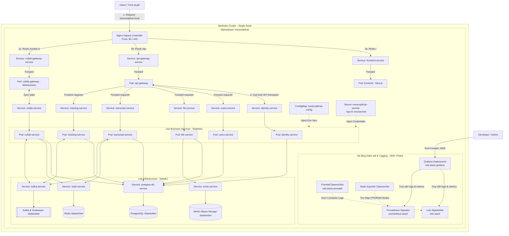

# Tài Liệu Kiểm Tra Triển Khai Kubernetes (K8s) - TranscriptHub (Nhánh `dev_js`)

Tài liệu này đóng vai trò là cẩm nang kiểm tra (Testing & Verification Guide) cho quá trình triển khai hệ thống **TranscriptHub** (nhánh `dev_js`) lên cụm **Kubernetes (K8s)** bằng quy trình **CI/CD trực tiếp** (không sử dụng GitOps như ArgoCD/FluxCD).

---

## 1. Bản Đồ Tài Liệu Hướng Dẫn & Kiểm Tra

Thư mục `k8s_deployment_test` được cấu trúc thành các tài liệu chuyên biệt sau:

```text
documents/k8s_deployment_test/
├── README.md                                  # Hướng dẫn chung & Sơ đồ Kiến trúc tổng quan
├── huong_dan_trien_khai_k8s.md                # [MỚI] Tài liệu triển khai chuẩn chỉ (Minikube, GitHub Actions, Env, Helm)
├── 01_kiem_tra_cicd_pipeline.md               # Quy trình kiểm tra tích hợp và triển khai tự động (CI/CD)
├── 02_kiem_tra_k8s_resources.md               # Quy trình kiểm tra trạng thái các tài nguyên trong cụm
└── 03_kich_ban_kiem_thu_chuc_nang_he_thong.md  # Các kịch bản kiểm thử (E2E, Self-healing, Zero-downtime)
```

---

## 2. Tổng Quan Kiến Trúc Triển Khai trên K8s

Hệ thống TranscriptHub trên K8s được cấu trúc và định tuyến chi tiết như sau:



---

## 3. Quy Trình CI/CD Trực Tiếp (Direct Deployment Pipeline)

Khác với mô hình GitOps (nơi tác nhân GitOps tự đồng bộ manifest từ Git repository), quy trình CI/CD trực tiếp của nhánh `dev_js` hoạt động theo mô hình **Push-based**:

1. **Trigger**: Developer đẩy code lên nhánh `dev_js`.
2. **CI Stage**: Jenkins (hoặc GitHub Actions) thực hiện Lint, Unit Test, build kiểm tra.
3. **Build Stage**: Build Docker images và gắn tag động theo số build (`${BUILD_NUMBER}`) cùng tag `latest`.
4. **Push Stage**: Đẩy Docker images lên Docker Hub.
5. **CD Stage**: CI runner kết nối SSH bảo mật tới máy ảo GCP để đồng bộ manifests (SCP) và thực thi trực tiếp các lệnh `kubectl apply` và `kubectl set image` nội bộ để cập nhật phiên bản mới.
6. **Verification Stage**: Kiểm tra trạng thái Rollout thông qua lệnh `kubectl rollout status`.

---

## 4. Điều Kiện Cần Trước Khi Tiến Hành Kiểm Tra (Prerequisites)

Để thực hiện toàn bộ các bước kiểm tra trong tài liệu này, bạn cần truy cập được vào:
1. **Jenkins Server Dashboard** hoặc lịch sử chạy **GitHub Actions** (để kiểm tra CI/CD).
2. **K8s Control Plane**: Máy có cài đặt lệnh `kubectl` được cấu hình kết nối tới cụm K8s mục tiêu (ví dụ: Minikube local hoặc cụm K8s remote).
3. **Quyền truy cập Namespace `transcripthub`** trên K8s.
4. **Virtual Domain Config**: Đã trỏ IP cụm K8s tới domain ảo `transcripthub.local` trong tệp tin `hosts` của máy kiểm thử.

> [!IMPORTANT]
> Toàn bộ các câu lệnh kiểm tra (CLI) trong tài liệu này được thiết kế để chạy trên môi trường console (Linux/macOS bash hoặc Windows PowerShell có cài đặt CLI tương ứng). Hãy đảm bảo ngữ cảnh của `kubectl` (kubectl context) đang trỏ đúng cụm cần kiểm tra trước khi thực thi lệnh có tính thay đổi hệ thống.
