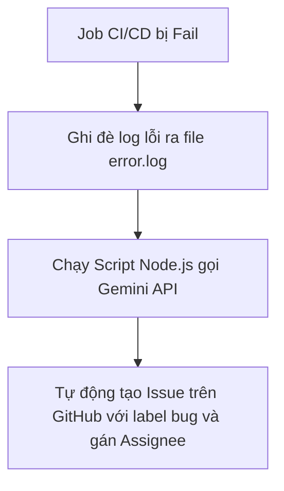

# Hướng dẫn Triển khai Luồng Alert & AI Agent tự động xử lý CI/CD Failure

Tài liệu này hướng dẫn chi tiết cách triển khai luồng thông báo tự động (Alert) khi build/deploy thất bại và thiết lập AI Agent để tự động phân tích logs lỗi, mở GitHub Issues cho các lỗi kiểm thử/tích hợp.

---

## 1. Phần 1: Tích hợp Luồng Alert qua Discord Webhook

Mục tiêu: Khi bất kỳ step nào trong pipeline CI/CD của GitHub Actions bị lỗi (fail), hệ thống sẽ gửi tin nhắn cảnh báo có định dạng cấu trúc rõ ràng vào channel Discord của team.

### Bước 1.1: Tạo Webhook trên Discord
1. Vào phần cấu hình Server Discord của bạn $\rightarrow$ Chọn **Integrations** $\rightarrow$ **Webhooks**.
2. Click **Create Webhook**, chọn Channel muốn nhận tin nhắn thông báo (ví dụ `#transhub-alerts`).
3. Đặt tên hiển thị cho bot và click **Copy Webhook URL**.

### Bước 1.2: Cấu hình Secret trên GitHub
1. Truy cập repo GitHub của bạn $\rightarrow$ **Settings** $\rightarrow$ **Secrets and variables** $\rightarrow$ **Actions**.
2. Tạo mới một secret:
   - **Name**: `DISCORD_WEBHOOK_URL`
   - **Value**: Dán link Webhook URL vừa copy ở bước trên.

### Bước 1.3: Thêm mã nguồn cấu hình Alert vào File Workflow YAML
Chèn đoạn script sau vào cuối mỗi Job cần kiểm soát lỗi (ví dụ trong file [.github/workflows/ci.yml](file:///d:/VDT_Tucode/VDT_miniproject_TranscriptHub/.github/workflows/ci.yml) và [.github/workflows/cd.yml](file:///d:/VDT_Tucode/VDT_miniproject_TranscriptHub/.github/workflows/cd.yml)):

```yaml
      - name: Send Discord Alert on Failure
        if: failure()
        uses: sarisia/actions-status-discord@v1
        with:
          webhook: ${{ secrets.DISCORD_WEBHOOK_URL }}
          title: "❌ Job [${{ github.job }}] Gặp Sự Cố!"
          description: |
            **Repository**: `${{ github.repository }}`
            **Branch**: `${{ github.ref_name }}`
            **Commit**: `${{ github.sha }}` bởi @${{ github.actor }}
            **Link Log**: [Xem chi tiết tại đây](${{ github.server_url }}/${{ github.repository }}/actions/runs/${{ github.run_id }})
          color: 0xff0000
```

---

## 2. Phần 2: Triển khai AI Agent Phân tích & Tự tạo Task (GitHub Issue)

AI Agent sẽ chạy ở mức **Rule-based** (tự động tạo issue và gán trách nhiệm cho người push code) kết hợp **AI-powered** (dùng Gemini 2.0 Flash phân tích log thô để chỉ ra dòng code lỗi và gợi ý cách sửa đổi).



### Bước 2.1: Phân quyền Ghi cho GITHUB_TOKEN
Mặc định GitHub Actions chỉ có quyền đọc code. Bạn cần cấp quyền ghi để nó tự tạo Issue:
1. Vào **Settings** của repository trên GitHub $\rightarrow$ **Actions** $\rightarrow$ **General**.
2. Cuộn xuống phần **Workflow permissions** chọn **Read and write permissions** $\rightarrow$ Click **Save**.

### Bước 2.2: Lấy Gemini API Key và lưu vào Secrets
1. Đăng nhập [Google AI Studio](https://aistudio.google.com/) để lấy API Key miễn phí.
2. Thêm vào GitHub Secrets của repo với tên: `GEMINI_API_KEY`.

### Bước 2.3: Tạo File Script Trực quan hóa Lỗi Bằng AI
Tạo script [scripts/analyze-ci-error.js](file:///d:/VDT_Tucode/VDT_miniproject_TranscriptHub/scripts/analyze-ci-error.js) để gửi log cho AI:

```javascript
const { GoogleGenAI } = require("@google/generative-ai");
const fs = require('fs');

async function analyze() {
  const apiKey = process.env.GEMINI_API_KEY;
  if (!apiKey) return "Không có API key của AI để phân tích.";

  const logContent = fs.readFileSync('error.log', 'utf8');
  // Lấy 150 dòng cuối của file log để tránh quá tải dung lượng token
  const trimmedLog = logContent.split('\n').slice(-150).join('\n');

  const ai = new GoogleGenAI({ apiKey });
  const model = ai.getGenerativeModel({ model: "gemini-2.0-flash" });

  const prompt = `
Bạn là một kỹ sư DevOps và Lập trình viên NodeJS chuyên nghiệp.
Hãy phân tích đoạn log lỗi CI/CD dưới đây của dự án Node.js/Next.js/NestJS.
Chỉ ra nguyên nhân chính xác và gợi ý các dòng code cần sửa một cách ngắn gọn, súc tích bằng tiếng Việt.

Log lỗi:
\`\`\`
${trimmedLog}
\`\`\`
  `;

  try {
    const result = await model.generateContent(prompt);
    return result.response.text();
  } catch (error) {
    return "Gặp lỗi trong quá trình kết nối với AI Agent.";
  }
}

analyze().then(analysis => console.log(analysis));
```

### Bước 2.4: Cấu hình workflow thực thi AI Agent
Cập nhật file `ci.yml` ở bước chạy lệnh linter/tester để ghi đè log lỗi ra file và khởi chạy AI Agent:

```yaml
      # Ví dụ bước chạy test trong backend-ci
      - name: Run Unit Tests
        run: |
          cd services_ms
          npm run test > error.log 2>&1 || true

      - name: Run AI Agent Analyzer
        if: failure()
        env:
          GEMINI_API_KEY: ${{ secrets.GEMINI_API_KEY }}
        run: |
          cd services_ms
          npm install @google/generative-ai
          node ../scripts/analyze-ci-error.js > ../ai_analysis.md || true

      - name: Create Issue with AI Analysis
        if: failure()
        uses: actions/github-script@v7
        with:
          script: |
            const fs = require('fs');
            let aiContent = "";
            try {
              aiContent = fs.readFileSync('ai_analysis.md', 'utf8');
            } catch (e) {
              aiContent = "Không thể lấy kết quả phân tích từ AI.";
            }

            const bodyText = `
            ## 🚨 Phát hiện Lỗi CI/CD Pipeline
            - **Tác giả commit:** @${context.actor}
            - **Log link:** [Xem chi tiết tại đây](${context.serverUrl}/${context.repo.owner}/${context.repo.repo}/actions/runs/${context.runId})

            ---
            
            ### 🤖 AI Agent Phân tích & Đề xuất cách sửa:
            ${aiContent}
            `;

            // Kiểm tra xem đã có issue tương tự chưa để tránh lặp
            const issues = await github.rest.issues.listForRepo({
              owner: context.repo.owner,
              repo: context.repo.repo,
              state: 'open',
              labels: `ci-fail-${context.job}`
            });

            if (issues.data.length === 0) {
              await github.rest.issues.create({
                owner: context.repo.owner,
                repo: context.repo.repo,
                title: `[AI Alert] Lỗi build tại Job: ${context.job}`,
                body: bodyText,
                labels: ['bug', `ci-fail-${context.job}`],
                assignees: [context.actor]
              });
            }
```
