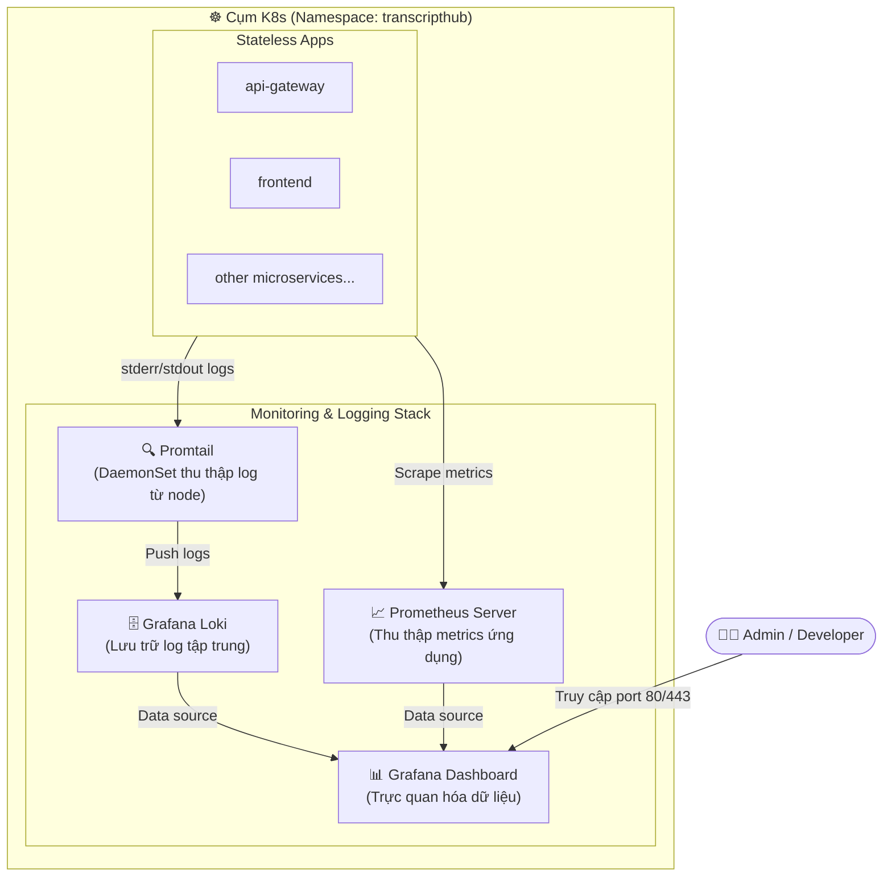

# Hướng dẫn Triển khai Hệ thống Giám sát & Logs tập trung (Prometheus & Loki Stack) bằng Helm

Tài liệu này hướng dẫn chi tiết các bước cài đặt, cấu hình và vận hành hệ thống giám sát metric (Prometheus, Grafana) và quản lý log tập trung (Loki, Promtail) trên cụm K8s (k3s) của máy ảo GCP VM thông qua **Helm 3**.

---

## 1. Kiến trúc hệ thống giám sát



---

## 2. Bước 1: Chuẩn bị Helm Repositories

Kết nối SSH vào máy ảo GCP VM và thực hiện thêm các kho chứa (repositories) chính thức của Prometheus và Grafana:

```bash
# Thêm repository cho Grafana (chứa Loki & Promtail)
helm repo add grafana https://grafana.github.io/helm-charts

# Thêm repository cho Prometheus Community
helm repo add prometheus-community https://prometheus-community.github.io/helm-charts

# Cập nhật danh sách gói mới nhất
helm repo update
```

---

## 3. Bước 2: Triển khai Loki Stack (Log Management)

Loki Stack bao gồm **Loki** (lưu trữ log) và **Promtail** (agent tự động gom log từ các file log của Container trên Node hệ thống):

```bash
# Cài đặt Loki Stack vào namespace 'transcripthub'
helm install loki-stack grafana/loki-stack \
  --namespace transcripthub \
  --set loki.persistence.enabled=true \
  --set loki.persistence.size=10Gi \
  --set promtail.enabled=true
```

> **Lưu ý:** `--set loki.persistence.enabled=true` đảm bảo log của bạn không bị mất đi mỗi khi Pod của Loki khởi động lại (sử dụng StorageClass mặc định của k3s để tạo Volume 10GB).

---

## 4. Bước 3: Triển khai Prometheus Stack (Metrics & Grafana)

Prometheus Stack (kube-prometheus-stack) sẽ cài đặt toàn bộ hệ thống thu thập metrics hệ thống cùng với giao diện trực quan hóa **Grafana**:

```bash
# Cài đặt Prometheus & Grafana vào namespace 'transcripthub'
helm install prometheus-stack prometheus-community/kube-prometheus-stack \
  --namespace transcripthub \
  --set grafana.persistence.enabled=true \
  --set grafana.persistence.size=5Gi
```

Kiểm tra trạng thái toàn bộ các pod của stack giám sát:
```bash
kubectl get pods -n transcripthub -l "release in (loki-stack, prometheus-stack)"
```
*(Đợi cho đến khi toàn bộ Pod chuyển sang trạng thái `Running`).*

---

## 5. Bước 4: Lấy thông tin đăng nhập Grafana

Mật khẩu admin của Grafana được sinh ngẫu nhiên khi cài đặt và lưu trữ trong K8s Secret. Hãy chạy lệnh dưới đây để giải mã lấy mật khẩu:

```bash
# Lấy mật khẩu admin của Grafana
kubectl get secret --namespace transcripthub prometheus-stack-grafana \
  -o jsonpath="{.data.admin-password}" | base64 --decode ; echo
```
* **Tài khoản mặc định:** `admin`
* **Mật khẩu:** Chuỗi ký tự hiển thị từ câu lệnh trên.

---

## 6. Bước 5: Cấu hình Ingress truy cập Grafana từ bên ngoài

Để truy cập vào giao diện web của Grafana qua tên miền `grafana.transcripthub.local`, bạn cần tạo một file cấu hình Ingress.

Tạo file [k8s/apps/grafana-ingress.yaml](file:///d:/VDT_Tucode/VDT_miniproject_TranscriptHub/k8s/apps/grafana-ingress.yaml) (hoặc chạy trực tiếp lệnh apply):

```yaml
apiVersion: networking.k8s.io/v1
kind: Ingress
metadata:
  name: grafana-ingress
  namespace: transcripthub
  annotations:
    kubernetes.io/ingress.class: nginx
spec:
  rules:
  - host: grafana.transcripthub.local
    http:
      paths:
      - path: /
        pathType: Prefix
        backend:
          service:
            name: prometheus-stack-grafana
            port:
              number: 80
```

Áp dụng cấu hình Ingress lên cụm:
```bash
kubectl apply -f k8s/apps/grafana-ingress.yaml
```

---

## 7. Bước 6: Cấu hình trên máy cá nhân để truy cập

### 7.1. Cấu hình file Hosts (DNS ảo)
Thêm dòng sau vào file `/etc/hosts` (macOS/Linux) hoặc `C:\Windows\System32\drivers\etc\hosts` (Windows) của máy tính cá nhân của bạn:

```text
<IP-NGOẠI-VI-GCP-VM> grafana.transcripthub.local
```

### 7.2. Truy cập và kết nối Data Source
1. Mở trình duyệt, truy cập địa chỉ: `http://grafana.transcripthub.local`
2. Đăng nhập bằng tài khoản `admin` và mật khẩu lấy được ở **Bước 4**.
3. **Kết nối Loki làm Data Source**:
   - Vào **Connections** $\rightarrow$ **Data Sources** $\rightarrow$ Chọn **Add data source**.
   - Tìm và chọn **Loki**.
   - Điền mục URL: `http://loki-stack.transcripthub.svc.cluster.local:3100`
   - Cuộn xuống dưới cùng click **Save & test** (Nó sẽ báo kết nối thành công).
4. Bây giờ bạn có thể vào tab **Explore**, chọn source **Loki** và lọc log của các Pod (ví dụ filter: `{namespace="transcripthub"}`) để xem log tập trung thời gian thực!
