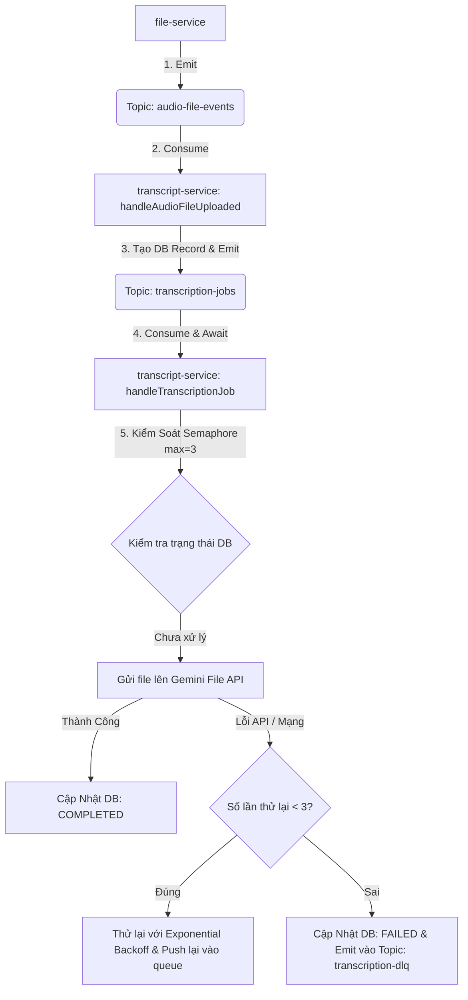

# Tài Liệu Kiến Trúc & Triển Khai: Kafka Message Queue cho Xử Lý Transcription

Tài liệu này trình bày chi tiết về kiến trúc hàng đợi thông điệp thực sự (Message Queue) sử dụng Apache Kafka được xây dựng để xử lý các tác vụ nhận dạng giọng nói (Transcription) bất đồng bộ trong hệ thống `TranscriptHub`.

---

## 1. Đặt Vấn Đề & Phân Tích Hiện Trạng

### Cơ Chế Cũ (Chưa Tối Ưu)
Trước đây, sau khi nhận được sự kiện từ `file-service`, hệ thống thực hiện quá trình dịch chuyển mã âm thanh bất đồng bộ bằng cách sử dụng `setImmediate()` của Node.js:
- **Không kiểm soát được độ đồng thời (No Concurrency Control)**: Nếu người dùng tải lên đồng thời 20-30 file lớn, hệ thống sẽ gọi API Gemini đồng loạt. Việc này dẫn đến việc bị nhà cung cấp API khóa/giới hạn băng thông (Lỗi HTTP 429 Too Many Requests) và gây nghẽn tài nguyên RAM/CPU trên container.
- **Không có cơ chế thử lại (No Retry Policy)**: Khi gặp lỗi mạng hoặc lỗi giới hạn tần suất từ API, tác vụ sẽ thất bại ngay lập tức mà không có cơ chế thử lại thông minh.
- **Dễ mất dữ liệu (Risk of Job Loss)**: Nếu service bị sập hoặc khởi động lại (restart) trong lúc các luồng `setImmediate()` đang chạy, các tác vụ đang xử lý dở dang sẽ bị mất hoàn toàn và bản ghi trong CSDL sẽ bị kẹt vĩnh viễn ở trạng thái `PROCESSING`.
- **Không có Dead Letter Queue (DLQ)**: Khi một tác vụ liên tục thất bại do file lỗi hoặc lỗi hệ thống nghiêm trọng, không có cơ chế phân loại riêng để quản trị viên có thể theo dõi và gỡ lỗi.

---

## 2. Kiến Trúc Hàng Đợi Mới (Kafka-Native Job Queue)

Để giải quyết triệt để các vấn đề trên, chúng ta đã tận dụng hạ tầng Kafka sẵn có để chuyển đổi quy trình xử lý sang mô hình **Worker/Job Queue**.



### Các Topic Tham Gia:
1. `audio-file-events`: Nhận sự kiện thông báo file tải lên thành công từ `file-service`. Xử lý nhanh bằng cách tạo bản ghi DB trống (`PROCESSING`) và đẩy job vào hàng đợi chính.
2. `transcription-jobs`: Hàng đợi chứa các job đang chờ xử lý thực sự. Tách biệt hoàn toàn luồng xử lý chậm của AI khỏi luồng nhận sự kiện nhanh của Kafka.
3. `transcription-dlq`: Hàng đợi chứa các tác vụ bị lỗi nghiêm trọng sau 3 lần thử lại thất bại để phục vụ việc phân tích lỗi.

---

## 3. Các Tính Năng Cốt Lõi Được Triển Khai

### 3.1. Kiểm Soát Độ Đồng Thời (Semaphore Concurrency Control)
Để bảo vệ tài nguyên hệ thống và tránh bị giới hạn tần suất (Rate Limit) bởi API của Google Gemini, chúng ta đã triển khai một lớp Semaphore tùy biến có cấu hình tối đa **3 luồng xử lý đồng thời** cùng lúc.

```typescript
class Semaphore {
  private permits: number;
  private queue: (() => void)[] = [];

  constructor(permits: number) {
    this.permits = permits;
  }

  async acquire(): Promise<void> {
    if (this.permits > 0) {
      this.permits--;
      return;
    }
    return new Promise<void>((resolve) => {
      this.queue.push(resolve);
    });
  }

  release(): void {
    if (this.queue.length > 0) {
      const next = this.queue.shift();
      if (next) next();
    } else {
      this.permits++;
    }
  }
}
```
Mỗi khi có thông điệp đến từ `transcription-jobs`, worker bắt buộc phải thực hiện `await semaphore.acquire()` để lấy quyền xử lý trước khi tải file và gọi API Gemini, sau khi xử lý xong (dù thành công hay thất bại) sẽ gọi `semaphore.release()` trong block `finally`.

### 3.2. Cơ Chế Thử Lại Lũy Thừa (Exponential Backoff Retry)
Khi gặp lỗi trong quá trình giao tiếp với Gemini (đặc biệt là lỗi HTTP 429 Too Many Requests), hệ thống sẽ không bỏ cuộc ngay mà tự động tăng số lần thử (`attempt`) và lên lịch thử lại với độ trễ tăng dần theo lũy thừa:
- Lần thử 1: Chờ 2 giây (`2^1 * 2s`)
- Lần thử 2: Chờ 4 giây (`2^2 * 2s`)
- Lần thử 3: Chờ 8 giây (`2^3 * 2s`)

Cơ chế này sử dụng `await new Promise(resolve => setTimeout(resolve, delay))` ngay trong context xử lý bất đồng bộ trước khi phát lại (re-emit) job lên Kafka, giúp giãn cách lưu lượng truy cập một cách thông minh mà không gây chặn luồng xử lý chính.

### 3.3. Hàng Đợi Lỗi (Dead Letter Queue - DLQ)
Nếu sau 3 lần thử lại tác vụ vẫn tiếp tục thất bại, hệ thống sẽ thực hiện:
1. Đánh dấu bản ghi trạng thái trong database thành `FAILED` và đính kèm thông tin lỗi chi tiết.
2. Tạo một payload lỗi chứa thông tin chi tiết: `fileId`, `transcriptId`, lỗi gặp phải, số lần đã thử, thời điểm xảy ra lỗi.
3. Đẩy payload này vào topic `transcription-dlq` để thông báo cho hệ thống giám sát hoặc lưu trữ để debug thủ công sau này.

### 3.4. Khôi Phục Tự Động Khi Khởi Động (Startup Recovery)
Khi container `transcript-service` khởi động hoặc khởi động lại sau sự cố:
- Dịch vụ sẽ truy vấn CSDL để tìm kiếm tất cả các bản ghi có trạng thái `PROCESSING`.
- Tự động re-enqueue (đẩy lại) các tác vụ bị kẹt này vào topic `transcription-jobs` với `attempt: 1` để đảm bảo không một file âm thanh nào bị bỏ lỡ hoặc kẹt vô hạn ở trạng thái xử lý dở dang.

---

## 4. Tối Ưu Hóa Timeout Cho Kafka Consumer (Tuning)

### Vấn Đề Gặp Phải
Do quá trình xử lý AI (tải tệp âm thanh dung lượng lớn lên Google File API, thăm dò trạng thái cho đến khi file `ACTIVE` trên Google, gọi API nhận dạng giọng nói và nhận phản hồi văn bản) có độ trễ lớn (thường mất từ 30 đến 60 giây đối với các file âm thanh vài MB trở lên), Kafka Broker có thể không nhận được phản hồi heartbeat đúng hạn từ Consumer.

Hậu quả là Kafka Broker sẽ coi Consumer đó đã chết và kích nó ra khỏi nhóm (Rebalancing group) dẫn đến lỗi:
```
ERROR [Connection] Response Heartbeat ... error: "The coordinator is not aware of this member"
```

### Giải Pháp Tối Ưu Cấu Hình
Chúng ta đã cấu hình tăng mạnh các thông số timeout tại file `main.ts` để đảm bảo hệ thống duy trì kết nối ổn định trong suốt quá trình chờ đợi API AI:
- **`sessionTimeout`**: Tăng từ mặc định 30 giây lên **90 giây** (`90000` ms). Broker sẽ đợi tối đa 90 giây trước khi coi consumer đã sập.
- **`rebalanceTimeout`**: Tăng từ mặc định 60 giây lên **120 giây** (`120000` ms). Thời gian chờ tối đa khi thực hiện phân chia lại phân vùng giữa các consumer.
- **`heartbeatInterval`**: Điều chỉnh lên **25 giây** (`25000` ms), đảm bảo luôn nhỏ hơn 1/3 giá trị `sessionTimeout` theo khuyến nghị của Kafka.

```typescript
// Cấu hình trong apps/transcript/src/main.ts
app.connectMicroservice<MicroserviceOptions>({
  transport: Transport.KAFKA,
  options: {
    client: {
      clientId: 'transcript-service',
      brokers: kafkaBrokers,
    },
    consumer: {
      groupId: 'transcript-group',
      allowAutoTopicCreation: true,
      sessionTimeout: 90000,    // 90 giây
      rebalanceTimeout: 120000, // 120 giây
      heartbeatInterval: 25000, // 25 giây
    },
  },
});
```

---

## 5. Chi Tiết Bản Sửa Đổi Các File

### 5.1. [transcript.service.ts](file:///d:/VDT_Tucode/VDT_miniproject_TranscriptHub/services_ms/apps/transcript/src/transcript.service.ts)
- Định nghĩa class `Semaphore` nội bộ.
- Triển khai `onModuleInit()` để kết nối Kafka Producer và gọi hàm tự động khôi phục tác vụ kẹt `recoverStuckJobs()`.
- Chuyển `generateTranscriptAsync()` và `generateTranscriptManually()` sang gọi `enqueueTranscriptionJob()`.
- Xây dựng `processTranscriptionJob()` làm nhiệm vụ worker chính: kiểm soát semaphore, gọi hàm dịch, xử lý bắt lỗi rate limit lũy thừa, đẩy DLQ.

### 5.2. [transcript.controller.ts](file:///d:/VDT_Tucode/VDT_miniproject_TranscriptHub/services_ms/apps/transcript/src/transcript.controller.ts)
- Lắng nghe `@EventPattern('transcription-jobs')` và truyền payload sang `processTranscriptionJob()`.
- Tối ưu `@EventPattern('audio-file-events')` chỉ thực hiện enqueue nhanh vào Queue rồi kết thúc ngay.

### 5.3. [transcript.module.ts](file:///d:/VDT_Tucode/VDT_miniproject_TranscriptHub/services_ms/apps/transcript/src/transcript.module.ts)
- Đăng ký Client Kafka Producer mang tên `TRANSCRIPT_KAFKA_PRODUCER` sử dụng `ClientsModule.registerAsync`.

### 5.4. [main.ts](file:///d:/VDT_Tucode/VDT_miniproject_TranscriptHub/services_ms/apps/transcript/src/main.ts)
- Tinh chỉnh các tham số timeout cho Consumer Kafka.

### 5.5. [transcript.repository.ts](file:///d:/VDT_Tucode/VDT_miniproject_TranscriptHub/services_ms/apps/transcript/src/repositories/transcript.repository.ts)
- Bổ sung hàm `findByStatus(status)` phục vụ tính năng phục hồi startup recovery.

---

## 6. Kết Luận

Kiến trúc hàng đợi thông điệp thực sự cho xử lý Transcription đã giúp hệ thống đạt được:
1. **Sự tin cậy (Reliability)**: Không sợ mất mát job, tự động khôi phục khi sập hệ thống.
2. **Khả năng chịu tải (Scalability)**: Kiểm soát chặt chẽ lưu lượng đồng thời gọi lên API của bên thứ ba, bảo vệ tài nguyên máy chủ.
3. **Khả năng tự hồi phục (Self-healing)**: Tự động retry thông minh với exponential backoff.
4. **Tính minh bạch (Observability)**: Tách các bản ghi lỗi nghiêm trọng vào DLQ để theo dõi riêng biệt.
