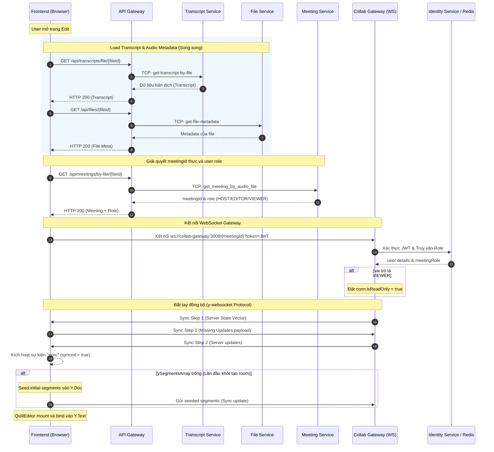
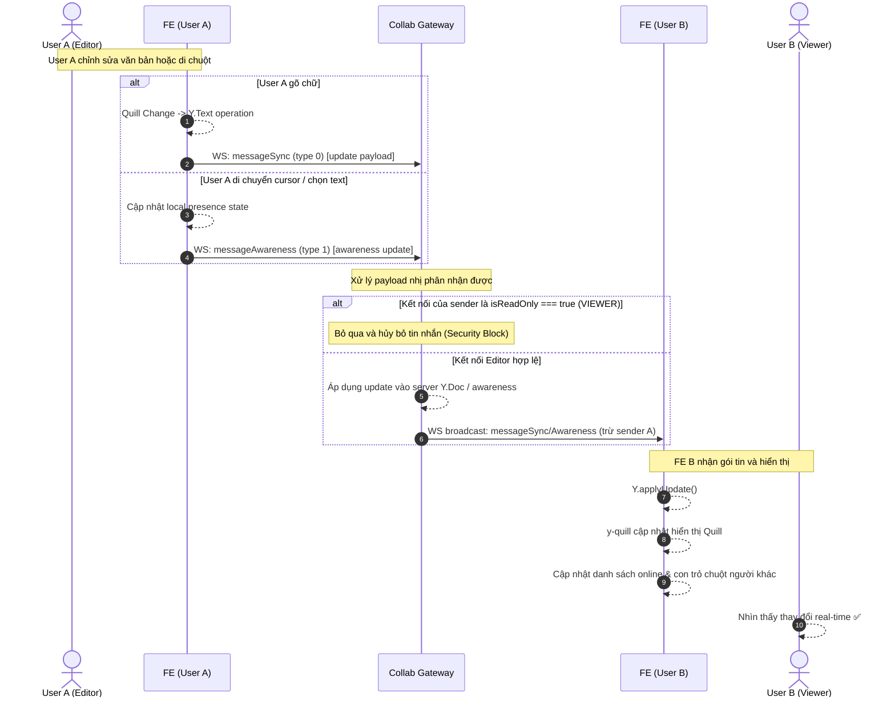
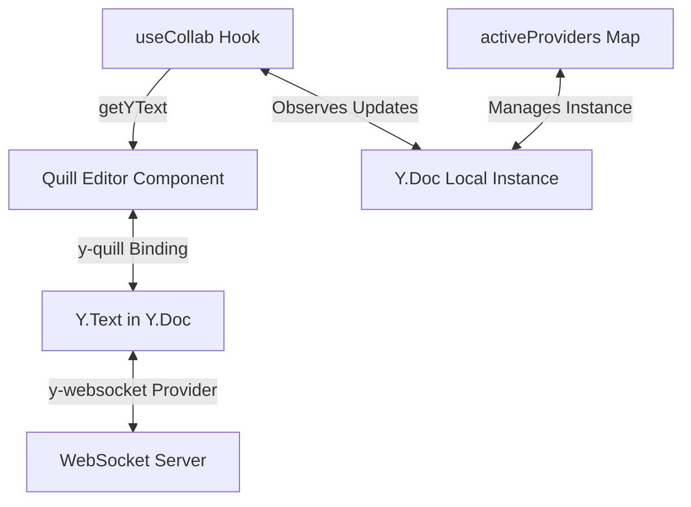

# Tài liệu triển khai Collaborative Editing — TranscriptHub

> **Phiên bản tài liệu:** 1.0  
> **Cập nhật lần cuối:** 2026-06-19  
> **Trạng thái:** Production-ready (sau debug session)

---

## Mục lục

1. [Tổng quan kiến trúc](#1-tổng-quan-kiến-trúc)
2. [Lý thuyết nền tảng — CRDT và Y.js](#2-lý-thuyết-nền-tảng--crdt-và-yjs)
3. [Luồng dữ liệu đầy đủ](#3-luồng-dữ-liệu-đầy-đủ)
4. [Collab Gateway — WebSocket Server](#4-collab-gateway--websocket-server)
5. [Collab Microservice — NestJS TCP Service](#5-collab-microservice--nestjs-tcp-service)
6. [API Gateway — HTTP Bridge](#6-api-gateway--http-bridge)
7. [Frontend — useCollab Hook & QuillEditor](#7-frontend--usecollab-hook--quilleditor)
8. [Database Schema](#8-database-schema)
9. [Xác thực & Phân quyền](#9-xác-thực--phân-quyền)
10. [Các bug đã gặp & cách fix](#10-các-bug-đã-gặp--cách-fix)
11. [Cấu hình môi trường & Docker](#11-cấu-hình-môi-trường--docker)
12. [Sequence Diagram đầy đủ](#12-sequence-diagram-đầy-đủ)

---

## 1. Tổng quan kiến trúc

Hệ thống chỉnh sửa cộng tác của TranscriptHub được xây dựng trên **3 tầng dịch vụ** độc lập:

```
┌─────────────────────────────────────────────────────────┐
│                    BROWSER (Client)                      │
│  ┌──────────────┐   ┌────────────────────────────────┐  │
│  │  useCollab   │   │       QuillEditor (y-quill)     │  │
│  │   (hook)     │   │  Quill ←──── Y.Text binding    │  │
│  │              │   │                                │  │
│  │  Y.Doc ──────┼───┤  ySegmentsArray (Y.Array)      │  │
│  │  WebSocket   │   │  doc.getText("content-{id}")   │  │
│  │  Provider    │   └────────────────────────────────┘  │
│  └──────┬───────┘                                        │
│         │ WebSocket ws://localhost:3008/{meetingId}       │
└─────────┼───────────────────────────────────────────────┘
          │
┌─────────┼───────────────────────────────────────────────┐
│         ▼        COLLAB GATEWAY (Node.js + ws)           │
│  ┌──────────────────────────────────────────────────┐   │
│  │  index.js — Pure WebSocket relay server          │   │
│  │                                                  │   │
│  │  • Xác thực JWT (local + fallback Identity HTTP) │   │
│  │  • Phân quyền vai trò từ Identity Service + Cache │   │
│  │  • Y.Doc in-memory per meetingId                 │   │
│  │  • y-protocols: sync (type 0) + awareness (type 1)│   │
│  │  • Relay doc updates và awareness updates        │   │
│  └──────────────────────────────────────────────────┘   │
│         │                    │                           │
│    Redis Cache          Identity Service HTTP            │
│  (role TTL 300s)       (role lookup + JWT verify)        │
└─────────────────────────────────────────────────────────┘

┌─────────────────────────────────────────────────────────┐
│           COLLAB MICROSERVICE (NestJS TCP)               │
│  ┌──────────────────────────────────────────────────┐   │
│  │  CollabController — MessagePattern handlers      │   │
│  │  CollabService — Business logic                  │   │
│  │  CollabRepository — Prisma DB access             │   │
│  │  MeetingGateway — TCP call sang Meeting Service  │   │
│  └──────────────────────────────────────────────────┘   │
│         │                                               │
│    PostgreSQL (transcripts schema)                      │
│  • Transcript (rawText + structuredContent JSONB)       │
│  • TranscriptVersion (snapshot history)                 │
└─────────────────────────────────────────────────────────┘
```

### Phân chia trách nhiệm

| Service | Công nghệ | Trách nhiệm |
|---------|-----------|-------------|
| **Collab Gateway** | Node.js, `ws`, `yjs`, `y-protocols` | Relay WebSocket real-time; Y.Doc CRDT in-memory |
| **Collab Microservice** | NestJS, Prisma, TCP | Lưu/lấy transcript; snapshot versioning |
| **API Gateway** | NestJS, HTTP | Bridge FE → Collab Microservice (qua TCP) |
| **Frontend** | Next.js, `y-websocket`, `y-quill` | UI editing với Y.js binding |
### Tại sao tách rời Collab Gateway thành Standalone thay vì tích hợp vào NestJS Monorepo?

Việc tách rời **Collab Gateway** (WebSocket Server chạy Node.js thuần + `ws`) thành một dịch vụ độc lập ngoài monorepo của các service NestJS chính mang lại nhiều lợi thế kỹ thuật quan trọng:

1. **Quản lý trạng thái và Bộ nhớ (Stateful vs Stateless)**:
   - Các dịch vụ trong monorepo NestJS (`api-gateway`, `meeting`, v.v.) được thiết kế theo dạng **stateless** để dễ dàng scale-out theo chiều ngang.
   - Ngược lại, **Collab Gateway** là một dịch vụ cực kỳ **stateful**. Nó duy trì các kết nối WebSocket liên tục (persistent connections) và lưu giữ toàn bộ dữ liệu tài liệu cộng tác (`Y.Doc` state vector + history) trong bộ nhớ RAM cho mỗi phòng (room). Việc gom chung một dịch vụ stateful nặng bộ nhớ vào chung cụm microservice stateless sẽ gây khó khăn lớn cho việc điều phối tải và co giãn tài nguyên độc lập.

2. **Tối ưu hóa hiệu năng và Băng thông nhị phân (Binary Protocol)**:
   - Thư viện `y-websocket` giao tiếp bằng cách truyền các luồng đệm nhị phân (`Uint8Array` chứa sync/awareness updates).
   - NestJS WebSocket Gateway (`@nestjs/websockets` sử dụng Socket.io hoặc ws adapter) áp dụng thêm các lớp bọc giao thức (wrapper layers), cơ chế serialization JSON mặc định và quản lý vòng đời Class phức tạp. Sử dụng một Node.js script thuần với thư viện `ws` giúp giảm thiểu tối đa overhead CPU, xử lý trực tiếp binary buffer cực nhanh và tối ưu hóa băng thông cho hàng vạn kết nối đồng thời.

3. **Cô lập lỗi (Fault Isolation) & Garbage Collection**:
   - Y.js quản lý cộng tác thời gian thực bằng cách liên tục đồng bộ hóa và dọn dẹp các bản cập nhật trạng thái trong bộ nhớ. Quá trình này đòi hỏi Garbage Collection (GC) của V8 engine hoạt động tích cực.
   - Nếu xảy ra sự cố rò rỉ bộ nhớ (memory leak) do kết nối treo hoặc quá tải phòng sửa đổi, chỉ duy nhất tiến trình độc lập của **Collab Gateway** bị ảnh hưởng (hoặc restart). Các service cốt lõi của NestJS như Auth, Meeting, Transcript lưu trữ vẫn hoạt động bình thường, không gây sập diện rộng.

4. **Đặc thù về Cân bằng tải (Load Balancing & Sticky Sessions)**:
   - Khi scale-out hệ thống cộng tác thời gian thực, các client trong cùng một phòng bắt buộc phải kết nối tới cùng một instance chứa dữ liệu `Y.Doc` in-memory đó (hoặc sử dụng pub/sub như Redis).
   - Việc tách riêng giúp cấu hình điều hướng Ingress (như Nginx, Kong) dễ dàng route trực tiếp traffic `/collab/*` sang cụm Collab Gateway độc lập với các quy tắc định tuyến WebSocket chuyên biệt.
### Tại sao không khai báo y-websocket (dùng raw ws) dưới dạng một service NestJS trong Monorepo?

Ngay cả khi không dùng `@nestjs/websockets` mà chỉ khởi tạo `ws` thuần túy, việc dựng một ứng dụng NestJS làm vỏ bọc (wrapper) cho **Collab Gateway** trong monorepo vẫn bộc lộ nhiều điểm hạn chế so với Node.js script độc lập:

1. **Overhead khởi tạo của NestJS (Bootstrap Memory & CPU)**:
   - Một ứng dụng NestJS khi khởi chạy bắt buộc phải tải IoC Container, quét toàn bộ decorators, phản chiếu metadata (`reflect-metadata`), khởi tạo Dependency Injection và cấu hình vòng đời module.
   - Quá trình này tiêu tốn từ **40MB - 70MB RAM ban đầu** ngay cả khi chưa nhận bất kỳ kết nối nào. Ngược lại, một Node.js script thuần chỉ cần dưới **10MB RAM** để khởi chạy. Phần tài nguyên RAM tiết kiệm được này có thể phục vụ để lưu trữ thêm hàng trăm thực thể `Y.Doc` in-memory cho các phòng họp trực tuyến.

2. **Kiến trúc NestJS không đem lại giá trị cho Relay Node**:
   - NestJS được thiết kế cực kỳ mạnh mẽ để quản lý các REST API phức tạp, DTO validation, route handlers, interceptors, và database repositories.
   - Tuy nhiên, **Collab Gateway** thực chất chỉ đóng vai trò là một **Relay Node** trung chuyển nhị phân. Nó không lưu database trực tiếp (ủy thác hoàn toàn việc lưu trữ transcript và snapshots cho **Collab Microservice** qua giao thức TCP), không cần validation DTO, cũng không cần route controllers. Việc bọc nó bằng NestJS sẽ làm phức tạp hóa mã nguồn một cách không cần thiết (over-engineering).

3. **Nguy cơ nghẽn Event Loop (Low Latency)**:
   - Do Node.js là đơn luồng (single-threaded), mọi thao tác xử lý logic đồng bộ của NestJS framework (quản lý middleware, validation, exception filters...) đều chia sẻ chung Event Loop.
   - Đối với việc truyền tải real-time nhịp độ cao như di chuột (awareness cursor) hay gõ phím liên tục, các tác vụ trung gian của NestJS có thể làm tăng độ trễ (latency) của gói tin nhị phân và tăng nguy cơ nghẽn Event Loop khi có hàng ngàn client cùng chỉnh sửa.

4. **Cô lập Dependency và Khả năng bảo trì**:
   - Thư viện Y.js và hệ sinh thái CRDT cập nhật rất nhanh. Khi tách riêng thành Node.js thuần, chúng ta hoàn toàn chủ động nâng cấp các package Y.js mà không lo ngại xung đột phiên bản TypeScript, webpack/vite/nest-cli builder của dự án chính.
   - Đặc biệt, trong tương lai nếu muốn tối ưu hóa hiệu năng cực hạn, ta có thể dễ dàng viết lại hoàn toàn **Collab Gateway** bằng **Go** hoặc **Rust** (sử dụng thư viện `y-crdt` / Rust `yjs`) và thay thế trực tiếp mà không ảnh hưởng gì tới cấu trúc monorepo NestJS của backend.

---

## 2. Lý thuyết nền tảng — CRDT và Y.js

### 2.1 CRDT là gì?

**CRDT (Conflict-free Replicated Data Type)** là cấu trúc dữ liệu cho phép nhiều người cùng chỉnh sửa một tài liệu **đồng thời** mà **không có conflict**.

Ví dụ trực quan:
```
User A (offline): "Hello World"  →  xóa "World" → "Hello "
User B (offline): "Hello World"  →  thêm "!" →  "Hello World!"

Khi 2 thay đổi merge:
  - Operational Transform (OT): cần server biết thứ tự → phức tạp
  - CRDT (Y.js):                tự động merge → "Hello !"   ✅
```

### 2.2 Y.js và cấu trúc dữ liệu

Y.js là thư viện CRDT JavaScript. TranscriptHub dùng các type sau:

```
Y.Doc  ← Root document, chứa toàn bộ shared state
├── Y.Array<Y.Map> "segments"   ← Danh sách segment metadata
│     ├── Y.Map { id, startTime, endTime, speaker }  (segment 1)
│     ├── Y.Map { id, startTime, endTime, speaker }  (segment 2)
│     └── ...
│
├── Y.Text "content-{seg-id-1}"   ← Nội dung text của segment 1
├── Y.Text "content-{seg-id-2}"   ← Nội dung text của segment 2
└── ...
```

**Quan trọng:** Tất cả `Y.Array`, `Y.Text` phải được tạo bằng `doc.getArray(name)` / `doc.getText(name)` — KHÔNG dùng `new Y.Array()` vì sẽ tạo ra "floating" instance không thuộc doc, không bao giờ sync.

### 2.3 y-websocket Protocol

`y-websocket` định nghĩa 2 loại message qua WebSocket:

```
Message Type 0 = messageSync
  ├── Sync Step 1: Client gửi state vector hiện tại → Server trả về missing updates
  ├── Sync Step 2: Server phản hồi với updates mà client chưa có
  └── Update:      Cập nhật Y.Doc (vd: user vừa gõ)

Message Type 1 = messageAwareness
  └── Awareness:   Trạng thái user hiện tại (vị trí cursor, tên, màu...)
```

**Binary format** (lib0 encoding):
```
[messageType: varuint] [payload: varuint8array]
```

---

## 3. Luồng dữ liệu đầy đủ

### 3.1 Khi user mở trang edit lần đầu

```
1. FE load dữ liệu bản dịch và metadata tệp âm thanh song song:
   ├── api.get("/transcripts/file/{fileId}") (API Gateway → Transcript Service)
   └── api.get("/files/{fileId}") (API Gateway → File Service)
2. FE giải quyết meetingId (UUID) và vai trò (role) từ audioFileId:
   └── meetingsApi.getByAudioFile(fileId) (API Gateway → Meeting Service)
       └── Trả về UUID thực của meetingId và meetingRole (HOST/EDITOR/VIEWER) của user trong meeting này.
3. useCollab hook: getOrCreateCollab(meetingId)
   └── Nếu chưa tồn tại trong Registry (Map `activeProviders` dùng để lưu trữ Singleton kết nối ở Client), tạo Y.Doc và ySegmentsArray (Y.Array) mới trong memory.
4. WebsocketProvider kết nối: ws://collab-gateway:3008/{meetingId}?token=JWT
5. Server xác thực JWT → lấy userId và thông tin tài khoản.
6. Server kiểm tra role của user trong meeting từ Identity Service (có lưu cache Redis 5 phút):
   └── Nếu role là "VIEWER", đặt cờ conn.isReadOnly = true để chặn mọi gói tin update từ client này.
7. Bắt đầu bắt tay đồng bộ dữ liệu (Sync Handshake):
   ├── Server gửi Sync Step 1 (State Vector của server) cho Client.
   ├── Client nhận, tính toán phần dữ liệu thiếu và gửi Sync Step 2 (Update) cho Server.
   ├── Server nhận, áp dụng Update vào Y.Doc của mình và gửi trả Sync Step 2 của Client.
   └── Hai bên hoàn tất đồng bộ hóa trạng thái Y.Doc.
8. Provider kích hoạt sự kiện "sync" trên Client (synced=true).
9. useCollab:
   ├── Khởi tạo trạng thái Presence của user hiện tại (ID, Tên, Màu sắc) lên awareness.
   └── Nếu ySegmentsArray trên Y.Doc trống (chưa có ai chỉnh sửa trước đó), tiến hành seed dữ liệu ban đầu từ database (transcript.segments).
10. QuillEditor mount → bind từng đoạn Quill Editor tương ứng với Y.Text ("content-{segmentId}").
11. User nhìn thấy nội dung hoàn chỉnh và danh sách những người đang online kèm con trỏ chuột thời gian thực.
```



### 3.2 Khi user gõ chữ hoặc di chuyển con trỏ chuột

```
1. User tương tác trên màn hình:
   ├── User gõ chữ: Quill phát sự kiện → QuillBinding chuyển đổi Quill Delta thành Y.Text operation.
   └── User di chuột/chọn văn bản: awareness.setLocalState() cập nhật cursor.
2. Y.Doc cập nhật trạng thái local.
3. WebsocketProvider tự động đóng gói sự kiện:
   ├── Với thay đổi văn bản: [type=0 (messageSync)][payload binary update]
   └── Với di chuột/presence: [type=1 (messageAwareness)][payload binary update]
4. Gửi qua kết nối WebSocket tới Collab Gateway.
5. Collab Gateway nhận gói tin nhị phân và kiểm tra:
   ├── Nếu connection có isReadOnly === true (VIEWER): Bỏ qua gói tin, không áp dụng (bảo vệ phía backend).
   └── Nếu hợp lệ:
       ├── Với sync update: readSyncMessage() áp dụng vào server Y.Doc và broadcast update tới các clients khác trong phòng.
       └── Với awareness update: applyAwarenessUpdate() cập nhật danh sách người dùng và broadcast tới các clients khác.
6. Các Client khác nhận gói tin cập nhật:
   ├── Y.Doc áp dụng update → y-quill phát hiện và hiển thị thay đổi văn bản thời gian thực.
   └── Awareness áp dụng update → hiển thị danh sách người dùng online và vị trí con trỏ chuột động của người khác.
```



### 3.3 Khi user bấm "Lưu" (Save Snapshot)

```
1. FE gọi hàm saveSnapshot() từ useCollab hook.
2. hook đọc toàn bộ ySegmentsArray, trích xuất rawText và structuredContent (các segments kèm delta của Quill).
3. Gửi request POST /api/collab/transcript qua axios client:
   └── payload: { meetingId, rawText, structuredContent }
4. Next.js Route Handler / proxy chuyển tiếp đến API Gateway tại cổng :3000/api/v1/collab/transcript.
5. API Gateway: JwtIdentityGuard giải mã token → CollabController.saveTranscript() nhận payload.
6. CollabService.saveTranscript(meetingId, rawText, structuredContent):
   ├── Gọi meetingGateway.getAudioFileId(meetingId) qua giao thức TCP sang Meeting Service để lấy audioFileId.
   ├── Gọi collabRepository.updateTranscript(audioFileId, { rawText, structuredContent }).
   └── Prisma thực hiện update bản ghi trong bảng `Transcript` của PostgreSQL.
7. Database hoàn thành lưu trữ trạng thái bản dịch mới nhất.
```

```mermaid
sequenceDiagram
    autonumber
    participant FE as Frontend (Browser)
    participant NEXT as Next.js API Proxy
    participant APIGW as API Gateway
    participant CS as Collab Service
    participant MS as Meeting Service
    database DB as PostgreSQL (Prisma)

    Note over FE: User click nút "Lưu thay đổi"
    FE-->>FE: read ySegmentsArray -> construct rawText & structuredContent
    FE->>NEXT: POST /api/collab/transcript [Bearer JWT]
    NEXT->>APIGW: POST /api/v1/collab/transcript [Bearer JWT]
    Note over APIGW: JwtIdentityGuard giải mã và kiểm tra JWT
    APIGW->>CS: TCP: save-transcript { meetingId, rawText, structuredContent }
    CS->>MS: TCP: get-audioFileId { meetingId }
    MS-->>CS: Trả về audioFileId thực
    CS->>DB: collabRepository.updateTranscript(audioFileId, ...)
    Note over DB: Cập nhật rawText & structuredContent trong db
    DB-->>CS: OK
    CS-->>APIGW: OK
    APIGW-->>NEXT: HTTP 200 OK
    NEXT-->>FE: HTTP 200 OK
    Note over FE: Hiển thị thông báo lưu thành công ✅
```

---

## 4. Collab Gateway — WebSocket Server

**Path:** `services_ms/apps/collab-gateway/src/`

### 4.1 Cấu trúc thư mục

```
collab-gateway/
├── src/
│   ├── index.js              # Entry point — WS server chính
│   ├── middleware/
│   │   ├── auth.js           # JWT verification
│   │   └── role.js           # Role lookup với Redis cache
│   ├── services/
│   │   ├── identity.js       # HTTP calls đến Identity Service
│   │   ├── redis.js          # Redis client (ioredis)
│   │   └── collab.js         # (legacy) HTTP client đến Collab Service
│   └── utils/
│       └── logger.js         # Structured logging
├── Dockerfile
└── package.json
```

### 4.2 `index.js` — Chi tiết giải thích

```javascript
// === CONSTANTS ===
const messageSync = 0;        // y-websocket protocol: sync (step1/step2/update)
const messageAwareness = 1;   // y-websocket protocol: awareness state

// === DOC STORE ===
// Mỗi meetingId có 1 Y.Doc riêng, tồn tại trong memory suốt session
const docs = new Map();
// Structure: Map<meetingId, { doc: Y.Doc, awareness: Awareness, connections: Set<WebSocket> }>

function getOrCreateDoc(meetingId) {
  if (!docs.has(meetingId)) {
    const doc = new Y.Doc();
    doc.gc = true; // Enable garbage collection cho Y.Doc
    docs.set(meetingId, {
      doc,
      awareness: new awarenessProtocol.Awareness(doc),
      connections: new Set(),
    });
  }
  return docs.get(meetingId);
}
```

#### Xử lý kết nối mới

```javascript
wss.on('connection', async (conn, req) => {
  // y-websocket sends room name as URL path: ws://host/{meetingId}?token=xxx
  const url = new URL(req.url, `http://${req.headers.host}`);
  const token = url.searchParams.get('token');
  const meetingId = url.pathname.replace(/^\//, ''); // e.g. "/{uuid}" → "{uuid}"

  if (!token || !meetingId) {
    conn.close(4001, 'Missing token or meetingId');
    logger.warn(`[WS] Rejected: token=${!!token} meetingId="${meetingId}"`);
    return;
  }

  try {
    const user = await authMiddleware(token);
    if (!user) {
      conn.close(4001, 'Unauthorized');
      return;
    }

    const role = await roleMiddleware(meetingId, user.id);

    const docEntry = getOrCreateDoc(meetingId);
    docEntry.connections.add(conn);
    conn.userId = user.id;
    conn.role = role;
    conn.meetingId = meetingId;
    conn.awarenessClientIDs = new Set(); // track Y.js clientIDs from this conn

    logger.info(`[WS] User ${user.id} (${role}) joined meeting ${meetingId}`);

    if (role === 'VIEWER') {
      conn.isReadOnly = true;
    }

    // Relay awareness changes to all other connections
    const awarenessHandler = ({ added, updated, removed }) => {
      const changedClients = [...added, ...updated, ...removed];
      broadcastAwarenessUpdate(docEntry, changedClients, conn);
    };
    docEntry.awareness.on('change', awarenessHandler);

    // Relay doc updates to all other connections
    const updateHandler = (update, origin) => {
      if (origin !== conn) {
        broadcastUpdate(docEntry, update, origin);
      }
    };
    docEntry.doc.on('update', updateHandler);

    // Receive and dispatch messages from this client
    conn.on('message', (rawMessage) => {
      if (conn.isReadOnly) return;
      try {
        handleMessage(conn, docEntry, new Uint8Array(rawMessage));
      } catch (err) {
        logger.error(`[WS] Message error: ${err.message}`);
      }
    });

    // Cleanup on disconnect
    conn.on('close', () => {
      docEntry.connections.delete(conn);
      if (conn.awarenessClientIDs.size > 0) {
        awarenessProtocol.removeAwarenessStates(
          docEntry.awareness,
          [...conn.awarenessClientIDs],
          conn
        );
      }
      docEntry.awareness.off('change', awarenessHandler);
      docEntry.doc.off('update', updateHandler);
      logger.info(`[WS] User ${user.id} left meeting ${meetingId}`);
    });

    // Send current doc state to new client (sync step 1)
    sendSyncStep1(conn, docEntry.doc);

    // Send current awareness states to new client
    const awarenessStates = docEntry.awareness.getStates();
    if (awarenessStates.size > 0) {
      const encoder = encoding.createEncoder();
      encoding.writeVarUint(encoder, messageAwareness); // type 1
      const updateData = awarenessProtocol.encodeAwarenessUpdate(
        docEntry.awareness,
        Array.from(awarenessStates.keys())
      );
      encoding.writeVarUint8Array(encoder, updateData);
      conn.send(encoding.toUint8Array(encoder));
    }
  } catch (err) {
    logger.error(`[WS] Connection setup error: ${err.message}`);
    conn.close(1011, 'Internal error');
  }
});
```

#### Giải thích chi tiết các bước xử lý kết nối mới

##### Ý nghĩa của các tham số đầu vào trong sự kiện `connection`
Sự kiện `connection` nhận vào callback chứa hai tham số:
*   `conn`: Đại diện cho đối tượng kết nối **WebSocket** (một instance của class `WebSocket` từ thư viện `ws`). Đây là đường truyền socket trực tiếp giữa Client (trình duyệt của một user) và Server.
    *   Nó hỗ trợ các API có sẵn của WebSocket như gửi gói tin (`conn.send()`), lắng nghe sự kiện (`conn.on('message')`, `conn.on('close')`), đóng kết nối (`conn.close()`).
    *   Ngoài ra, server còn gán thêm các thuộc tính metadata động lên `conn` để theo dõi ngữ cảnh: `conn.userId` (định danh người dùng), `conn.role` (vai trò của user), `conn.meetingId` (ID cuộc họp), `conn.isReadOnly` (chỉ đọc), `conn.awarenessClientIDs` (ID con trỏ Y.js).
*   `req`: Đại diện cho đối tượng HTTP Request ban đầu (`IncomingMessage` của Node.js) khi Client gửi yêu cầu bắt tay nâng cấp giao thức (protocol upgrade) lên WebSocket. Nó chứa các siêu dữ liệu HTTP như URL kết nối (`req.url`), headers (`req.headers`), địa chỉ IP client.

##### A. Các bước xử lý chính (Đánh số)

1. **Phân tích tham số kết nối từ URL**:
   ```javascript
   const url = new URL(req.url, `http://${req.headers.host}`);
   const token = url.searchParams.get('token');
   const meetingId = url.pathname.replace(/^\//, '');
   ```
   Server bóc tách `token` và `meetingId` trực tiếp từ URL path gửi lên từ client (ví dụ: `ws://host/{meetingId}?token=xxx`).

2. **Kiểm tra đầu vào (Validation Guard)**:
   ```javascript
   if (!token || !meetingId) {
     conn.close(4001, 'Missing token or meetingId');
     return;
   }
   ```
   Nếu thiếu token hoặc ID phòng họp, đóng kết nối ngay lập tức bằng mã lỗi WebSocket `4001` để chặn kết nối rác.

3. **Xác thực và lấy vai trò (Authentication & Authorization)**:
   ```javascript
   const user = await authMiddleware(token);
   const role = await roleMiddleware(meetingId, user.id);
   ```
   Gọi Middleware xác thực token qua Identity Service và truy xuất quyền hạn (`HOST`, `EDITOR`, hay `VIEWER`) của người dùng tương ứng với cuộc họp hiện tại.

4. **Đăng ký thực thể phòng và kết nối**:
   ```javascript
   const docEntry = getOrCreateDoc(meetingId);
   docEntry.connections.add(conn);
   conn.userId = user.id;
   conn.role = role;
   conn.meetingId = meetingId;
   conn.awarenessClientIDs = new Set();
   ```
   Lấy hoặc tạo phòng cộng tác `Y.Doc` trong bộ nhớ RAM, lưu kết nối `conn` vào phòng và gán các trường siêu dữ liệu định danh (`userId`, `role`, `meetingId`) trực tiếp lên đối tượng kết nối `conn` để quản lý.

5. **Chế độ chỉ đọc đối với VIEWER**:
   ```javascript
   if (role === 'VIEWER') {
     conn.isReadOnly = true;
   }
   ```
   Nếu vai trò là `VIEWER`, đặt cờ `conn.isReadOnly = true` để ngăn chặn các bản cập nhật chỉnh sửa được gửi lên từ kết nối này.

6. **Thiết lập lắng nghe sự kiện đồng bộ (Event Listeners)**:
   ```javascript
   // Đồng bộ sự hiện diện chuột (Awareness)
   const awarenessHandler = ({ added, updated, removed }) => { ... };
   docEntry.awareness.on('change', awarenessHandler);

   // Đồng bộ cập nhật ký tự (Doc updates)
   const updateHandler = (update, origin) => { ... };
   docEntry.doc.on('update', updateHandler);
   ```
   Khi có thay đổi về con trỏ chuột (`awareness change`) hoặc nội dung nhập liệu (`doc update`), server sẽ tự động chuyển tiếp (broadcast) các thay đổi này tới toàn bộ những người dùng khác trong phòng họp.

   > [!NOTE]
   > **Chi tiết về `awareness.on('change', callback)`**:
   > - **Nhiệm vụ**: Đăng ký một callback để lắng nghe bất kỳ thay đổi nào về trạng thái hiện diện (presence/awareness) của các client trong phòng (ví dụ: thay đổi vị trí con trỏ chuột, cập nhật tên/màu sắc của user, hoặc trạng thái online/offline).
   > - **Tham số callback**: Callback nhận vào một đối tượng chứa `{ added, updated, removed }` đại diện cho danh sách các Y.js Client ID (định dạng số nguyên) tương ứng vừa được thêm mới, cập nhật hoặc thoát.
   > - **Các vị trí sử dụng trong hệ thống**:
   >   1. **Backend (collab-gateway/src/index.js:L172)**: Đăng ký lắng nghe biến đổi của phòng họp trên server. Khi bất kỳ client nào gửi cập nhật chuột lên, server sẽ phát hiện qua sự kiện này và tự động gọi `broadcastAwarenessUpdate` để gửi dữ liệu nhị phân cập nhật đó sang các kết nối client còn lại trong phòng.
   >   2. **Frontend (fe_next/hooks/use-collab.ts:L152)**: Đăng ký lắng nghe trên Client. Khi client nhận được thông tin cập nhật chuột/danh sách online từ server truyền về, sự kiện này sẽ kích hoạt và gọi `notifySubscribers()` để báo hiệu cho React re-render giao diện hiển thị danh sách người đang truy cập và con trỏ chuột của họ.

7. **Lắng nghe tin nhắn chỉnh sửa từ Client**:
   ```javascript
   conn.on('message', (rawMessage) => {
     if (conn.isReadOnly) return;
     handleMessage(conn, docEntry, new Uint8Array(rawMessage));
   });
   ```
   Lắng nghe các tin nhắn nhị phân chỉnh sửa từ client gửi lên và gọi hàm giải mã `handleMessage` nếu kết nối không phải là Read-only.

8. **Dọn dẹp tài nguyên khi Client ngắt kết nối (Cleanup Handler)**:
   ```javascript
   conn.on('close', () => {
     docEntry.connections.delete(conn);
     awarenessProtocol.removeAwarenessStates(docEntry.awareness, [...conn.awarenessClientIDs], conn);
     docEntry.awareness.off('change', awarenessHandler);
     docEntry.doc.off('update', updateHandler);
   });
   ```
   Khi client ngắt kết nối, dọn dẹp các sự kiện để chống rò rỉ bộ nhớ (memory leaks) và xóa bỏ vị trí con trỏ chuột của người dùng này khỏi danh sách Presence để tránh hiện tượng con trỏ "ma" (ghost cursor).

##### B. Các phần bổ trợ đồng bộ ban đầu

* **Bắt tay đồng bộ hóa dữ liệu (Sync Step 1)**:
  ```javascript
  sendSyncStep1(conn, docEntry.doc);
  ```
  Ngay khi kết nối thành công, server chủ động gửi trạng thái vector hiện tại của server sang client để bắt đầu chu trình đối chiếu và tải phần dữ liệu chênh lệch còn thiếu.
* **Đồng bộ hóa Presence danh sách online**:
  ```javascript
  const awarenessStates = docEntry.awareness.getStates();
  if (awarenessStates.size > 0) { ... }
  ```
  Nếu trong phòng đã có người online trước đó, server lập tức đóng gói danh sách Client ID và thông tin Presence của họ dưới dạng binary và gửi sang cho client mới để hiển thị danh sách người dùng trực tuyến ngay tức khắc.
```

#### Xử lý message inbound

```javascript
function handleMessage(conn, docEntry, message) {
  const decoder = decoding.createDecoder(message);
  const messageType = decoding.readVarUint(decoder);  // đọc byte đầu tiên

  switch (messageType) {
    case 0: // messageSync
      // readSyncMessage xử lý cả 3 sub-types:
      //   - syncStep1: gửi lại syncStep2 (missing updates)
      //   - syncStep2: apply updates nhận được
      //   - syncUpdate: apply doc update
      const encoder = encoding.createEncoder();
      encoding.writeVarUint(encoder, 0); // respond cũng là messageSync
      syncProtocol.readSyncMessage(decoder, encoder, docEntry.doc, null);
      if (encoding.length(encoder) > 1) conn.send(encoding.toUint8Array(encoder));
      break;

    case 1: // messageAwareness
      const update = decoding.readVarUint8Array(decoder);
      // Track clientIDs để cleanup khi disconnect
      trackAwarenessClientIDs(conn, update);
      // Apply và trigger 'change' event → broadcast đến clients khác
      awarenessProtocol.applyAwarenessUpdate(docEntry.awareness, update, conn);
      break;
  }
}
```

#### Tại sao phải track `awarenessClientIDs`?

```javascript
// Y.js awareness dùng clientID (số int), KHÔNG phải userId (database)
// Khi disconnect, phải remove đúng clientID:
conn.on('close', () => {
  awarenessProtocol.removeAwarenessStates(
    docEntry.awareness,
    [...conn.awarenessClientIDs],  // ← phải là Y.js clientIDs
    conn
  );
});

// Sai (bug cũ): removeAwarenessStates(awareness, [conn.userId], conn)
// → Không tìm thấy state nào → "ghost" users xuất hiện mãi không mất
```

### 4.3 `middleware/auth.js`

```javascript
// Xác thực 2 lớp:
// 1. Verify JWT local (nhanh, không cần network)
// 2. Nếu local fail → fallback HTTP đến Identity Service (chậm hơn, 3s timeout)

export async function authMiddleware(token) {
  const response = await identityService.verifyToken(token);
  if (!response.success) return null;
  return response.data; // { id: number, email: string }
}
```

### 4.4 `middleware/role.js`

```javascript
// Cache role trong Redis với TTL 300s (5 phút)
// Tránh gọi HTTP đến Identity Service mỗi lần user kết nối

const ROLE_CACHE_TTL = 300; // seconds

export async function roleMiddleware(meetingId, userId) {
  const cacheKey = `meeting:${meetingId}:user:${userId}:role`;
  
  const cachedRole = await redisService.get(cacheKey);
  if (cachedRole) return cachedRole; // Cache HIT
  
  const role = await identityService.getMeetingRole(meetingId, userId);
  await redisService.set(cacheKey, role, ROLE_CACHE_TTL);
  return role; // "HOST" | "EDITOR" | "VIEWER"
}
```

---

## 5. Collab Microservice — NestJS TCP Service

**Path:** `services_ms/apps/collab/src/`

### 5.1 Kiến trúc NestJS

Service này chạy trên **TCP transport** (không phải HTTP). Không có REST API riêng — chỉ nhận message từ API Gateway qua `ClientProxy`.

```
TCP Port 3007 (COLLAB_SERVICE_TCP_PORT)
         │
    CollabController (@MessagePattern)
         │
    CollabService (business logic)
         │
    CollabRepository (Prisma)     +    MeetingGateway (TCP → Meeting Service)
         │
    PostgreSQL (schema: transcripts)
```

### 5.2 `collab.controller.ts` — MessagePattern handlers

```typescript
@Controller()
export class CollabController {
  // API Gateway gửi: this.collabClient.send('save-transcript', { meetingId, rawText, structuredContent, userId })
  @MessagePattern('save-transcript')
  async saveTranscript(
    @Payload()
    payload: {
      meetingId: string;
      rawText: string;
      structuredContent: any;
      userId: number;
    },
  ) {
    return this.collabService.saveTranscript(
      payload.meetingId,
      payload.rawText,
      payload.structuredContent,
      payload.userId,
    );
  }

  @MessagePattern('get-transcript')
  async getTranscript(@Payload() payload: { meetingId: string }) {
    return this.collabService.getTranscript(payload.meetingId);
  }

  @MessagePattern('create-snapshot')
  async createSnapshot(
    @Payload()
    payload: {
      meetingId: string;
      userId: number;
      versionName: string;
    },
  ) {
    const result = await this.collabService.createSnapshot(
      payload.meetingId,
      payload.userId,
      payload.versionName,
    );
    return {
      versionId: result.id,
      message: 'Snapshot created successfully',
    };
  }

  @MessagePattern('get-versions')
  async getVersions(@Payload() payload: { meetingId: string }) {
    return this.collabService.getVersions(payload.meetingId);
  }

  @MessagePattern('get-version-detail')
  async getVersionDetail(@Payload() payload: { versionId: number }) {
    return this.collabService.getVersionDetail(payload.versionId);
  }

  @MessagePattern('restore-version')
  async restoreVersion(
    @Payload() payload: { meetingId: string; versionId: number },
  ) {
    return this.collabService.restoreVersion(
      payload.meetingId,
      payload.versionId,
    );
  }
}
```

### 5.3 `collab.service.ts` — Business logic

```typescript
async saveTranscript(
  meetingId: string,
  rawText: string,
  structuredContent: any,
  userId: number,
) {
  // 1. Lấy audioFileId từ meetingId qua Meeting Service (TCP)
  const audioFileId = await this.meetingGateway.getAudioFileId(meetingId);

  // 2. Cập nhật bảng Transcript chính
  const updatedTranscript = await this.collabRepository.updateTranscript(audioFileId, {
    rawText,
    structuredContent,
  });

  // 3. Tự động tạo một snapshot lưu lịch sử vào bảng TranscriptVersion
  const timestampStr = new Date().toLocaleTimeString('vi-VN', {
    hour: '2-digit',
    minute: '2-digit',
    second: '2-digit',
  }) + ' ' + new Date().toLocaleDateString('vi-VN');
  const versionName = `Bản lưu - ${timestampStr}`;

  await this.collabRepository.createTranscriptVersion({
    transcriptId: updatedTranscript.id,
    versionName,
    rawText: updatedTranscript.rawText,
    structuredContent: updatedTranscript.structuredContent,
    createdById: userId,
  });

  return updatedTranscript;
}

async createSnapshot(meetingId: string, userId: number, versionName: string) {
  const audioFileId = await this.meetingGateway.getAudioFileId(meetingId);
  const transcript = await this.collabRepository.findTranscriptByAudioFileId(audioFileId);
  if (!transcript) throw new Error('Transcript not found');

  // Tạo bản snapshot (version) thủ công
  return this.collabRepository.createTranscriptVersion({
    transcriptId: transcript.id,
    versionName,
    rawText: transcript.rawText,
    structuredContent: transcript.structuredContent,
    createdById: userId,
  });
}
```

### 5.4 `gateways/meeting.gateway.ts` — Inter-service communication

```typescript
@Injectable()
export class MeetingGateway {
  constructor(@Inject('MEETING_CLIENT') private readonly meetingClient: ClientProxy) {}

  async getAudioFileId(meetingId: string): Promise<string> {
    // Gọi TCP → Meeting Service với MessagePattern 'get-audioFileId'
    const response = await lastValueFrom(
      this.meetingClient.send('get-audioFileId', { meetingId })
    );
    if (!response?.audioFileId) throw new Error('Failed to get audioFileId');
    return response.audioFileId;
  }
}
```

---

## 6. API Gateway — HTTP Bridge

**Path:** `services_ms/apps/api-gateway/src/collab/`

API Gateway expose HTTP endpoints để FE gọi qua Next.js proxy.

### 6.1 Collab endpoints trong API Gateway

```typescript
@ApiTags('Collab')
@ApiBearerAuth()
@UseGuards(JwtIdentityGuard)  // ← Bắt buộc Bearer token
@Controller('v1/collab')
export class CollabController {
  @Post('transcript')          // POST /api/v1/collab/transcript
  saveTranscript(@Body() dto: SaveTranscriptDto, @Req() req: any) {
    return this.collabService.saveTranscript(dto.meetingId, dto.rawText, dto.structuredContent);
  }

  @Post('snapshot')            // POST /api/v1/collab/snapshot
  createSnapshot(...) { ... }

  @Get(':meetingId/versions')  // GET /api/v1/collab/{meetingId}/versions
  getVersions(...) { ... }

  @Post('restore')             // POST /api/v1/collab/restore
  restoreVersion(...) { ... }
}
```

### 6.2 Next.js Proxy (FE → API Gateway)

File: `fe_next/next.config.ts`

```typescript
async rewrites() {
  const gatewayUrl = process.env.API_GATEWAY_URL ?? "http://localhost:3000";
  return [
    // FE gọi /api/collab/* → Gateway nhận /api/v1/collab/*
    {
      source: "/api/collab/:path*",
      destination: `${gatewayUrl}/api/v1/collab/:path*`,
    },
    // Các service khác tương tự...
    { source: "/api/meetings/:path*", destination: `${gatewayUrl}/api/v1/meetings/:path*` },
    { source: "/api/users/:path*",    destination: `${gatewayUrl}/api/users/:path*` },
    // ...
  ];
}
```

**Lý do dùng proxy:** Tránh CORS. Browser → Next.js (same origin) → NestJS. NestJS không cần cấu hình CORS vì giao tiếp là server-to-server.

---

## 7. Frontend — FE

Kiến trúc đồng bộ phía Frontend của hệ thống Realtime Collaboration được xây dựng xung quanh các thư viện cốt lõi:
- **`Yjs`**: Thư viện CRDT (Conflict-free Replicated Data Types) hiệu năng cao giúp tự động giải quyết xung đột khi nhiều người cùng gõ.
- **`y-websocket`**: Cầu nối truyền tin WebSocket đồng bộ dữ liệu `Y.Doc` giữa Client và Server.
- **`Quill`**: Trình soạn thảo văn bản giàu tính năng (Rich-text Editor).
- **`y-quill`**: Adapter (Binding) đồng bộ trực tiếp kiểu dữ liệu `Y.Text` với trạng thái hiển thị của Quill.

Dưới đây là sơ đồ luồng dữ liệu cộng tác ở Frontend:



---

### 7.1 Chi tiết Code & Giải thích từng phần

#### 7.1.1 Singleton Registry: [getOrCreateCollab](file:///d:/VDT_Tucode/VDT_miniproject_TranscriptHub/fe_next/hooks/use-collab.ts#L96)

Hàm này chịu trách nhiệm khởi tạo hoặc tái sử dụng một thực thể kết nối cộng tác duy nhất ứng với mỗi `meetingId`. Bản chất của nó là triển khai một Singleton Registry, tránh việc khởi tạo nhiều kết nối WebSocket trùng lặp khi có nhiều thành phần giao diện cùng tham gia vào một phiên họp.

##### Khai báo Interface và Registry Map:
```typescript
interface CollabInstance {
  doc: Y.Doc;                                // Thực thể tài liệu cộng tác YJS local
  ySegmentsArray: Y.Array<Y.Map<any>>;       // Cấu trúc mảng chứa metadata của các segment
  connect: () => Promise<void>;              // Hàm kích hoạt kết nối WebSocket và thiết lập state
  disconnect: () => void;                    // Hàm ngắt kết nối, dọn dẹp awareness và hủy provider
  buildSegments: () => CollabSegment[];      // Chuyển đổi dữ liệu YJS sang dạng React-friendly
  addSubscriber: (fn: () => void) => () => void; // Cơ chế Pub/Sub để React Component đăng ký re-render
  provider: WebsocketProvider | null;        // Đối tượng WebSocket provider của y-websocket
  role: string;                              // Quyền hiện tại của người dùng (HOST, EDITOR, VIEWER)
  _mountedCount: number;                     // Đếm số lượng React component đang sử dụng instance này
  _connectDone: boolean;                     // Cờ đánh dấu đã gọi connect thành công
  _disconnectTimer: ReturnType<typeof setTimeout> | null; // Bộ đệm khử rung (debounce) cho StrictMode
  _pendingSeeds: TranscriptSegment[] | null; // Lưu trữ dữ liệu seed ban đầu khi YJS chưa đồng bộ xong
  _meetingRole: string | null;               // Vai trò nhận từ bên ngoài truyền vào
  _meetingId?: string | null;
}

const activeProviders = new Map<string, CollabInstance>();
```

##### Chi tiết Code hàm [getOrCreateCollab](file:///d:/VDT_Tucode/VDT_miniproject_TranscriptHub/fe_next/hooks/use-collab.ts#L96):
```typescript
function getOrCreateCollab(meetingId: string): CollabInstance {
  if (!activeProviders.has(meetingId)) {
    const doc = new Y.Doc();
    // Tạo hoặc lấy một Y.Array có tên là "segments" thuộc về đồ thị Y.Doc
    const ySegmentsArray = doc.getArray<Y.Map<any>>("segments");
    const subscribers = new Set<() => void>();
    let provider: WebsocketProvider | null = null;
```
* **Giải thích**: 
  - `activeProviders` đóng vai trò là một Pool lưu trữ các `CollabInstance`. Nếu `meetingId` đã tồn tại trong Pool, hàm sẽ lập tức trả về thực thể hiện có.
  - `doc = new Y.Doc()` tạo mới một tài liệu YJS rỗng làm Single Source of Truth cho phiên cộng tác cục bộ.
  - `ySegmentsArray` lưu trữ danh sách các đoạn hội thoại (segment). Mỗi segment là một `Y.Map` chứa metadata: `id`, `startTime`, `endTime`, `speaker`. Việc sử dụng `doc.getArray("segments")` đảm bảo cấu trúc mảng này nằm trong đồ thị đồng bộ của YJS.
  - `subscribers = new Set<() => void>()`: Tập hợp lưu trữ các hàm callback cập nhật của React Hook `useCollab` đăng ký tới Singleton instance này. Khi có bất kỳ sự kiện nào xảy ra (Y.Doc thay đổi nội dung, danh sách người dùng online cập nhật), Singleton instance sẽ duyệt qua Set này để gọi các callback kích hoạt React component render lại giao diện mới nhất.
  - `provider`: Lưu trữ thực thể của `WebsocketProvider` (của thư viện `y-websocket`). Nó khởi tạo ban đầu là `null` và được gán sau khi thực hiện kết nối WebSocket thành công, đóng vai trò đồng bộ hóa YJS delta updates và Awareness state giữa Client và Server.

##### Hàm chuyển đổi cấu trúc dữ liệu `buildSegments`:
```typescript
    const buildSegments = (): CollabSegment[] => {
      return ySegmentsArray.toArray().map((m) => {
        const id = m.get("id") as string;
        const yText = doc.getText(`content-${id}`);
        return {
          id,
          startTime: Number(m.get("startTime")),
          endTime: Number(m.get("endTime")),
          speaker: m.get("speaker") as string,
          content: yText?.toString() ?? "",
          delta: yText ? yText.toDelta() : [],
        } satisfies CollabSegment;
      });
    };
```
* **Giải thích**: 
  - Vì React không thể phát hiện thay đổi trực tiếp trên các cấu trúc dữ liệu nội bộ của YJS (`Y.Array`, `Y.Map`), hàm `buildSegments` được dùng để trích xuất dữ liệu thô (Plain JavaScript Objects).
  - Với mỗi segment, nó lấy thuộc tính từ `Y.Map` và truy vấn văn bản cộng tác dạng `Y.Text` tương ứng qua định danh khóa `content-${id}`.
  - Trả về đối tượng `CollabSegment` chứa cả định dạng chuỗi (`content`) và cấu trúc Delta giàu định dạng (`delta`) để binding với Quill.

##### Hàm phát thông báo cập nhật `notifySubscribers`:
```typescript
    const notifySubscribers = () => {
      subscribers.forEach((fn) => fn());
    };
```
* **Giải thích**:
  - Hàm này chịu trách nhiệm lặp qua toàn bộ danh sách các hàm callback đăng ký trong tập hợp `subscribers` (được lưu bằng `Set`).
  - **Tham số `fn` (Function) là gì?**:
    + Trong mã nguồn cụ thể, `fn` chính là hàm **`updateState()`** được truyền từ hook `useCollab` khi hook này đăng ký qua lệnh `collab.addSubscriber(updateState)`.
    + Nhiệm vụ của `updateState` (tức `fn`) là:
      1. Đọc lại các dữ liệu mới nhất từ đối tượng Singleton (như lấy trạng thái kết nối `wsconnected`, trạng thái đồng bộ `synced`, danh sách online users qua `awareness.getStates()`, và mảng dữ liệu segment sau khi merge qua `buildSegments()`).
      2. Thực hiện gọi hàm thay đổi state của React (`setState(...)` và `setSegments(...)`).
    + **Tại sao phải gọi `fn()`?**: Vì YJS và WebSocket hoạt động bên ngoài React (không kích hoạt re-render tự động). Việc gọi `fn()` (chính là thực thi `updateState()`) đóng vai trò là "nút bấm" ra lệnh cho React cập nhật lại UI (re-render) tương ứng với dữ liệu cộng tác mới nhất vừa nhận được.

##### Kết nối WebSocket và Đồng bộ Hóa (`connect`):
```typescript
    const connect = async () => {
      if (provider || instance._connectDone) return;

      const session = await getSession();
      const token = session?.accessToken;
      if (!token) {
        console.warn("[Collab] Không có access token — chế độ chỉ đọc");
        return;
      }

      instance.role = instance._meetingRole ?? "VIEWER";

      // Khởi tạo cầu nối WebSocket
      provider = new WebsocketProvider(WS_URL, meetingId, doc, {
        params: { token },
        connect: true,
      });

      // Thiết lập Presence (Awareness)
      const userInfo: CollabUser = {
        id: session.user?.id ?? "",
        name: session.user?.name ?? session.user?.email ?? "Unknown",
        email: session.user?.email ?? "",
        color: pickColor(session.user?.id ?? session.user?.email ?? meetingId),
      };
      provider.awareness.setLocalState({ user: userInfo });

      provider.awareness.on("change", () => notifySubscribers());
```
* **Giải thích**:
  - Hàm `connect` lấy JWT Token của người dùng từ phiên đăng nhập NextAuth để gửi kèm dưới dạng Query Parameter khi bắt đầu bắt tay (handshake) kết nối WebSocket. Việc này giúp API Gateway xác thực người dùng ngay khi thiết lập kết nối TCP.
  - `WebsocketProvider` tự động đồng bộ hóa `Y.Doc` cục bộ với WebSocket Server. Nó cũng tích hợp sẵn cơ chế tự động kết nối lại (Auto-reconnect) khi mất mạng.
  - Hệ thống **Awareness** quản lý Presence (trạng thái online). Bằng cách gọi `setLocalState`, client phát quảng bá thông tin định danh của mình (tên, avatar màu sắc) tới tất cả các client khác trong phòng thông qua WebSocket. Khi có sự thay đổi về danh sách online, sự kiện `"change"` kích hoạt thông báo cho các subscribers.
  - **Lệnh `provider.awareness.setLocalState({ user: userInfo })`**:
    + Lưu trữ thông tin cá nhân của người dùng hiện tại (userInfo) cục bộ vào bộ nhớ RAM của client (trong class `Awareness`).
    + Ngay sau đó, nó kích hoạt gửi gói tin WebSocket loại awareness lên server. Server sẽ nhận và ghi đè trạng thái của user này trong RAM của server, rồi broadcast (phát quảng bá) thông tin này tới RAM của toàn bộ các client khác đang online trong cùng một `meetingId`.
  - **Lệnh `provider.awareness.on("change", () => notifySubscribers())`**:
    + Lắng nghe mọi sự kiện thay đổi trạng thái online/offline của phòng họp (khi có người mới kết nối, người cũ ngắt kết nối, hoặc ai đó cập nhật trạng thái hoạt động).
    + Khi có thay đổi, hàm callback `notifySubscribers()` được kích hoạt, dẫn đến việc gọi hàm `updateState()` trong hook `useCollab` để đọc lại danh sách user từ RAM và setState để trigger React render lại giao diện mới nhất.
  - **Cơ chế lưu trữ Presence (Awareness State)**:
    + Trạng thái presence là dữ liệu tạm thời (Ephemeral State) chỉ lưu trong bộ nhớ RAM của Client và Server chứ không được ghi vào cơ sở dữ liệu Postgres.
    + Mỗi client duy trì trạng thái presence của chính mình. Khi người dùng di chuyển chuột, chọn văn bản, hoặc online/offline, thay đổi này được cập nhật vào awareness local state và lập tức broadcast tới tất cả các máy khách đang kết nối cùng phòng họp qua các gói tin WebSocket nhị phân.
    + Khi client chủ động gọi hàm `disconnect()`, hệ thống sẽ thiết lập `provider.awareness.setLocalState(null)`. Bản tin này phát đi giúp các máy khách khác lập tức xóa user này khỏi danh sách online trên giao diện (UI) mà không cần đợi timeout ping/pong của WebSocket.

##### Cơ chế Seeding Dữ liệu An toàn khi Đồng bộ Xong (`sync`):
```typescript
      provider.on("sync", (isSynced: boolean) => {
        if (isSynced && instance._pendingSeeds && ySegmentsArray.length === 0) {
          const seeds = instance._pendingSeeds;
          instance._pendingSeeds = null;
          doc.transact(() => {
            seeds.forEach((s) => {
              const meta = new Y.Map<any>();
              meta.set("id", s.id);
              meta.set("startTime", s.startTime);
              meta.set("endTime", s.endTime);
              meta.set("speaker", s.speaker);
              ySegmentsArray.push([meta]);
              const yText = doc.getText(`content-${s.id}`);
              if (yText.length === 0) yText.insert(0, s.content ?? "");
            });
          });
        }
        notifySubscribers();
      });

      ySegmentsArray.observeDeep(() => notifySubscribers());
```
* **Giải thích bằng ví dụ trực quan (Ẩn dụ "Cuốn sổ ghi chép dùng chung")**:
  - **Bối cảnh**: Bạn và những người khác cùng viết chung một cuốn sổ (tài liệu cộng tác `Y.Doc` trên Server). Khi bạn vừa mở máy tính lên (component mount), bạn có một bản in dữ liệu từ trước (`_pendingSeeds` lấy từ cơ sở dữ liệu Postgres). Lúc này, bạn chưa kết nối mạng nên chưa biết cuốn sổ trên server đang trống hay đã được người khác viết đầy dữ liệu.
  - **Vấn đề trùng lặp (Race Condition)**: Nếu bạn vội vã chép ngay bản in cũ đó vào cuốn sổ local của bạn trước khi kết nối mạng, khi bạn online, thuật toán của YJS sẽ nghĩ rằng đây là dữ liệu mới được viết độc lập. Nó sẽ tự động hòa trộn (merge) bằng cách giữ lại cả hai: nội dung có sẵn trên server và nội dung bạn vừa chép vào. Kết quả là mọi đoạn hội thoại bị **nhân đôi (duplicate)** trên màn hình.
  - **Giải pháp xử lý qua sự kiện `"sync"`**:
    + Bước 1: Khi vừa mở trang, ta **chỉ lưu tạm** bản in cũ vào biến tạm `_pendingSeeds`.
    + Bước 2: Sự kiện `provider.on("sync", (isSynced) => { ... })` giống như việc bạn gọi điện cho Server hỏi: *"Hãy gửi cho tôi nội dung mới nhất trong sổ"*.
    + Bước 3: Khi nhận được tín hiệu đồng bộ xong (`isSynced === true`), bạn so khớp: nếu cuốn sổ lúc này **hoàn toàn trống trơn** (`ySegmentsArray.length === 0`), điều đó nghĩa là chưa có ai viết gì cả. Lúc này bạn mới an toàn chép bản in tạm kia vào sổ thông qua một giao dịch duy nhất `doc.transact` (viết một mạch xong rồi mới đóng sổ gửi đi, tránh phát tin nhắn vụn vặt từng chữ qua mạng). Nếu cuốn sổ đã có sẵn nội dung, bạn bỏ qua bản in tạm kia đi và sử dụng nội dung vừa đồng bộ từ server về.
  - **Hàm `ySegmentsArray.observeDeep(...)` (Trợ lý giám sát sâu)**:
    + Giống như bạn thuê một trợ lý đứng canh cuốn sổ. Bất cứ khi nào có ai viết thêm một đoạn mới, xóa đi một đoạn, đổi tên Speaker, hay thậm chí sửa một chữ cái lồng sâu trong bất kỳ đoạn hội thoại nào, người trợ lý này sẽ lập tức báo cho bạn (`notifySubscribers()`) để bạn vẽ lại giao diện mới nhất lên màn hình (trigger React re-render). `observeDeep` (giám sát sâu) đảm bảo theo dõi mọi thay đổi ở mọi cấp độ phân cấp của tài liệu.

##### Hàm Ngắt Kết nối (`disconnect`):
```typescript
    const disconnect = () => {
      if (!provider) return;
      try { provider.awareness.setLocalState(null); } catch (_) { }
      provider.disconnect();
      provider.destroy();
      provider = null;
      instance.provider = null;
      instance._connectDone = false;
    };
```
* **Giải thích**:
  - Trước khi đóng kết nối vật lý, client chủ động đặt local state của awareness về `null`. Thao tác này gửi một bản tin "tạm biệt" nhanh qua WebSocket để báo cho các client khác gỡ bỏ user này khỏi danh sách hiển thị lập tức, thay vì đợi cơ chế timeout của server phát hiện. Sau đó, provider được ngắt kết nối và giải phóng tài nguyên triệt để bằng lệnh `destroy()`.

---

#### 7.1.2 React Hook Custom: [useCollab](file:///d:/VDT_Tucode/VDT_miniproject_TranscriptHub/fe_next/hooks/use-collab.ts#L225)

Hook này làm nhiệm vụ **cầu nối (Bridge)** kết nối hai thế giới hoàn toàn khác nhau:
1. **Thế giới của Singleton Registry (`getOrCreateCollab`)**: Đây là thế giới JavaScript thuần túy của các thư viện bên ngoài (YJS, WebSocket). Nó chạy độc lập, lưu trữ dữ liệu trong RAM, chỉ hiểu về kết nối WebSocket, thuật toán CRDT giải quyết xung đột, và hoàn toàn không quan tâm hay biết cách để tự render lại giao diện React.
2. **Thế giới của React Component**: Đây là thế giới của giao diện người dùng (UI). Nó chỉ hiểu các khái niệm của React như State (`useState`) để lưu trữ hiển thị dữ liệu mới và Vòng đời (`useEffect`) để biết khi nào component xuất hiện (mount) hoặc biến mất (unmount) trên màn hình.

**Nhờ có hook `useCollab` làm trung gian, hai thế giới này hoạt động hài hòa:**
* **Đồng bộ vòng đời (Lifecycle Sync)**: Khi React Component hiển thị trên màn hình, hook bảo Singleton: *"Hãy mở kết nối WebSocket"*. Khi Component biến mất, hook bảo: *"Đóng kết nối sau 150ms buffer nhé"*.
* **Đồng bộ trạng thái (State Sync)**: Khi Singleton nhận được dữ liệu gõ chữ mới từ người khác qua WebSocket, nó thông báo cho hook. Hook ngay lập tức dùng `setState` để cập nhật biến `segments`. React phát hiện state thay đổi và tự động vẽ lại giao diện mới nhất.
* **Cung cấp API đơn giản (Clean API)**: Hook đóng gói toàn bộ các thao tác dữ liệu phức tạp (như thao tác đồ thị YJS, khởi tạo transaction `doc.transact`) và xuất ra ngoài các hàm Javascript thông thường cực kỳ sạch sẽ và dễ dùng như `addSegment()`, `saveSnapshot()`, `restoreVersion()` để các React component gọi trực tiếp.

---

##### Khởi tạo và Quản lý Đổi Meeting:
```typescript
export function useCollab({
  meetingId,
  meetingRole,
  initialSegments,
  onContentsChange,
}: UseCollabOptions) {
  const collabRef = useRef<CollabInstance | null>(null);
  
  // Quản lý state của sự cộng tác để phản hồi lên UI
  const [state, setState] = useState<CollabState>({
    connected: false,
    synced: false,
    users: [],
    canEdit: false,
    role: "VIEWER",
    segmentCount: initialSegments?.length ?? 0,
  });
```
* **Giải thích sự khác biệt giữa `collabRef` và `state` (React State)**:
  - **`collabRef` (Động cơ chạy nền — Logic Engine)**: 
    - Lưu trữ thực thể kết nối thực tế `CollabInstance` (chứa các thực thể phức tạp như `Y.Doc`, `WebsocketProvider` và các hàm `connect`, `disconnect`).
    - Việc thay đổi các thuộc tính bên trong đối tượng này (ví dụ: client gửi update, trạng thái kết nối chuyển mạch,...) **không làm kích hoạt React re-render**. Điều này là cực kỳ quan trọng cho hiệu năng vì chúng ta không muốn React liên tục render lại giao diện mỗi khi mạng gửi nhận gói tin WebSocket hoặc khi có tác vụ ngầm chạy.
    - Giúp lưu giữ tham chiếu ổn định đến kết nối cũ để thực hiện `disconnect()` chuẩn xác khi chuyển `meetingId`.
  - **`state` (Bảng đồng hồ hiển thị — UI Dashboard)**: 
    - Chỉ lưu trữ các dữ liệu dạng nguyên thủy (như boolean `connected`, `synced`, danh sách mảng người dùng online `users`, `segmentCount`). Đây là những thông số giao diện cần in ra màn hình cho người dùng xem.
    - Khi các thông số này thay đổi (ví dụ: mất mạng đổi sang `connected: false`), ta gọi `setState(...)` để **ép React re-render** và vẽ lại giao diện tương ứng cho người dùng nhìn thấy.
  - *Tóm lại*: `collabRef` là **động cơ hoạt động** (giữ logic chạy ngầm), còn `state` là **màn hình hiển thị** (chỉ cập nhật khi cần đổi giao diện). Phân tách như vậy giúp ứng dụng chạy cực kỳ mượt mà, tránh re-render thừa.

---

  const [segments, setSegments] = useState<CollabSegment[]>([]);
  const onContentsChangeRef = useRef(onContentsChange);
  onContentsChangeRef.current = onContentsChange;

  // Singleton: Tránh khởi tạo lại kết nối WebSocket nhiều lần
  if (meetingId && (!collabRef.current || collabRef.current._meetingId !== meetingId)) {
    if (collabRef.current) {
      try { collabRef.current.disconnect(); } catch (_) {}
    }
    collabRef.current = getOrCreateCollab(meetingId);
    collabRef.current._meetingId = meetingId;
  }
  const collab = collabRef.current;
```
* **Giải thích**:
  - **Không phải tạo lại hook `useCollab`**: Bản thân hook `useCollab` là một hàm chạy bên trong component của React. Khi component thay đổi `meetingId` (ví dụ người dùng chuyển trang xem cuộc họp từ ID `"A"` sang ID `"B"`), component sẽ render lại và gọi tiếp hook này với tham số `meetingId` mới. Hook không bị hủy hay tạo lại.
  - **Thay đổi đối tượng kết nối bên trong hook**:
    1. Hook phát hiện `meetingId` mới khác với `collabRef.current._meetingId` đang lưu trữ.
    2. Nó chủ động gọi `disconnect()` trên thực thể cũ để **ngắt kết nối WebSocket cũ** (đóng kết nối đến phòng họp `"A"`).
    3. Nó gọi `getOrCreateCollab(meetingId)` để lấy hoặc tạo mới một thực thể `CollabInstance` tương ứng với phòng họp mới `"B"` từ Registry Pool (`activeProviders`).
    4. Cập nhật con trỏ `collabRef.current` trỏ sang thực thể mới này.
  - Nhờ cơ chế này, hook vẫn được giữ nguyên nhưng đối tượng WebSocket connection và tài liệu `Y.Doc` bên trong nó đã được hoán đổi thành công sang phòng họp mới một cách an toàn.

##### Đồng bộ Role và Seed dữ liệu ban đầu:
```typescript
  useEffect(() => {
    if (!collab || !meetingRole) return;
    collab._meetingRole = meetingRole;
    if (collab.role !== meetingRole) {
      collab.role = meetingRole;
    }
  }, [collab, meetingRole]);

  useEffect(() => {
    if (!collab || !initialSegments?.length) return;
    if (collab.ySegmentsArray.length > 0) return;
    if (collab.provider?.synced) {
      if (collab.ySegmentsArray.length === 0) {
        collab.doc.transact(() => {
          initialSegments.forEach((s) => {
            const meta = new Y.Map<any>();
            meta.set("id", s.id);
            meta.set("startTime", s.startTime);
            meta.set("endTime", s.endTime);
            meta.set("speaker", s.speaker);
            collab.ySegmentsArray.push([meta]);
            const yText = collab.doc.getText(`content-${s.id}`);
            if (yText.length === 0) yText.insert(0, s.content ?? "");
          });
        });
      }
      return;
    }
    collab._pendingSeeds = initialSegments;
  }, [collab, initialSegments]);
```
* **Giải thích**:
  - API trả về role của người dùng trong phòng họp (HOST/EDITOR/VIEWER) có thể diễn ra chậm hơn quá trình kết nối WebSocket. `useEffect` đầu tiên theo dõi và đồng bộ hóa quyền truy cập này vào thực thể `collab` để cập nhật trạng thái chỉ đọc (read-only) kịp thời.
  - `useEffect` thứ hai đảm bảo nếu tài liệu YJS đã đồng bộ xong (`collab.provider.synced = true`) mà mảng dữ liệu vẫn rỗng, nó sẽ kích hoạt việc seed dữ liệu ngay lập tức. Nếu chưa đồng bộ xong, nó lưu vào `_pendingSeeds` để đợi hàm đồng bộ hoàn thành kích hoạt.

##### Cập nhật State và Quản lý Vòng đời qua Bộ đệm StrictMode:
```typescript
  // Đăng ký nhận cập nhật từ Singleton Instance
  useEffect(() => {
    if (!collab) return;

    const updateState = () => {
      const p = collab.provider;
      const role = collab.role;
      const canEdit = role !== "VIEWER";

      setState((s) => ({
        ...s,
        connected: p?.wsconnected ?? false,
        synced: p?.synced ?? false,
        segmentCount: collab.ySegmentsArray.length,
        role,
        canEdit,
      }));

      if (p) {
        const users: CollabUser[] = [];
        p.awareness.getStates().forEach((st) => {
          if (st.user) users.push(st.user as CollabUser);
        });
        setState((s) => ({ ...s, users }));
      }

      const segs = collab.buildSegments();
      setSegments(segs);
      onContentsChangeRef.current?.(segs);
    };

    const unsub = collab.addSubscriber(updateState);
    updateState();
    return unsub;
  }, [collab]);

  // Quản lý kết nối / ngắt kết nối vật lý kèm bộ đệm 150ms chống StrictMode double-mount
  useEffect(() => {
    if (!collab) return;

    if (collab._disconnectTimer) {
      clearTimeout(collab._disconnectTimer);
      collab._disconnectTimer = null;
    }

    collab._mountedCount++;
    collab.connect();

    return () => {
      collab._mountedCount--;
      if (collab._mountedCount <= 0) {
        collab._disconnectTimer = setTimeout(() => {
          if (collab._mountedCount <= 0) {
            if (meetingId) activeProviders.delete(meetingId);
            collab.disconnect();
          }
          collab._disconnectTimer = null;
        }, 150);
      }
    };
  }, [collab, meetingId]);
```
* **Giải thích**:
  - Khi có cập nhật mới (người dùng khác gõ chữ, thay đổi danh sách online), hàm `updateState` được gọi để lấy thông tin mới nhất từ YJS và ánh xạ vào React State (`state`, `segments`), kích hoạt UI render lại.
  - **Cơ chế chống Double-Mount**: Ở chế độ React StrictMode (môi trường dev), React sẽ tự động chạy hiệu ứng phụ `Mount -> Unmount -> Mount` liên tục để kiểm tra lỗi rò rỉ tài nguyên. Nếu không có biện pháp xử lý, WebSocket sẽ bị kết nối, đóng, rồi kết nối lại tức thì. Bằng cách đếm số lượng `_mountedCount` kết hợp bộ đệm trì hoãn `setTimeout 150ms` trong hàm cleanup, nếu tiến trình remount xảy ra ngay lập tức, `_mountedCount` tăng lại lên `1` và hàm `clearTimeout` sẽ hủy bỏ lệnh đóng kết nối cũ. Nhờ đó, WebSocket giữ trạng thái ổn định tuyệt đối.

##### Các Public APIs và Cơ chế Tự động Lưu (Auto-Save):
```typescript
  const getYText = useCallback((segmentId: string): Y.Text | undefined => {
    return collab?.doc.getText(`content-${segmentId}`);
  }, [collab]);

  const addSegment = useCallback((segment: TranscriptSegment) => {
    if (!collab) return;
    collab.doc.transact(() => {
      const meta = new Y.Map<any>();
      meta.set("id", segment.id);
      meta.set("startTime", segment.startTime);
      meta.set("endTime", segment.endTime);
      meta.set("speaker", segment.speaker);
      collab.ySegmentsArray.push([meta]);
      collab.doc.getText(`content-${segment.id}`).insert(0, segment.content ?? "");
    });
  }, [collab]);

  const saveSnapshot = useCallback(async () => {
    if (!collab || !meetingId) return false;
    const segs = collab.buildSegments();
    const rawText = segs.map((s) => `[${s.speaker}] ${s.content}`).join("\n");
    const structuredContent = {
      segments: segs.map((s) => ({
        id: s.id,
        startTime: s.startTime,
        endTime: s.endTime,
        speaker: s.speaker,
        text: s.content,
        delta: s.delta,
      })),
    };
    try {
      await collabApi.saveTranscript({ meetingId, rawText, structuredContent });
      return true;
    } catch {
      return false;
    }
  }, [collab, meetingId]);

  // Tự động lưu sau mỗi 10 thay đổi của chính người dùng hiện tại
  useEffect(() => {
    if (!collab || !meetingId) return;
    let changeCount = 0;
    const handleUpdate = (update: Uint8Array, origin: any) => {
      // Bỏ qua các thay đổi nhận về từ bên ngoài qua WebSocket
      if (collab.provider && origin === collab.provider) return;

      changeCount++;
      if (changeCount >= 10) {
        changeCount = 0;
        console.log("[Collab] Đạt mốc 10 thay đổi nội bộ, tự động lưu...");
        saveSnapshot();
      }
    };
    collab.doc.on("update", handleUpdate);
    return () => { collab.doc.off("update", handleUpdate); };
  }, [collab, meetingId, saveSnapshot]);
```
* **Giải thích**:
  - `addSegment` chèn một `Y.Map` chứa metadata vào `Y.Array` đồng thời chèn nội dung văn bản vào `Y.Text` trong cùng một transaction `doc.transact` để gửi đi một update mạng duy nhất.
  - `saveSnapshot` đóng gói dữ liệu và gọi API thông qua axios proxy `/api/collab/...` (được Next.js rewrite trỏ đến Gateway API HTTP) để thực hiện lưu trữ vĩnh viễn vào Postgres.
  - **Lọc Nguồn Thay Đổi để Auto-Save**: Sự kiện `update` của Y.Doc cung cấp tham số `origin`. Nếu sự thay đổi bắt nguồn từ WebSocket Provider (`origin === provider`), nghĩa là thay đổi này do người khác gõ truyền tới máy mình. Chúng ta bỏ qua. Ngược lại, nếu `origin` khác `provider` (ví dụ do editor của local thay đổi), biến đếm `changeCount` tăng lên. Khi đạt đủ 10 thay đổi, nó tự động gọi `saveSnapshot()` để lưu trữ dạng sao lưu định kỳ phòng trường hợp mất mạng đột ngột hoặc tắt trình duyệt.

##### Cơ chế Khôi phục Phiên bản (Rollback):
```typescript
  const restoreVersion = useCallback(async (versionId: number) => {
    if (!collab || !meetingId) return false;
    try {
      const restored = await collabApi.restoreVersion({ meetingId, versionId });
      if (restored && restored.structuredContent?.segments) {
        collab.doc.transact(() => {
          // Xóa toàn bộ dữ liệu hiện tại
          collab.ySegmentsArray.delete(0, collab.ySegmentsArray.length);

          // Ghi đè bằng dữ liệu khôi phục
          restored.structuredContent.segments.forEach((s: any) => {
            const meta = new Y.Map<any>();
            meta.set("id", s.id);
            meta.set("startTime", s.startTime);
            meta.set("endTime", s.endTime);
            meta.set("speaker", s.speaker);
            collab.ySegmentsArray.push([meta]);

            const yText = collab.doc.getText(`content-${s.id}`);
            yText.delete(0, yText.length);
            yText.insert(0, s.text ?? "");
          });
        });
        return true;
      }
      return false;
    } catch (err) {
      console.error("[Collab] Phục hồi phiên bản thất bại:", err);
      return false;
    }
  }, [collab, meetingId]);
```
* **Giải thích**:
  - Khi thực hiện khôi phục (rollback) về một phiên bản lịch sử cũ, máy khách gọi API HTTP khôi phục dữ liệu ở Database. Khi API trả về dữ liệu thành công, Client thực hiện việc thay đổi trạng thái Y.Doc local trong một khối giao dịch duy nhất (`collab.doc.transact`).
  - Nó dọn dẹp sạch sẽ `ySegmentsArray` và mọi `Y.Text` cũ, sau đó điền lại thông tin của phiên bản được khôi phục. Mọi thay đổi ghi đè này sẽ được YJS tính toán delta và gửi quảng bá tức khắc đến tất cả các client khác qua WebSocket, giúp toàn bộ phòng đồng bộ ngay lập tức sang trạng thái của phiên bản cũ.

---

#### 7.1.3 Quill Editor Binding: [QuillEditor](file:///d:/VDT_Tucode/VDT_miniproject_TranscriptHub/fe_next/components/transcript/QuillEditor.tsx#L24)

Component này đóng vai trò giao diện nhập liệu trực tiếp của người dùng, thực hiện liên kết hai chiều giữa trình soạn thảo Quill và thực thể dữ liệu cộng tác `Y.Text`.

##### Chi tiết Code component [QuillEditor](file:///d:/VDT_Tucode/VDT_miniproject_TranscriptHub/fe_next/components/transcript/QuillEditor.tsx#L24):
```typescript
export function QuillEditor({
  segmentId,
  getYText,
  canEdit,
  initialContent,
  onContentChange,
}: QuillEditorProps) {
  const containerRef = useRef<HTMLDivElement>(null);
  const quillRef = useRef<Quill | null>(null);
  const bindingRef = useRef<QuillBinding | null>(null);
  
  // Sử dụng Stable Refs để loại bỏ dependency không cần thiết khỏi useEffect
  const onContentChangeRef = useRef(onContentChange);
  onContentChangeRef.current = onContentChange;

  const getYTextRef = useRef(getYText);
  getYTextRef.current = getYText;

  const initialContentRef = useRef(initialContent);

  useEffect(() => {
    if (!containerRef.current) return;
    let destroyed = false;

    const init = async () => {
      // Dynamic import tránh lỗi crash SSR của Next.js do thư viện Quill cần document/window
      const { default: QuillLib } = await import("quill");
      const { QuillBinding: QB } = await import("y-quill");

      if (destroyed || !containerRef.current) return;
      if (quillRef.current) return; // Guard chống tạo lặp

      // Khởi tạo thực thể Quill
      const quill = new QuillLib(containerRef.current, {
        theme: "snow",
        placeholder: "Nhập nội dung...",
        readOnly: !canEdit,
        modules: {
          toolbar: canEdit ? [
            ["bold", "italic", "underline", "strike"],
            [{ script: "sub" }, { script: "super" }],
            [{ list: "ordered" }, { list: "bullet" }],
            ["clean"],
          ] : false,
        },
      });

      if (destroyed) return;
      quillRef.current = quill;

      // Hàm liên kết Quill với YJS Text, Polling nếu dữ liệu chưa sync xong
      const tryBind = () => {
        const yText = getYTextRef.current(segmentId);
        if (yText) {
          if (bindingRef.current) return;
          bindingRef.current = new QB(yText, quill);
        } else {
          // Y.Text chưa sẵn sàng -> Seed tạm text và poll liên tục đến khi có Y.Text
          if (initialContentRef.current && quill.getLength() <= 1) {
            quill.setText(initialContentRef.current);
          }
          const checkInterval = setInterval(() => {
            if (destroyed) { clearInterval(checkInterval); return; }
            const yt = getYTextRef.current(segmentId);
            if (yt) {
              clearInterval(checkInterval);
              if (!bindingRef.current) {
                bindingRef.current = new QB(yt, quill);
              }
            }
          }, 200);
          (quill as any)._cleanupInterval = checkInterval;
        }
      };

      tryBind();

      quill.on("text-change", () => {
        onContentChangeRef.current?.(quill.getText().slice(0, -1)); // Loại bỏ newline thừa của Quill
      });
    };

    init();

    return () => {
      destroyed = true;
      if ((quillRef.current as any)?._cleanupInterval) {
        clearInterval((quillRef.current as any)?._cleanupInterval);
      }
      if (bindingRef.current) {
        bindingRef.current.destroy();
        bindingRef.current = null;
      }
      if (containerRef.current) {
        containerRef.current.innerHTML = ""; // Xóa sạch HTML để dọn dẹp DOM
      }
      quillRef.current = null;
    };
  }, [segmentId, canEdit]); // dependency duy nhất

  return (
    <div className="quill-editor-wrapper">
      <div ref={containerRef} className="..." />
    </div>
  );
}
```

##### Giải thích chi tiết các điểm kỹ thuật:
- **Dynamic Import (SSR Evading)**: Quill và `y-quill` phụ thuộc trực tiếp vào môi trường trình duyệt (các API như `window`, `document`). Next.js chạy render ở phía server (Server-Side Rendering) trước khi gửi HTML về trình duyệt, nếu import tĩnh trực tiếp ở đầu file sẽ gây crash ứng dụng. Bằng cách viết hàm `async init` và sử dụng `await import("quill")`, việc import chỉ diễn ra sau khi component được mount thành công ở Client-side.
- **Khắc phục lỗi Toolbar Duplication (Nhân bản thanh công cụ)**:
  - *Nguyên nhân*: Thanh công cụ (toolbar) của Quill là một phần tử DOM được sinh ra bên ngoài container chính. Nếu mảng dependencies của `useEffect` chứa các prop biến đổi liên tục (như `getYText`, `initialContent`), `useEffect` sẽ chạy lại cleanup và khởi tạo lại Quill. Đôi khi, cleanup chạy không kịp hoặc không dọn dẹp hết toolbar cũ khiến DOM sinh ra hàng loạt thanh công cụ xếp chồng lên nhau.
  - *Giải pháp*: Sử dụng React Refs để chứa các giá trị hàm callback và nội dung khởi tạo. dependency array lúc này chỉ bao gồm `[segmentId, canEdit]`. Việc thay đổi nội dung văn bản cộng tác (qua WebSocket) diễn ra trực tiếp thông qua cơ chế cập nhật của `QuillBinding` mà không hề kích hoạt render lại hay khởi tạo lại thực thể Quill.
- **Cơ chế Polling Y.Text**: Khi tài liệu vừa được load, có thể WebSocket đang trong quá trình đồng bộ hóa đồ thị YJS. Lúc này `getYText(segmentId)` trả về `undefined`. Thay vì báo lỗi, hệ thống sẽ chèn tạm nội dung tĩnh `initialContent` hiển thị cho người dùng xem trước, đồng thời chạy một bộ định thời `setInterval` kiểm tra định kỳ mỗi 200ms. Khi quá trình đồng bộ hoàn tất và `Y.Text` được khởi tạo, nó sẽ lập tức dừng bộ định thời và thiết lập liên kết `QuillBinding`.
- **Hàm Cleanup an toàn**: Khi component unmount (ví dụ người dùng cuộn khỏi vùng nhìn thấy của danh sách segment ảo), hàm cleanup sẽ dừng polling interval, ngắt liên kết `binding.destroy()`, xóa sạch ruột DOM container bằng `containerRef.current.innerHTML = ""` để ngăn rò rỉ bộ nhớ.

---

### 7.2 Các Cơ chế Đặc thù (Mechanisms)

#### 7.2.1 Singleton Registry (Quản lý kết nối theo Pool)
Giúp chia sẻ duy nhất một thực thể kết nối WebSocket và tài liệu `Y.Doc` cho mọi Hook cùng gọi. Khi có nhiều component con trong cây thư mục giao diện cùng tham gia tương tác dữ liệu, việc truy vấn qua Registry Map giúp:
- Tiết kiệm băng thông, tránh tạo hàng loạt kết nối song song gây quá tải Server.
- Tránh xung đột đồng bộ giữa các vùng dữ liệu trên giao diện máy khách.

#### 7.2.2 Double-Mount Absorption / Debounce Timer (150ms)
React 18 ở chế độ phát triển (Development + StrictMode) kích hoạt hai lần mount-unmount tức khắc trên cùng một component. Để triệt tiêu hành vi nhấp nháy kết nối (connect -> disconnect -> connect):
- Sử dụng biến đếm `_mountedCount`.
- Khi unmount, thay vì gọi `disconnect()` ngay lập tức, một timer trì hoãn 150ms được thiết lập.
- Nếu việc mount lần hai diễn ra ngay sau đó (thường chỉ mất vài mili-giây), timer này sẽ bị hủy bỏ trước khi kịp chạy hàm đóng kết nối.

#### 7.2.3 Deep Observer (`observeDeep`)
YJS quản lý cấu trúc dữ liệu dưới dạng đồ thị cây. Một thay đổi xảy ra trên các thuộc tính của `Y.Map` lồng trong `Y.Array` sẽ không được phát hiện bởi phương thức lắng nghe thông thường `observe` (chỉ lắng nghe thay đổi nông - shallow level). Việc sử dụng `observeDeep` giúp nhận diện mọi thay đổi ở bất kỳ nhánh sâu nào và tự động trigger cập nhật state phía React.

#### 7.2.4 Y.Doc Transactions (`doc.transact`)
Để tránh việc phát các gói tin cập nhật mạng quá vụn vặt (gây chậm hệ thống mạng và tốn tài nguyên CPU xử lý xung đột), cơ chế Transaction nhóm tất cả các thay đổi (ví dụ: vừa thêm metadata segment mới vào mảng, vừa chèn văn bản ban đầu vào `Y.Text`) lại với nhau. YJS chỉ phát sinh và gửi đi một bản tin cập nhật tổng hợp duy nhất sau khi khối transaction kết thúc.

#### 7.2.5 Auto-Save Origin Filter (`origin !== provider`)
Nhận diện nguồn gốc thay đổi của tài liệu thông qua thuộc tính `origin` trong sự kiện `update` của Y.Doc.
- Nếu `origin === provider`: Thay đổi đến từ server (do người khác gõ và gửi qua WebSocket).
- Nếu `origin !== provider`: Thay đổi do chính người dùng hiện tại thực hiện ở trình soạn thảo local.
Hệ thống chỉ tích lũy đếm thay đổi từ local để tự động lưu sau mỗi 10 thao tác gõ của chính người dùng đó, tránh việc tự động lưu bị kích hoạt vô hạn bởi các hoạt động gõ của những cộng tác viên khác.

#### 7.2.6 Rollback YJS Sync
Quy trình khôi phục đồng bộ:
1. Client yêu cầu API Gateway khôi phục DB.
2. Nhận dữ liệu khôi phục, client bao bọc trong giao dịch `doc.transact`.
3. Xóa toàn bộ phần tử trong `Y.Array` và toàn bộ text trong các `Y.Text` cũ.
4. Nạp lại cấu trúc mới từ bản sao lưu.
5. Sự thay đổi đồ sộ này lập tức tạo ra một bản cập nhật mạng gửi qua WebSocket, ép toàn bộ các trình duyệt đang kết nối khác xóa và nạp lại tương tự mà không cần tải lại trang.

#### 7.2.7 React Ref Stable Bindings
Sử dụng tham chiếu React Refs (`useRef`) làm nơi chứa các hàm callback hoặc các biến phụ thuộc. Vì giá trị của ref thay đổi không kích hoạt render lại, đồng thời bản thân đối tượng ref có tham chiếu không đổi qua mỗi chu kỳ render, ta có thể triệt tiêu hoàn toàn chúng khỏi danh sách dependencies của `useEffect`, giúp giữ cho hiệu ứng phụ chạy ổn định và chính xác.

---

### 7.3 Các Design Pattern Sử dụng (Design Patterns)

#### 7.3.1 Singleton Registry Pattern
Áp dụng tại lớp lưu trữ `activeProviders` Map kết hợp hàm `getOrCreateCollab`. Đảm bảo hệ thống chỉ duy trì tối đa một thực thể kết nối ứng với mỗi `meetingId` bất chấp số lượng component gọi hook `useCollab` là bao nhiêu.

#### 7.3.2 Observer / Pub-Sub Pattern
Được triển khai thủ công thông qua tập hợp `subscribers` (đối tượng `Set<() => void>`) trong mỗi `CollabInstance`.
- **Publisher**: Các sự kiện thay đổi dữ liệu của YJS (`observeDeep`) hoặc thay đổi trạng thái online (`awareness.on("change")`) kích hoạt hàm `notifySubscribers()`.
- **Subscriber**: Các thực thể hook `useCollab` đăng ký hàm `updateState` của mình vào Pool thông qua `addSubscriber`. Khi có thông báo, tất cả các hook đăng ký sẽ cùng cập nhật React State để đồng bộ hiển thị lên giao diện.

#### 7.3.3 Proxy / Gateway Pattern
Tránh vấn đề CORS và bảo mật đường truyền. Giao diện Frontend gọi API lưu trữ/lịch sử thông qua đường dẫn cục bộ `/api/collab/*`. Hệ thống Next.js `rewrites` đóng vai trò làm proxy chuyển hướng ngầm đến API Gateway. Điều này che giấu địa chỉ IP thực tế của Gateway và cổng TCP nội bộ của các microservice.

#### 7.3.4 Adapter / Binding Pattern
Thư viện `y-quill` đóng vai trò là một Adapter kết cấu. Nó lắng nghe các sự kiện thay đổi văn bản trên trình soạn thảo Quill (ở dạng các sự kiện text-change của DOM) để chuyển đổi và áp dụng vào mô hình dữ liệu cộng tác `Y.Text`, đồng thời dịch ngược các cập nhật mạng CRDT từ `Y.Text` để render lại giao diện Quill một cách mượt mà và chính xác.


## 8. Database Schema

```sql
-- Schema: transcripts (trong PostgreSQL multi-schema setup)

-- Bảng transcript chính (1-1 với AudioFile)
CREATE TABLE transcripts.transcripts (
  id              SERIAL PRIMARY KEY,
  audio_file_id   UUID UNIQUE NOT NULL,    -- FK đến files.audio_files
  raw_text        TEXT NOT NULL,           -- Full text (newline-separated)
  structured_content JSONB NOT NULL,       -- { segments: [{id, startTime, endTime, speaker, text, delta}] }
  status          VARCHAR(50) NOT NULL,    -- PROCESSING | COMPLETED | FAILED
  created_at      TIMESTAMP DEFAULT now(),
  updated_at      TIMESTAMP
);

-- Bảng version/snapshot để rollback
CREATE TABLE transcripts.transcript_versions (
  id                 SERIAL PRIMARY KEY,
  transcript_id      INT REFERENCES transcripts(id) ON DELETE CASCADE,
  version_name       VARCHAR(255) NOT NULL,
  raw_text           TEXT NOT NULL,
  structured_content JSONB NOT NULL,
  created_by_id      INT,                 -- userId người tạo snapshot
  created_at         TIMESTAMP DEFAULT now()
);
CREATE INDEX ON transcripts.transcript_versions (transcript_id);
CREATE INDEX ON transcripts.transcript_versions (created_at);
```

### structuredContent format

```json
{
  "segments": [
    {
      "id": "seg-0",
      "startTime": 0,
      "endTime": 5.2,
      "speaker": "Speaker 1",
      "text": "Xin chào mọi người",
      "delta": [{ "insert": "Xin chào mọi người" }]
    }
  ]
}
```

---

## 9. Xác thực & Phân quyền

### 9.1 JWT Flow

```
1. User login → Identity Service tạo JWT:
   { sub: userId, email, iat, exp }
   Signed với secret: JWT_SECRET

2. NextAuth lưu JWT trong session (accessToken)

3. WebSocket connect: ws://gateway:3008/{meetingId}?token={accessToken}

4. Collab Gateway:
   a. jwt.verify(token, JWT_SECRET) → decoded { sub, email }
   b. Nếu expired/invalid → close(4001, 'Unauthorized')

5. Role lookup: GET identity-service:3002/meetings/{meetingId}/role?userId={id}
   → { role: "HOST" | "EDITOR" | "VIEWER" }
   → Cache Redis key: meeting:{meetingId}:user:{userId}:role  (TTL 300s)
```

### 9.2 Phân quyền trong Collab

| Role | WebSocket | Chỉnh sửa | Lưu | Tạo snapshot |
|------|-----------|-----------|-----|--------------|
| HOST | ✅ | ✅ | ✅ | ✅ |
| EDITOR | ✅ | ✅ | ✅ | ✅ |
| VIEWER | ✅ | ❌ | ❌ | ❌ |

```javascript
// Collab Gateway enforce VIEWER read-only:
if (role === 'VIEWER') {
  conn.isReadOnly = true;
}

conn.on('message', (rawMessage) => {
  if (conn.isReadOnly) return; // Drop tất cả updates từ VIEWER
  handleMessage(conn, docEntry, ...);
});
```

---

## 10. Các bug đã gặp & cách fix

### Bug #1: WS Spam Reconnect (Critical)

**Triệu chứng:** DevTools Network → WS tab hiển thị hàng chục connections, liên tục kết nối/ngắt.

**Root cause:**
```javascript
// CODE SAI:
const url = new URL(req.url, `http://${req.headers.host}`);
const meetingId = url.searchParams.get('meetingId'); // → luôn null!

// y-websocket gửi room qua URL PATH không phải query param:
// ws://host/6aeb0839-c2d5-4126-9ed7-864d21a7c836?token=xxx
//            ^^^^^^^^^^^^^^^^^^^^^^^^^^^^^^^^^^^^^^^^
//                         PATH                     QUERY
```

**Fix:**
```javascript
const meetingId = url.pathname.replace(/^\//, '');
```

---

### Bug #2: y-websocket Protocol Type Mismatch (Critical)

**Triệu chứng:** `contentRefs[(info & binary.BITS5)] is not a function` trên server, `Unexpected end of array` trên client.

**Root cause:**
```javascript
// CODE SAI — Type 1 và 2 bị hoán đổi:
encoding.writeVarUint(encoder, 1); // Dùng 1 cho sync → SAI
encoding.writeVarUint(encoder, 2); // Dùng 2 cho awareness → SAI

// y-websocket spec:
// messageSync      = 0
// messageAwareness = 1
```

**Fix:**
```javascript
const messageSync = 0;
const messageAwareness = 1;
// Dùng đúng constants trong tất cả encode/decode
```

---

### Bug #3: Y.Array không sync (Critical)

**Triệu chứng:** Chỉnh sửa trên tab 1, tab 2 không thấy gì.

**Root cause:**
```typescript
// CODE SAI:
const ySegmentsArray = new Y.Array(); // ← "floating" array, không thuộc Y.Doc
// Y.js không biết array này tồn tại → không bao giờ sync

// Sau khi fix Y.Doc, cũng phải attach array vào Y.Doc:
// ySegmentsArray.integrate(doc, ...) // phức tạp
```

**Fix:**
```typescript
// CODE ĐÚNG:
const ySegmentsArray = doc.getArray<Y.Map<any>>("segments");
// doc.getArray() tạo/lấy array đã thuộc Y.Doc → tự động sync
```

---

### Bug #4: Multiple Quill Toolbars

**Triệu chứng:** Mỗi segment hiện 5-10 hàng toolbar B I U S... chồng nhau.

**Root cause:**
```typescript
// CODE SAI:
useEffect(() => {
  // Khởi tạo Quill mới mỗi khi effect chạy
}, [segmentId, canEdit, getYText, initialContent]);
//                                ↑
// initialContent thay đổi mỗi khi Y.js sync → Quill mới được tạo mỗi frame
// Quill cũ không bị xóa khỏi DOM → chồng chất
```

**Fix:**
```typescript
useEffect(() => {
  // ...
}, [segmentId, canEdit]); // Chỉ 2 deps → Quill chỉ được tạo 1 lần
// getYText và initialContent được access qua useRef()
```

---

### Bug #5: Awareness Không Hoạt Động

**Triệu chứng:** Không thấy ai đang online dù đã mở 2 tab.

**Root cause:** FE không gọi `setLocalState()` sau khi kết nối → Server và clients khác không biết user này tồn tại.

**Fix:**
```typescript
// Trong connect(), sau khi tạo WebsocketProvider:
provider.awareness.setLocalState({
  user: {
    id: session.user.id,
    name: session.user.name,
    email: session.user.email,
    color: pickColor(session.user.id),
  }
});
```

---

### Bug #6: Duplicate Segment Keys

**Triệu chứng:** React warning "two children with same key `seg-1`". Segments bị duplicate.

**Root cause:**
```
Tab 1: Y.Doc empty → seed "seg-0, seg-1, ..."
Tab 2: Y.Doc empty → seed "seg-0, seg-1, ..."  (trước khi sync!)
Tab 2: Y.js sync → nhận thêm "seg-0, seg-1, ..." từ Tab 1
→ Y.Array có 2x segments với cùng ID
```

**Fix:** Seed SAU KHI sync, chỉ khi array vẫn rỗng:
```typescript
provider.on("sync", (isSynced) => {
  if (isSynced && instance._pendingSeeds && ySegmentsArray.length === 0) {
    // Server không có data → an toàn để seed
    doSeed(instance._pendingSeeds);
    instance._pendingSeeds = null;
  }
  notifySubscribers();
});
```

---

### Bug #7: Save Transcript CORS Error / 404

**Triệu chứng:** `POST http://localhost:3007/collab/transcript` → CORS error hoặc connection refused.

**Root cause:** Port 3007 là **TCP microservice**, không phải HTTP server. FE không thể gọi trực tiếp.

**Fix:**
1. Thêm `collabApi` trong `lib/api.ts` gọi qua `/api/collab/transcript`
2. Thêm Next.js proxy rule: `/api/collab/*` → `API_GATEWAY/api/v1/collab/*`
3. API Gateway forward qua TCP → Collab Microservice

---

### Bug #8: Database Constraint Violated (meetingId vs audioFileId)

**Triệu chứng:** `{"code":1001,"message":"Database constraint violated (Code: 5001)"}` khi lưu.

**Root cause:**
```
URL: /transcripts/{audioFileId}/edit
FE:  meetingId = fileId = audioFileId  ← SAI

collabService.saveTranscript(meetingId):
  → meetingGateway.getAudioFileId(meetingId) 
  → Meeting Service tìm meeting với id = audioFileId
  → Không tìm thấy → Exception → "Database constraint violated"
```

**Fix:** Lookup actual meetingId trước khi connect:
```typescript
meetingsApi.list(0, 100, true)
  .then(meetings => {
    const match = meetings.find(m => m.audioFileId === fileId);
    if (match?.id) setMeetingId(match.id); // Dùng actual UUID
  });
```

---

### Bug #9: Lịch sử phiên bản trống sau khi bấm Lưu (Empty Versions List)

**Triệu chứng:** Người dùng thực hiện Lưu thủ công hoặc cơ chế auto-save chạy thành công nhưng khi mở modal Lịch sử phiên bản, danh sách trả về rỗng `[]`.

**Root cause:**
Hàm `saveTranscript` ở backend chỉ thực hiện câu lệnh Prisma `update` trên thực thể `Transcript` để lưu nội dung mới nhất của tài liệu mà chưa hề gọi `createTranscriptVersion` để lưu vết lịch sử (snapshot). Do đó, bảng `TranscriptVersion` luôn trống.

**Fix:**
1. Cập nhật chữ ký hàm `saveTranscript` từ API Gateway sang Microservice nhận thêm tham số `userId` (ID của người thực hiện lưu).
2. Sau khi cập nhật thành công bảng `Transcript` chính, tiến hành chèn thêm một bản ghi mới vào bảng `TranscriptVersion` với tên phiên bản được sinh động (ví dụ: `Bản lưu - 21:55:00 19/06/2026`), lưu lại các thông tin `rawText`, `structuredContent` và `createdById`.

---

### Bug #10: Lỗi Type Check thuộc tính 'getVersionDetail' không tồn tại trên FE client

**Triệu chứng:** Trình biên dịch TypeScript báo lỗi `Property 'getVersionDetail' does not exist on type...` ở frontend hook.

**Root cause:**
API client wrapper (`collabApi` ở `fe_next/lib/api.ts`) chưa khai báo phương thức `getVersionDetail` và frontend hook chưa export đúng tên hàm dẫn đến việc gọi hàm này bị lỗi type-checking.

**Fix:**
Khai báo đầy đủ hàm `getVersionDetail` trong `collabApi` để gọi endpoint GET `/api/collab/versions/:versionId` và export đồng bộ trong `useCollab` hook.

---

## 11. Cấu hình môi trường & Docker

### 11.1 Biến môi trường Collab Gateway

```env
# services_ms/apps/collab-gateway/.env.example
WS_PORT=3008
JWT_SECRET=th_jwt_s3cr3t_k3y_x9mK2pL8qR4nW6vY1bZ5cE0aF7gH3jN
IDENTITY_SERVICE_URL=http://identity-service:3002
REDIS_HOST=redis
REDIS_PORT=6379
ROLE_CACHE_TTL=300
```

### 11.2 Biến môi trường Frontend

```env
# fe_next/.env.local
NEXT_PUBLIC_COLLAB_WS_URL=ws://localhost:3008
API_GATEWAY_URL=http://api-gateway:3000   # server-side proxy target
```

### 11.3 Dockerfile Collab Gateway

```dockerfile
FROM node:22-alpine
WORKDIR /app
COPY package*.json ./
RUN npm config set registry https://registry.npmmirror.com && \
    npm install --omit=dev
COPY src ./src
EXPOSE 3008
CMD ["node", "src/index.js"]
```

### 11.4 Docker Compose

```yaml
# Trong docker-compose.yml:
transcripthub-collab-gateway:
  build: ./services_ms/apps/collab-gateway
  ports:
    - "3008:3008"
  environment:
    - JWT_SECRET=${JWT_SECRET}
    - IDENTITY_SERVICE_URL=http://identity-service:3002
    - REDIS_HOST=redis
  depends_on:
    - redis
    - identity-service

transcripthub-collab-service:
  # NestJS TCP microservice
  ports:
    - "3007:3007"
  environment:
    - COLLAB_SERVICE_TCP_PORT=3007
    - MEETING_SERVICE_HOST=meeting-service
    - MEETING_SERVICE_TCP_PORT=3006
```

---

## 12. Sequence Diagram đầy đủ

### 12.1 Connection Handshake

```
Browser (Tab 1)          Collab Gateway         Identity Service      Redis
     │                        │                        │                │
     │── WS connect ─────────►│                        │                │
     │   /{meetingId}?token=X │                        │                │
     │                        │── jwt.verify(X) ──────►│                │
     │                        │◄─ { id:1, email:... } ─│                │
     │                        │── GET /meetings/{id}/  │                │
     │                        │   role?userId=1 ───────►│                │
     │                        │◄─ "HOST" ──────────────│                │
     │                        │── SET meeting:...:role ─────────────────►│
     │                        │   "HOST" TTL 300s       │                │
     │◄─ Sync Step 1 ─────────│ (doc state vector)      │                │
     │── Sync Step 2 ─────────►│ (missing updates)      │                │
     │◄─ Sync Step 2 ─────────│ (our missing updates)   │                │
     │                        │                        │                │
     │  provider.on("sync",   │                        │                │
     │    isSynced=true)      │                        │                │
     │                        │                        │                │
     │── Awareness Update ────►│ (setLocalState)        │                │
     │   type=1, {user info}  │                        │                │
     │                        │─── broadcast to ────────────────────────►│
     │                        │    other connections   │                │
```

### 12.2 Real-time Edit Sync

```
Browser (Tab 1)    Collab Gateway    Browser (Tab 2)
     │                   │                │
     │  User types       │                │
     │  "Hello"          │                │
     │                   │                │
     │── type=0 ────────►│                │
     │   sync update     │                │
     │   [Y.Doc delta]   │                │
     │                   │                │
     │                   │ Y.applyUpdate()│
     │                   │ doc.on('update')
     │                   │── broadcast ──►│
     │                   │   type=0       │
     │                   │   sync update  │
     │                   │               │ Y.applyUpdate()
     │                   │               │ QuillBinding detects
     │                   │               │ Quill displays "Hello"
     │                   │               │
     │                   │               │ User sees edit ✅
```

### 12.3 Save Flow

```
Browser                Next.js          API Gateway        Collab Service       Meeting Service
   │                      │                  │                   │                    │
   │ saveSnapshot()        │                  │                   │                    │
   │ collabApi             │                  │                   │                    │
   │ .saveTranscript()     │                  │                   │                    │
   │                       │                  │                   │                    │
   │── POST /api/ ────────►│                  │                   │                    │
   │   collab/transcript   │                  │                   │                    │
   │   Bearer {JWT}        │                  │                   │                    │
   │                       │── proxy ─────────►│                   │                    │
   │                       │   /api/v1/collab/ │                   │                    │
   │                       │   transcript      │                   │                    │
   │                       │                  │ JwtIdentityGuard  │                    │
   │                       │                  │ validates JWT      │                    │
   │                       │                  │                   │                    │
   │                       │                  │── TCP send ───────►│                   │
   │                       │                  │  'save-transcript' │                   │
   │                       │                  │                   │── TCP send ────────►│
   │                       │                  │                   │  'get-audioFileId' │
   │                       │                  │                   │◄── audioFileId ────│
   │                       │                  │                   │                    │
   │                       │                  │                   │── DB update ──────►PostgreSQL
   │                       │                  │                   │◄── OK ─────────────│
   │                       │                  │◄── OK ────────────│                   │
   │                       │◄── 200 OK ───────│                   │                   │
   │◄── success ───────────│                  │                   │                   │
```

---

*Tài liệu này được viết dựa trên code thực tế và debugging session chi tiết. Mọi bug và fix đều được document trong Mục 10.*
