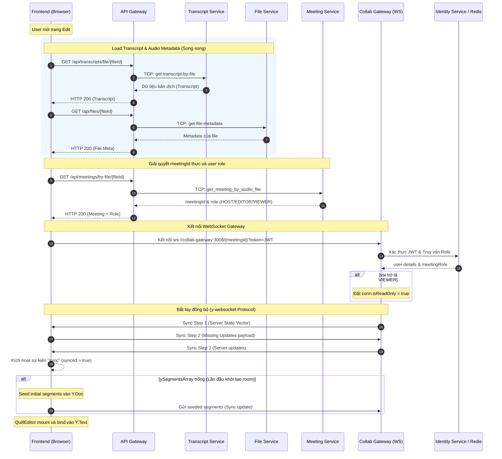
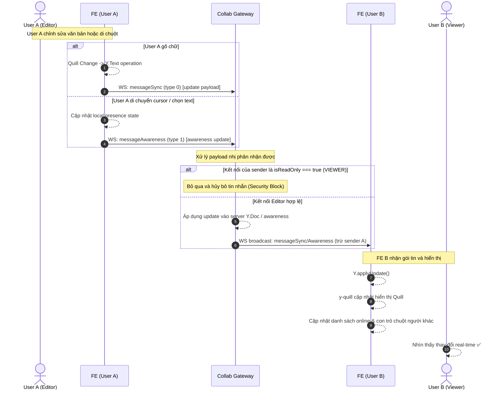

# Tài liệu triển khai Collaborative Editing — TranscriptHub

> **Phiên bản tài liệu:** 1.0  
> **Cập nhật lần cuối:** 2026-06-19  
> **Trạng thái:** Production-ready (sau debug session)

---

## Mục lục

1. [Tổng quan kiến trúc](#1-tổng-quan-kiến-trúc)
2. [Lý thuyết nền tảng — CRDT và Y.js](#2-lý-thuyết-nền-tảng--crdt-và-yjs)
3. [Luồng dữ liệu đầy đủ](#3-luồng-dữ-liệu-đầy-đủ)
4. [Collab Gateway — WebSocket Server](#4-collab-gateway--websocket-server)
5. [Collab Microservice — NestJS TCP Service](#5-collab-microservice--nestjs-tcp-service)
6. [API Gateway — HTTP Bridge](#6-api-gateway--http-bridge)
7. [Frontend — useCollab Hook & QuillEditor](#7-frontend--usecollab-hook--quilleditor)
8. [Database Schema](#8-database-schema)
9. [Xác thực & Phân quyền](#9-xác-thực--phân-quyền)
10. [Các bug đã gặp & cách fix](#10-các-bug-đã-gặp--cách-fix)
11. [Cấu hình môi trường & Docker](#11-cấu-hình-môi-trường--docker)
12. [Sequence Diagram đầy đủ](#12-sequence-diagram-đầy-đủ)

---

## 1. Tổng quan kiến trúc

Hệ thống chỉnh sửa cộng tác của TranscriptHub được xây dựng trên **3 tầng dịch vụ** độc lập:

```
┌─────────────────────────────────────────────────────────┐
│                    BROWSER (Client)                      │
│  ┌──────────────┐   ┌────────────────────────────────┐  │
│  │  useCollab   │   │       QuillEditor (y-quill)     │  │
│  │   (hook)     │   │  Quill ←──── Y.Text binding    │  │
│  │              │   │                                │  │
│  │  Y.Doc ──────┼───┤  ySegmentsArray (Y.Array)      │  │
│  │  WebSocket   │   │  doc.getText("content-{id}")   │  │
│  │  Provider    │   └────────────────────────────────┘  │
│  └──────┬───────┘                                        │
│         │ WebSocket ws://localhost:3008/{meetingId}       │
└─────────┼───────────────────────────────────────────────┘
          │
┌─────────┼───────────────────────────────────────────────┐
│         ▼        COLLAB GATEWAY (Node.js + ws)           │
│  ┌──────────────────────────────────────────────────┐   │
│  │  index.js — Pure WebSocket relay server          │   │
│  │                                                  │   │
│  │  • Xác thực JWT (local + fallback Identity HTTP) │   │
│  │  • Phân quyền vai trò từ Identity Service + Cache │   │
│  │  • Y.Doc in-memory per meetingId                 │   │
│  │  • y-protocols: sync (type 0) + awareness (type 1)│   │
│  │  • Relay doc updates và awareness updates        │   │
│  └──────────────────────────────────────────────────┘   │
│         │                    │                           │
│    Redis Cache          Identity Service HTTP            │
│  (role TTL 300s)       (role lookup + JWT verify)        │
└─────────────────────────────────────────────────────────┘

┌─────────────────────────────────────────────────────────┐
│           COLLAB MICROSERVICE (NestJS TCP)               │
│  ┌──────────────────────────────────────────────────┐   │
│  │  CollabController — MessagePattern handlers      │   │
│  │  CollabService — Business logic                  │   │
│  │  CollabRepository — Prisma DB access             │   │
│  │  MeetingGateway — TCP call sang Meeting Service  │   │
│  └──────────────────────────────────────────────────┘   │
│         │                                               │
│    PostgreSQL (transcripts schema)                      │
│  • Transcript (rawText + structuredContent JSONB)       │
│  • TranscriptVersion (snapshot history)                 │
└─────────────────────────────────────────────────────────┘
```

### Phân chia trách nhiệm

| Service | Công nghệ | Trách nhiệm |
|---------|-----------|-------------|
| **Collab Gateway** | Node.js, `ws`, `yjs`, `y-protocols` | Relay WebSocket real-time; Y.Doc CRDT in-memory |
| **Collab Microservice** | NestJS, Prisma, TCP | Lưu/lấy transcript; snapshot versioning |
| **API Gateway** | NestJS, HTTP | Bridge FE → Collab Microservice (qua TCP) |
| **Frontend** | Next.js, `y-websocket`, `y-quill` | UI editing với Y.js binding |
### Tại sao tách rời Collab Gateway thành Standalone thay vì tích hợp vào NestJS Monorepo?

Việc tách rời **Collab Gateway** (WebSocket Server chạy Node.js thuần + `ws`) thành một dịch vụ độc lập ngoài monorepo của các service NestJS chính mang lại nhiều lợi thế kỹ thuật quan trọng:

1. **Quản lý trạng thái và Bộ nhớ (Stateful vs Stateless)**:
   - Các dịch vụ trong monorepo NestJS (`api-gateway`, `meeting`, v.v.) được thiết kế theo dạng **stateless** để dễ dàng scale-out theo chiều ngang.
   - Ngược lại, **Collab Gateway** là một dịch vụ cực kỳ **stateful**. Nó duy trì các kết nối WebSocket liên tục (persistent connections) và lưu giữ toàn bộ dữ liệu tài liệu cộng tác (`Y.Doc` state vector + history) trong bộ nhớ RAM cho mỗi phòng (room). Việc gom chung một dịch vụ stateful nặng bộ nhớ vào chung cụm microservice stateless sẽ gây khó khăn lớn cho việc điều phối tải và co giãn tài nguyên độc lập.

2. **Tối ưu hóa hiệu năng và Băng thông nhị phân (Binary Protocol)**:
   - Thư viện `y-websocket` giao tiếp bằng cách truyền các luồng đệm nhị phân (`Uint8Array` chứa sync/awareness updates).
   - NestJS WebSocket Gateway (`@nestjs/websockets` sử dụng Socket.io hoặc ws adapter) áp dụng thêm các lớp bọc giao thức (wrapper layers), cơ chế serialization JSON mặc định và quản lý vòng đời Class phức tạp. Sử dụng một Node.js script thuần với thư viện `ws` giúp giảm thiểu tối đa overhead CPU, xử lý trực tiếp binary buffer cực nhanh và tối ưu hóa băng thông cho hàng vạn kết nối đồng thời.

3. **Cô lập lỗi (Fault Isolation) & Garbage Collection**:
   - Y.js quản lý cộng tác thời gian thực bằng cách liên tục đồng bộ hóa và dọn dẹp các bản cập nhật trạng thái trong bộ nhớ. Quá trình này đòi hỏi Garbage Collection (GC) của V8 engine hoạt động tích cực.
   - Nếu xảy ra sự cố rò rỉ bộ nhớ (memory leak) do kết nối treo hoặc quá tải phòng sửa đổi, chỉ duy nhất tiến trình độc lập của **Collab Gateway** bị ảnh hưởng (hoặc restart). Các service cốt lõi của NestJS như Auth, Meeting, Transcript lưu trữ vẫn hoạt động bình thường, không gây sập diện rộng.

4. **Đặc thù về Cân bằng tải (Load Balancing & Sticky Sessions)**:
   - Khi scale-out hệ thống cộng tác thời gian thực, các client trong cùng một phòng bắt buộc phải kết nối tới cùng một instance chứa dữ liệu `Y.Doc` in-memory đó (hoặc sử dụng pub/sub như Redis).
   - Việc tách riêng giúp cấu hình điều hướng Ingress (như Nginx, Kong) dễ dàng route trực tiếp traffic `/collab/*` sang cụm Collab Gateway độc lập với các quy tắc định tuyến WebSocket chuyên biệt.
### Tại sao không khai báo y-websocket (dùng raw ws) dưới dạng một service NestJS trong Monorepo?

Ngay cả khi không dùng `@nestjs/websockets` mà chỉ khởi tạo `ws` thuần túy, việc dựng một ứng dụng NestJS làm vỏ bọc (wrapper) cho **Collab Gateway** trong monorepo vẫn bộc lộ nhiều điểm hạn chế so với Node.js script độc lập:

1. **Overhead khởi tạo của NestJS (Bootstrap Memory & CPU)**:
   - Một ứng dụng NestJS khi khởi chạy bắt buộc phải tải IoC Container, quét toàn bộ decorators, phản chiếu metadata (`reflect-metadata`), khởi tạo Dependency Injection và cấu hình vòng đời module.
   - Quá trình này tiêu tốn từ **40MB - 70MB RAM ban đầu** ngay cả khi chưa nhận bất kỳ kết nối nào. Ngược lại, một Node.js script thuần chỉ cần dưới **10MB RAM** để khởi chạy. Phần tài nguyên RAM tiết kiệm được này có thể phục vụ để lưu trữ thêm hàng trăm thực thể `Y.Doc` in-memory cho các phòng họp trực tuyến.

2. **Kiến trúc NestJS không đem lại giá trị cho Relay Node**:
   - NestJS được thiết kế cực kỳ mạnh mẽ để quản lý các REST API phức tạp, DTO validation, route handlers, interceptors, và database repositories.
   - Tuy nhiên, **Collab Gateway** thực chất chỉ đóng vai trò là một **Relay Node** trung chuyển nhị phân. Nó không lưu database trực tiếp (ủy thác hoàn toàn việc lưu trữ transcript và snapshots cho **Collab Microservice** qua giao thức TCP), không cần validation DTO, cũng không cần route controllers. Việc bọc nó bằng NestJS sẽ làm phức tạp hóa mã nguồn một cách không cần thiết (over-engineering).

3. **Nguy cơ nghẽn Event Loop (Low Latency)**:
   - Do Node.js là đơn luồng (single-threaded), mọi thao tác xử lý logic đồng bộ của NestJS framework (quản lý middleware, validation, exception filters...) đều chia sẻ chung Event Loop.
   - Đối với việc truyền tải real-time nhịp độ cao như di chuột (awareness cursor) hay gõ phím liên tục, các tác vụ trung gian của NestJS có thể làm tăng độ trễ (latency) của gói tin nhị phân và tăng nguy cơ nghẽn Event Loop khi có hàng ngàn client cùng chỉnh sửa.

4. **Cô lập Dependency và Khả năng bảo trì**:
   - Thư viện Y.js và hệ sinh thái CRDT cập nhật rất nhanh. Khi tách riêng thành Node.js thuần, chúng ta hoàn toàn chủ động nâng cấp các package Y.js mà không lo ngại xung đột phiên bản TypeScript, webpack/vite/nest-cli builder của dự án chính.
   - Đặc biệt, trong tương lai nếu muốn tối ưu hóa hiệu năng cực hạn, ta có thể dễ dàng viết lại hoàn toàn **Collab Gateway** bằng **Go** hoặc **Rust** (sử dụng thư viện `y-crdt` / Rust `yjs`) và thay thế trực tiếp mà không ảnh hưởng gì tới cấu trúc monorepo NestJS của backend.

---

## 2. Lý thuyết nền tảng — CRDT và Y.js

### 2.1 CRDT là gì?

**CRDT (Conflict-free Replicated Data Type)** là cấu trúc dữ liệu cho phép nhiều người cùng chỉnh sửa một tài liệu **đồng thời** mà **không có conflict**.

Ví dụ trực quan:
```
User A (offline): "Hello World"  →  xóa "World" → "Hello "
User B (offline): "Hello World"  →  thêm "!" →  "Hello World!"

Khi 2 thay đổi merge:
  - Operational Transform (OT): cần server biết thứ tự → phức tạp
  - CRDT (Y.js):                tự động merge → "Hello !"   ✅
```

### 2.2 Y.js và cấu trúc dữ liệu

Y.js là thư viện CRDT JavaScript. TranscriptHub dùng các type sau:

```
Y.Doc  ← Root document, chứa toàn bộ shared state
├── Y.Array<Y.Map> "segments"   ← Danh sách segment metadata
│     ├── Y.Map { id, startTime, endTime, speaker }  (segment 1)
│     ├── Y.Map { id, startTime, endTime, speaker }  (segment 2)
│     └── ...
│
├── Y.Text "content-{seg-id-1}"   ← Nội dung text của segment 1
├── Y.Text "content-{seg-id-2}"   ← Nội dung text của segment 2
└── ...
```

**Quan trọng:** Tất cả `Y.Array`, `Y.Text` phải được tạo bằng `doc.getArray(name)` / `doc.getText(name)` — KHÔNG dùng `new Y.Array()` vì sẽ tạo ra "floating" instance không thuộc doc, không bao giờ sync.

### 2.3 y-websocket Protocol

`y-websocket` định nghĩa 2 loại message qua WebSocket:

```
Message Type 0 = messageSync
  ├── Sync Step 1: Client gửi state vector hiện tại → Server trả về missing updates
  ├── Sync Step 2: Server phản hồi với updates mà client chưa có
  └── Update:      Cập nhật Y.Doc (vd: user vừa gõ)

Message Type 1 = messageAwareness
  └── Awareness:   Trạng thái user hiện tại (vị trí cursor, tên, màu...)
```

**Binary format** (lib0 encoding):
```
[messageType: varuint] [payload: varuint8array]
```

---

## 3. Luồng dữ liệu đầy đủ

### 3.1 Khi user mở trang edit lần đầu

```
1. FE load dữ liệu bản dịch và metadata tệp âm thanh song song:
   ├── api.get("/transcripts/file/{fileId}") (API Gateway → Transcript Service)
   └── api.get("/files/{fileId}") (API Gateway → File Service)
2. FE giải quyết meetingId (UUID) và vai trò (role) từ audioFileId:
   └── meetingsApi.getByAudioFile(fileId) (API Gateway → Meeting Service)
       └── Trả về UUID thực của meetingId và meetingRole (HOST/EDITOR/VIEWER) của user trong meeting này.
3. useCollab hook: getOrCreateCollab(meetingId)
   └── Nếu chưa tồn tại trong Registry (Map `activeProviders` dùng để lưu trữ Singleton kết nối ở Client), tạo Y.Doc và ySegmentsArray (Y.Array) mới trong memory.
4. WebsocketProvider kết nối: ws://collab-gateway:3008/{meetingId}?token=JWT
5. Server xác thực JWT → lấy userId và thông tin tài khoản.
6. Server kiểm tra role của user trong meeting từ Identity Service (có lưu cache Redis 5 phút):
   └── Nếu role là "VIEWER", đặt cờ conn.isReadOnly = true để chặn mọi gói tin update từ client này.
7. Bắt đầu bắt tay đồng bộ dữ liệu (Sync Handshake):
   ├── Server gửi Sync Step 1 (State Vector của server) cho Client.
   ├── Client nhận, tính toán phần dữ liệu thiếu và gửi Sync Step 2 (Update) cho Server.
   ├── Server nhận, áp dụng Update vào Y.Doc của mình và gửi trả Sync Step 2 của Client.
   └── Hai bên hoàn tất đồng bộ hóa trạng thái Y.Doc.
8. Provider kích hoạt sự kiện "sync" trên Client (synced=true).
9. useCollab:
   ├── Khởi tạo trạng thái Presence của user hiện tại (ID, Tên, Màu sắc) lên awareness.
   └── Nếu ySegmentsArray trên Y.Doc trống (chưa có ai chỉnh sửa trước đó), tiến hành seed dữ liệu ban đầu từ database (transcript.segments).
10. QuillEditor mount → bind từng đoạn Quill Editor tương ứng với Y.Text ("content-{segmentId}").
11. User nhìn thấy nội dung hoàn chỉnh và danh sách những người đang online kèm con trỏ chuột thời gian thực.
```



### 3.2 Khi user gõ chữ hoặc di chuyển con trỏ chuột

```
1. User tương tác trên màn hình:
   ├── User gõ chữ: Quill phát sự kiện → QuillBinding chuyển đổi Quill Delta thành Y.Text operation.
   └── User di chuột/chọn văn bản: awareness.setLocalState() cập nhật cursor.
2. Y.Doc cập nhật trạng thái local.
3. WebsocketProvider tự động đóng gói sự kiện:
   ├── Với thay đổi văn bản: [type=0 (messageSync)][payload binary update]
   └── Với di chuột/presence: [type=1 (messageAwareness)][payload binary update]
4. Gửi qua kết nối WebSocket tới Collab Gateway.
5. Collab Gateway nhận gói tin nhị phân và kiểm tra:
   ├── Nếu connection có isReadOnly === true (VIEWER): Bỏ qua gói tin, không áp dụng (bảo vệ phía backend).
   └── Nếu hợp lệ:
       ├── Với sync update: readSyncMessage() áp dụng vào server Y.Doc và broadcast update tới các clients khác trong phòng.
       └── Với awareness update: applyAwarenessUpdate() cập nhật danh sách người dùng và broadcast tới các clients khác.
6. Các Client khác nhận gói tin cập nhật:
   ├── Y.Doc áp dụng update → y-quill phát hiện và hiển thị thay đổi văn bản thời gian thực.
   └── Awareness áp dụng update → hiển thị danh sách người dùng online và vị trí con trỏ chuột động của người khác.
```



### 3.3 Khi user bấm "Lưu" (Save Snapshot)

```
1. FE gọi hàm saveSnapshot() từ useCollab hook.
2. hook đọc toàn bộ ySegmentsArray, trích xuất rawText và structuredContent (các segments kèm delta của Quill).
3. Gửi request POST /api/collab/transcript qua axios client:
   └── payload: { meetingId, rawText, structuredContent }
4. Next.js Route Handler / proxy chuyển tiếp đến API Gateway tại cổng :3000/api/v1/collab/transcript.
5. API Gateway: JwtIdentityGuard giải mã token → CollabController.saveTranscript() nhận payload.
6. CollabService.saveTranscript(meetingId, rawText, structuredContent):
   ├── Gọi meetingGateway.getAudioFileId(meetingId) qua giao thức TCP sang Meeting Service để lấy audioFileId.
   ├── Gọi collabRepository.updateTranscript(audioFileId, { rawText, structuredContent }).
   └── Prisma thực hiện update bản ghi trong bảng `Transcript` của PostgreSQL.
7. Database hoàn thành lưu trữ trạng thái bản dịch mới nhất.
```

```mermaid
sequenceDiagram
    autonumber
    participant FE as Frontend (Browser)
    participant NEXT as Next.js API Proxy
    participant APIGW as API Gateway
    participant CS as Collab Service
    participant MS as Meeting Service
    database DB as PostgreSQL (Prisma)

    Note over FE: User click nút "Lưu thay đổi"
    FE-->>FE: read ySegmentsArray -> construct rawText & structuredContent
    FE->>NEXT: POST /api/collab/transcript [Bearer JWT]
    NEXT->>APIGW: POST /api/v1/collab/transcript [Bearer JWT]
    Note over APIGW: JwtIdentityGuard giải mã và kiểm tra JWT
    APIGW->>CS: TCP: save-transcript { meetingId, rawText, structuredContent }
    CS->>MS: TCP: get-audioFileId { meetingId }
    MS-->>CS: Trả về audioFileId thực
    CS->>DB: collabRepository.updateTranscript(audioFileId, ...)
    Note over DB: Cập nhật rawText & structuredContent trong db
    DB-->>CS: OK
    CS-->>APIGW: OK
    APIGW-->>NEXT: HTTP 200 OK
    NEXT-->>FE: HTTP 200 OK
    Note over FE: Hiển thị thông báo lưu thành công ✅
```

---

## 4. Collab Gateway — WebSocket Server

**Path:** `services_ms/apps/collab-gateway/src/`

### 4.1 Cấu trúc thư mục

```
collab-gateway/
├── src/
│   ├── index.js              # Entry point — WS server chính
│   ├── middleware/
│   │   ├── auth.js           # JWT verification
│   │   └── role.js           # Role lookup với Redis cache
│   ├── services/
│   │   ├── identity.js       # HTTP calls đến Identity Service
│   │   ├── redis.js          # Redis client (ioredis)
│   │   └── collab.js         # (legacy) HTTP client đến Collab Service
│   └── utils/
│       └── logger.js         # Structured logging
├── Dockerfile
└── package.json
```

### 4.2 `index.js` — Chi tiết giải thích

```javascript
// === CONSTANTS ===
const messageSync = 0;        // y-websocket protocol: sync (step1/step2/update)
const messageAwareness = 1;   // y-websocket protocol: awareness state

// === DOC STORE ===
// Mỗi meetingId có 1 Y.Doc riêng, tồn tại trong memory suốt session
const docs = new Map();
// Structure: Map<meetingId, { doc: Y.Doc, awareness: Awareness, connections: Set<WebSocket> }>

function getOrCreateDoc(meetingId) {
  if (!docs.has(meetingId)) {
    const doc = new Y.Doc();
    doc.gc = true; // Enable garbage collection cho Y.Doc
    docs.set(meetingId, {
      doc,
      awareness: new awarenessProtocol.Awareness(doc),
      connections: new Set(),
    });
  }
  return docs.get(meetingId);
}
```

#### Xử lý kết nối mới

```javascript
wss.on('connection', async (conn, req) => {
  // 1. Parse URL — y-websocket gửi room qua PATH, không phải query param!
  //    Sai:  url.searchParams.get('meetingId')  → luôn null
  //    Đúng: url.pathname.replace(/^\//, '')
  const url = new URL(req.url, `http://${req.headers.host}`);
  const token = url.searchParams.get('token');
  const meetingId = url.pathname.replace(/^\//, '');
  //    VD: ws://host/6aeb0839-...?token=eyJ...
  //    → meetingId = "6aeb0839-..."
  //    → token = "eyJ..."

  // 2. Xác thực JWT
  const user = await authMiddleware(token);
  if (!user) { conn.close(4001, 'Unauthorized'); return; }

  // 3. Lấy role (cache Redis 300s)
  const role = await roleMiddleware(meetingId, user.id);

  // 4. Setup connection
  conn.awarenessClientIDs = new Set(); // Track Y.js clientIDs để cleanup đúng khi disconnect
  docEntry.connections.add(conn);

  // 5. Đăng ký event handlers
  docEntry.awareness.on('change', awarenessHandler);
  docEntry.doc.on('update', updateHandler);
  conn.on('message', (rawMessage) => handleMessage(...));
  conn.on('close', () => cleanup());

  // 6. Gửi sync step 1 ngay cho client mới
  sendSyncStep1(conn, docEntry.doc);

  // 7. Gửi awareness states hiện tại của các clients khác
  sendCurrentAwarenessToNewClient(conn, docEntry);
});
```

#### Xử lý message inbound

```javascript
function handleMessage(conn, docEntry, message) {
  const decoder = decoding.createDecoder(message);
  const messageType = decoding.readVarUint(decoder);  // đọc byte đầu tiên

  switch (messageType) {
    case 0: // messageSync
      // readSyncMessage xử lý cả 3 sub-types:
      //   - syncStep1: gửi lại syncStep2 (missing updates)
      //   - syncStep2: apply updates nhận được
      //   - syncUpdate: apply doc update
      const encoder = encoding.createEncoder();
      encoding.writeVarUint(encoder, 0); // respond cũng là messageSync
      syncProtocol.readSyncMessage(decoder, encoder, docEntry.doc, null);
      if (encoding.length(encoder) > 1) conn.send(encoding.toUint8Array(encoder));
      break;

    case 1: // messageAwareness
      const update = decoding.readVarUint8Array(decoder);
      // Track clientIDs để cleanup khi disconnect
      trackAwarenessClientIDs(conn, update);
      // Apply và trigger 'change' event → broadcast đến clients khác
      awarenessProtocol.applyAwarenessUpdate(docEntry.awareness, update, conn);
      break;
  }
}
```

#### Tại sao phải track `awarenessClientIDs`?

```javascript
// Y.js awareness dùng clientID (số int), KHÔNG phải userId (database)
// Khi disconnect, phải remove đúng clientID:
conn.on('close', () => {
  awarenessProtocol.removeAwarenessStates(
    docEntry.awareness,
    [...conn.awarenessClientIDs],  // ← phải là Y.js clientIDs
    conn
  );
});

// Sai (bug cũ): removeAwarenessStates(awareness, [conn.userId], conn)
// → Không tìm thấy state nào → "ghost" users xuất hiện mãi không mất
```

### 4.3 `middleware/auth.js`

```javascript
// Xác thực 2 lớp:
// 1. Verify JWT local (nhanh, không cần network)
// 2. Nếu local fail → fallback HTTP đến Identity Service (chậm hơn, 3s timeout)

export async function authMiddleware(token) {
  const response = await identityService.verifyToken(token);
  if (!response.success) return null;
  return response.data; // { id: number, email: string }
}
```

### 4.4 `middleware/role.js`

```javascript
// Cache role trong Redis với TTL 300s (5 phút)
// Tránh gọi HTTP đến Identity Service mỗi lần user kết nối

const ROLE_CACHE_TTL = 300; // seconds

export async function roleMiddleware(meetingId, userId) {
  const cacheKey = `meeting:${meetingId}:user:${userId}:role`;
  
  const cachedRole = await redisService.get(cacheKey);
  if (cachedRole) return cachedRole; // Cache HIT
  
  const role = await identityService.getMeetingRole(meetingId, userId);
  await redisService.set(cacheKey, role, ROLE_CACHE_TTL);
  return role; // "HOST" | "EDITOR" | "VIEWER"
}
```

---

## 5. Collab Microservice — NestJS TCP Service

**Path:** `services_ms/apps/collab/src/`

### 5.1 Kiến trúc NestJS

Service này chạy trên **TCP transport** (không phải HTTP). Không có REST API riêng — chỉ nhận message từ API Gateway qua `ClientProxy`.

```
TCP Port 3007 (COLLAB_SERVICE_TCP_PORT)
         │
    CollabController (@MessagePattern)
         │
    CollabService (business logic)
         │
    CollabRepository (Prisma)     +    MeetingGateway (TCP → Meeting Service)
         │
    PostgreSQL (schema: transcripts)
```

### 5.2 `collab.controller.ts` — MessagePattern handlers

```typescript
@Controller()
export class CollabController {
  // API Gateway gửi: this.collabClient.send('save-transcript', { meetingId, rawText, structuredContent, userId })
  @MessagePattern('save-transcript')
  async saveTranscript(
    @Payload()
    payload: {
      meetingId: string;
      rawText: string;
      structuredContent: any;
      userId: number;
    },
  ) {
    return this.collabService.saveTranscript(
      payload.meetingId,
      payload.rawText,
      payload.structuredContent,
      payload.userId,
    );
  }

  @MessagePattern('get-transcript')
  async getTranscript(@Payload() payload: { meetingId: string }) {
    return this.collabService.getTranscript(payload.meetingId);
  }

  @MessagePattern('create-snapshot')
  async createSnapshot(
    @Payload()
    payload: {
      meetingId: string;
      userId: number;
      versionName: string;
    },
  ) {
    const result = await this.collabService.createSnapshot(
      payload.meetingId,
      payload.userId,
      payload.versionName,
    );
    return {
      versionId: result.id,
      message: 'Snapshot created successfully',
    };
  }

  @MessagePattern('get-versions')
  async getVersions(@Payload() payload: { meetingId: string }) {
    return this.collabService.getVersions(payload.meetingId);
  }

  @MessagePattern('get-version-detail')
  async getVersionDetail(@Payload() payload: { versionId: number }) {
    return this.collabService.getVersionDetail(payload.versionId);
  }

  @MessagePattern('restore-version')
  async restoreVersion(
    @Payload() payload: { meetingId: string; versionId: number },
  ) {
    return this.collabService.restoreVersion(
      payload.meetingId,
      payload.versionId,
    );
  }
}
```

### 5.3 `collab.service.ts` — Business logic

```typescript
async saveTranscript(
  meetingId: string,
  rawText: string,
  structuredContent: any,
  userId: number,
) {
  // 1. Lấy audioFileId từ meetingId qua Meeting Service (TCP)
  const audioFileId = await this.meetingGateway.getAudioFileId(meetingId);

  // 2. Cập nhật bảng Transcript chính
  const updatedTranscript = await this.collabRepository.updateTranscript(audioFileId, {
    rawText,
    structuredContent,
  });

  // 3. Tự động tạo một snapshot lưu lịch sử vào bảng TranscriptVersion
  const timestampStr = new Date().toLocaleTimeString('vi-VN', {
    hour: '2-digit',
    minute: '2-digit',
    second: '2-digit',
  }) + ' ' + new Date().toLocaleDateString('vi-VN');
  const versionName = `Bản lưu - ${timestampStr}`;

  await this.collabRepository.createTranscriptVersion({
    transcriptId: updatedTranscript.id,
    versionName,
    rawText: updatedTranscript.rawText,
    structuredContent: updatedTranscript.structuredContent,
    createdById: userId,
  });

  return updatedTranscript;
}

async createSnapshot(meetingId: string, userId: number, versionName: string) {
  const audioFileId = await this.meetingGateway.getAudioFileId(meetingId);
  const transcript = await this.collabRepository.findTranscriptByAudioFileId(audioFileId);
  if (!transcript) throw new Error('Transcript not found');

  // Tạo bản snapshot (version) thủ công
  return this.collabRepository.createTranscriptVersion({
    transcriptId: transcript.id,
    versionName,
    rawText: transcript.rawText,
    structuredContent: transcript.structuredContent,
    createdById: userId,
  });
}
```

### 5.4 `gateways/meeting.gateway.ts` — Inter-service communication

```typescript
@Injectable()
export class MeetingGateway {
  constructor(@Inject('MEETING_CLIENT') private readonly meetingClient: ClientProxy) {}

  async getAudioFileId(meetingId: string): Promise<string> {
    // Gọi TCP → Meeting Service với MessagePattern 'get-audioFileId'
    const response = await lastValueFrom(
      this.meetingClient.send('get-audioFileId', { meetingId })
    );
    if (!response?.audioFileId) throw new Error('Failed to get audioFileId');
    return response.audioFileId;
  }
}
```

---

## 6. API Gateway — HTTP Bridge

**Path:** `services_ms/apps/api-gateway/src/collab/`

API Gateway expose HTTP endpoints để FE gọi qua Next.js proxy.

### 6.1 Collab endpoints trong API Gateway

```typescript
@ApiTags('Collab')
@ApiBearerAuth()
@UseGuards(JwtIdentityGuard)  // ← Bắt buộc Bearer token
@Controller('v1/collab')
export class CollabController {
  @Post('transcript')          // POST /api/v1/collab/transcript
  saveTranscript(@Body() dto: SaveTranscriptDto, @Req() req: any) {
    return this.collabService.saveTranscript(dto.meetingId, dto.rawText, dto.structuredContent);
  }

  @Post('snapshot')            // POST /api/v1/collab/snapshot
  createSnapshot(...) { ... }

  @Get(':meetingId/versions')  // GET /api/v1/collab/{meetingId}/versions
  getVersions(...) { ... }

  @Post('restore')             // POST /api/v1/collab/restore
  restoreVersion(...) { ... }
}
```

### 6.2 Next.js Proxy (FE → API Gateway)

File: `fe_next/next.config.ts`

```typescript
async rewrites() {
  const gatewayUrl = process.env.API_GATEWAY_URL ?? "http://localhost:3000";
  return [
    // FE gọi /api/collab/* → Gateway nhận /api/v1/collab/*
    {
      source: "/api/collab/:path*",
      destination: `${gatewayUrl}/api/v1/collab/:path*`,
    },
    // Các service khác tương tự...
    { source: "/api/meetings/:path*", destination: `${gatewayUrl}/api/v1/meetings/:path*` },
    { source: "/api/users/:path*",    destination: `${gatewayUrl}/api/users/:path*` },
    // ...
  ];
}
```

**Lý do dùng proxy:** Tránh CORS. Browser → Next.js (same origin) → NestJS. NestJS không cần cấu hình CORS vì giao tiếp là server-to-server.

---

## 7. Frontend — useCollab Hook & QuillEditor

### 7.1 `useCollab` hook — `fe_next/hooks/use-collab.ts`

Hook trung tâm quản lý toàn bộ collab state, thiết lập kết nối, đồng bộ dữ liệu Y.js và quản lý hiện diện của người dùng.

#### 7.1.1 Singleton Pattern & Cơ chế Đồng bộ State (Pub/Sub)

##### A. Thiết kế Singleton Pattern
Trong React, mỗi khi component chứa hook này re-render (do state hoặc props thay đổi), toàn bộ mã lệnh của hook `useCollab` sẽ chạy lại từ đầu đến cuối. Nếu không kiểm soát, mỗi lần gõ phím sẽ kích hoạt việc khởi tạo lại kết nối WebSocket mới, làm sập server và crash trình duyệt.
Do đó, hook áp dụng mẫu thiết kế **Singleton** ở hai cấp độ:
1.  **Component Level (useRef)**: Sử dụng `collabRef = useRef<CollabInstance | null>(null)` và kiểm tra `if (!collabRef.current)`. Vì giá trị của `useRef` được React giữ nguyên qua các lần re-render, thực thể collab chỉ được tạo ra đúng **1 lần duy nhất** khi component mount.
2.  **Global Level (activeProviders)**: Quản lý một `Map<string, CollabInstance>` đóng vai trò registry. Nếu có nhiều components khác nhau cùng tham gia một phòng họp, chúng sẽ dùng chung một kết nối duy nhất thay vì tạo kết nối thừa.

```typescript
const activeProviders = new Map<string, CollabInstance>();

function getOrCreateCollab(meetingId: string): CollabInstance {
  if (!activeProviders.has(meetingId)) {
    const doc = new Y.Doc();
    const ySegmentsArray = doc.getArray<Y.Map<any>>("segments");
    // Setup providers, subscribers...
    activeProviders.set(meetingId, instance);
  }
  return activeProviders.get(meetingId)!;
}
```

##### B. Cơ chế Đồng bộ State qua Pub/Sub (`subscribers`)
Vì Y.js hoạt động độc lập với React state và lưu trữ dữ liệu dưới dạng các cấu trúc dữ liệu CRDT nội bộ, chúng ta cần một cơ chế để đồng bộ hóa và thông báo cho React render lại giao diện bất cứ khi nào Y.js có cập nhật:
*   **`subscribers`**: Là một `Set<() => void>` chứa các hàm callback cần kích hoạt khi dữ liệu thay đổi.
*   **Hàm `fn` đăng ký**: Chính là hàm `updateState` nằm bên trong `useCollab`. Hàm này có nhiệm vụ lấy dữ liệu segments mới nhất từ Y.js (`collab.buildSegments()`), danh sách user online từ `awareness` và gọi `setState(...)` của React để kích hoạt re-render UI.
*   **`notifySubscribers`**: Duyệt qua Set và thực thi tất cả hàm `fn()` để đồng loạt thông báo cho các hook đang lắng nghe cập nhật lại giao diện.

---

#### 7.1.2 Kết nối WebSocket với StrictMode guard

React StrictMode ở môi trường Development sẽ giả lập việc unmount và mount lại component ngay lập tức (Mount $\rightarrow$ Unmount $\rightarrow$ Mount) để kiểm tra các lỗi rò rỉ bộ nhớ.
Để tránh việc đóng và mở kết nối WebSocket liên tục trong vài mili-giây, hook sử dụng biến đếm `_mountedCount` kết hợp với bộ trì hoãn `setTimeout 150ms` khi ngắt kết nối:

```typescript
useEffect(() => {
  if (!collab) return;

  // Hủy tiến trình ngắt kết nối đang chờ (nếu có từ StrictMode unmount trước)
  if (collab._disconnectTimer) {
    clearTimeout(collab._disconnectTimer);
    collab._disconnectTimer = null;
  }

  collab._mountedCount++;
  collab.connect(); // Mở kết nối WebSocket (hoặc tái sử dụng nếu đã mở)

  return () => {
    collab._mountedCount--;
    if (collab._mountedCount <= 0) {
      // Trì hoãn 150ms trước khi thực sự ngắt kết nối
      collab._disconnectTimer = setTimeout(() => {
        if (collab._mountedCount <= 0) {
          activeProviders.delete(meetingId);
          collab.disconnect(); // Đóng kết nối WebSocket và destroy provider
        }
        collab._disconnectTimer = null;
      }, 150);
    }
  };
}, [collab, meetingId]);
```

---

#### 7.1.3 Seeding dữ liệu ban đầu (post-sync)

##### A. Tại sao phải chờ Sync hoàn tất mới Seed?
Dữ liệu của TranscriptHub ban đầu nằm tĩnh dưới Database. Khi một cuộc họp lần đầu tiên được mở để chỉnh sửa cộng tác, Y.Doc trên WebSocket server hoàn toàn trống rỗng.
*   **Nếu nạp dữ liệu trước khi sync**: Client mở tab mới $\rightarrow$ thấy Y.Doc cục bộ rỗng $\rightarrow$ vội vã nạp segments từ DB $\rightarrow$ WebSocket kết nối thành công và tải dữ liệu cũ từ server về $\rightarrow$ Y.js tự động merge dữ liệu cũ và dữ liệu mới nạp $\rightarrow$ Gây ra hiện tượng **trùng lặp bản ghi (duplicate segments)** trên giao diện.
*   **Chờ sync hoàn tất**: Chờ sự kiện `"sync"` của `WebsocketProvider` kích hoạt (`isSynced === true`). Khi đó client đã biết chính xác server đang có dữ liệu hay không. Chỉ khi mảng `ySegmentsArray.length === 0` (server trống), ta mới tiến hành nạp dữ liệu ban đầu từ DB.

##### B. Ý nghĩa của `doc.transact(...)`
Khi nạp dữ liệu (seed), chúng ta phải đẩy hàng chục segment và text vào tài liệu. Nếu làm điều này theo cách thông thường, mỗi thay đổi nhỏ sẽ kích hoạt sự kiện cập nhật (`observe`), khiến React re-render liên tục và gửi hàng chục gói tin WebSocket nhỏ lên server.
*   `doc.transact(() => { ... })` gộp toàn bộ các thao tác chèn dữ liệu bên trong nó thành **một transaction duy nhất**.
*   **Lợi ích**: Tối ưu hiệu năng render (React chỉ vẽ lại UI 1 lần duy nhất sau khi nạp xong) và tối ưu băng thông mạng (chỉ gửi đúng 1 frame WebSocket chứa toàn bộ dữ liệu seed).

```typescript
provider.on("sync", (isSynced: boolean) => {
  if (isSynced && instance._pendingSeeds && ySegmentsArray.length === 0) {
    const seeds = instance._pendingSeeds;
    instance._pendingSeeds = null;
    
    // Gộp tất cả hành động thêm segments vào 1 transaction duy nhất
    doc.transact(() => {
      seeds.forEach((s) => {
        const meta = new Y.Map<any>();
        meta.set("id", s.id);
        meta.set("startTime", s.startTime);
        meta.set("endTime", s.endTime);
        meta.set("speaker", s.speaker);
        ySegmentsArray.push([meta]);
        
        const yText = doc.getText(`content-${s.id}`);
        if (yText.length === 0) yText.insert(0, s.content ?? "");
      });
    });
  }
  notifySubscribers();
});
```

---

#### 7.1.4 Awareness — Hiển thị user đang online

```typescript
// Trong connect():
const userInfo: CollabUser = {
  id: session.user?.id ?? "",
  name: session.user?.name ?? "Unknown",
  email: session.user?.email ?? "",
  color: pickColor(session.user?.id ?? meetingId),
};
// PHẢI gọi setLocalState để server và clients khác biết user này đang online
// Nếu không gọi → awareness luôn rỗng → không thấy ai đang sửa
provider.awareness.setLocalState({ user: userInfo });

// Đọc awareness của users khác:
p.awareness.getStates().forEach((state) => {
  if (state.user) users.push(state.user as CollabUser);
});
```

---

#### 7.1.5 Phân quyền thành viên & API Tra cứu Cuộc họp

##### A. Phân biệt Quyền hạn Hệ thống (Identity Role) và Quyền hạn Cuộc họp (Meeting Role)
*   **System Role (`session.user.role`)**: Là vai trò đăng nhập của tài khoản trên hệ thống (ví dụ: `ADMIN`, `USER`). Role này không quyết định quyền hạn chỉnh sửa tài liệu của một cuộc họp cụ thể.
*   **Meeting Role (`meetingRole`)**: Là quyền hạn của thành viên trong cuộc họp đó (ví dụ: `HOST`, `EDITOR`, `VIEWER`). Khi thiết lập `WebsocketProvider`, Frontend truyền token và lấy vai trò này để truyền vào collab instance. Quyền hạn `canEdit` được thiết lập dựa trên `role !== 'VIEWER'`.

##### B. API Tra cứu Cuộc họp trực tiếp bằng Audio File ID
Trước đây, Frontend không có API để tra cứu cuộc họp từ ID file âm thanh, buộc phải lấy danh sách tất cả cuộc họp về và lọc ở Client. 
Hiện tại, hệ thống đã bổ sung API trực tiếp ở backend và tích hợp vào Frontend:

```typescript
// Gọi API lấy thông tin cuộc họp trực tiếp bằng audioFileId (fileId trong URL)
useEffect(() => {
  meetingsApi.getByAudioFile(fileId)
    .then(async (meeting: any) => {
      if (!meeting?.id) return;
      setMeetingId(meeting.id); // Lấy UUID của cuộc họp làm room key

      // Tra cứu quyền của user hiện tại trong cuộc họp
      try {
        const members: any[] = await meetingsApi.getMembers(meeting.id);
        const currentUserId = parseInt((session?.user as any)?.id ?? "0", 10);
        const myMember = members.find((m: any) => m.userId === currentUserId);
        if (myMember?.role) setMeetingRole(myMember.role);
      } catch {
        // Fallback VIEWER nếu có lỗi xảy ra
      }
    })
    .catch(() => { /* Fallback: dùng fileId làm room key, quyền VIEWER */ });
}, [fileId, session?.user]);
```

---

#### 7.1.6 Lưu Snapshot về Database (`saveSnapshot`)

Khi người dùng thực hiện lưu bản ghi, chúng ta cần chuyển đổi cấu trúc dữ liệu in-memory Y.js sang các dạng dữ liệu lưu trữ truyền thống:
1.  **Dạng văn bản thô (`rawText`)**: Nối các đoạn thoại lại với nhau dạng `[Người nói] Nội dung` để lưu log hoặc xuất file `.txt`.
2.  **Dạng cấu trúc JSON (`structuredContent`)**: Giữ nguyên thông tin id, thời gian, người nói, và Quill Delta để render lại editor.
3.  **Cầu nối HTTP $\rightarrow$ TCP**: FE gọi API Gateway qua giao thức HTTP (đường dẫn `/api/collab/transcript`). API Gateway sẽ kiểm tra token của người dùng và forward tiếp dữ liệu này xuống **Collab Microservice** thông qua cổng truyền thông nội bộ **TCP**.
    *   *Lưu ý*: Frontend không thể gửi trực tiếp dữ liệu đến cổng microservice `3007` vì trình duyệt không hỗ trợ gửi raw TCP sockets trực tiếp tới cổng nội bộ này.

```typescript
const saveSnapshot = useCallback(async () => {
  if (!collab || !meetingId) return false;

  const segs = collab.buildSegments();
  const rawText = segs.map((s) => `[${s.speaker}] ${s.content}`).join("\n");
  const structuredContent = {
    segments: segs.map((s) => ({
      id: s.id,
      startTime: s.startTime,
      endTime: s.endTime,
      speaker: s.speaker,
      text: s.content,
      delta: s.delta,
    })),
  };

  try {
    // Gọi qua API Gateway HTTP
    await collabApi.saveTranscript({ meetingId, rawText, structuredContent });
    return true;
  } catch {
    return false;
  }
}, [collab, meetingId]);
```

---

#### 7.1.7 Vòng đời hoạt động của useCollab (Hook Lifecycle)

1.  **Mount & Render lần đầu**: Khởi tạo React state, lấy hoặc tạo mới `CollabInstance` duy nhất (Singleton). Trả về dữ liệu để vẽ UI thô (Connected: false).
2.  **Đăng ký & Mở kết nối**: Chạy `useEffect` đăng ký subscriber (hàm `updateState`). Đồng thời gọi `collab.connect()` để bắt đầu bắt tay (handshake) qua WebSocket, đính kèm token xác thực.
3.  **Sync & Seed**: Khi bắt tay hoàn tất, sự kiện `sync` được kích hoạt. Nếu Y.Doc trên server trống, thực hiện nạp dữ liệu (`doc.transact`) từ Database. Re-render UI để hiển thị văn bản hoàn chỉnh.
4.  **Chạy Real-time**: Khi có bất kỳ thay đổi nào từ phía local hoặc nhận từ socket server, YJS gọi subscriber `updateState` $\rightarrow$ React gọi `setState()` $\rightarrow$ re-render UI cập nhật ký tự gõ.
5.  **Unmount**: Khi người dùng đóng trang, số lượng mount giảm. Bộ đếm trì hoãn 150ms chạy, nếu không mount lại, hệ thống sẽ giải phóng tài nguyên (`provider.destroy()`) và ngắt kết nối WebSocket hoàn toàn.

---

#### 7.1.8 Cơ chế tự động lưu khi đạt 10 thay đổi (Auto-Save on 10 Edits)

Hệ thống cung cấp cơ chế tự động lưu bản dịch mỗi khi người dùng đang thao tác tại client hiện tại thực hiện đủ **10 thay đổi** (gõ/xóa ký tự, hoàn tác, sửa segment,...).

*   **Bộ lọc thay đổi cục bộ**: Lắng nghe sự kiện `doc.on("update", (update, origin) => ...)` trên `Y.Doc`. Gói tin nhận về từ kết nối WebSocket (sự thay đổi của những người dùng khác) sẽ có `origin === collab.provider`. Do đó ta chỉ đếm các thay đổi có `origin !== collab.provider`.
*   **Kích hoạt lưu**: Mỗi khi biến đếm đạt mốc 10, hệ thống tự động reset biến đếm về 0 và gọi hàm `saveSnapshot()` để đồng bộ hóa bản ghi hiện tại xuống PostgreSQL và ghi nhận một phiên bản lưu trữ mới.

```typescript
useEffect(() => {
  if (!collab || !meetingId) return;

  let changeCount = 0;
  const handleUpdate = (update: Uint8Array, origin: any) => {
    // Bỏ qua các update nhận về từ WebSocket (thay đổi của người dùng khác)
    if (collab.provider && origin === collab.provider) return;

    changeCount++;
    if (changeCount >= 10) {
      changeCount = 0;
      console.log("[Collab] Đạt mốc 10 thay đổi nội bộ, tự động lưu phiên bản...");
      saveSnapshot();
    }
  };

  collab.doc.on("update", handleUpdate);
  return () => {
    collab.doc.off("update", handleUpdate);
  };
}, [collab, meetingId, saveSnapshot]);
```

---

#### 7.1.9 Lịch sử phiên bản & Phục hồi qua Yjs Transactions (Rollback Flow)

Khi người dùng thực hiện khôi phục (rollback) dữ liệu về một phiên bản lịch sử:
1.  **Giao tiếp HTTP**: Client gửi yêu cầu khôi phục thông qua API `collabApi.restoreVersion({ meetingId, versionId })`.
2.  **Khôi phục Database**: Backend cập nhật dữ liệu của phiên bản cũ đè lên bản ghi transcript chính trong cơ sở dữ liệu PostgreSQL.
3.  **Khôi phục thời gian thực (Y.Doc Sync)**: Để tránh tình trạng dữ liệu DB đã lùi nhưng màn hình của các người dùng khác đang kết nối WebSocket không cập nhật (do Y.Doc memory trên server/client chưa thay đổi), client thực hiện khôi phục phải cập nhật cục bộ Y.Doc trong một transaction:
    *   Xóa toàn bộ segments cũ trên mảng Yjs: `ySegmentsArray.delete(...)`.
    *   Tái tạo lại các mảng segment và văn bản Y.Text tương ứng từ dữ liệu của phiên bản được khôi phục.
    *   Thay đổi này sẽ tự động đóng gói dưới dạng `messageSync` gửi lên Collab Gateway để broadcast và cập nhật tức thời màn hình của tất cả các cộng tác viên khác trong phòng.

```typescript
const restoreVersion = useCallback(async (versionId: number) => {
  if (!collab || !meetingId) return false;
  try {
    const restored = await collabApi.restoreVersion({ meetingId, versionId });
    if (restored && restored.structuredContent?.segments) {
      // Cập nhật Yjs document ở local để đồng bộ tới tất cả client trong phòng
      collab.doc.transact(() => {
        // Xóa sạch segments hiện tại
        collab.ySegmentsArray.delete(0, collab.ySegmentsArray.length);

        // Nạp lại các segment từ dữ liệu khôi phục
        restored.structuredContent.segments.forEach((s: any) => {
          const meta = new Y.Map<any>();
          meta.set("id", s.id);
          meta.set("startTime", s.startTime);
          meta.set("endTime", s.endTime);
          meta.set("speaker", s.speaker);
          collab.ySegmentsArray.push([meta]);

          const yText = collab.doc.getText(`content-${s.id}`);
          yText.delete(0, yText.length);
          yText.insert(0, s.text ?? "");
        });
      });
      return true;
    }
    return false;
  } catch (err) {
    console.error("[Collab] Phục hồi phiên bản thất bại:", err);
    return false;
  }
}, [collab, meetingId]);
```

---

#### 7.1.10 Tách biệt component giao diện Lịch sử (`TranscriptHistoryModal`)

Nhằm tối ưu hóa hiệu năng render, tránh phình to mã nguồn trang chỉnh sửa chính [page.tsx](file:///d:/VDT_Tucode/VDT_miniproject_TranscriptHub/fe_next/app/%28dashboard%29/transcripts/%5BfileId%5D/edit/page.tsx) (vốn đã dài hơn 600 dòng code), toàn bộ giao diện và logic quản lý modal lịch sử đã được tách thành một component riêng biệt: [TranscriptHistoryModal.tsx](file:///d:/VDT_Tucode/VDT_miniproject_TranscriptHub/fe_next/components/transcript/TranscriptHistoryModal.tsx).

*   **Trách nhiệm của trang cha (`page.tsx`)**: Chỉ lưu trữ duy nhất 1 cờ trạng thái bật/tắt modal `showHistoryModal` và cung cấp các hàm API call từ `useCollab` xuống cho modal.
*   **Trách nhiệm của Modal Component**:
    *   Tự quản lý các trạng thái nội bộ: danh sách phiên bản (`versions`), chi tiết phiên bản đang chọn (`selectedVersion`), các trạng thái loading danh sách/chi tiết, và trạng thái hiển thị popup xác nhận khôi phục (`showConfirmRestore`).
    *   Render giao diện chia làm hai phần (Bên trái: danh sách 10 phiên bản gần nhất kèm thông tin người sửa và thời gian sửa; Bên phải: Panel xem trước nội dung chi tiết từng segment).
    *   Enforce kiểm tra xác nhận từ phía người dùng (Confirm Popup) trước khi thực thi lùi dữ liệu tránh thao tác nhầm.

---


### 7.2 `QuillEditor` component — `fe_next/components/transcript/QuillEditor.tsx`

#### 7.2.1 Tại sao dùng Quill?

- **Quill** là rich text editor với Delta format (array of ops)
- **y-quill** (`QuillBinding`) tự động sync giữa Quill Delta và Y.Text CRDT
- Không cần xử lý conflict thủ công — Y.js lo hết

#### 7.2.2 Design pattern: deps array

```typescript
useEffect(() => {
  // Khởi tạo Quill và bind với Y.Text
  init();

  return () => {
    // Cleanup: destroy binding, clear DOM
  };
}, [segmentId, canEdit]); 
// ↑ CHỈ 2 deps này — KHÔNG có getYText, initialContent

// Lý do KHÔNG để getYText, initialContent trong deps:
// - Mỗi khi Y.js sync → parent re-render → initialContent thay đổi
// - Nếu initialContent trong deps → effect re-run → Quill mới được tạo và append vào DOM
// - Kết quả: 5, 10, 20 toolbars chồng nhau trong 1 segment!
// Fix: dùng useRef cho getYText và initialContent (stable reference)

const getYTextRef = useRef(getYText);
getYTextRef.current = getYText; // Luôn trỏ đến latest function
```

#### 7.2.3 Binding workflow

```typescript
const tryBind = () => {
  const yText = getYTextRef.current(segmentId);
  if (yText) {
    // Y.Text đã sẵn sàng → bind ngay
    bindingRef.current = new QuillBinding(yText, quill);
    // QuillBinding tự động:
    //   - Apply Y.Text state vào Quill display
    //   - Forward Quill changes → Y.Text operations
    //   - Nhận Y.Text changes từ remote → update Quill display
  } else {
    // Y.Text chưa ready (doc đang sync) → hiện text tạm + poll
    if (initialContentRef.current) quill.setText(initialContentRef.current);
    const interval = setInterval(() => {
      const yt = getYTextRef.current(segmentId);
      if (yt) { clearInterval(interval); bindingRef.current = new QB(yt, quill); }
    }, 200);
  }
};
```

---

## 8. Database Schema

```sql
-- Schema: transcripts (trong PostgreSQL multi-schema setup)

-- Bảng transcript chính (1-1 với AudioFile)
CREATE TABLE transcripts.transcripts (
  id              SERIAL PRIMARY KEY,
  audio_file_id   UUID UNIQUE NOT NULL,    -- FK đến files.audio_files
  raw_text        TEXT NOT NULL,           -- Full text (newline-separated)
  structured_content JSONB NOT NULL,       -- { segments: [{id, startTime, endTime, speaker, text, delta}] }
  status          VARCHAR(50) NOT NULL,    -- PROCESSING | COMPLETED | FAILED
  created_at      TIMESTAMP DEFAULT now(),
  updated_at      TIMESTAMP
);

-- Bảng version/snapshot để rollback
CREATE TABLE transcripts.transcript_versions (
  id                 SERIAL PRIMARY KEY,
  transcript_id      INT REFERENCES transcripts(id) ON DELETE CASCADE,
  version_name       VARCHAR(255) NOT NULL,
  raw_text           TEXT NOT NULL,
  structured_content JSONB NOT NULL,
  created_by_id      INT,                 -- userId người tạo snapshot
  created_at         TIMESTAMP DEFAULT now()
);
CREATE INDEX ON transcripts.transcript_versions (transcript_id);
CREATE INDEX ON transcripts.transcript_versions (created_at);
```

### structuredContent format

```json
{
  "segments": [
    {
      "id": "seg-0",
      "startTime": 0,
      "endTime": 5.2,
      "speaker": "Speaker 1",
      "text": "Xin chào mọi người",
      "delta": [{ "insert": "Xin chào mọi người" }]
    }
  ]
}
```

---

## 9. Xác thực & Phân quyền

### 9.1 JWT Flow

```
1. User login → Identity Service tạo JWT:
   { sub: userId, email, iat, exp }
   Signed với secret: JWT_SECRET

2. NextAuth lưu JWT trong session (accessToken)

3. WebSocket connect: ws://gateway:3008/{meetingId}?token={accessToken}

4. Collab Gateway:
   a. jwt.verify(token, JWT_SECRET) → decoded { sub, email }
   b. Nếu expired/invalid → close(4001, 'Unauthorized')

5. Role lookup: GET identity-service:3002/meetings/{meetingId}/role?userId={id}
   → { role: "HOST" | "EDITOR" | "VIEWER" }
   → Cache Redis key: meeting:{meetingId}:user:{userId}:role  (TTL 300s)
```

### 9.2 Phân quyền trong Collab

| Role | WebSocket | Chỉnh sửa | Lưu | Tạo snapshot |
|------|-----------|-----------|-----|--------------|
| HOST | ✅ | ✅ | ✅ | ✅ |
| EDITOR | ✅ | ✅ | ✅ | ✅ |
| VIEWER | ✅ | ❌ | ❌ | ❌ |

```javascript
// Collab Gateway enforce VIEWER read-only:
if (role === 'VIEWER') {
  conn.isReadOnly = true;
}

conn.on('message', (rawMessage) => {
  if (conn.isReadOnly) return; // Drop tất cả updates từ VIEWER
  handleMessage(conn, docEntry, ...);
});
```

---

## 10. Các bug đã gặp & cách fix

### Bug #1: WS Spam Reconnect (Critical)

**Triệu chứng:** DevTools Network → WS tab hiển thị hàng chục connections, liên tục kết nối/ngắt.

**Root cause:**
```javascript
// CODE SAI:
const url = new URL(req.url, `http://${req.headers.host}`);
const meetingId = url.searchParams.get('meetingId'); // → luôn null!

// y-websocket gửi room qua URL PATH không phải query param:
// ws://host/6aeb0839-c2d5-4126-9ed7-864d21a7c836?token=xxx
//            ^^^^^^^^^^^^^^^^^^^^^^^^^^^^^^^^^^^^^^^^
//                         PATH                     QUERY
```

**Fix:**
```javascript
const meetingId = url.pathname.replace(/^\//, '');
```

---

### Bug #2: y-websocket Protocol Type Mismatch (Critical)

**Triệu chứng:** `contentRefs[(info & binary.BITS5)] is not a function` trên server, `Unexpected end of array` trên client.

**Root cause:**
```javascript
// CODE SAI — Type 1 và 2 bị hoán đổi:
encoding.writeVarUint(encoder, 1); // Dùng 1 cho sync → SAI
encoding.writeVarUint(encoder, 2); // Dùng 2 cho awareness → SAI

// y-websocket spec:
// messageSync      = 0
// messageAwareness = 1
```

**Fix:**
```javascript
const messageSync = 0;
const messageAwareness = 1;
// Dùng đúng constants trong tất cả encode/decode
```

---

### Bug #3: Y.Array không sync (Critical)

**Triệu chứng:** Chỉnh sửa trên tab 1, tab 2 không thấy gì.

**Root cause:**
```typescript
// CODE SAI:
const ySegmentsArray = new Y.Array(); // ← "floating" array, không thuộc Y.Doc
// Y.js không biết array này tồn tại → không bao giờ sync

// Sau khi fix Y.Doc, cũng phải attach array vào Y.Doc:
// ySegmentsArray.integrate(doc, ...) // phức tạp
```

**Fix:**
```typescript
// CODE ĐÚNG:
const ySegmentsArray = doc.getArray<Y.Map<any>>("segments");
// doc.getArray() tạo/lấy array đã thuộc Y.Doc → tự động sync
```

---

### Bug #4: Multiple Quill Toolbars

**Triệu chứng:** Mỗi segment hiện 5-10 hàng toolbar B I U S... chồng nhau.

**Root cause:**
```typescript
// CODE SAI:
useEffect(() => {
  // Khởi tạo Quill mới mỗi khi effect chạy
}, [segmentId, canEdit, getYText, initialContent]);
//                                ↑
// initialContent thay đổi mỗi khi Y.js sync → Quill mới được tạo mỗi frame
// Quill cũ không bị xóa khỏi DOM → chồng chất
```

**Fix:**
```typescript
useEffect(() => {
  // ...
}, [segmentId, canEdit]); // Chỉ 2 deps → Quill chỉ được tạo 1 lần
// getYText và initialContent được access qua useRef()
```

---

### Bug #5: Awareness Không Hoạt Động

**Triệu chứng:** Không thấy ai đang online dù đã mở 2 tab.

**Root cause:** FE không gọi `setLocalState()` sau khi kết nối → Server và clients khác không biết user này tồn tại.

**Fix:**
```typescript
// Trong connect(), sau khi tạo WebsocketProvider:
provider.awareness.setLocalState({
  user: {
    id: session.user.id,
    name: session.user.name,
    email: session.user.email,
    color: pickColor(session.user.id),
  }
});
```

---

### Bug #6: Duplicate Segment Keys

**Triệu chứng:** React warning "two children with same key `seg-1`". Segments bị duplicate.

**Root cause:**
```
Tab 1: Y.Doc empty → seed "seg-0, seg-1, ..."
Tab 2: Y.Doc empty → seed "seg-0, seg-1, ..."  (trước khi sync!)
Tab 2: Y.js sync → nhận thêm "seg-0, seg-1, ..." từ Tab 1
→ Y.Array có 2x segments với cùng ID
```

**Fix:** Seed SAU KHI sync, chỉ khi array vẫn rỗng:
```typescript
provider.on("sync", (isSynced) => {
  if (isSynced && instance._pendingSeeds && ySegmentsArray.length === 0) {
    // Server không có data → an toàn để seed
    doSeed(instance._pendingSeeds);
    instance._pendingSeeds = null;
  }
  notifySubscribers();
});
```

---

### Bug #7: Save Transcript CORS Error / 404

**Triệu chứng:** `POST http://localhost:3007/collab/transcript` → CORS error hoặc connection refused.

**Root cause:** Port 3007 là **TCP microservice**, không phải HTTP server. FE không thể gọi trực tiếp.

**Fix:**
1. Thêm `collabApi` trong `lib/api.ts` gọi qua `/api/collab/transcript`
2. Thêm Next.js proxy rule: `/api/collab/*` → `API_GATEWAY/api/v1/collab/*`
3. API Gateway forward qua TCP → Collab Microservice

---

### Bug #8: Database Constraint Violated (meetingId vs audioFileId)

**Triệu chứng:** `{"code":1001,"message":"Database constraint violated (Code: 5001)"}` khi lưu.

**Root cause:**
```
URL: /transcripts/{audioFileId}/edit
FE:  meetingId = fileId = audioFileId  ← SAI

collabService.saveTranscript(meetingId):
  → meetingGateway.getAudioFileId(meetingId) 
  → Meeting Service tìm meeting với id = audioFileId
  → Không tìm thấy → Exception → "Database constraint violated"
```

**Fix:** Lookup actual meetingId trước khi connect:
```typescript
meetingsApi.list(0, 100, true)
  .then(meetings => {
    const match = meetings.find(m => m.audioFileId === fileId);
    if (match?.id) setMeetingId(match.id); // Dùng actual UUID
  });
```

---

### Bug #9: Lịch sử phiên bản trống sau khi bấm Lưu (Empty Versions List)

**Triệu chứng:** Người dùng thực hiện Lưu thủ công hoặc cơ chế auto-save chạy thành công nhưng khi mở modal Lịch sử phiên bản, danh sách trả về rỗng `[]`.

**Root cause:**
Hàm `saveTranscript` ở backend chỉ thực hiện câu lệnh Prisma `update` trên thực thể `Transcript` để lưu nội dung mới nhất của tài liệu mà chưa hề gọi `createTranscriptVersion` để lưu vết lịch sử (snapshot). Do đó, bảng `TranscriptVersion` luôn trống.

**Fix:**
1. Cập nhật chữ ký hàm `saveTranscript` từ API Gateway sang Microservice nhận thêm tham số `userId` (ID của người thực hiện lưu).
2. Sau khi cập nhật thành công bảng `Transcript` chính, tiến hành chèn thêm một bản ghi mới vào bảng `TranscriptVersion` với tên phiên bản được sinh động (ví dụ: `Bản lưu - 21:55:00 19/06/2026`), lưu lại các thông tin `rawText`, `structuredContent` và `createdById`.

---

### Bug #10: Lỗi Type Check thuộc tính 'getVersionDetail' không tồn tại trên FE client

**Triệu chứng:** Trình biên dịch TypeScript báo lỗi `Property 'getVersionDetail' does not exist on type...` ở frontend hook.

**Root cause:**
API client wrapper (`collabApi` ở `fe_next/lib/api.ts`) chưa khai báo phương thức `getVersionDetail` và frontend hook chưa export đúng tên hàm dẫn đến việc gọi hàm này bị lỗi type-checking.

**Fix:**
Khai báo đầy đủ hàm `getVersionDetail` trong `collabApi` để gọi endpoint GET `/api/collab/versions/:versionId` và export đồng bộ trong `useCollab` hook.

---

## 11. Cấu hình môi trường & Docker

### 11.1 Biến môi trường Collab Gateway

```env
# services_ms/apps/collab-gateway/.env.example
WS_PORT=3008
JWT_SECRET=th_jwt_s3cr3t_k3y_x9mK2pL8qR4nW6vY1bZ5cE0aF7gH3jN
IDENTITY_SERVICE_URL=http://identity-service:3002
REDIS_HOST=redis
REDIS_PORT=6379
ROLE_CACHE_TTL=300
```

### 11.2 Biến môi trường Frontend

```env
# fe_next/.env.local
NEXT_PUBLIC_COLLAB_WS_URL=ws://localhost:3008
API_GATEWAY_URL=http://api-gateway:3000   # server-side proxy target
```

### 11.3 Dockerfile Collab Gateway

```dockerfile
FROM node:22-alpine
WORKDIR /app
COPY package*.json ./
RUN npm config set registry https://registry.npmmirror.com && \
    npm install --omit=dev
COPY src ./src
EXPOSE 3008
CMD ["node", "src/index.js"]
```

### 11.4 Docker Compose

```yaml
# Trong docker-compose.yml:
transcripthub-collab-gateway:
  build: ./services_ms/apps/collab-gateway
  ports:
    - "3008:3008"
  environment:
    - JWT_SECRET=${JWT_SECRET}
    - IDENTITY_SERVICE_URL=http://identity-service:3002
    - REDIS_HOST=redis
  depends_on:
    - redis
    - identity-service

transcripthub-collab-service:
  # NestJS TCP microservice
  ports:
    - "3007:3007"
  environment:
    - COLLAB_SERVICE_TCP_PORT=3007
    - MEETING_SERVICE_HOST=meeting-service
    - MEETING_SERVICE_TCP_PORT=3006
```

---

## 12. Sequence Diagram đầy đủ

### 12.1 Connection Handshake

```
Browser (Tab 1)          Collab Gateway         Identity Service      Redis
     │                        │                        │                │
     │── WS connect ─────────►│                        │                │
     │   /{meetingId}?token=X │                        │                │
     │                        │── jwt.verify(X) ──────►│                │
     │                        │◄─ { id:1, email:... } ─│                │
     │                        │── GET /meetings/{id}/  │                │
     │                        │   role?userId=1 ───────►│                │
     │                        │◄─ "HOST" ──────────────│                │
     │                        │── SET meeting:...:role ─────────────────►│
     │                        │   "HOST" TTL 300s       │                │
     │◄─ Sync Step 1 ─────────│ (doc state vector)      │                │
     │── Sync Step 2 ─────────►│ (missing updates)      │                │
     │◄─ Sync Step 2 ─────────│ (our missing updates)   │                │
     │                        │                        │                │
     │  provider.on("sync",   │                        │                │
     │    isSynced=true)      │                        │                │
     │                        │                        │                │
     │── Awareness Update ────►│ (setLocalState)        │                │
     │   type=1, {user info}  │                        │                │
     │                        │─── broadcast to ────────────────────────►│
     │                        │    other connections   │                │
```

### 12.2 Real-time Edit Sync

```
Browser (Tab 1)    Collab Gateway    Browser (Tab 2)
     │                   │                │
     │  User types       │                │
     │  "Hello"          │                │
     │                   │                │
     │── type=0 ────────►│                │
     │   sync update     │                │
     │   [Y.Doc delta]   │                │
     │                   │                │
     │                   │ Y.applyUpdate()│
     │                   │ doc.on('update')
     │                   │── broadcast ──►│
     │                   │   type=0       │
     │                   │   sync update  │
     │                   │               │ Y.applyUpdate()
     │                   │               │ QuillBinding detects
     │                   │               │ Quill displays "Hello"
     │                   │               │
     │                   │               │ User sees edit ✅
```

### 12.3 Save Flow

```
Browser                Next.js          API Gateway        Collab Service       Meeting Service
   │                      │                  │                   │                    │
   │ saveSnapshot()        │                  │                   │                    │
   │ collabApi             │                  │                   │                    │
   │ .saveTranscript()     │                  │                   │                    │
   │                       │                  │                   │                    │
   │── POST /api/ ────────►│                  │                   │                    │
   │   collab/transcript   │                  │                   │                    │
   │   Bearer {JWT}        │                  │                   │                    │
   │                       │── proxy ─────────►│                   │                    │
   │                       │   /api/v1/collab/ │                   │                    │
   │                       │   transcript      │                   │                    │
   │                       │                  │ JwtIdentityGuard  │                    │
   │                       │                  │ validates JWT      │                    │
   │                       │                  │                   │                    │
   │                       │                  │── TCP send ───────►│                   │
   │                       │                  │  'save-transcript' │                   │
   │                       │                  │                   │── TCP send ────────►│
   │                       │                  │                   │  'get-audioFileId' │
   │                       │                  │                   │◄── audioFileId ────│
   │                       │                  │                   │                    │
   │                       │                  │                   │── DB update ──────►PostgreSQL
   │                       │                  │                   │◄── OK ─────────────│
   │                       │                  │◄── OK ────────────│                   │
   │                       │◄── 200 OK ───────│                   │                   │
   │◄── success ───────────│                  │                   │                   │
```

---

*Tài liệu này được viết dựa trên code thực tế và debugging session chi tiết. Mọi bug và fix đều được document trong Mục 10.*
