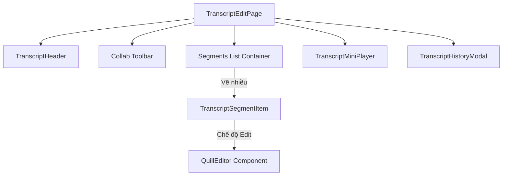

# Hướng Dẫn Kiến Trúc Hiển Thị Giao Diện & Đồng Bộ Cộng Tác (Collab UI Rendering)

Tài liệu này giải thích chi tiết cấu trúc giao diện trang chỉnh sửa bản dịch (`TranscriptEditPage`), cách tổ chức các component con, cơ chế quản lý dữ liệu, và cách thức đồng bộ hóa thời gian thực (collaboration) phía Client.

---

## 1. Cấu trúc Cây Component (Component Tree)

Giao diện chỉnh sửa bản dịch được chia nhỏ thành các component độc lập nhằm tối ưu hiệu năng render và dễ quản lý:



---

## 2. Chi Tiết Từng Thành Phần Giao Diện

### 2.1 Trang Chỉnh Sửa Chính: [TranscriptEditPage](file:///d:/VDT_Tucode/VDT_miniproject_TranscriptHub/fe_next/app/%28dashboard%29/transcripts/%5BfileId%5D/edit/page.tsx)

Đóng vai trò là Container Component, chịu trách nhiệm fetch dữ liệu ban đầu, quản lý các state tổng quan của phòng họp, tích hợp hook `useCollab` và điều phối các component con.

#### Các State và Logic Quan Trọng:
1. **Xác định Phòng Họp và Quyền Hạn (`meetingId` & `meetingRole`)**:
   - URL của trang có định dạng `/transcripts/[fileId]/edit`.
   - `fileId` là ID của file âm thanh. Page gọi API `meetingsApi.getByAudioFile(fileId)` để phân giải ra UUID thực của cuộc họp (`meetingId`).
   - Khi có `meetingId`, hệ thống truy vấn tiếp danh sách thành viên `meetingsApi.getMembers(meetingId)` để lấy vai trò của người dùng hiện tại (`HOST`, `EDITOR`, hay `VIEWER`).
   - *Lưu ý*: Quyền hạn này hoàn toàn độc lập với hệ thống role phân quyền hệ thống (`session.user.role` là ADMIN/USER).
2. **Quản lý Dữ liệu Local (`editedSegments`)**:
   - `editedSegments` là một `Record<string, string>` (key là Segment ID, value là nội dung text).
   - Ban đầu, dữ liệu được seed từ DB thông qua `transcript.segments`.
   - Lắng nghe thay đổi từ YJS qua `collabSegments` (thông tin đồng bộ từ server và các client khác về) để liên tục ghi đè cập nhật vào `editedSegments`, giữ UI luôn đồng nhất với thế giới collab.
3. **Theo dõi Segment Đang Phát (`activeSegmentIndex`)**:
   - Hook `useTranscriptDetail` cung cấp thời gian phát nhạc hiện tại `currentTime`.
   - Cứ mỗi khi `currentTime` thay đổi, hệ thống duyệt qua danh sách các segments để tìm đoạn hội thoại nào có khoảng thời gian khớp nhất:
     ```typescript
     const idx = segs.findIndex(
       (s, i) => currentTime >= s.startTime && (i === segs.length - 1 || currentTime < segs[i + 1].startTime)
     );
     setActiveSegmentIndex(idx);
     ```
   - Segment đang phát sẽ được đánh dấu viền đỏ nổi bật trên màn hình.

---

### 2.2 Thanh Công Cụ Cộng Tác (Collab Toolbar)

Nằm ở phần đầu trang, tích hợp ngay dưới header để hiển thị trạng thái thời gian thực và cung cấp các nút thao tác nhanh.

* **Trạng thái kết nối (`collabState.connected`)**:
  - Nếu kết nối WebSocket thành công: Hiển thị chấm tròn xanh lục nhấp nháy kèm chữ **Live**.
  - Nếu mất mạng hoặc ngắt kết nối: Hiển thị màu xám kèm chữ **Offline**.
* **Số người đang online trong phòng (`collabState.users.length`)**:
  - Khi có trên 1 người đang mở phòng, thanh công cụ sẽ vẽ thêm icon `Users` kèm con số chỉ lượng người đang cộng tác thời gian thực.
* **Chỉ báo Quyền hạn (`collabState.canEdit`)**:
  - Nếu người vào trang là `VIEWER` (Chỉ xem), hệ thống hiển thị nhãn màu cam **Chỉ xem**, đồng thời vô hiệu hóa khả năng tương tác của trình soạn thảo.
* **Chỉ báo Thay đổi chưa lưu (`hasChanges`)**:
  - Bằng cách so sánh nội dung trong `editedSegments` với YJS data `collabSegments`, nếu có sự sai khác, UI hiển thị nhãn **Có thay đổi chưa lưu** kèm nút **Hoàn tác** và nút **Lưu thay đổi** được sáng lên.
  - Khi lưu thành công, nút chuyển trạng thái **Đã lưu!** và hiển thị tích xanh.

---

### 2.3 Container và Từng Đoạn Bản Dịch: [TranscriptSegmentItem](file:///d:/VDT_Tucode/VDT_miniproject_TranscriptHub/fe_next/components/transcript/TranscriptSegmentItem.tsx)

Bản dịch âm thanh được chia thành nhiều đoạn thoại nhỏ (Segment) xếp dọc. Mỗi đoạn được quản lý bởi component `TranscriptSegmentItem`.

#### Cấu trúc Giao Diện của Một Segment:
1. **Hộp số thứ tự & Nút nhảy thời gian**:
   - Hiển thị badge số thứ tự (ví dụ: `1`, `2`, `3`).
   - Bên dưới badge là nút play nhỏ hình tròn. Nhấp vào nút này sẽ nhảy âm thanh của trình phát đến đúng thời điểm bắt đầu segment đó:
     ```typescript
     onSegmentClick={handleSegmentClick} // Gọi seekTo(segment.startTime)
     ```
2. **Thông tin Speaker & Thời gian thoại (Time range)**:
   - Hiển thị tên người nói dưới dạng badge màu đỏ nổi bật (Speaker).
   - Hiển thị khoảng thời gian thoại có định dạng phút:giây (ví dụ: `00:05 → 00:12`).
3. **Khối Nội dung soạn thảo (Content Area)**:
   - **Chế độ Xem thường (`mode === "view"`)**: Chỉ hiển thị thẻ `<p>` chứa text thuần. Khi rê chuột sẽ có hiệu ứng đổi màu hover và nhấp chuột vào sẽ nhảy trình phát nhạc đến segment đó.
   - **Chế độ Sửa (`mode === "edit"`)**: 
     - Nếu có hàm `getYText`, component sẽ mount trình soạn thảo cộng tác thời gian thực `QuillEditor`.
     - Nếu không có (ví dụ offline hoặc chưa đồng bộ xong), component sẽ fallback về thẻ `<textarea>` chỉ đọc để tránh lỗi hiển thị.

---

### 2.4 Trình Soạn Thảo Cộng Tác: [QuillEditor](file:///d:/VDT_Tucode/VDT_miniproject_TranscriptHub/fe_next/components/transcript/QuillEditor.tsx)

Đây là thành phần cốt lõi thực thi việc gõ chữ và đồng bộ hóa.

#### Cách Thức Tương Tác Dữ Liệu Khi Chỉnh Sửa:
* **Khởi tạo và Binding**:
  - Trình duyệt mount component, client tải động `quill` và `y-quill` thông qua Dynamic Import.
  - Sau khi khởi tạo đối tượng Quill DOM, hàm `tryBind` sẽ thực hiện truy xuất cấu trúc văn bản cộng tác `Y.Text` từ đồ thị YJS bằng ID:
    ```typescript
    const yText = getYText(segmentId); // yText lúc này đại diện cho content-segmentId
    bindingRef.current = new QuillBinding(yText, quill);
    ```
* **Luồng gõ chữ đồng bộ (Client ➔ YJS ➔ WebSocket ➔ Clients khác)**:
  1. Người dùng gõ một phím trên trình soạn thảo Quill.
  2. Sự kiện gõ phím được `QuillBinding` bắt lại, dịch sang dạng cập nhật CRDT Delta và áp dụng trực tiếp vào biến `yText` (`Y.Text`).
  3. Đối tượng `Y.Text` cập nhật sẽ kích hoạt cơ chế đồng bộ của `Y.Doc`. `Y.Doc` gom nhóm thay đổi và chuyển giao cho `WebsocketProvider` mã hóa nhị phân rồi gửi qua WebSocket lên Server.
  4. Server nhận gói tin, lưu vào RAM của Server, và phát tán gói tin này cho tất cả các trình duyệt của người dùng khác đang mở trang này.
  5. Các máy khách khác nhận tin nhắn WebSocket, tự động cập nhật vào RAM `Y.Text` của họ. `QuillBinding` trên máy họ phát hiện `Y.Text` thay đổi, lập tức cập nhật lại văn bản hiển thị trên ô soạn thảo Quill tương ứng mà không làm mất con trỏ chuột của người dùng đó.
* **Gửi dữ liệu về Component cha**:
  - Quill lắng nghe sự kiện `"text-change"` nội bộ để gọi hàm callback `onContentChange` nhằm cập nhật lại mảng trạng thái `editedSegments` trên Page Component chính, giúp đồng bộ hóa các nút "Lưu thay đổi", "Hoàn tác".

---

### 2.5 Trình Phát Nhạc Thu Nhỏ: [TranscriptMiniPlayer](file:///d:/VDT_Tucode/VDT_miniproject_TranscriptHub/fe_next/components/transcript/TranscriptMiniPlayer.tsx)

Nằm cố định ở cuối trang (Sticky Bottom), cho phép người dùng vừa gõ chữ chỉnh sửa bản dịch vừa nghe lại âm thanh để đối chiếu.
* Cung cấp các nút Play/Pause, tua nhanh/tua chậm, kéo thanh trượt thời gian (Progress bar), và tăng giảm âm lượng.
* Hoạt động đồng bộ hai chiều: Tua nhạc trên player sẽ tự động làm thay đổi highlight của segment đang phát ở phía trên; ngược lại, nhấn nút nhảy thời gian ở từng segment cũng sẽ ép player tua đến đúng mốc thời gian đó.

---

### 2.6 Khôi Phục Lịch Sử: [TranscriptHistoryModal](file:///d:/VDT_Tucode/VDT_miniproject_TranscriptHub/fe_next/components/transcript/TranscriptHistoryModal.tsx)

Một hộp thoại (Modal) cho phép người dùng xem danh sách các phiên bản snapshot lịch sử đã lưu của bản dịch này.
* Khi người dùng nhấp vào xem một phiên bản lịch sử: Modal truy vấn thông tin chi tiết qua API Gateway.
* Khi nhấp nút **Khôi phục phiên bản**:
  1. Gọi API HTTP khôi phục dữ liệu ở Backend database Postgres.
  2. Nhận kết quả thành công, kích hoạt hàm `restoreVersion` của hook `useCollab`.
  3. `restoreVersion` chạy một transaction xóa sạch mảng segments hiện tại của Y.Doc và ghi đè toàn bộ dữ liệu của phiên bản cũ vào.
  4. Hành động thay đổi đồ thị dữ liệu YJS này tự động tạo ra một lượng delta update khổng lồ gửi qua WebSocket, ép trình duyệt của mọi người dùng khác đang online trong phòng lập tức đồng bộ giao diện lùi về phiên bản lịch sử vừa được khôi phục mà không cần tải lại trang.
