# Collab Service - Tài Liệu Kiến Trúc & Thiết Kế

Tài liệu này mô tả **kiến trúc**, **luồng giao tiếp**, và **quy trình vận hành** của hệ thống Collaborative Editing (Cộng tác chỉnh sửa bản dịch thời gian thực) trong TranscriptHub.

---

## 1. Tổng Quan

### 1.1. Mục đích

Cho phép nhiều người dùng cùng chỉnh sửa bản dịch cuộc họp **theo thời gian thực** (real-time) với khả năng:
- Đồng bộ nội dung realtime giữa các editor
- Lưu lịch sử phiên bản (snapshot) tự động và thủ công
- Khôi phục (rollback) về phiên bản cũ
- Kiểm soát quyền chỉnh sửa theo vai trò (HOST, EDITOR, VIEWER)

### 1.2. Công nghệ sử dụng

| Công nghệ | Vai trò |
|---|---|
| **Yjs** | CRDT library - đảm bảo tính nhất quán khi nhiều người cùng sửa đồng thời |
| **y-websocket** | WebSocket server - sync CRDT updates giữa các clients |
| **Quill** | Rich text editor (frontend) |
| **Redis Pub/Sub** | Đồng bộ giữa nhiều instances y-websocket |
| **PostgreSQL** | Lưu trữ transcript & phiên bản lịch sử |

---

## 2. Nguyên Tắc Thiết Kế

### 2.1. Separation of Concerns

Hệ thống được chia thành **2 thành phần độc lập**:

| Thành phần | Giao thức | Cổng | Trách nhiệm |
|---|---|---|---|
| **y-websocket Server** | WebSocket + TCP RPC | `:3008` | CRDT sync, Awareness, Auth, Role filtering, TCP RPC client |
| **Collab Service** | TCP RPC Server | `:3007` | Snapshot management, Version history, Persistence |

### 2.2. Tại sao chia tách?

1. **y-websocket** là thư viện chuẩn đã implement đúng protocol Yjs (Sync Step 1/2, Awareness). Viết lại từ đầu rất phức tạp và dễ sai.
2. **Collab Service** chỉ cần lo TCP RPC handler + Snapshot trigger — không cần tự quản lý WebSocket.
3. **Scalability**: Khi deploy nhiều instances y-websocket, cần **Redis Pub/Sub** để sync giữa các instances. Collab Service stateless nên không cần.

### 2.3. Nguyên tắc truy cập dữ liệu

**Quan trọng:**
- **y-websocket KHÔNG truy cập trực tiếp PostgreSQL.**
- **y-websocket** giao tiếp với **Collab Service qua TCP RPC** (không qua HTTP).
- **Collab Service** giao tiếp với **Meeting Service qua TCP RPC** để lấy `audioFileId`, sau đó dùng **Prisma direct** vào bảng `transcripts` và `transcript_versions`.

---

## 3. Sơ Đồ Kiến Trúc

### 3.1. Sơ đồ tổng quan (Architecture Overview)

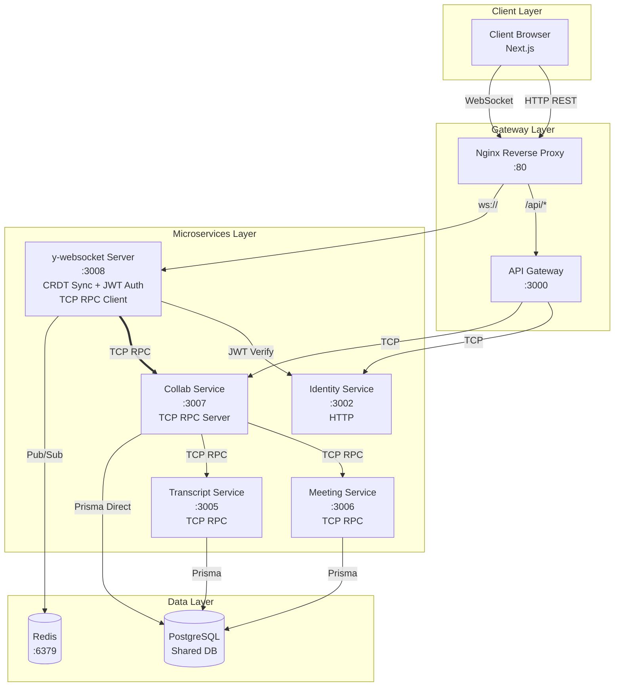

> **Lưu ý:** y-websocket sử dụng **TCP RPC** thay vì HTTP để giao tiếp với Collab Service, giúp giảm overhead và tăng performance.
> URL tới Web Socket có Token đính kém dạng Params luôn, nên y-websocket sẽ chạy đến identity để check verify token + gán Header để có thể truy cập TCP RPC đến các MicroService bên dưới

### 3.2. Các thành phần chi tiết

#### 3.2.1. Client Layer (Browser)

- **Next.js App**: Giao diện người dùng
- **Quill Editor**: Rich text editor cho từng segment bản dịch
- **Yjs Client**: CRDT document client
- **y-websocket Provider**: Kết nối WebSocket tới y-websocket server

#### 3.2.2. Gateway Layer

| Thành phần | Mô tả |
|---|---|
| **Nginx** | Reverse proxy, định tuyến HTTP → API Gateway, WS → y-websocket |
| **API Gateway** | REST API Gateway (`:3000`), transform response, rate limiting |

#### 3.2.3. Microservices Layer

| Service | Cổng | Giao thức | Trách nhiệm |
|---|---|---|---|
| **y-websocket** | `:3008` | WebSocket + TCP RPC Client | CRDT sync, auth, graceful disconnect, TCP RPC client to Collab |
| **Collab Service** | `:3007` | TCP RPC Server | Snapshot management, version history, persistence, TCP RPC handler |
| **Meeting Service** | `:3006` | TCP RPC | Meeting CRUD, member management |
| **Transcript Service** | `:3005` | TCP RPC | Transcript CRUD |
| **Identity Service** | `:3002` | HTTP | JWT verification, user management |

#### 3.2.4. Data Layer

| Thành phần | Mô tả |
|---|---|
| **Redis** | Pub/Sub cho multi-instance y-websocket, caching meeting roles |
| **PostgreSQL** | Shared database với nhiều schemas |

---

## 4. Luồng Giao Tiếp Chi Tiết

### 4.1. Kết nối WebSocket & Auth

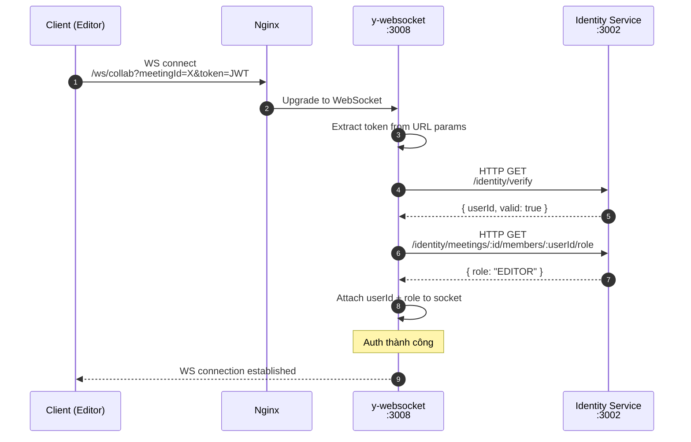

> **Lưu ý:** Identity Service vẫn dùng HTTP vì đây là external-facing service, các internal services giao tiếp qua TCP RPC.

### 4.2. Load Document (Init Yjs Room)

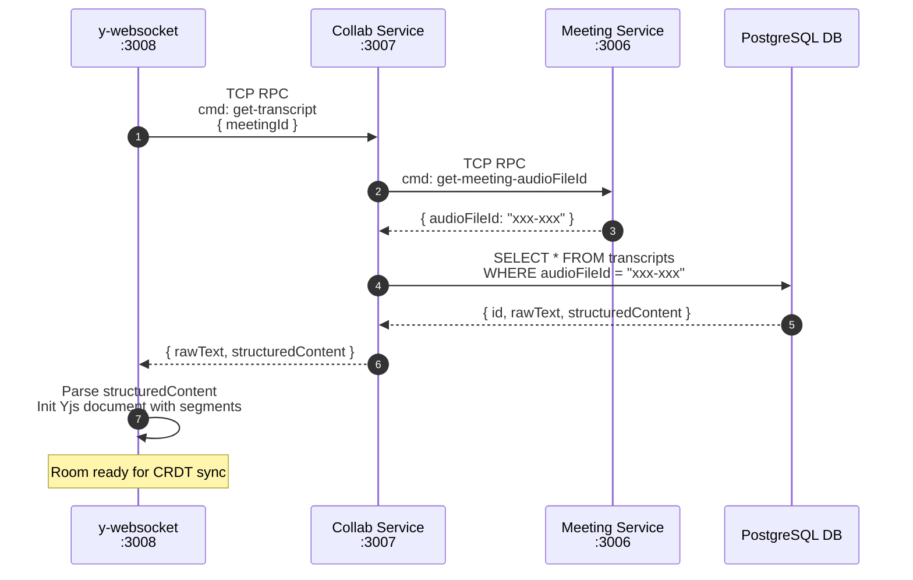

### 4.3. CRDT Sync & Auto-save (Character-count)

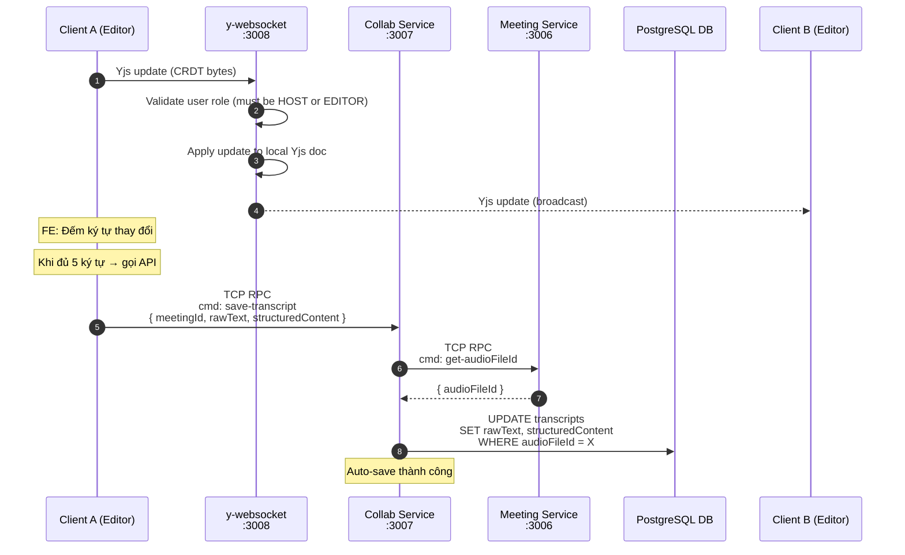

### 4.4. Disconnect Behavior

Khi user disconnect (F5, đóng tab, hoặc mất mạng):
- User bị **remove khỏi Room** ngay lập tức
- **Không có grace-period** - đơn giản hóa logic
- Dữ liệu đã được **auto-save** (mỗi 5 ký tự) và user có thể **chủ động lưu** bất cứ lúc nào
- User khác trong room tiếp tục làm việc bình thường

---

## 5. Database Schema

### 5.1. Bảng Transcripts (Đã có)

Bảng lưu trữ nội dung bản dịch hiện tại, được auto-save định kỳ.

| Column | Type | Mô tả |
|---|---|---|
| `id` | INT | Primary key |
| `audio_file_id` | UUID | Foreign key tới audio file |
| `raw_text` | TEXT | Nội dung text thuần (speaker: text) |
| `structured_content` | JSONB | Cấu trúc phân đoạn { segments: [...] } |
| `status` | VARCHAR | PROCESSING, COMPLETED, FAILED |
| `created_at` | TIMESTAMP | Thời điểm tạo |
| `updated_at` | TIMESTAMP | Thời điểm cập nhật cuối |

### 5.2. Bảng TranscriptVersions (Mới)

Bảng lưu trữ lịch sử phiên bản (snapshots) của transcript.

| Column | Type | Mô tả |
|---|---|---|
| `id` | INT | Primary key |
| `transcript_id` | INT | Foreign key tới transcripts |
| `version_name` | VARCHAR(255) | Tên phiên bản (VD: "Bản chốt dịch lần 1") |
| `raw_text` | TEXT | Nội dung text tại thời điểm snapshot |
| `structured_content` | JSONB | Cấu trúc segments tại thời điểm snapshot |
| `created_by_id` | INT | User ID của người tạo snapshot |
| `created_at` | TIMESTAMP | Thời điểm tạo snapshot |

### 5.3. Relationship Diagram

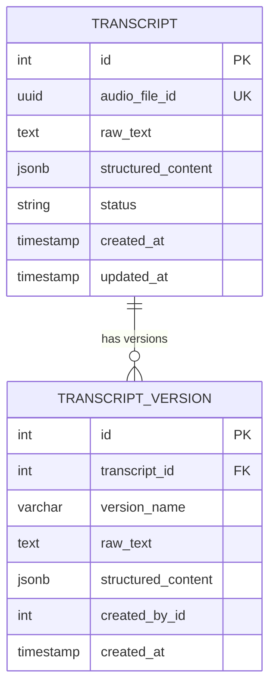

---

## 6. TCP RPC Commands

### 6.1. Collab Service TCP RPC Commands

Collab Service expose các commands qua TCP RPC để y-websocket và các service khác gọi.

| Command | Mô tả | Called by |
|---|---|---|
| `get-transcript` | Lấy transcript hiện tại để init Yjs | y-websocket |
| `save-transcript` | Auto-save transcript state | y-websocket, Client |
| `create-snapshot` | Tạo snapshot phiên bản | y-websocket, Client |
| `get-versions` | Lấy danh sách phiên bản | Client |
| `restore-version` | Khôi phục phiên bản cũ | Client |

### 6.2. TCP RPC Request/Response Examples

#### get-transcript

**Request:**
```json
{
  "cmd": "get-transcript",
  "data": {
    "meetingId": "123"
  }
}
```

**Response:**
```json
{
  "success": true,
  "data": {
    "rawText": "Speaker 1: Xin chào...\nSpeaker 2: Cảm ơn...",
    "structuredContent": {
      "segments": [
        {
          "id": "seg-001",
          "startTime": 0,
          "endTime": 15,
          "speaker": "Speaker 1",
          "text": "Xin chào..."
        }
      ]
    }
  }
}
```

#### save-transcript

**Request:**
```json
{
  "cmd": "save-transcript",
  "data": {
    "meetingId": "123",
    "rawText": "Speaker 1: Xin chào mới...",
    "structuredContent": { ... }
  }
}
```

**Response:**
```json
{
  "success": true,
  "message": "Transcript saved successfully"
}
```

#### create-snapshot

**Request:**
```json
{
  "cmd": "create-snapshot",
  "data": {
    "meetingId": "123",
    "userId": 42,
    "versionName": "Bản chốt dịch lần 1"
  }
}
```

**Response:**
```json
{
  "success": true,
  "data": {
    "versionId": 15,
    "message": "Snapshot created successfully"
  }
}
```

---

## 7. Luồng API Chi Tiết (API Flow)

### 7.1. Tổng quan các điểm giao tiếp

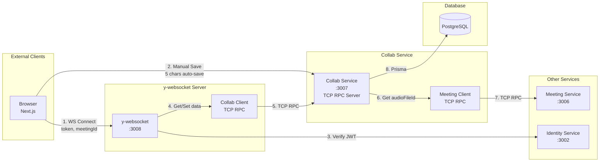

### 7.2. Chi tiết từng luồng

#### Luồng A: Kết nối WebSocket & Init Document

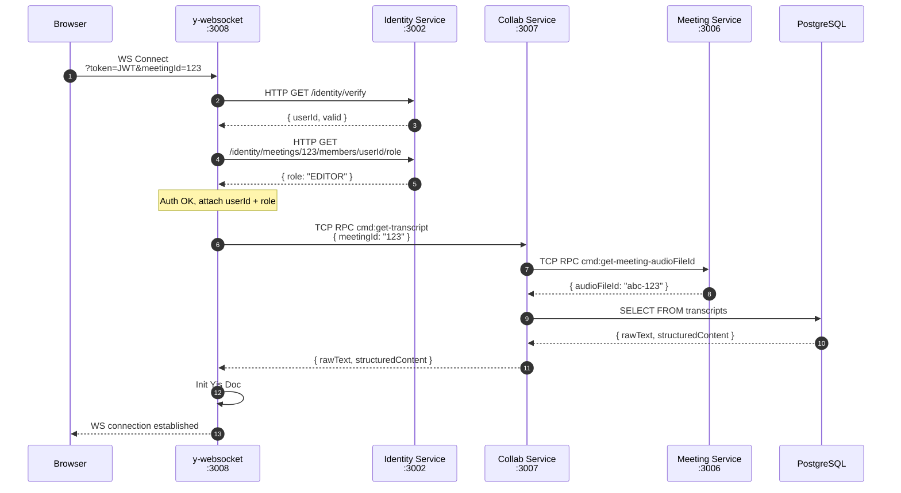

#### Luồng B: Auto-save (5 ký tự) & Manual Save

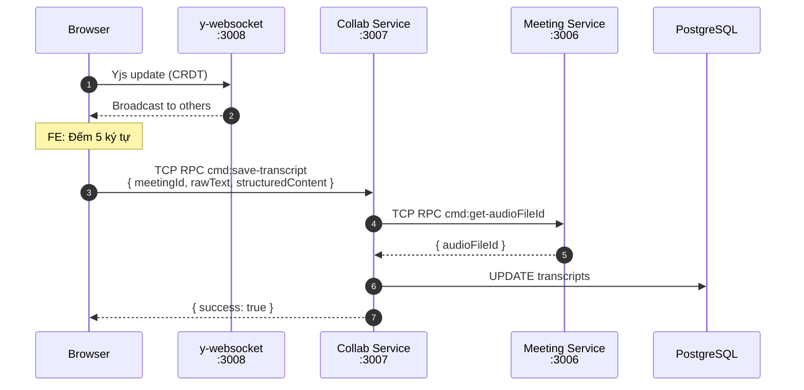

#### Luồng C: Tạo Snapshot (Manual)

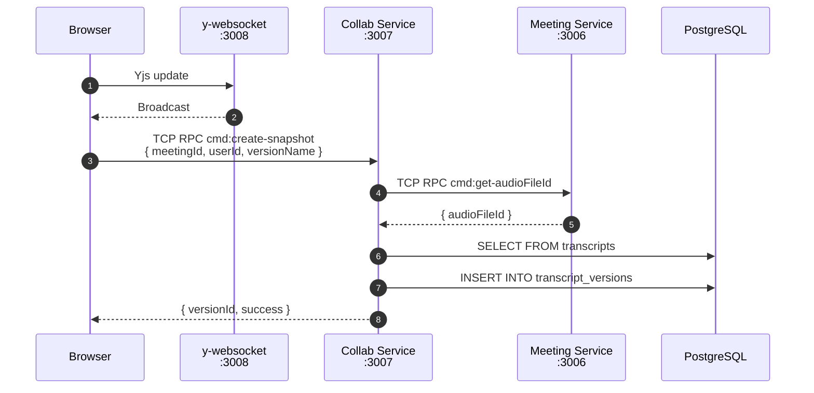

#### Luồng D: Lấy danh sách phiên bản

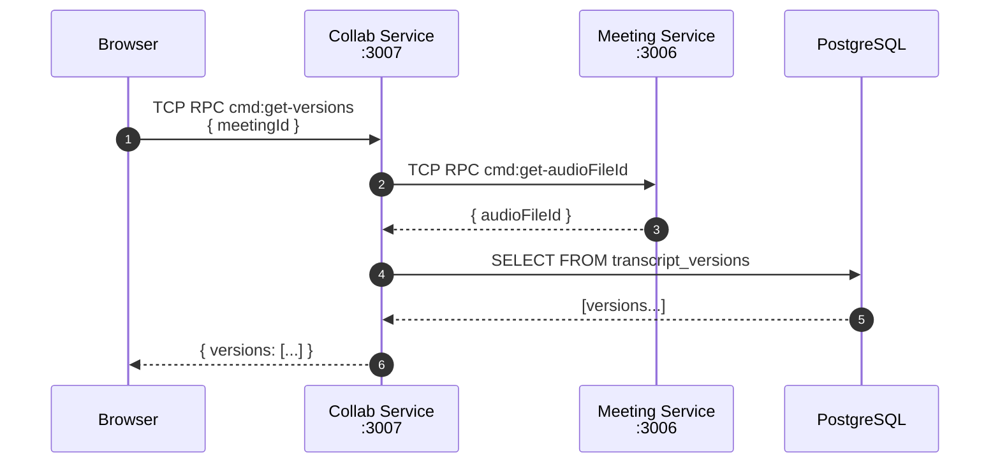

#### Luồng E: Khôi phục phiên bản

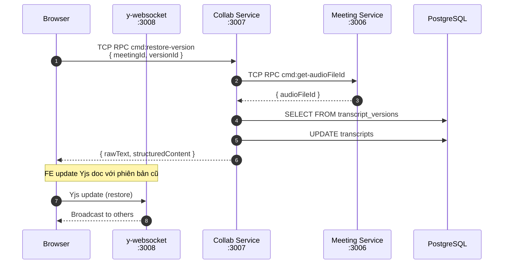

### 7.3. Bảng tóm tắt luồng

| Luồng | Trigger | Từ đâu | Đến đâu | Dữ liệu |
|--------|---------|---------|---------|---------|
| **A** | WS Connect | Browser | Collab Service | Init document |
| **B** | 5 ký tự | Browser | Collab Service | Auto-save |
| **C** | Manual button | Browser | Collab Service | Tạo snapshot |
| **D** | Xem lịch sử | Browser | Collab Service | Danh sách versions |
| **E** | Restore button | Browser | Collab Service | Khôi phục version |

---

## 8. Bảo Mật

### 8.1. Authentication (JWT)

- Client gửi JWT token qua URL param: `?token=<JWT>`
- y-websocket server verify token bằng `JWT_SECRET`
- Check token blacklist trong Redis (support logout)

### 8.2. Authorization (Role-based)

| Vai trò | Quyền |
|---|---|
| **HOST** | Full access: read, write, snapshot, restore |
| **EDITOR** | Read, write, snapshot, restore |
| **VIEWER** | Read only: nhận CRDT updates nhưng KHÔNG gửi được |

### 8.3. Role Verification

1. y-websocket verify JWT → lấy `userId`
2. Gọi Identity Service → lấy `role` của user trong meeting
3. Cache role trong Redis (5 phút) để giảm latency

### 8.4. Security Checklist

- [x] JWT authentication ở handshake
- [x] Role-based write filtering (server-side)
- [x] Token blacklist trong Redis
- [x] Rate limiting (ở API Gateway)
- [x] Input validation (NestJS ValidationPipe)
- [x] Internal services chỉ giao tiếp qua TCP RPC (không expose ra external)

---

## 9. Các Tính Năng Đặc Biệt

### 9.1. CRDT (Conflict-free Replicated Data Type)

**Vấn đề giải quyết:**
- Khi 2 người cùng sửa 1 đoạn text cùng lúc, ai giữ quyền?
- CRDT đảm bảo **không có conflict** - tất cả thay đổi đều được merge một cách toán học.

**Cách hoạt động:**
- Mỗi client có 1 bản sao Yjs document
- Khi có thay đổi, client gửi **delta** (update) tới y-websocket
- y-websocket broadcast delta tới tất cả clients
- Mỗi client apply delta vào local doc → **tất cả docs converge về cùng 1 state**

### 9.2. Awareness (Presence)

Cho phép hiển thị:
- Ai đang online trong phòng
- Cursor position của từng user
- User đang edit segment nào

**Cách hoạt động:**
- Client set local awareness state: `{ name: "John", color: "#ff0000" }`
- y-websocket broadcast awareness states tới all clients
- Frontend render avatars và cursors dựa trên awareness data

### 9.3. Character-count Auto-save (FE-side)

**Vấn đề:**
- Nếu auto-save mỗi lần user gõ 1 ký tự → quá tải database
- Nếu auto-save theo thời gian cố định (5s không activity) → không phản ánh đúng thao tác user

**Giải pháp:**
- **Frontend** đếm số ký tự thay đổi trong mỗi lần input
- Khi user nhập đủ **5 ký tự** → FE gọi API auto-save ngay lập tức
- User có thể **chủ động lưu** (manual save) bất cứ lúc nào

**Lợi ích:**
- Auto-save phản ánh đúng "công sức" của user
- Giảm số lần gọi API so với debounce time-based
- User kiểm soát được khi nào dữ liệu được lưu

---

## 9. Directory Structure

```
services_ms/
├── apps/
│   ├── collab/                              # [NEW] Collab Service (TCP RPC Server)
│   │   ├── Dockerfile
│   │   └── src/
│   │       ├── main.ts                      # Entry point
│   │       ├── collab.module.ts             # NestJS module
│   │       ├── collab.controller.ts        # TCP RPC handlers
│   │       ├── collab.service.ts           # Business logic
│   │       ├── meeting-client/              # TCP RPC client
│   │       └── prisma/                     # Database access
│   │
│   └── collab-ws/                          # [NEW] y-websocket Server
│       ├── Dockerfile
│       └── src/
│           ├── main.ts                      # Entry point
│           ├── auth/                        # JWT middleware
│           ├── room/                        # Room & persistence
│           ├── collab-client/              # [NEW] TCP RPC client to Collab Service
│           └── config/                      # Env config
│
fe_next/
├── lib/
│   └── collaborative-manager.ts             # [NEW] Yjs client wrapper
├── components/
│   └── collaborative-editor.tsx            # [NEW] Editor UI
└── app/
    └── (dashboard)/transcripts/[fileId]/
        └── page.tsx                       # [MODIFY] Integration
```

---

## 10. Directory Structure

### 10.1. Docker Services

| Service | Container | Port | Dependencies |
|---|---|---|---|
| `collab-service` | transcripthub-collab-service | `:3007` (TCP RPC) | postgres, redis |
| `collab-ws` | transcripthub-collab-ws | `:3008` (WS + TCP Client) | redis, collab-service |

### 10.2. Environment Variables

**Collab Service:**
```
COLLAB_SERVICE_PORT=3007
DATABASE_URL=postgresql://...
JWT_SECRET=...
MEETING_SERVICE_HOST=meeting-service
MEETING_SERVICE_TCP_PORT=3006
```

**y-websocket Server:**
```
WS_PORT=3008
COLLAB_SERVICE_HOST=collab-service
COLLAB_SERVICE_TCP_PORT=3007
JWT_SECRET=...
IDENTITY_SERVICE_URL=http://identity-service:3002
REDIS_HOST=redis
REDIS_PORT=6379
```

> **Lưu ý:** Thay đổi từ `COLLAB_SERVICE_URL=http://...` sang `COLLAB_SERVICE_HOST` và `COLLAB_SERVICE_TCP_PORT` để sử dụng TCP RPC thay vì HTTP.

### 10.3. Nginx Routing

```nginx
# WebSocket routing
location /ws/collab/ {
    proxy_pass http://collab-ws:3008/;
    proxy_http_version 1.1;
    proxy_set_header Upgrade $http_upgrade;
    proxy_set_header Connection "upgrade";
    proxy_read_timeout 86400;
}
```

> **Lưu ý:** Collab Service giao tiếp qua TCP RPC nên không cần expose HTTP port ra ngoài qua Nginx. Chỉ cần đảm bảo các service trong Docker network có thể kết nối TCP với nhau.

---

## 11. Monitoring & Troubleshooting

### 11.1. Health Checks

```bash
# Check Collab Service (TCP)
nc -zv collab-service 3007

# Check y-websocket
curl http://localhost:3008/health
```

### 11.2. Logs

```bash
# Collab Service
docker logs transcripthub-collab-service -f

# y-websocket
docker logs transcripthub-collab-ws -f
```

### 11.3. Common Issues

| Issue | Cause | Solution |
|---|---|---|
| Client không connect được | JWT hết hạn | Refresh token trước khi kết nối WS |
| Sync chậm > 200ms | Network lag | Kiểm tra latency client ↔ server |
| Auto-save không hoạt động | FE chưa implement count logic | Kiểm tra console FE |
| Viewer có thể edit | Frontend only protection | Enable server-side role check |
| Yjs doc lớn, load chậm | Nhiều segments | Pagination hoặc lazy loading |

---

## 12. Future Improvements

- [ ] Thêm **comment system** cho phép comment trên text
- [ ] Thêm **notification system** khi có thay đổi lớn
- [ ] Thêm **search/filter** trong lịch sử phiên bản
- [ ] Tối ưu **bandwidth** bằng binary protocol thay vì JSON

---

## 13. References

- [Yjs Documentation](https://docs.yjs.dev/)
- [y-websocket Documentation](https://github.com/yjs/y-websocket)
- [Quill Editor](https://quilljs.com/)
- [CRDT Paper](https://arxiv.org/abs/2010.03625)
