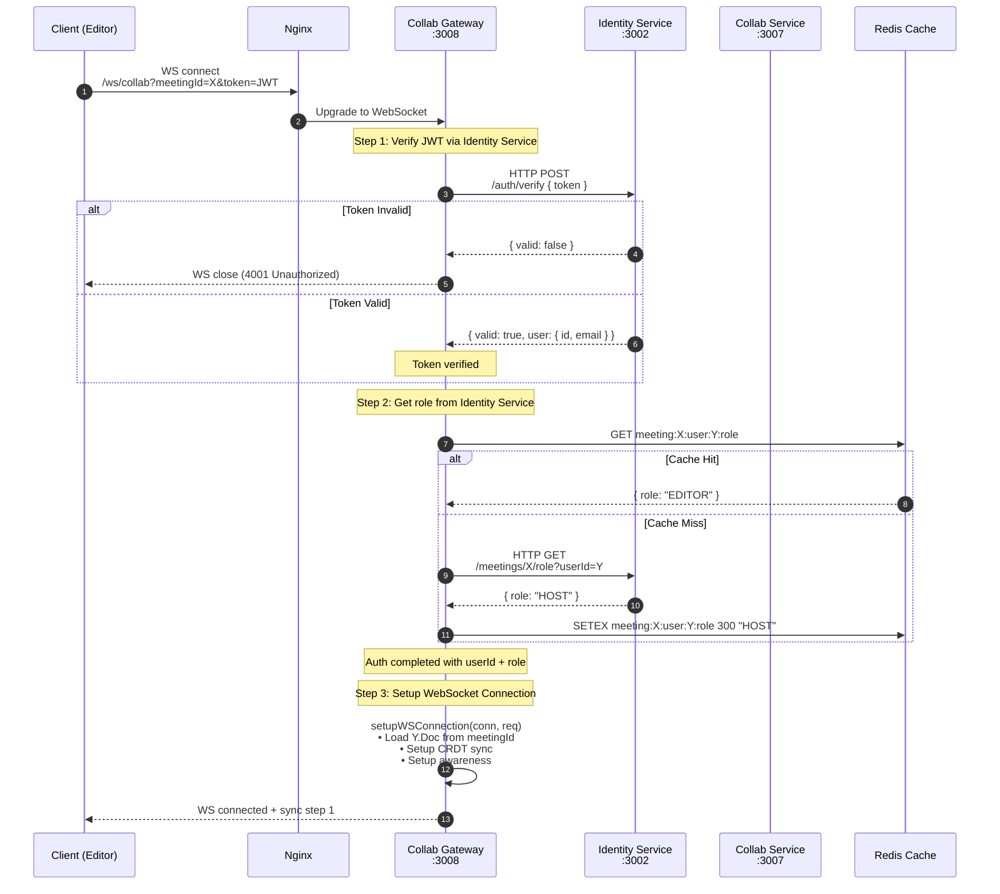
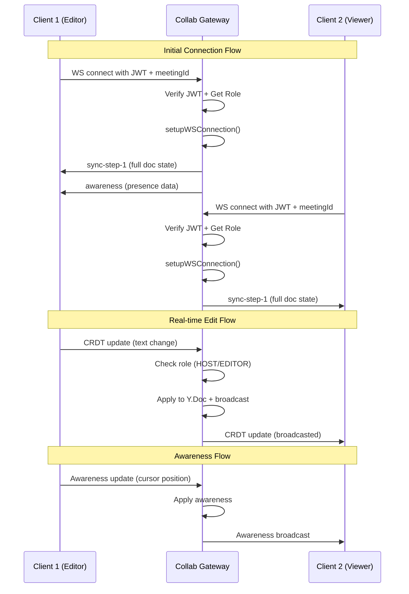

# Collab Service - Tài Liệu Kiến Trúc & Thiết Kế

Tài liệu này mô tả **kiến trúc**, **luồng giao tiếp**, và **quy trình vận hành** của hệ thống Collaborative Editing (Cộng tác chỉnh sửa bản dịch thời gian thực) trong TranscriptHub.

---

## 1. Tổng Quan

### 1.1. Mục đích

Cho phép nhiều người dùng cùng chỉnh sửa bản dịch cuộc họp **theo thời gian thực** (real-time) với khả năng:
- Đồng bộ nội dung realtime giữa các editor
- Lưu lịch sử phiên bản (snapshot) tự động và thủ công
- Khôi phục (rollback) về phiên bản cũ
- Kiểm soát quyền chỉnh sửa theo vai trò (HOST, EDITOR, VIEWER)

### 1.2. Công nghệ sử dụng

| Công nghệ | Vai trò |
|---|---|
| **Yjs** | CRDT library - đảm bảo tính nhất quán khi nhiều người cùng sửa đồng thời |
| **y-websocket (server utils)** | WebSocket server utilities từ y-websocket (đơn giản, standalone) |
| **ws** | Standalone WebSocket server library |
| **lib0 (y-websocket dependency)** | Binary encoding/decoding |
| **Quill** | Rich text editor (frontend) |
| **Redis** | Cache roles và Pub/Sub cho multi-instance |
| **PostgreSQL** | Lưu trữ transcript & phiên bản lịch sử |

---

## 2. Tại Sao Dùng Standalone Node.js WebSocket Server?

### 2.1. Đơn Giản Hóa Kiến Trúc

Thay vì dùng NestJS + y-protocols + Socket.io phức tạp, chúng ta dùng **standalone Node.js WebSocket server** giống như `demoYjs/backend/server.js`:

```javascript
// ✅ Đơn giản như demoYjs - chỉ vài dòng code
import { WebSocketServer } from 'ws';
import { setupWSConnection } from 'y-websocket/bin/utils';

const wss = new WebSocketServer({ server });
wss.on('connection', (conn, req) => {
  setupWSConnection(conn, req, { gc: true });
});
```

**Lợi ích:**
- Code đơn giản, dễ debug
- Không cần NestJS overhead
- Tận dùng `y-websocket/bin/utils` đã có đầy đủ CRDT sync
- Nhanh, nhẹ, hiệu quả

### 2.2. So Sánh Kiến Trúc

| Aspect | NestJS + y-protocols (Cũ) | Standalone Node.js (Mới) |
|--------|---------------------------|---------------------------|
| **Độ phức tạp** | Cao - nhiều layers | Thấp - đơn giản |
| **Dependencies** | @nestjs/websockets, y-protocols, socket.io | ws, y-websocket |
| **Code lines** | ~500+ lines gateway + services | ~100-200 lines |
| **Debugging** | Khó hơn | Dễ hơn |
| **Performance** | Tốt | Rất tốt |
| **Integrate với hệ thống** | Qua TCP RPC clients | Qua internal HTTP/TCP clients |

### 2.3. Giữ Nguyên Yêu Cầu Hệ Thống

Mặc dù đơn giản hóa server, chúng ta vẫn giữ đầy đủ:

| Yêu cầu | Implement |
|----------|-----------|
| **JWT Authentication** | Verify token ở connection handshake |
| **Role-based Access** | Check role trước khi apply CRDT updates |
| **Redis Cache** | Cache roles để giảm gọi Identity Service |
| **TCP RPC Clients** | Gọi Identity & Collab services khi cần |
| **Multi-instance Support** | Redis Pub/Sub để broadcast giữa các instances |

---

## 3. Sơ Đồ Kiến Trúc Mới

### 3.1. Architecture Overview

```
┌─────────────────────────────────────────────────────────────────┐
│                        CLIENT (Browser)                          │
│  ┌─────────────┐  ┌─────────────┐  ┌─────────────────────────┐ │
│  │   Quill     │  │    Yjs      │  │  y-websocket Provider  │ │
│  │  Editor     │──│   Doc       │──│  (Browser client)     │ │
│  └─────────────┘  └─────────────┘  └───────────┬─────────────┘ │
└────────────────────────────────────────────────┼────────────────┘
                                                 │ WebSocket
                                                 │ Binary (lib0)
                                                 ▼
┌─────────────────────────────────────────────────────────────────┐
│               COLLAB GATEWAY (Standalone Node.js)                │
│                                                                  │
│  ┌─────────────────────────────────────────────────────────────┐│
│  │              ws (WebSocket Server)                           ││
│  │  ┌─────────────────────────────────────────────────────────┐││
│  │  │  setupWSConnection (y-websocket/bin/utils)               │││
│  │  │  • Auto room management                                  │││
│  │  │  • Auto CRDT sync (sync protocol)                       │││
│  │  │  • Auto awareness (presence)                            │││
│  │  └─────────────────────────────────────────────────────────┘││
│  └─────────────────────────────────────────────────────────────┘│
│                              │                                   │
│                              ▼                                   │
│  ┌─────────────────────────────────────────────────────────────┐│
│  │                  Custom Middleware Layer                     ││
│  │  ┌──────────────────┐  ┌──────────────────┐                ││
│  │  │  Auth Middleware │  │  Role Middleware │                ││
│  │  │  (JWT verify)     │  │  (HOST/EDITOR/   │                ││
│  │  │                   │  │   VIEWER)        │                ││
│  │  └──────────────────┘  └──────────────────┘                ││
│  └─────────────────────────────────────────────────────────────┘│
│                              │                                   │
│                              ▼                                   │
│  ┌─────────────────────────────────────────────────────────────┐│
│  │                    Y.Doc (In-memory)                         ││
│  │  ┌─────────────┐  ┌─────────────┐  ┌─────────────────┐   ││
│  │  │  Y.Text     │  │  Y.Array    │  │  Y.Map          │   ││
│  │  │ (segments)  │  │ (segments)  │  │  (metadata)     │   ││
│  │  └─────────────┘  └─────────────┘  └─────────────────┘   ││
│  └─────────────────────────────────────────────────────────────┘│
│                              │                                   │
│                              ▼                                   │
│  ┌─────────────────────────────────────────────────────────────┐│
│  │                    External Services                         ││
│  │  ┌──────────────────┐  ┌──────────────────┐                ││
│  │  │  HTTP Client     │  │  Redis Client    │                ││
│  │  │  (Identity,      │  │  (Role Cache,    │                ││
│  │  │   Collab)        │  │   Pub/Sub)       │                ││
│  │  └──────────────────┘  └──────────────────┘                ││
│  └─────────────────────────────────────────────────────────────┘│
└─────────────────────────────────────────────────────────────────┘
```

### 3.2. Các thành phần chi tiết

#### 3.2.1. Client Layer (Browser)

- **Next.js App**: Giao diện người dùng
- **Quill Editor**: Rich text editor cho từng segment bản dịch
- **Yjs Client**: CRDT document client
- **y-websocket Provider**: Kết nối WebSocket tới Collab Gateway

#### 3.2.2. Collab Gateway (Standalone)

| Thành phần | Mô tả |
|---|---|
| **ws** | Native WebSocket server library |
| **y-websocket/bin/utils** | CRDT sync + room management |
| **Auth Middleware** | JWT verify ở connection |
| **Role Middleware** | Attach role to connection |
| **HTTP Client** | Gọi Identity & Collab services |

#### 3.2.3. External Services

| Service | Giao thức | Trách nhiệm |
|---------|----------|-------------|
| **Identity Service** | HTTP | JWT verify, user roles |
| **Collab Service** | HTTP | Save transcript, snapshots |
| **Redis** | Redis | Cache roles, Pub/Sub |

---

## 4. Luồng Giao Tiếp Chi Tiết

### 4.1. WebSocket Connection Flow



### 4.2. Real-time Edit Flow



---

## 5. Source Code Structure

### 5.1. Directory Structure

```
services_ms/apps/collab-gateway/
├── src/
│   ├── index.js                 # Entry point - standalone WS server
│   ├── middleware/
│   │   ├── auth.js              # JWT authentication middleware
│   │   └── role.js              # Role-based access middleware
│   ├── services/
│   │   ├── identity.js          # HTTP client to Identity Service
│   │   ├── collab.js            # HTTP client to Collab Service
│   │   └── redis.js             # Redis client for caching
│   ├── room/
│   │   └── manager.js           # Yjs document management
│   └── utils/
│       └── logger.js            # Logging utility
├── package.json
├── Dockerfile
└── .env.example
```

### 5.2. Entry Point (index.js)

```javascript
import http from 'http';
import { WebSocketServer } from 'ws';
import { setupWSConnection } from 'y-websocket/bin/utils';
import { authMiddleware } from './middleware/auth.js';
import { roleMiddleware } from './middleware/role.js';
import { identityService } from './services/identity.js';
import { collabService } from './services/collab.js';
import { redisService } from './services/redis.js';
import { RoomManager } from './room/manager.js';

const PORT = process.env.WS_PORT || 3008;
const server = http.createServer();

// WebSocket Server
const wss = new WebSocketServer({ server });

wss.on('connection', async (conn, req) => {
  const url = new URL(req.url, `http://${req.headers.host}`);
  const token = url.searchParams.get('token');
  const meetingId = url.searchParams.get('meetingId');

  if (!token || !meetingId) {
    conn.close(4001, 'Missing token or meetingId');
    return;
  }

  try {
    // 1. Authenticate
    const user = await authMiddleware(token);
    if (!user) {
      conn.close(4001, 'Unauthorized');
      return;
    }

    // 2. Get role
    const role = await roleMiddleware(meetingId, user.id);

    // 3. Attach metadata to connection
    conn.userId = user.id;
    conn.email = user.email;
    conn.role = role;
    conn.meetingId = meetingId;

    // 4. Setup Yjs connection
    setupWSConnection(conn, req, {
      gc: true,
      docName: meetingId,
    });

    console.log(`[WS] User ${user.id} joined meeting ${meetingId} as ${role}`);
  } catch (error) {
    console.error('[WS] Connection error:', error.message);
    conn.close(4001, 'Authentication failed');
  }
});

server.listen(PORT, () => {
  console.log(`Collab Gateway running on ws://localhost:${PORT}`);
});
```

### 5.3. Auth Middleware

```javascript
import { identityService } from '../services/identity.js';

export async function authMiddleware(token) {
  const response = await identityService.verifyToken(token);
  if (!response.success) {
    return null;
  }
  return response.data;
}
```

### 5.4. Role Middleware

```javascript
import { identityService } from '../services/identity.js';
import { redisService } from '../services/redis.js';

export async function roleMiddleware(meetingId, userId) {
  const cacheKey = `meeting:${meetingId}:user:${userId}:role`;

  // Check cache first
  const cachedRole = await redisService.get(cacheKey);
  if (cachedRole) {
    return cachedRole;
  }

  // Get from Identity Service
  const response = await identityService.getMeetingRole(meetingId, userId);
  const role = response.data?.role || 'VIEWER';

  // Cache for 5 minutes
  await redisService.set(cacheKey, role, 300);

  return role;
}
```

---

## 6. Bảo Mật

### 6.1. Authentication (JWT)

- Client gửi JWT token qua URL param: `?token=<JWT>`
- Collab Gateway verify token bằng cách gọi HTTP tới Identity Service
- Check token blacklist trong Redis (support logout)

### 6.2. Authorization (Role-based)

| Vai trò | Quyền |
|---------|-------|
| **HOST** | Full access: read, write, snapshot, restore |
| **EDITOR** | Full access: read, write, snapshot, restore |
| **VIEWER** | Read only: nhận CRDT updates nhưng KHÔNG gửi được |

**Lưu ý:** `y-websocket/bin/utils` hỗ trợ read-only connections. Chúng ta có thể dùng feature này cho VIEWER role.

### 6.3. Security Checklist

- [x] JWT authentication ở handshake
- [x] Role-based write filtering (server-side)
- [x] Token blacklist trong Redis
- [x] Rate limiting (ở API Gateway)
- [x] Input validation
- [x] Internal services giao tiếp qua HTTP (gateway nằm trong Docker network)

---

## 7. Environment Variables

**Collab Gateway:**

```
WS_PORT=3008
IDENTITY_SERVICE_URL=http://identity-service:3002
COLLAB_SERVICE_URL=http://collab-service:3007
REDIS_HOST=redis
REDIS_PORT=6379
ROLE_CACHE_TTL=300
LOG_LEVEL=info
```

---

## 8. Monitoring & Troubleshooting

### 8.1. Health Checks

```bash
# Check Collab Gateway
curl http://localhost:3008/health

# Check WebSocket connection count
# (Implement /metrics endpoint)
```

### 8.2. Logs

```bash
# Collab Gateway
docker logs transcripthub-collab-gateway -f
```

### 8.3. Common Issues

| Issue | Cause | Solution |
|-------|-------|----------|
| Client không connect được | JWT hết hạn | Refresh token trước khi kết nối WS |
| Sync chậm > 200ms | Network lag | Kiểm tra latency client ↔ server |
| Viewer có thể edit | Chưa set read-only | Enable read-only mode trong setupWSConnection |

---

## 9. References

- [Yjs Documentation](https://docs.yjs.dev/)
- [y-websocket GitHub](https://github.com/yjs/y-websocket)
- [lib0 (y-websocket dependency)](https://github.com/dmonad/lib0)
- [ws WebSocket Library](https://github.com/websockets/ws)
- [CRDT Paper](https://arxiv.org/abs/2010.03625)
