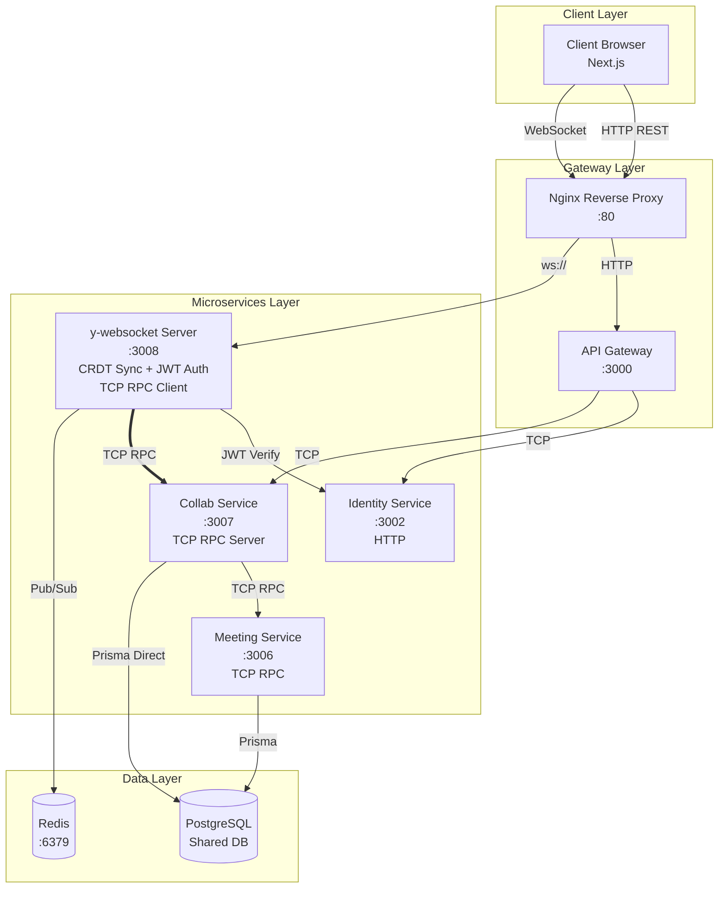
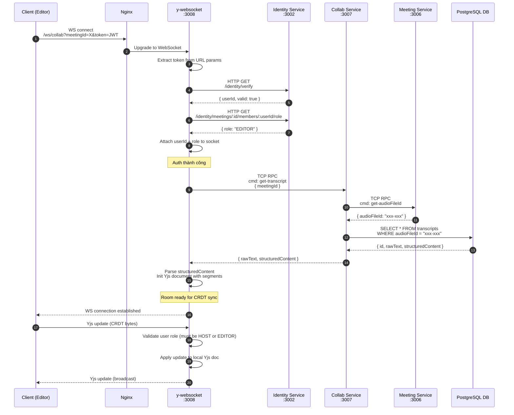
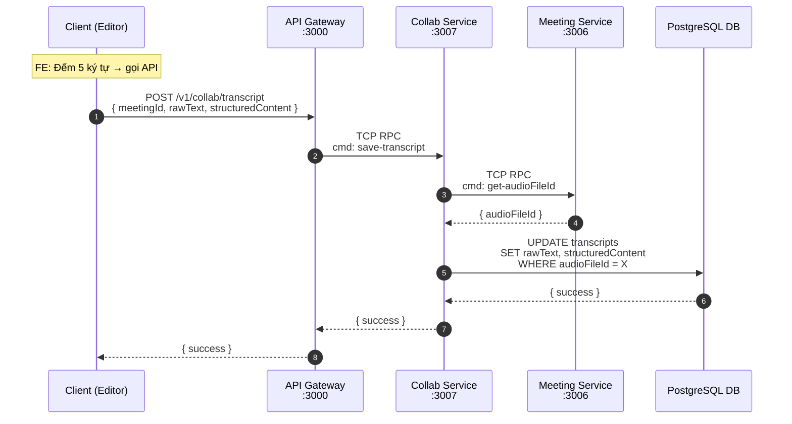
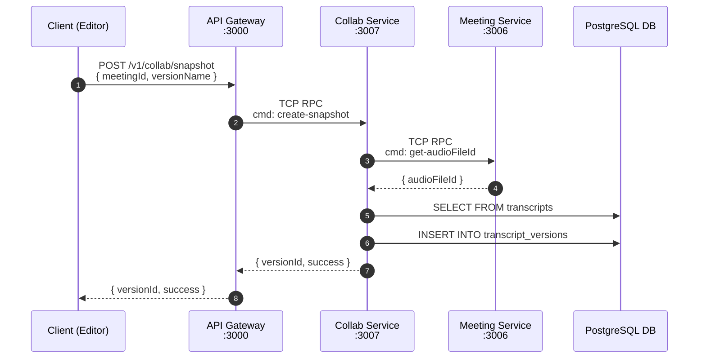
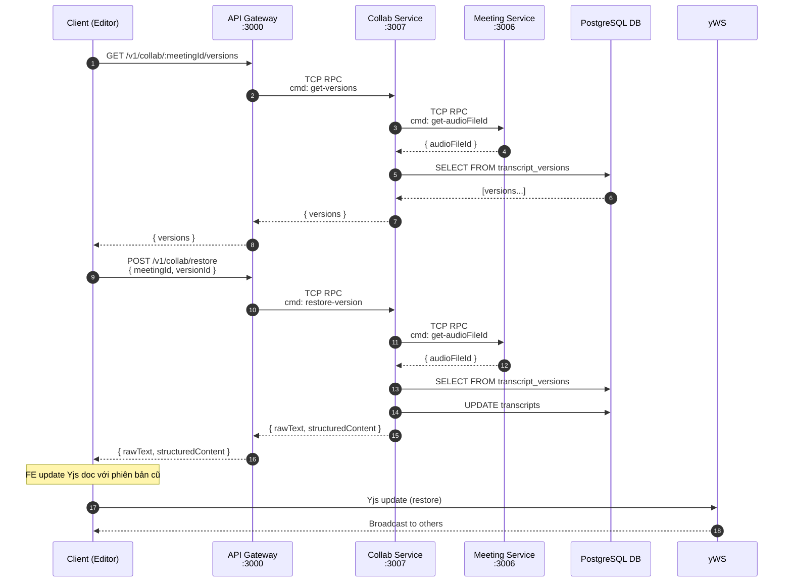

# Collab Service - Tài Liệu Kiến Trúc & Thiết Kế

Tài liệu này mô tả **kiến trúc**, **luồng giao tiếp**, và **quy trình vận hành** của hệ thống Collaborative Editing (Cộng tác chỉnh sửa bản dịch thời gian thực) trong TranscriptHub.

---

## 1. Tổng Quan

### 1.1. Mục đích

Cho phép nhiều người dùng cùng chỉnh sửa bản dịch cuộc họp **theo thời gian thực** (real-time) với khả năng:
- Đồng bộ nội dung realtime giữa các editor
- Lưu lịch sử phiên bản (snapshot) tự động và thủ công
- Khôi phục (rollback) về phiên bản cũ
- Kiểm soát quyền chỉnh sửa theo vai trò (HOST, EDITOR, VIEWER)

### 1.2. Công nghệ sử dụng

| Công nghệ | Vai trò |
|---|---|
| **Yjs** | CRDT library - đảm bảo tính nhất quán khi nhiều người cùng sửa đồng thời |
| **y-websocket** | WebSocket server - sync CRDT updates giữa các clients |
| **Quill** | Rich text editor (frontend) |
| **Redis Pub/Sub** | Đồng bộ giữa nhiều instances y-websocket |
| **PostgreSQL** | Lưu trữ transcript & phiên bản lịch sử |

---

## 2. Nguyên Tắc Thiết Kế

### 2.1. Separation of Concerns

Hệ thống được chia thành **2 phần chính**:

| Phần | Giao thức | Cổng | Trách nhiệm |
|---|---|---|---|
| **WebSocket (CRDT Sync)** | WebSocket | `:3008` | Chỉ sync CRDT realtime, init document |
| **HTTP API** | REST | `:3000` | Auto-save, Snapshot, Versions, Restore |

**Nguyên tắc:** WebSocket chỉ tập trung vào **real-time sync**. Các thao tác CRUD thuần túy (save, snapshot, versions, restore) đi qua **HTTP API Gateway**.

### 2.2. Tại sao tách?

1. **WebSocket** chỉ lo CRDT sync → đơn giản, hiệu quả
2. **HTTP API** xử lý các thao tác không cần realtime → dễ scale, dễ cache
3. **Scalability**: Khi deploy nhiều instances y-websocket, cần **Redis Pub/Sub** để sync giữa các instances

### 2.3. Nguyên tắc truy cập dữ liệu

**Quan trọng:**
- **y-websocket KHÔNG truy cập trực tiếp PostgreSQL.**
- **y-websocket** giao tiếp với **Collab Service qua TCP RPC** (không qua HTTP).
- **API Gateway** giao tiếp với **Collab Service qua TCP RPC** cho các HTTP endpoints.
- **Collab Service** giao tiếp với **Meeting Service qua TCP RPC** để lấy `audioFileId`, sau đó dùng **Prisma direct** vào bảng `transcripts` và `transcript_versions`.

---

## 3. Sơ Đồ Kiến Trúc

### 3.1. Sơ đồ tổng quan (Architecture Overview)



### 3.2. Các thành phần chi tiết

#### 3.2.1. Client Layer (Browser)

- **Next.js App**: Giao diện người dùng
- **Quill Editor**: Rich text editor cho từng segment bản dịch
- **Yjs Client**: CRDT document client
- **y-websocket Provider**: Kết nối WebSocket tới y-websocket server

#### 3.2.2. Gateway Layer

| Thành phần | Mô tả |
|---|---|
| **Nginx** | Reverse proxy, định tuyến HTTP → API Gateway, WS → y-websocket |
| **API Gateway** | REST API Gateway (`:3000`), expose Collab HTTP endpoints |

#### 3.2.3. Microservices Layer

| Service | Cổng | Giao thức | Trách nhiệm |
|---|---|---|---|
| **y-websocket** | `:3008` | WebSocket + TCP RPC Client | CRDT sync, auth, init document, TCP RPC client to Collab |
| **Collab Service** | `:3007` | TCP RPC Server | Snapshot management, version history, persistence |
| **Meeting Service** | `:3006` | TCP RPC | Meeting CRUD, member management |
| **Identity Service** | `:3002` | HTTP | JWT verification, user management |

#### 3.2.4. Data Layer

| Thành phần | Mô tả |
|---|---|
| **Redis** | Pub/Sub cho multi-instance y-websocket |
| **PostgreSQL** | Shared database với nhiều schemas |

---

## 4. Luồng Giao Tiếp Chi Tiết

### 4.1. WebSocket Flow - Init Document & Real-time Sync



### 4.2. HTTP API Flow - Auto-save & Snapshots



### 4.3. HTTP API Flow - Create Snapshot



### 4.4. HTTP API Flow - Get Versions & Restore



---

## 5. Bảng Tóm Tắt Luồng

| Luồng | Trigger | Cần Realtime? | Đi qua |
|-------|---------|---------------|--------|
| **Init Document** | WS Connect | ✅ Yes | WebSocket → y-websocket → Collab |
| **Real-time Edit** | Typing | ✅ Yes | WebSocket (CRDT sync) |
| **Auto-save** | 5 ký tự | ❌ No | HTTP → API Gateway → Collab |
| **Create Snapshot** | Manual button | ❌ No | HTTP → API Gateway → Collab |
| **Get Versions** | View history | ❌ No | HTTP → API Gateway → Collab |
| **Restore Version** | Restore button | ❌ No | HTTP → API Gateway → Collab |

---

## 6. Database Schema

### 6.1. Bảng Transcripts (Đã có)

Bảng lưu trữ nội dung bản dịch hiện tại, được auto-save định kỳ.

| Column | Type | Mô tả |
|---|---|---|
| `id` | INT | Primary key |
| `audio_file_id` | UUID | Foreign key tới audio file |
| `raw_text` | TEXT | Nội dung text thuần (speaker: text) |
| `structured_content` | JSONB | Cấu trúc phân đoạn { segments: [...] } |
| `status` | VARCHAR | PROCESSING, COMPLETED, FAILED |
| `created_at` | TIMESTAMP | Thời điểm tạo |
| `updated_at` | TIMESTAMP | Thời điểm cập nhật cuối |

### 6.2. Bảng TranscriptVersions (Mới)

Bảng lưu trữ lịch sử phiên bản (snapshots) của transcript.

| Column | Type | Mô tả |
|---|---|---|
| `id` | INT | Primary key |
| `transcript_id` | INT | Foreign key tới transcripts |
| `version_name` | VARCHAR(255) | Tên phiên bản (VD: "Bản chốt dịch lần 1") |
| `raw_text` | TEXT | Nội dung text tại thời điểm snapshot |
| `structured_content` | JSONB | Cấu trúc segments tại thời điểm snapshot |
| `created_by_id` | INT | User ID của người tạo snapshot |
| `created_at` | TIMESTAMP | Thời điểm tạo snapshot |

---

## 7. TCP RPC Commands (Internal)

Collab Service expose các commands qua TCP RPC để y-websocket và API Gateway gọi.

| Command | Mô tả | Called by |
|---------|-------|----------|
| `get-transcript` | Lấy transcript hiện tại để init Yjs | y-websocket |
| `save-transcript` | Auto-save transcript state | y-websocket, API Gateway |
| `create-snapshot` | Tạo snapshot phiên bản | y-websocket, API Gateway |
| `get-versions` | Lấy danh sách phiên bản | API Gateway |
| `restore-version` | Khôi phục phiên bản cũ | API Gateway |

---

## 8. HTTP REST Endpoints (External)

API Gateway expose các HTTP endpoints cho client gọi.

| Method | Endpoint | Mô tả |
|--------|----------|--------|
| POST | `/v1/collab/transcript` | Save transcript (auto-save/manual-save) |
| POST | `/v1/collab/snapshot` | Create snapshot |
| GET | `/v1/collab/:meetingId/versions` | Get all versions |
| POST | `/v1/collab/restore` | Restore to specific version |

---

## 9. Bảo Mật

### 9.1. Authentication (JWT)

- Client gửi JWT token qua URL param: `?token=<JWT>` (WebSocket)
- Client gửi JWT token qua Authorization header: `Bearer <JWT>` (HTTP)
- y-websocket server verify token bằng `JWT_SECRET`
- Check token blacklist trong Redis (support logout)

### 9.2. Authorization (Role-based)

| Vai trò | Quyền |
|---|---|
| **HOST** | Full access: read, write, snapshot, restore |
| **EDITOR** | Read, write, snapshot, restore |
| **VIEWER** | Read only: nhận CRDT updates nhưng KHÔNG gửi được |

### 9.3. Role Verification

1. y-websocket verify JWT → lấy `userId`
2. Gọi Identity Service → lấy `role` của user trong meeting
3. Cache role trong Redis (5 phút) để giảm latency

### 9.4. Security Checklist

- [x] JWT authentication ở handshake
- [x] Role-based write filtering (server-side)
- [x] Token blacklist trong Redis
- [x] Rate limiting (ở API Gateway)
- [x] Input validation (NestJS ValidationPipe)
- [x] Internal services chỉ giao tiếp qua TCP RPC (không expose ra external)

---

## 10. Các Tính Năng Đặc Biệt

### 10.1. CRDT (Conflict-free Replicated Data Type)

**Vấn đề giải quyết:**
- Khi 2 người cùng sửa 1 đoạn text cùng lúc, ai giữ quyền?
- CRDT đảm bảo **không có conflict** - tất cả thay đổi đều được merge một cách toán học.

**Cách hoạt động:**
- Mỗi client có 1 bản sao Yjs document
- Khi có thay đổi, client gửi **delta** (update) tới y-websocket
- y-websocket broadcast delta tới tất cả clients
- Mỗi client apply delta vào local doc → **tất cả docs converge về cùng 1 state**

### 10.2. Awareness (Presence)

Cho phép hiển thị:
- Ai đang online trong phòng
- Cursor position của từng user
- User đang edit segment nào

**Cách hoạt động:**
- Client set local awareness state: `{ name: "John", color: "#ff0000" }`
- y-websocket broadcast awareness states tới all clients
- Frontend render avatars và cursors dựa trên awareness data

### 10.3. Character-count Auto-save (FE-side)

**Vấn đề:**
- Nếu auto-save mỗi lần user gõ 1 ký tự → quá tải database
- Nếu auto-save theo thời gian cố định (5s không activity) → không phản ánh đúng thao tác user

**Giải pháp:**
- **Frontend** đếm số ký tự thay đổi trong mỗi lần input
- Khi user nhập đủ **5 ký tự** → FE gọi HTTP API auto-save ngay lập tức
- User có thể **chủ động lưu** (manual save) bất cứ lúc nào

---

## 11. Directory Structure

```
services_ms/
├── apps/
│   ├── collab/                              # Collab Service (TCP RPC Server)
│   │   ├── Dockerfile
│   │   └── src/
│   │       ├── main.ts                      # TCP port 3007
│   │       ├── collab.module.ts
│   │       ├── collab.controller.ts        # TCP RPC handlers
│   │       ├── collab.service.ts
│   │       ├── collab.repository.ts
│   │       ├── config/env.config.ts
│   │       ├── gateways/meeting.gateway.ts # TCP client to Meeting
│   │       └── prisma/
│   │
│   ├── collab-ws/                          # y-websocket Server
│   │   ├── Dockerfile
│   │   └── src/
│   │       ├── main.ts                      # WebSocket port 3008
│   │       ├── auth/                        # JWT middleware
│   │       ├── room/                        # Room & persistence
│   │       ├── collab-client/              # TCP RPC client to Collab
│   │       └── config/
│   │
│   └── api-gateway/
│       └── src/
│           └── collab/                     # Collab HTTP Module
│               ├── collab.controller.ts    # HTTP REST endpoints
│               ├── collab.service.ts      # TCP client to Collab
│               └── dto/

fe_next/
├── lib/
│   └── collaborative-manager.ts             # Yjs client wrapper
├── components/
│   └── collaborative-editor.tsx            # Editor UI
└── app/
    └── (dashboard)/transcripts/[fileId]/
        └── page.tsx
```

---

## 12. Environment Variables

**Collab Service:**
```
COLLAB_SERVICE_TCP_PORT=3007
DATABASE_URL=postgresql://...
MEETING_SERVICE_HOST=meeting-service
MEETING_SERVICE_TCP_PORT=3006
```

**API Gateway:**
```
COLLAB_SERVICE_HOST=collab-service
COLLAB_SERVICE_TCP_PORT=3007
```

**y-websocket Server:**
```
WS_PORT=3008
COLLAB_SERVICE_HOST=collab-service
COLLAB_SERVICE_TCP_PORT=3007
JWT_SECRET=...
IDENTITY_SERVICE_URL=http://identity-service:3002
REDIS_HOST=redis
REDIS_PORT=6379
```

---

## 13. Monitoring & Troubleshooting

### 13.1. Health Checks

```bash
# Check Collab Service (TCP)
nc -zv collab-service 3007

# Check y-websocket
curl http://localhost:3008/health
```

### 13.2. Logs

```bash
# Collab Service
docker logs transcripthub-collab-service -f

# y-websocket
docker logs transcripthub-collab-ws -f
```

### 13.3. Common Issues

| Issue | Cause | Solution |
|-------|-------|----------|
| Client không connect được | JWT hết hạn | Refresh token trước khi kết nối WS |
| Sync chậm > 200ms | Network lag | Kiểm tra latency client ↔ server |
| Auto-save không hoạt động | FE chưa implement count logic | Kiểm tra console FE |
| Viewer có thể edit | Frontend only protection | Enable server-side role check |
| Yjs doc lớn, load chậm | Nhiều segments | Pagination hoặc lazy loading |

---

## 14. References

- [Yjs Documentation](https://docs.yjs.dev/)
- [y-websocket Documentation](https://github.com/yjs/y-websocket)
- [Quill Editor](https://quilljs.com/)
- [CRDT Paper](https://arxiv.org/abs/2010.03625)
