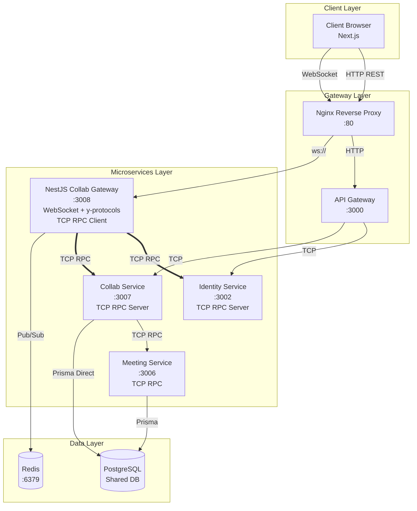
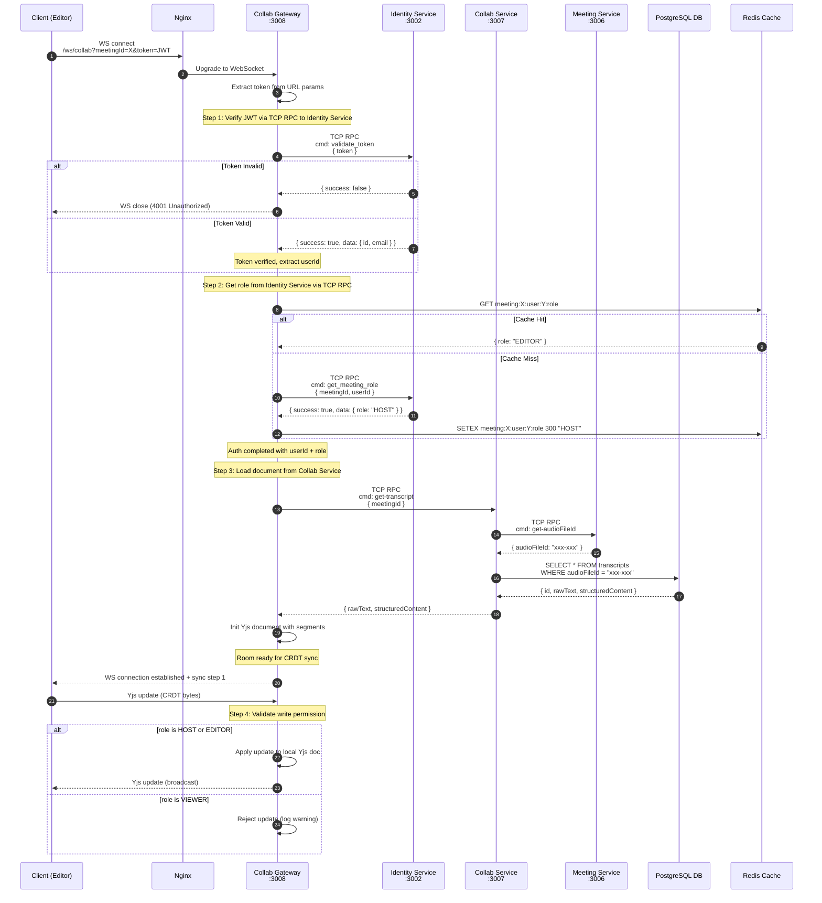
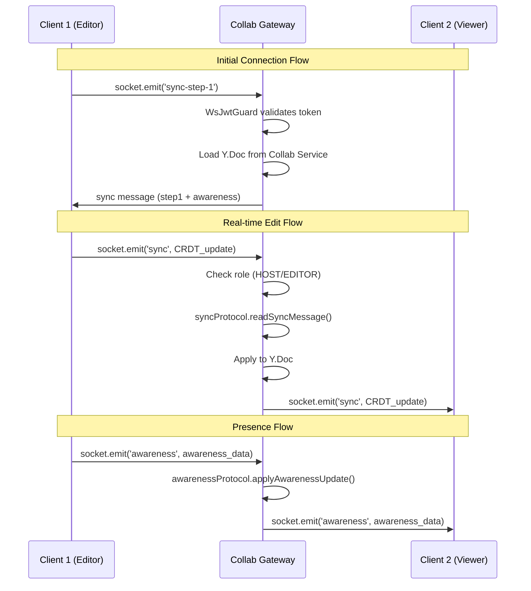

# Collab Service - Tài Liệu Kiến Trúc & Thiết Kế

Tài liệu này mô tả **kiến trúc**, **luồng giao tiếp**, và **quy trình vận hành** của hệ thống Collaborative Editing (Cộng tác chỉnh sửa bản dịch thời gian thực) trong TranscriptHub.

---

## 1. Tổng Quan

### 1.1. Mục đích

Cho phép nhiều người dùng cùng chỉnh sửa bản dịch cuộc họp **theo thời gian thực** (real-time) với khả năng:
- Đồng bộ nội dung realtime giữa các editor
- Lưu lịch sử phiên bản (snapshot) tự động và thủ công
- Khôi phục (rollback) về phiên bản cũ
- Kiểm soát quyền chỉnh sửa theo vai trò (HOST, EDITOR, VIEWER)

### 1.2. Công nghệ sử dụng

| Công nghệ | Vai trò |
|---|
| **Yjs** | CRDT library - đảm bảo tính nhất quán khi nhiều người cùng sửa đồng thời |
| **y-protocols** | Protocol implementations - sync, awareness (chúng ta dùng cái này!) |
| **@nestjs/websockets** | NestJS WebSocket Gateway - handle WebSocket connections trong NestJS |
| **lib0 (y-protocols dependency)** | Binary encoding/decoding cho y-protocols |
| **Quill** | Rich text editor (frontend) |
| **Redis Pub/Sub** | Đồng bộ giữa nhiều instances Collab Gateway |
| **PostgreSQL** | Lưu trữ transcript & phiên bản lịch sử |

---

## 2. Tại Sao Dùng y-protocols Thay Vì y-websocket?

### 2.1. Vấn đề khi dùng trực tiếp y-websocket

**y-websocket là một package hoàn chỉnh** bao gồm:
- WebSocket server
- Yjs document management
- Protocol implementation
- Authentication mặc định

**Nhược điểm khi dùng trực tiếp:**

```javascript
// ❌ y-websocket server hoạt động độc lập
const { WebSocketServer } = require('y-websocket');
const server = new WebSocketServer({ port: 3008 });

// Vấn đề:
// 1. Không tích hợp được với NestJS DI system
// 2. Không share được TCP clients với các services khác
// 3. Auth logic phải viết riêng, không dùng chung
// 4. Không theo patterns của monorepo
```

### 2.2. Giải pháp: Dùng y-protocols + Socket.io

**y-protocols** là các protocol implementations rời rạc mà y-websocket sử dụng bên trong:

```javascript
// ✅ Chúng ta dùng riêng lẻ
import * as syncProtocol from 'y-protocols/sync';      // CRDT sync protocol
import * as awarenessProtocol from 'y-protocols/awareness'; // Presence protocol
import * as encoding from 'lib0/encoding';              // Binary encoding
```

**Lợi ích:**

| Aspect | y-websocket | y-protocols + Socket.io |
|--------|-------------|--------------------------|
| **Tích hợp NestJS** | ❌ Không | ✅ Hoàn toàn |
| **Dependency Injection** | ❌ Không | ✅ Có |
| **Custom Auth** | ⚠️ Hạn chế | ✅ Tùy ý |
| **TCP Client Sharing** | ❌ Không | ✅ Có thể share |
| **Module System** | ❌ Không | ✅ Có |
| **Testing** | ⚠️ Khó | ✅ Dễ |
| **Maintainability** | ⚠️ Lock vào y-websocket | ✅ Tự kiểm soát |

### 2.3. Kiến trúc Protocol

```
┌─────────────────────────────────────────────────────────────────┐
│                        CLIENT (Browser)                          │
│  ┌─────────────┐  ┌─────────────┐  ┌─────────────────────────┐  │
│  │   Quill     │  │    Yjs      │  │   y-websocket Provider  │  │
│  │  Editor     │──│   Doc       │──│   (Socket.io client)   │  │
│  └─────────────┘  └─────────────┘  └───────────┬─────────────┘  │
└────────────────────────────────────────────────┼────────────────┘
                                                 │ WebSocket
                                                 │ Binary (lib0)
                                                 ▼
┌─────────────────────────────────────────────────────────────────┐
│                    COLLAB GATEWAY (NestJS)                      │
│  ┌───────────────────────────────────────────────────────────┐  │
│  │              @WebSocketGateway (Socket.io)                │  │
│  └───────────────────────────────────────────────────────────┘  │
│                              │                                   │
│                              ▼                                   │
│  ┌───────────────────────────────────────────────────────────┐  │
│  │                  y-protocols (lib0 encoding)              │  │
│  │  ┌─────────────────┐  ┌─────────────────┐                │  │
│  │  │  syncProtocol   │  │ awarenessProtocol│                │  │
│  │  │  (CRDT sync)    │  │  (Presence)     │                │  │
│  │  └─────────────────┘  └─────────────────┘                │  │
│  └───────────────────────────────────────────────────────────┘  │
│                              │                                   │
│                              ▼                                   │
│  ┌───────────────────────────────────────────────────────────┐  │
│  │                    Y.Doc (In-memory)                       │  │
│  │  ┌─────────────┐  ┌─────────────┐  ┌─────────────────┐   │  │
│  │  │  Y.Text     │  │  Y.Array    │  │  Y.Map          │   │  │
│  │  │ (segments)  │  │ (segments)  │  │  (metadata)     │   │  │
│  │  └─────────────┘  └─────────────┘  └─────────────────┘   │  │
│  └───────────────────────────────────────────────────────────┘  │
└─────────────────────────────────────────────────────────────────┘
```

---

## 3. Nguyên Tắc Thiết Kế

### 3.1. Separation of Concerns

Hệ thống được chia thành **2 phần chính**:

| Phần | Giao thức | Cổng | Trách nhiệm |
|---|---|---|---|
| **WebSocket (CRDT Sync)** | WebSocket | `:3008` | Chỉ sync CRDT realtime, init document |
| **HTTP API** | REST | `:3000` | Auto-save, Snapshot, Versions, Restore |

**Nguyên tắc:** WebSocket chỉ tập trung vào **real-time sync**. Các thao tác CRUD thuần túy (save, snapshot, versions, restore) đi qua **HTTP API Gateway**.

### 3.2. Tại sao tách?

1. **WebSocket** chỉ lo CRDT sync → đơn giản, hiệu quả
2. **HTTP API** xử lý các thao tác không cần realtime → dễ scale, dễ cache
3. **Scalability**: Khi deploy nhiều instances Collab Gateway, cần **Redis Pub/Sub** để sync giữa các instances

### 3.3. Nguyên tắc truy cập dữ liệu

**Quan trọng:**
- **Collab Gateway (WebSocket) KHÔNG truy cập trực tiếp PostgreSQL.**
- **Collab Gateway** giao tiếp với **Collab Service qua TCP RPC** (không qua HTTP).
- **API Gateway** giao tiếp với **Collab Service qua TCP RPC** cho các HTTP endpoints.
- **Collab Service** giao tiếp với **Meeting Service qua TCP RPC** để lấy `audioFileId`, sau đó dùng **Prisma direct** vào bảng `transcripts` và `transcript_versions`.

---

## 4. Y-Protocol Chi Tiết

### 4.1. Message Types (y-protocols định nghĩa)

```typescript
// Message type constants
const msgSync = 0;        // CRDT synchronization
const msgAwareness = 1;   // Presence/awareness
```

### 4.2. Sync Protocol (`y-protocols/sync`)

Sync protocol xử lý việc đồng bộ CRDT state giữa các clients:

```typescript
import * as syncProtocol from 'y-protocols/sync';
import * as encoding from 'lib0/encoding';
import * as decoding from 'lib0/decoding';

// Các hàm chính:
// - syncProtocol.writeSyncStep1(encoder, doc)  // Server → Client (initial state)
// - syncProtocol.writeSyncStep2(encoder, doc)  // Client → Server (after receiving step1)
// - syncProtocol.readSyncMessage(decoder, encoder, doc, ws)  // Xử lý message

// Sync flow:
// 1. Client connect → Server gửi sync-step-1 (full state)
// 2. Client nhận → gửi sync-step-2 (missing updates)
// 3. Server nhận → áp dụng và gửi lại những gì client miss
```

**Sync Step 1 (Server gửi initial state):**
```
┌──────────────┐     sync-step-1      ┌──────────────┐
│   Server     │ ──────────────────▶ │   Client 1   │
│   (Y.Doc)    │   [full state]      │   (Y.Doc)   │
└──────────────┘                      └──────────────┘
```

**Sync Step 2 (Client sync lại):**
```
┌──────────────┐     sync-step-2      ┌──────────────┐
│   Client 2   │ ──────────────────▶ │   Server     │
│   (Y.Doc)   │   [local updates]    │   (Y.Doc)   │
└──────────────┘                      └──────────────┘
       │                                    │
       │     Server gửi lại                │
       │     missing updates               │
       └────────────────────────────────────┘
```

### 4.3. Awareness Protocol (`y-protocols/awareness`)

Awareness protocol xử lý presence - ai đang online, cursor ở đâu:

```typescript
import * as awarenessProtocol from 'y-protocols/awareness';

// Tạo awareness instance cho mỗi document
const awareness = new awarenessProtocol.Awareness(doc);

// Set local state (khi user thay đổi cursor/selection)
awareness.setLocalStateField('user', {
  userId: 123,
  role: 'EDITOR',
  name: 'John',
  color: '#ff0000',
  cursor: { index: 10, length: 5 },
});

// Encode awareness state để gửi qua network
const update = awarenessProtocol.encodeAwarenessUpdate(
  awareness,
  [clientId1, clientId2]  // Chỉ gửi state của các client này
);

// Decode và apply
awarenessProtocol.applyAwarenessUpdate(awareness, update, ws);

// Remove client khi disconnect
awarenessProtocol.removeAwarenessStates(awareness, [clientId], null);
```

### 4.4. Binary Encoding với lib0

**Tại sao dùng binary?**

```
┌─────────────────────────────────────────────────────────┐
│                    TEXT PROTOCOL                         │
│  {"type":"sync","data":"hello world"}                  │
│  → 46 bytes, parse JSON overhead                        │
├─────────────────────────────────────────────────────────┤
│                    BINARY PROTOCOL                      │
│  [0x00][0x05]hello                                   │
│  → 7 bytes, direct binary                             │
│                                                         │
│  Format: [messageType(1byte)][length(4bytes)][data]    │
└─────────────────────────────────────────────────────────┘
```

**lib0 encoding/decoding:**

```typescript
import * as encoding from 'lib0/encoding';
import * as decoding from 'lib0/decoding';

// Encoding (server side)
const encoder = encoding.createEncoder();
encoding.writeVarUint(encoder, msgSync);  // Message type
syncProtocol.writeSyncStep1(encoder, doc);
const message = encoding.toUint8Array(encoder);

// Decoding (when receive)
const decoder = decoding.createDecoder(data);
const messageType = decoding.readVarUint(decoder);
if (messageType === msgSync) {
  // Xử lý sync message
}
```

---

## 5. Sơ Đồ Kiến Trúc

### 5.1. Sơ đồ tổng quan (Architecture Overview)



### 5.2. Các thành phần chi tiết

#### 5.2.1. Client Layer (Browser)

- **Next.js App**: Giao diện người dùng
- **Quill Editor**: Rich text editor cho từng segment bản dịch
- **Yjs Client**: CRDT document client
- **y-websocket Provider**: Kết nối WebSocket tới Collab Gateway

#### 5.2.2. Gateway Layer

| Thành phần | Mô tả |
|---|
| **Nginx** | Reverse proxy, định tuyến HTTP → API Gateway, WS → Collab Gateway |
| **API Gateway** | REST API Gateway (`:3000`), expose Collab HTTP endpoints, giao tiếp với Identity & Collab qua TCP RPC |

#### 5.2.3. Microservices Layer

| Service | Cổng | Giao thức | Trách nhiệm |
|---|---|---|---|
| **Collab Gateway** | `:3008` | WebSocket + TCP RPC Client | CRDT sync, auth, init document, TCP RPC client to Identity & Collab |
| **Identity Service** | `:3002` | TCP RPC Server + HTTP (external) | JWT verification, user management, meeting roles |
| **Collab Service** | `:3007` | TCP RPC Server | Snapshot management, version history, persistence |
| **Meeting Service** | `:3006` | TCP RPC | Meeting CRUD, member management |

#### 5.2.4. Data Layer

| Thành phần | Mô tả |
|---|
| **Redis** | Pub/Sub cho multi-instance Collab Gateway |
| **PostgreSQL** | Shared database với nhiều schemas |

---

## 6. Luồng Giao Tiếp Chi Tiết

### 6.1. WebSocket Flow - Authentication & Init Document



### 6.2. Y-Protocol Message Flow



---

## 7. Bảng Tóm Tắt Luồng

| Luồng | Trigger | Cần Realtime? | Đi qua |
|-------|---------|---------------|--------|
| **Init Document** | WS Connect | ✅ Yes | WebSocket → Collab Gateway → Collab |
| **Real-time Edit** | Typing | ✅ Yes | WebSocket (y-protocol sync) |
| **Auto-save** | 5 ký tự | ❌ No | HTTP → API Gateway → Collab |
| **Create Snapshot** | Manual button | ❌ No | HTTP → API Gateway → Collab |
| **Get Versions** | View history | ❌ No | HTTP → API Gateway → Collab |
| **Restore Version** | Restore button | ❌ No | HTTP → API Gateway → Collab |

---

## 8. Database Schema

### 8.1. Bảng Transcripts (Đã có)

Bảng lưu trữ nội dung bản dịch hiện tại, được auto-save định kỳ.

| Column | Type | Mô tả |
|---|---|---|
| `id` | INT | Primary key |
| `audio_file_id` | UUID | Foreign key tới audio file |
| `raw_text` | TEXT | Nội dung text thuần (speaker: text) |
| `structured_content` | JSONB | Cấu trúc phân đoạn { segments: [...] } |
| `status` | VARCHAR | PROCESSING, COMPLETED, FAILED |
| `created_at` | TIMESTAMP | Thời điểm tạo |
| `updated_at` | TIMESTAMP | Thời điểm cập nhật cuối |

### 8.2. Bảng TranscriptVersions (Mới)

Bảng lưu trữ lịch sử phiên bản (snapshots) của transcript.

| Column | Type | Mô tả |
|---|---|---|
| `id` | INT | Primary key |
| `transcript_id` | INT | Foreign key tới transcripts |
| `version_name` | VARCHAR(255) | Tên phiên bản (VD: "Bản chốt dịch lần 1") |
| `raw_text` | TEXT | Nội dung text tại thời điểm snapshot |
| `structured_content` | JSONB | Cấu trúc segments tại thời điểm snapshot |
| `created_by_id` | INT | User ID của người tạo snapshot |
| `created_at` | TIMESTAMP | Thời điểm tạo snapshot |

---

## 9. TCP RPC Commands (Internal)

Collab Service expose các commands qua TCP RPC để Collab Gateway và API Gateway gọi.

| Command | Mô tả | Called by |
|---------|-------|----------|
| `get-transcript` | Lấy transcript hiện tại để init Yjs | Collab Gateway |
| `save-transcript` | Auto-save transcript state | Collab Gateway, API Gateway |
| `create-snapshot` | Tạo snapshot phiên bản | Collab Gateway, API Gateway |
| `get-versions` | Lấy danh sách phiên bản | API Gateway |
| `restore-version` | Khôi phục phiên bản cũ | API Gateway |

---

## 10. HTTP REST Endpoints (External)

API Gateway expose các HTTP endpoints cho client gọi.

| Method | Endpoint | Mô tả |
|--------|----------|--------|
| POST | `/v1/collab/transcript` | Save transcript (auto-save/manual-save) |
| POST | `/v1/collab/snapshot` | Create snapshot |
| GET | `/v1/collab/:meetingId/versions` | Get all versions |
| POST | `/v1/collab/restore` | Restore to specific version |

---

## 11. Bảo Mật

### 11.1. Authentication (JWT)

- Client gửi JWT token qua URL param: `?token=<JWT>` (WebSocket)
- Client gửi JWT token qua Authorization header: `Bearer <JWT>` (HTTP)
- Collab Gateway verify token bằng cách gọi TCP RPC tới Identity Service
- Check token blacklist trong Redis (support logout)

### 11.2. Authorization (Role-based)

| Vai trò | Quyền |
|---|
| **HOST** | Full access: read, write, snapshot, restore |
| **EDITOR** | Full access: read, write, snapshot, restore |
| **VIEWER** | Read only: nhận CRDT updates nhưng KHÔNG gửi được |

### 11.3. Role Verification

1. Client kết nối WebSocket với JWT token
2. Collab Gateway verify JWT → lấy `userId`
3. Collab Gateway gọi Identity Service → lấy `role` của user trong meeting
4. Cache role trong Redis (5 phút) để giảm latency
5. Khi nhận CRDT update từ client → kiểm tra role (HOST/EDITOR → cho phép, VIEWER → reject)

### 11.4. Security Checklist

- [x] JWT authentication ở handshake
- [x] Role-based write filtering (server-side)
- [x] Token blacklist trong Redis
- [x] Rate limiting (ở API Gateway)
- [x] Input validation (NestJS ValidationPipe)
- [x] Internal services chỉ giao tiếp qua TCP RPC (không expose ra external)

---

## 12. Các Tính Năng Đặc Biệt

### 12.1. CRDT (Conflict-free Replicated Data Type)

**Vấn đề giải quyết:**
- Khi 2 người cùng sửa 1 đoạn text cùng lúc, ai giữ quyền?
- CRDT đảm bảo **không có conflict** - tất cả thay đổi đều được merge một cách toán học.

**Cách hoạt động:**
- Mỗi client có 1 bản sao Yjs document
- Khi có thay đổi, client gửi **delta** (update) tới Collab Gateway
- Collab Gateway broadcast delta tới tất cả clients
- Mỗi client apply delta vào local doc → **tất cả docs converge về cùng 1 state**

### 12.2. Awareness (Presence)

Cho phép hiển thị:
- Ai đang online trong phòng
- Cursor position của từng user
- User đang edit segment nào

**Cách hoạt động:**
- Client set local awareness state: `{ name: "John", color: "#ff0000" }`
- Collab Gateway broadcast awareness states tới all clients
- Frontend render avatars và cursors dựa trên awareness data

### 12.3. Character-count Auto-save (FE-side)

**Vấn đề:**
- Nếu auto-save mỗi lần user gõ 1 ký tự → quá tải database
- Nếu auto-save theo thời gian cố định (5s không activity) → không phản ánh đúng thao tác user

**Giải pháp:**
- **Frontend** đếm số ký tự thay đổi trong mỗi lần input
- Khi user nhập đủ **5 ký tự** → FE gọi HTTP API auto-save ngay lập tức
- User có thể **chủ động lưu** (manual save) bất cứ lúc nào

---

## 13. Directory Structure

```
services_ms/
├── apps/
│   ├── collab/                              # Collab Service (TCP RPC Server)
│   │   └── src/
│   │       ├── main.ts                      # TCP port 3007
│   │       ├── collab.module.ts
│   │       ├── collab.controller.ts        # TCP RPC handlers
│   │       └── collab.service.ts
│   │
│   ├── collab-gateway/                      # Collab Gateway (NestJS WebSocket)
│   │   └── src/
│   │       ├── main.ts                      # WebSocket port 3008
│   │       ├── collab-gateway.module.ts
│   │       ├── collab-gateway.gateway.ts   # @WebSocketGateway + y-protocols
│   │       ├── auth/
│   │       │   └── ws-jwt.guard.ts        # JWT guard for WebSocket
│   │       ├── collab-client/              # TCP RPC client to Collab
│   │       ├── identity-client/            # TCP RPC client to Identity
│   │       ├── room/
│   │       │   └── room.service.ts        # Yjs document management
│   │       └── cache/
│   │           └── cache.service.ts      # Redis for role caching
│   │
│   └── api-gateway/
│       └── src/
│           └── collab/                     # Collab HTTP Module
│               ├── collab.controller.ts    # HTTP REST endpoints
│               └── collab.service.ts      # TCP client to Collab

fe_next/
├── lib/
│   └── collaborative-manager.ts             # Yjs client wrapper
├── components/
│   └── collaborative-editor.tsx            # Editor UI
└── app/
    └── (dashboard)/transcripts/[fileId]/
        └── page.tsx
```

---

## 14. Environment Variables

**Collab Gateway (NestJS):**
```
WS_PORT=3008
COLLAB_SERVICE_HOST=collab-service
COLLAB_SERVICE_TCP_PORT=3007
IDENTITY_SERVICE_HOST=identity-service
IDENTITY_SERVICE_TCP_PORT=3002
REDIS_HOST=redis
REDIS_PORT=6379
```

---

## 15. Monitoring & Troubleshooting

### 15.1. Health Checks

```bash
# Check Collab Service (TCP)
nc -zv collab-service 3007

# Check Collab Gateway
curl http://localhost:3008/health
```

### 15.2. Logs

```bash
# Collab Service
docker logs transcripthub-collab-service -f

# Collab Gateway
docker logs transcripthub-collab-gateway -f
```

### 15.3. Common Issues

| Issue | Cause | Solution |
|-------|-------|----------|
| Client không connect được | JWT hết hạn | Refresh token trước khi kết nối WS |
| Sync chậm > 200ms | Network lag | Kiểm tra latency client ↔ server |
| Auto-save không hoạt động | FE chưa implement count logic | Kiểm tra console FE |
| Viewer có thể edit | Frontend only protection | Enable server-side role check |
| Yjs doc lớn, load chậm | Nhiều segments | Pagination hoặc lazy loading |

---

## 16. References

- [Yjs Documentation](https://docs.yjs.dev/)
- [y-protocols GitHub](https://github.com/yjs/y-protocols)
- [lib0 (y-protocols dependency)](https://github.com/dmonad/lib0)
- [NestJS WebSockets](https://docs.nestjs.com/websockets/gateways)
- [CRDT Paper](https://arxiv.org/abs/2010.03625)
