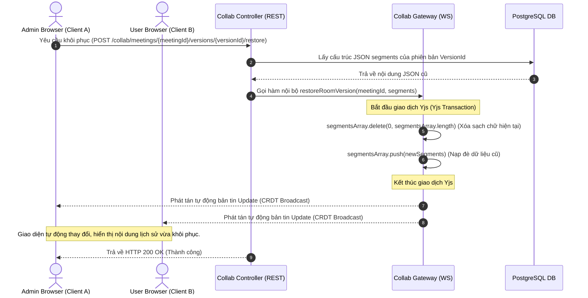

# Chiến Lược Lưu Lịch Sử Phiên Bản & Tự Động Chụp Snapshot (Save Snapshot & Version History Strategy)

Tài liệu này đặc tả chi tiết về mặt kiến trúc hệ thống, sơ đồ xử lý và giải thuật cho tính năng **Lưu lịch sử phiên bản** trong dịch vụ cộng tác hiệu chỉnh bản dịch thời gian thực (**Collab Service**).

---

## 1. Bản chất Kiến trúc & Lý do Lựa chọn Thiết kế

Hệ thống cộng tác hiệu chỉnh bản dịch hoạt động dựa trên thuật toán **CRDT (Yjs)** thông qua giao thức truyền tin nhị phân Stateful WebSockets. Để xây dựng tính năng quản lý lịch sử (Version History) tương tự Google Docs nhưng vẫn tối ưu hóa tài nguyên cơ sở dữ liệu và hiệu năng mạng, chúng ta lựa chọn mô hình **Hybrid Snapshot (Ảnh chụp lai)** thay vì ghi log tất cả các thao tác phím (Keystroke Operations).

### So sánh hai phương án thiết kế:

| Tiêu chí so sánh | Phương án 1: Nhật ký thao tác nhị phân (Keystroke Log) | Phương án 2: Ảnh chụp lai (Hybrid Snapshot) - ĐƯỢC CHỌN |
| :--- | :--- | :--- |
| **Bản chất lưu trữ** | Lưu từng gói tin delta nhị phân (`Uint8Array`) của mỗi phím bấm vào bảng log. | Lưu trạng thái cấu trúc JSON segments hoàn chỉnh tại các cột mốc thời gian lớn. |
| **Độ chi tiết lịch sử** | Chi tiết đến từng mili-giây, từng ký tự gõ. | Gom nhóm theo mốc thời gian (ví dụ: khi rời phòng, lưu thủ công). |
| **Khả năng đọc/truy vấn** | **Không thể** dùng SQL thô để tìm kiếm từ khóa hoặc phân tích lịch sử. | **Dễ dàng** dùng SQL để truy vấn JSON/Text của các bản dịch cũ. |
| **Độ phức tạp lập trình** | Cực kỳ phức tạp (phải tự viết bộ giải mã nhị phân, xử lý bất đồng bộ phức tạp). | Đơn giản, tin cậy, tận dụng cơ chế transactional rollback của Yjs. |
| **Độ ổn định hệ thống** | Rủi ro cao: Chỉ cần 1 gói tin ở giữa chuỗi log bị hỏng sẽ phá hủy toàn bộ lịch sử phía sau. | Độ cô lập cao: Mỗi phiên bản lưu trữ độc lập, hỏng một bản không ảnh hưởng các bản khác. |


---

## 2. Thiết kế Cơ sở Dữ liệu (Prisma Schema)

Lịch sử phiên bản được lưu trữ trong bảng `TranscriptVersion` thuộc schema `"transcripts"`. Mỗi phiên bản ghi nhận trạng thái toàn vẹn của bản dịch tại mốc thời gian đó, liên kết với tệp bản dịch chính và người tạo ra phiên bản đó.

```prisma
model TranscriptVersion {
  id                Int      @id @default(autoincrement())
  transcriptId      Int      @map("transcript_id")
  versionName       String?  @map("version_name") @db.VarChar(255) // VD: "Tự động lưu khi Nguyễn Văn A rời phòng"
  rawText           String   @map("raw_text") @db.Text
  structuredContent Json     @map("structured_content") @db.JsonB
  createdById       Int      @map("created_by_id") // ID tài khoản người dùng
  createdAt         DateTime @default(now()) @map("created_at")

  // Thiết lập liên kết khóa ngoại cascade xóa theo bản dịch chính
  transcript        Transcript @relation(fields: [transcriptId], references: [id], onDelete: Cascade)

  @@map("transcript_versions")
  @@schema("transcripts")
}
```

---

## 3. Đặc tả luồng dữ liệu khi Phục hồi Phiên bản (Version Rollback Flow)

Khi quản trị viên chọn một phiên bản cũ trong danh sách lịch sử và thực hiện khôi phục (Restore), luồng dữ liệu sẽ được xử lý như sau để đảm bảo tất cả màn hình người dùng đang trực tuyến cập nhật ngay lập tức mà không cần reload trang:



---

## 4. Danh Sách API Điểm Cuối (REST Endpoints)

Dịch vụ Collab cung cấp các REST API sau để ứng dụng Frontend tương tác với Lịch sử phiên bản:

### 1. Lấy danh sách lịch sử phiên bản của cuộc họp
*   **Endpoint**: `GET /api/collab/meetings/:meetingId/versions`
*   **Headers**: `Authorization: Bearer <Token>`
*   **Response (200 OK)**:
    ```json
    [
      {
        "id": 104,
        "versionName": "Tự động lưu khi Nguyễn Văn A rời phòng (Nguyễn Văn A)",
        "createdAt": "2026-06-16T15:30:00.000Z",
        "createdById": 12,
        "creatorName": "Nguyễn Văn A"
      },
      {
        "id": 98,
        "versionName": "Bản chốt hiệu chỉnh lần 1 (Trần Thị B)",
        "createdAt": "2026-06-16T12:15:00.000Z",
        "createdById": 15,
        "creatorName": "Trần Thị B"
      }
    ]
    ```

### 2. Lưu thủ công phiên bản hiện tại
*   **Endpoint**: `POST /api/collab/meetings/:meetingId/versions`
*   **Headers**: `Authorization: Bearer <Token>`
*   **Body**:
    ```json
    {
      "versionName": "Bản dịch nháp trước khi duyệt"
    }
    ```
*   **Response (201 Created)**:
    ```json
    {
      "id": 105,
      "message": "Đã lưu snapshot phiên bản thủ công thành công."
    }
    ```

### 3. Phục hồi về phiên bản cũ
*   **Endpoint**: `POST /api/collab/meetings/:meetingId/versions/:versionId/restore`
*   **Headers**: `Authorization: Bearer <Token>`
*   **Response (200 OK)**:
    ```json
    {
      "message": "Phục hồi phiên bản lịch sử thành công, đã đồng bộ tới tất cả thành viên."
    }
    ```
