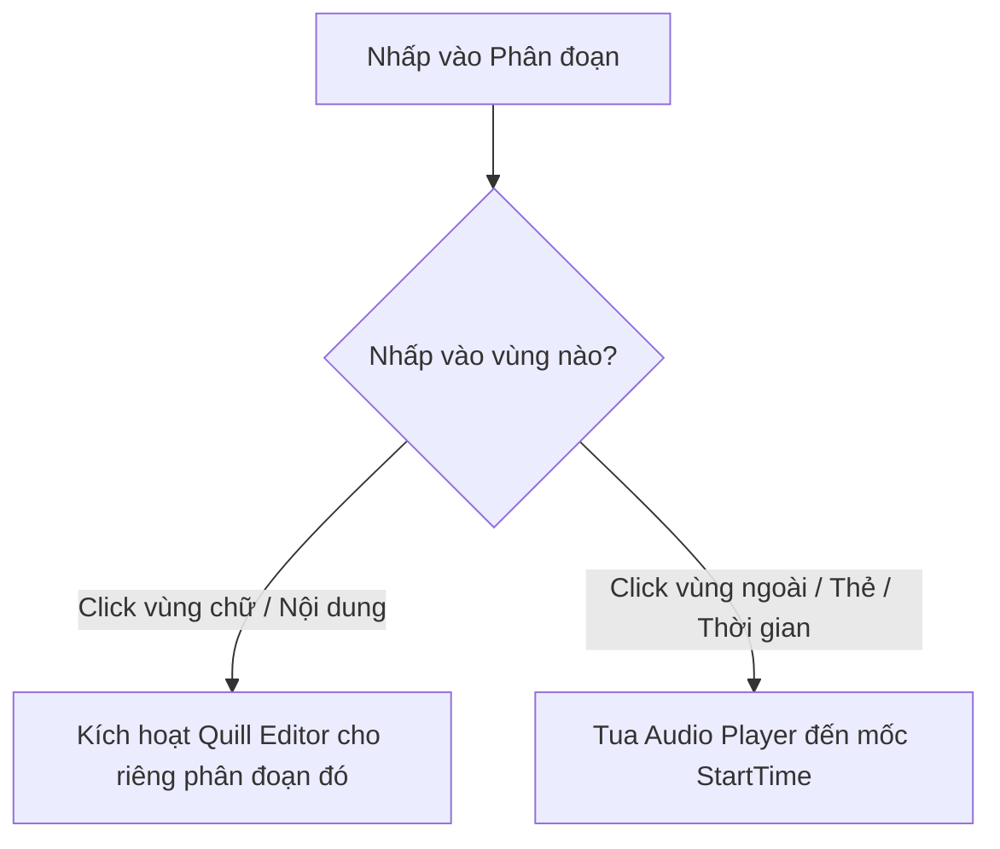

# Tài liệu Nghiệp vụ Giao diện (UI/UX) - Tính năng Chỉnh sửa Cộng tác (Collaborative Edit)

Tài liệu này đặc tả toàn bộ nghiệp vụ luồng đi, hành vi tương tác (User Interaction) và thiết kế trải nghiệm người dùng (UX) của giao diện chỉnh sửa bản ghi dịch (Transcript Edit Mode) trong hệ thống làm việc cộng tác thời gian thực. 

---

## 1. Mục tiêu Trải nghiệm (UX Goals)
Tính năng Chỉnh sửa Cộng tác (Collaborative Edit) được thiết kế nhằm đáp ứng các tiêu chuẩn trải nghiệm của các ứng dụng SaaS hàng đầu (Google Docs, Figma, Miro) với 3 mục tiêu cốt lõi:
1. **Hiệu năng cực đại (Ultra-performance):** Đảm bảo phản hồi giao diện tức thì (< 16ms / 60fps) ngay cả với bản ghi cuộc họp siêu dài (trên 1000 phân đoạn).
2. **Nhận diện cộng tác trực quan (Visual Presence):** Người dùng luôn nhận biết rõ ràng ai đang trực tuyến, họ ở đâu và họ đang làm gì trên văn bản.
3. **An toàn dữ liệu (Data Integrity):** Ngăn ngừa tối đa việc mất mát dữ liệu do xung đột đồng thời, mạng chập chờn hoặc do người dùng vô tình đóng tab.

---

## 2. Đặc tả các Thành phần Giao diện (UI Components)

### 2.1. Thanh Công cụ (Edit Toolbar)
Thanh công cụ nằm cố định ở phía trên, cung cấp trạng thái tổng quan của phiên làm việc.

| Thành phần | Hành vi UX | Hiển thị & Thay đổi UI tương ứng |
| :--- | :--- | :--- |
| **Đèn báo Trạng thái Kết nối (Live Indicator)** | • Người dùng biết trạng thái kết nối mạng của phiên cộng tác tức thì. • Tự động ngắt các thao tác chỉnh sửa nếu không thể đồng bộ. | • **Live (Đang kết nối):** Hiển thị icon `Wifi` màu xanh lá và đèn tròn `bg-green-500`. Có vòng tròn lan tỏa nhấp nháy lan rộng xung quanh (`animate-ping`) với độ mờ `opacity-40` để tạo cảm giác thời gian thực. • **Offline (Mất kết nối):** Icon `WifiOff` màu xám và đèn tròn đổi thành `bg-slate-400`. Đồng thời hiển thị Banner thông báo màu vàng nhạt `bg-yellow-50 text-yellow-800 border-yellow-200` chạy dọc phía dưới thanh công cụ: *"Mất kết nối mạng. Các chỉnh sửa cục bộ của bạn tạm thời chưa được lưu lên đám mây."* |
| **Danh sách Cộng tác viên (Collaborators Avatar Stack)** | • Người dùng biết có những ai đang cùng xem/sửa bản dịch. • Di chuột vào để xem thông tin chi tiết của người đó. | • Hiển thị danh sách Avatar hình tròn, xếp chồng lấn lên nhau một phần (`flex -space-x-1.5`). • Mỗi Avatar tròn (`w-5 h-5 rounded-full`) hiển thị 2 ký tự đầu viết hoa của tên, có màu nền ngẫu nhiên được gán cố định từ server (`style={{ backgroundColor: user.color }}`). • Khi di chuột vào Avatar (Hover): Kích hoạt chuyển động phóng to nhẹ (`hover:scale-110 hover:z-30`) kèm viền trắng nổi lên, đồng thời hiển thị Tooltip nhỏ nền tối (`bg-slate-900 text-white text-[8px] rounded px-1.5 py-0.5 shadow-sm`) nằm lơ lửng phía trên chứa: `Tên đầy đủ (Email)`. |
| **Lịch sử Phiên bản (Version History Button)** | • Mở rộng tính năng để xem các điểm khôi phục cũ của bản dịch. | • Biểu tượng đồng hồ ngược kèm nhãn "Lịch sử". Khi click, mở một Overlay Modal phủ mờ màn hình sau lưng (`fixed inset-0 bg-slate-900/60 backdrop-blur-sm`). |
| **Nút Lưu Thay Đổi (Save Changes Button)** | • Cung cấp trạng thái an toàn dữ liệu, người dùng chủ động biết khi nào cần bấm lưu hoặc khi nào hệ thống đã tự động lưu. | • **Trạng thái Mặc định (Đã lưu sạch):** Nút bị vô hiệu hóa (`disabled`), màu xám nhạt (`bg-slate-100 text-slate-400 border-slate-200`), không có bóng đổ. • **Trạng thái Có thay đổi chưa lưu:** Nút tự động chuyển trạng thái active: màu đỏ thương hiệu nổi bật (`bg-red-500 hover:bg-red-600 text-white`), đổ bóng nhẹ (`shadow-sm`). • **Trạng thái Đang lưu (Click):** Chữ đổi thành "Đang lưu...", xuất hiện icon loading xoay tròn (`animate-spin`). • **Trạng thái Lưu thành công:** Nút đổi sang màu xanh lá (`bg-green-500`), hiển thị icon `Check` kèm chữ "Đã lưu!". Trạng thái này giữ trong 2 giây rồi nút tự động ẩn/vô hiệu hóa trở lại. |

---

### 2.2. Phân đoạn Bản dịch (Transcript Segment Cards)
Mỗi phân đoạn trong danh sách là một thẻ (card) độc lập đại diện cho một câu nói của người nói tại mốc thời gian cụ thể.

#### A. Trạng thái Hiển thị Tĩnh (Inactive State)
* **Hành vi UX:** Hiển thị nội dung văn bản trực quan, gọn gàng, cho phép bôi đen copy nội dung tự nhiên. Rê chuột qua cho cảm giác có thể tương tác.
* **Hiển thị & Thay đổi UI tương ứng:**
  - Cấu trúc: Thẻ hiển thị dưới dạng một `div` tĩnh với đường viền xám nhạt (`border border-slate-100 bg-white rounded-2xl p-4 transition-all`).
  - Nội dung text hiển thị bằng thẻ `div` có kiểu chữ, cỡ chữ, và chiều cao dòng tương đồng tuyệt đối với trình soạn thảo Quill để tránh bị giật màn hình (layout shift) khi chuyển đổi (`text-xs text-slate-700 leading-relaxed p-3 border border-transparent whitespace-pre-wrap break-words min-h-[64px]`).
  - Hiệu ứng tương tác: Khi di chuột qua (Hover), màu nền thẻ chuyển sang màu xám nhạt nhẹ (`bg-slate-50/50`), đường viền chuyển sang màu xám đậm hơn (`border-slate-200`), con trỏ chuột đổi thành hình nhập văn bản (`cursor-text`) khi rê qua vùng chữ, và hình bàn tay (`cursor-pointer`) khi rê qua vùng thẻ xung quanh.

#### B. Trạng thái Biên tập Động (Active Editor State)
* **Hành vi UX:** Mở bộ gõ chuyên nghiệp cho phân đoạn được chọn. Đóng bộ gõ của phân đoạn cũ để giải phóng tài nguyên CPU và RAM.
* **Hiển thị & Thay đổi UI tương ứng:**
  - Cấu trúc: Thẻ `div` tĩnh hiển thị nội dung được thay thế bằng component `QuillEditor` (gồm khung soạn thảo và thanh công cụ định dạng ẩn).
  - Khung bao ngoài của phân đoạn đó chuyển đường viền sang màu đỏ cam nhạt (`border-red-200 bg-red-50/30 shadow-sm shadow-red-100/50`).
  - Xuất hiện một vạch chỉ thị đứng màu đỏ (`absolute left-0 top-0 bottom-0 w-0.5 bg-red-500 rounded-full`) ở cạnh trái của thẻ phân đoạn để báo hiệu đây là phân đoạn đang được người dùng trực tiếp xử lý.
  - Sau khi unmount (người dùng bấm ra ngoài), thẻ đóng Quill lại và chuyển đổi mượt mà trở lại dạng Inactive State với nội dung mới đã cập nhật.

---

## 3. Đặc tả Luồng Nghiệp vụ Tương tác (User Interactions)

### 3.1. Chỉnh sửa Nội dung (Content Editing)
1. **Kích hoạt:** Người dùng nhấp chuột vào vùng chữ của một phân đoạn tĩnh $\rightarrow$ **UI thay đổi:** `div` tĩnh biến mất, trình soạn thảo Quill xuất hiện, viền thẻ chuyển sang màu đỏ cam thương hiệu, con trỏ gõ chữ nhấp nháy xuất hiện ở cuối dòng văn bản.
2. **Soạn thảo:** Người dùng gõ phím $\rightarrow$ **UI thay đổi:** 
   - Ký tự mới xuất hiện ngay lập tức trong khung soạn thảo.
   - Nút "Lưu thay đổi" trên Toolbar đổi từ màu xám vô hiệu hóa sang màu đỏ kích hoạt.
   - Các thay đổi văn bản được đồng bộ và hiển thị tức thì trên màn hình các cộng tác viên khác.
3. **Đóng biên tập (Blur/Dismiss):** Người dùng nhấp chuột ra ngoài vùng thẻ segment $\rightarrow$ **UI thay đổi:** Quill unmount, thẻ chuyển về dạng hiển thị tĩnh màu xám đậm để tiết kiệm RAM.

---

### 3.2. Thay đổi Tên Người nói (Speaker Renaming)
Để tối ưu hiệu năng mạng và tránh giật lag khi gõ phím tên người nói:
1. **Kích hoạt:** Người dùng nhấp vào ô nhập tên người nói $\rightarrow$ **UI thay đổi:** Ô input đổi viền từ xám mờ sang màu đỏ cam thương hiệu (`border-red-400 ring-2 ring-red-100 transition-all`).
2. **Soạn thảo:** Người dùng gõ phím đổi tên $\rightarrow$ **UI thay đổi:**
   - Các ký tự thay đổi hiển thị trong ô input của người gõ.
   - Viền ô input đổi sang nét đứt (`border-dashed border-red-300`) hoặc xuất hiện icon nhỏ hình bút chì mờ để thể hiện trạng thái *"Bản nháp cục bộ - Chưa lưu lên mạng"*.
   - Màn hình của người dùng khác **hoàn toàn giữ nguyên tên cũ** trong giai đoạn này (chống spam gói tin mạng).
3. **Lưu & Đồng bộ:** Người dùng nhấn phím `Enter` hoặc click chuột ra ngoài (`onBlur`) $\rightarrow$ **UI thay đổi:**
   - Nét đứt của viền input chuyển sang nét liền thông thường.
   - Ô input nhấp nháy xanh lá cây nhẹ (`border-green-400`) trong vòng 300ms rồi biến mất hiệu ứng để báo hiệu lưu thành công.
   - Tên người nói mới lập tức cập nhật trên màn hình của tất cả các người dùng khác.

---

### 3.3. Đồng bộ Trạng thái Hoạt động (Awareness & Cursors)
Khi có nhiều người dùng cùng biên tập một bản ghi dịch:

#### A. Trạng thái Người khác đang sửa phân đoạn (Presence Highlight)
* **Hành vi UX:** Người dùng nhận diện được có người khác đang sửa ở một phân đoạn cụ thể để tránh gõ đè hoặc chỉnh sửa chéo gây xung đột.
* **Hiển thị & Thay đổi UI tương ứng:**
  - Khi Người dùng B nhấp chọn sửa nội dung hoặc tên người nói của Phân đoạn X $\rightarrow$ Trên màn hình của Người dùng A, Phân đoạn X lập tức thay đổi đường viền sang màu định danh của Người dùng B (ví dụ màu cam: `style={{ borderColor: userB.color }}`).
  - Thêm một bóng đổ mờ cùng tông màu bao quanh thẻ (`boxShadow: 0 0 0 2px ${userB.color}22`).
  - Góc phải bên dưới của thẻ phân đoạn xuất hiện một nhãn tên nhỏ dạng viên thuốc (`absolute right-2 bottom-2 px-1.5 py-0.5 rounded-full text-white text-[8px] font-bold animate-pulse`) có màu nền trùng với màu định danh của Người dùng B, hiển thị nội dung: `● [Tên Người dùng B] đang sửa`.

#### B. Con trỏ soạn thảo của người khác (Real-time Remote Caret)
* **Hành vi UX:** Nhìn thấy chi tiết vị trí gõ chữ của người khác trong phân đoạn để cộng tác nhịp nhàng.
* **Hiển thị & Thay đổi UI tương ứng:**
  - Khi cả hai cùng mở trình soạn thảo trên một phân đoạn, một vạch thẳng đứng có độ rộng `1.5px` và màu sắc trùng với màu định danh của Người dùng B sẽ xuất hiện tại vị trí gõ chữ của họ.
  - Phía trên vạch thẳng đứng có một lá cờ (flag) nhỏ hình chữ nhật chứa tên viết tắt hoặc tên đầy đủ của Người dùng B, màu nền của cờ trùng với màu định danh của họ, chữ trắng, font đậm (`text-[8px]`).
  - Vạch và lá cờ tự động trượt mượt mà (CSS transition) dịch chuyển theo từng ký tự gõ của Người dùng B.

---

### 3.4. Tua âm thanh theo phân đoạn (Click-to-Seek)
* **Hành vi UX:** Cho phép nghe lại nhanh âm thanh của phân đoạn, nhưng tránh làm gián đoạn gõ phím khi người dùng chỉ có nhu cầu nhấp chuột chỉnh sửa chữ.
* **Hiển thị & Thay đổi UI tương ứng:**
  - Nhấp vào mốc thời gian (Timestamp), số thứ tự phân đoạn, hoặc vùng trống trên thẻ phân đoạn $\rightarrow$ **UI thay đổi:** Thẻ phân đoạn nhận thêm viền đỏ nhạt, thanh tua của Trình phát âm thanh (Audio Player) ở cạnh dưới màn hình di chuyển tới mốc thời gian bắt đầu của phân đoạn, nút Phát (Play) đổi thành icon Dừng (Pause) và âm thanh bắt đầu phát.
  - **Hành vi cuộn trang:** Trình phát âm thanh di chuyển nhạc và cập nhật mốc thời gian, nhưng **giao diện danh sách phân đoạn hoàn toàn được giữ nguyên vị trí, không tự động cuộn (scroll) màn hình đến phân đoạn tương ứng đó**. Điều này giúp tránh hiện tượng màn hình tự dịch chuyển đột ngột gây mất định hướng và mất tiêu điểm mắt khi người dùng đang theo dõi vùng văn bản khác.
  - Nhấp trực tiếp vào vùng chữ soạn thảo $\rightarrow$ **UI thay đổi:** Không tua âm thanh, nút Play/Pause giữ nguyên trạng thái, chỉ kích hoạt con trỏ gõ chữ của trình soạn thảo.

