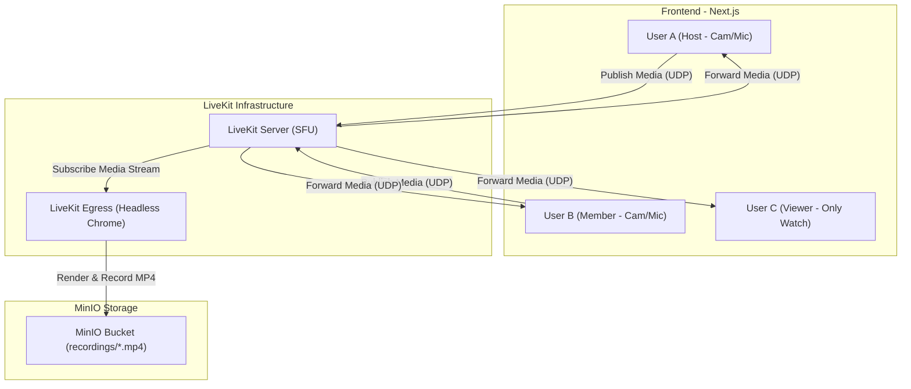
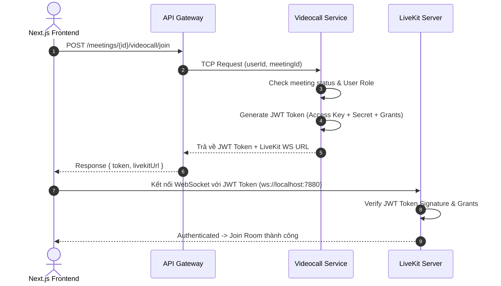
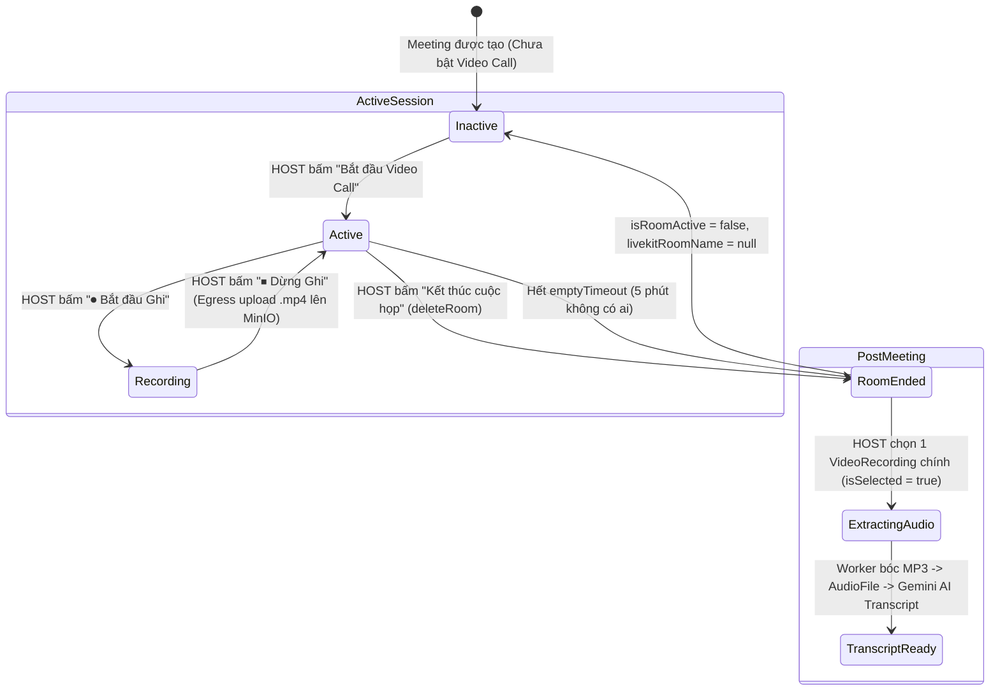

# Tài liệu Kiến trúc & Hướng dẫn Tích hợp LiveKit — TranscriptHub

Tài liệu này giải thích chi tiết về **LiveKit**, cơ chế hoạt động, các thành phần được sử dụng và luồng tích hợp hệ thống trong dự án **TranscriptHub**.

---

## 1. LiveKit là gì?

### 1.1 Định nghĩa
**LiveKit** là một nền tảng WebRTC mã nguồn mở (Open-source WebRTC Infrastructure / CPaaS) cho phép xây dựng các ứng dụng truyền thông thời gian thực (Real-Time Communication - RTC) như Video Call, Audio Call, Live Streaming và Collaborative Audio/Video.

### 1.2 Tại sao TranscriptHub chọn LiveKit?
So với các mô hình WebRTC truyền thống, LiveKit mang lại những ưu điểm vượt trội cho TranscriptHub:

| Mô hình | Cơ chế | Ưu điểm | Nhược điểm | Phù hợp với |
|---|---|---|---|---|
| **Mesh (P2P)** | Mỗi máy nối trực tiếp tới tất cả máy khác | Không tốn server, free | Nặng CPU & băng thông client khi > 4 người | Nhóm 2 - 3 người |
| **MCU** | Server nhận stream, encode lại thành 1 luồng duy nhất | Client nhẹ | Tốn CPU Server cực kỳ khủng khiếp | Hệ thống cũ |
| **SFU (LiveKit)** | Server nhận luồng từ Publisher, **chuyển tiếp (Forward)** tới các Subscriber | Client nhẹ, Server tối ưu, scale được hàng nghìn phòng | Cần Server hạ tầng | **TranscriptHub** (Cuộc họp đông người, cần Record) |

### 1.3 Tính năng nổi bật của LiveKit trong dự án
1. **Self-hosted $0 cost**: Chạy hoàn toàn trên Docker / Kubernetes nội bộ, không phụ thuộc vào vendor bên ngoài.
2. **Tích hợp sẵn Egress Service**: Ghi lại video/audio cuộc họp thành file `.mp4` và đẩy thẳng lên MinIO (S3-compatible).
3. **Bảo mật JWT Token**: Phân quyền chi tiết từng participant (HOST, EDITOR, VIEWER) theo từng phòng họp.
4. **React Component SDK**: UI Kit sẵn có hỗ trợ Next.js giúp dựng giao diện Video Call nhanh chóng.

---

## 2. Kiến trúc & Cơ chế hoạt động của LiveKit

### 2.0 Khái niệm SFU (Selective Forwarding Unit) là gì?

**SFU (Selective Forwarding Unit)** là một kiến trúc máy chủ truyền thông đa phương tiện trung gian cho WebRTC. Khác với các mô hình truyền thống:

- **Cách hoạt động**: Máy chủ SFU nhận luồng video/audio từ người phát (Publisher), **không mã hóa lại (transcode)** để giải phóng tải CPU cho server, mà chỉ làm nhiệm vụ **chuyển tiếp (forward)** các gói tin đó tới những người nhận (Subscribers) đang ở trong phòng họp.
- **Tại sao SFU chiến thắng mô hình P2P Mesh & MCU?**:
  1. **So với P2P (Mesh)**: Trong mạng Mesh, nếu phòng họp có $N$ người, máy bạn phải upload $N-1$ luồng video $\rightarrow$ tốn rất nhiều băng thông và làm nóng máy. Với SFU, máy bạn chỉ upload **đúng 1 luồng duy nhất** lên server.
  2. **So với MCU**: Máy chủ MCU phải nhận tất cả luồng, giải mã và ghép (mix) lại thành 1 video duy nhất rồi encode lại $\rightarrow$ cực kỳ ngốn CPU của Server và độ trễ cao. SFU bỏ qua bước encode lại này, giúp **tối ưu CPU server và giữ độ trễ siêu thấp (< 200ms)**.

### 2.1 Kiến trúc SFU trong LiveKit



#### Giải thích chi tiết các thành phần trong sơ đồ:

1. **Luồng Gửi & Nhận Video/Audio (Frontend $\leftrightarrow$ LiveKit Server)**:
   - **User A (Host)** & **User B (Member)**: Khi bật Camera/Mic, họ gửi **duy nhất 1 luồng video/audio** (`Publish Media (UDP)`) lên `LiveKit Server (SFU)`. Nhờ mô hình SFU, User A không cần phải tự nhân bản luồng gửi sang cho từng người (P2P), giúp **giảm nhẹ tối đa băng thông & CPU của client**.
   - **LiveKit Server (SFU)**: Đóng vai trò tổng đài trung tâm:
     - Nhận luồng từ User A $\rightarrow$ Chuyển tiếp (`Forward Media (UDP)`) tới User B và User C.
     - Nhận luồng từ User B $\rightarrow$ Chuyển tiếp (`Forward Media (UDP)`) tới User A và User C.
   - **User C (Viewer)**: Chỉ xem, không bật Cam/Mic nên chỉ đăng ký nhận luồng về mà không cần tốn dung lượng tải lên.

2. **Luồng Ghi Hình Cuộc Họp & Lưu Trữ (LiveKit Egress $\rightarrow$ MinIO)**:
   - **LiveKit Egress**: Đóng vai trò là một "người tham gia ngầm đặc biệt" trong phòng họp, đăng ký nhận toàn bộ luồng âm thanh/hình ảnh (`Subscribe Media Stream`) từ `LiveKit Server`. Nó chạy trình duyệt ẩn (Headless Chrome) trong Docker container để quay lại toàn bộ màn hình cuộc họp.
   - **MinIO Storage**: `LiveKit Egress` mã hóa video thành file chuẩn `.mp4` (`Render & Record MP4`) và upload thẳng vào MinIO Bucket (`recordings/*.mp4`). File này sẽ được dùng để trích xuất audio `.mp3` gửi cho Gemini AI tạo Transcript.

### 2.2 Tách biệt 2 Luồng Truyền tải (Signaling vs Media)

LiveKit chia giao tiếp WebRTC thành 2 luồng riêng biệt:

1. **Luồng Tín hiệu (Signaling Protocol - HTTP/WebSocket - Port 7880)**:
   - Trao đổi SDP (Session Description Protocol) và ICE Candidates giữa Client và Server.
   - Quản lý trạng thái phòng, danh sách participant, sự kiện bật/tắt mic, camera, giơ tay.
2. **Luồng Truyền tải Media (Media Transport - UDP/TCP - Port 7881/50000-50020)**:
   - Truyền dữ liệu âm thanh (Opus) và hình ảnh (VP8/H.264/AV1) thời gian thực với độ trễ siêu thấp (< 200ms).

### 2.3 Cơ chế Xác thực & Phân quyền (JWT Token & Grants)

Khi người dùng muốn vào phòng họp, Client **không bao giờ kết nối trực tiếp với API Key/Secret**. Thay vào đó:



#### Cấu trúc JWT Grant trong LiveKit:
```json
{
  "iss": "devkey",
  "sub": "user-123",
  "nbf": 1721280000,
  "exp": 1721294400,
  "video": {
    "roomJoin": true,
    "room": "transcripthub-meeting-uuid",
    "canPublish": true,
    "canSubscribe": true,
    "canPublishData": true,
    "roomRecord": true
  }
}
```

---

## 3. Các Thành phần LiveKit trong Hệ thống TranscriptHub

### 3.1 LiveKit Server (`livekit-server`)
- **Vai trò**: Trái tim của hạ tầng Video Call (SFU Server).
- **Nhiệm vụ**:
  - Nhận luồng media từ các máy trong phòng và chuyển tiếp cho những máy còn lại.
  - Quản lý vòng đời phòng (Room Lifecycle).
  - Bắn **Webhooks** về `videocall-service` khi phòng kết thúc (`room_finished`) hoặc khi Egress kết thúc (`egress_ended`).

### 3.2 LiveKit Egress (`livekit-egress`)
- **Vai trò**: Service thực hiện ghi hình / ghi âm cuộc họp.
- **Cơ chế hoạt động**:
  - Chạy một phiên bản Chromium ẩn (Headless Chrome) trong Docker container.
  - Chromium join vào phòng họp LiveKit như một participant đặc biệt, render toàn bộ layout video cuộc họp.
  - Mã hóa (Encode) giao diện + âm thanh thành file chuẩn `.mp4` bằng FFMpeg.
  - Upload trực tiếp file `.mp4` thu được lên **MinIO Bucket** (`transcripthub-bucket/recordings/{meetingId}/{recordingId}.mp4`).

### 3.3 Backend SDK (`livekit-server-sdk` - Node.js NestJS)
- **Sử dụng tại**: `videocall-service`.
- **Cung cấp 2 Client chính**:
  - `RoomServiceClient`: Tạo phòng (`createRoom`), Xóa/Đóng phòng (`deleteRoom`), Kick người dùng, Kiểm tra danh sách người trong phòng.
  - `EgressClient`: Trigger bắt đầu ghi hình (`startRoomCompositeEgress`), Dừng ghi hình (`stopEgress`).

### 3.4 Frontend Component SDK (`@livekit/components-react`)
- **Sử dụng tại**: `fe_next` (Next.js).
- **Cung cấp**:
  - `<LiveKitRoom>`: Provider bọc toàn bộ ứng dụng video call, tự động quản lý kết nối WebSockets & WebRTC peer connections.
  - `<VideoConference>`: Component UI dựng sẵn đầy đủ màn hình video grid, camera/mic toggle, screen share, chat panel.
  - Hooks: `useRoomContext`, `useParticipants`, `useLocalParticipant`, `useTracks`.

---

## 4. Quy trình Vòng đời Cuộc họp (Session-Based Lifetime)

TranscriptHub áp dụng mô hình **Session-Based Video Room** (Mỗi phiên họp tạo 1 phòng tạm, họp xong tắt phòng là xong, không vào lại phòng cũ):



---

## 5. Cấu hình Hạ tầng & Mạng (Docker Configuration)

### 5.1 Bảng Port Cần Thiết

| Port | Giao thức | Dịch vụ | Mục đích |
|---|---|---|---|
| `7880` | TCP | LiveKit Server | HTTP API & WebSocket Signaling (FE kết nối) |
| `7881` | TCP | LiveKit Server | WebRTC TURN/TLS Fallback (Khi mạng bị chặn UDP) |
| `50000-50020` | UDP | LiveKit Server | WebRTC RTP Media Transport (Audio/Video streams) |
| `3010` | TCP | Videocall Service | Internal NestJS Microservice |

### 5.2 Tương tác giữa các Container Docker

```yaml
# Sơ đồ phụ thuộc dịch vụ trong docker-compose.yml
redis (Cluster & Pub/Sub state)
   ▲
   │
   ├── livekit-server (Port 7880, 7881, 50000-50020/udp)
   │      ▲
   │      │ (ws connection & signaling)
   └── livekit-egress (Cap: SYS_ADMIN) ──► MinIO (Upload MP4)
          ▲
          │ (Trigger via EgressClient)
   videocall-service (NestJS TCP :3010) ──► Kafka (Emit event extract audio)
```

---

## 6. Thuật ngữ Cốt lõi & Sự kiện Webhook

### 6.1 Thuật ngữ LiveKit (Glossary)
- **Room**: Không gian ảo chứa cuộc họp WebRTC.
- **Participant**: Một thành viên trong phòng (gồm `LocalParticipant` và `RemoteParticipant`).
- **Track**: Luồng dữ liệu đơn lẻ (gồm Audio Track, Video Track, ScreenShare Track).
- **Publication**: Việc người tham gia đẩy (Publish) 1 Track lên phòng.
- **Subscription**: Việc người tham gia đăng ký nhận (Subscribe) Track từ người khác.
- **Egress**: Dịch vụ xuất/ghi dữ liệu từ LiveKit Room ra lưu trữ ngoài (File, RTMP Stream).

### 6.2 Các sự kiện Webhook LiveKit gửi về TranscriptHub (`/webhooks/livekit`)
1. **`room_started`**: Bật khi phòng bắt đầu có participant đầu tiên join.
2. **`room_finished`**: Bật khi phòng kết thúc hoặc bị hủy (dùng làm fallback sync trạng thái `isRoomActive = false` vào Database).
3. **`egress_started`**: Bật khi Egress bắt đầu ghi hình cuộc họp.
4. **`egress_ended`**: Bật khi Egress đã ghi hình xong và upload thành công file `.mp4` lên MinIO bucket (cập nhật trạng thái recording thành `READY`).

---

## 7. Tổng kết

Việc tích hợp **LiveKit** giúp TranscriptHub:
1. Sở hữu giải pháp Video Call độc lập, bảo mật, tự host 100% trên hệ thống Docker.
2. Tự động hóa hoàn toàn luồng: **Video Call -> Ghi hình MP4 -> Chọn bản ghi -> Trích xuất Audio MP3 -> Gemini AI Transcript**.
3. Quản lý tài nguyên hiệu quả với mô hình Session-based Room và cơ chế Egress ghi hình theo yêu cầu.
